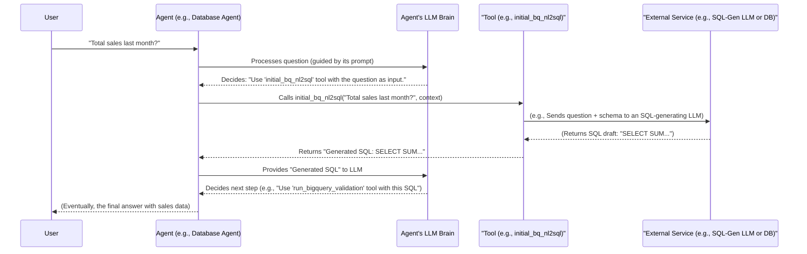

# Chapter 4: Tools (Capabilities) - The Agent's Special Equipment

Welcome to Chapter 4! In the [previous chapter on Agent Prompts (Instructions)](03_agent_prompts__instructions_.md), we learned how each agent gets its "script" – the detailed instructions telling it what its role is, what its goals are, and how it should behave. These prompts guide the agent's thinking.

But thinking is often not enough! Imagine you ask our data science assistant:

**"What were our total product sales last month?"**

The [Root Agent (Orchestrator)](01_root_agent__orchestrator_.md) and its [Sub-Agents (Specialists)](02_sub_agents__specialists_.md) can understand this question using their prompts and LLM brains. But how do they actually *get* the sales data? The agent can't magically look into a database just by thinking about it. It needs a way to interact with the outside world or perform specific actions.

That's where **Tools** come in!

## What's the Big Idea? Equipping Agents with Abilities

Think of a skilled craftsperson, like a carpenter. They have a plan in their head (like an agent's prompt), but to build a chair, they need actual tools: a saw to cut wood, a hammer to drive nails, a measuring tape to ensure accuracy.

**Tools are like the special equipment in an agent's toolbox.**

They are specific Python functions that agents can "call" to:
*   **Perform actions:** like running a database query, executing a piece of Python code, or sending an email.
*   **Get information:** like fetching data from an API, checking the current date, or listing available machine learning models.

Each tool serves a distinct purpose, enabling the agent to interact with its environment and achieve the goals set out in its [Agent Prompts (Instructions)](03_agent_prompts__instructions_.md).

## How Do Agents Use Tools?

Remember how an agent's prompt guides its behavior? Well, those prompts also tell the agent *which tools it has* and *when to use them*.

Here’s a simplified flow:
1.  The agent receives a task (e.g., from you, or from another agent).
2.  The agent's LLM brain, guided by its prompt, processes the task.
3.  The LLM decides that to fulfill the task, it needs to use a specific tool (e.g., "I need to use the `run_sql_query` tool to get sales data").
4.  The agent system then calls the actual Python function associated with that tool.
5.  The tool (the Python function) does its job (e.g., connects to the database, runs the SQL, gets the result).
6.  The result from the tool is passed back to the agent's LLM.
7.  The LLM, now armed with new information or having completed an action, decides what to do next (e.g., use another tool, formulate an answer for you).

## Examples of Tools in Our `data-science` Project

Let's look at a few tools our agents use. These are real Python functions that give our agents their special capabilities.

### Tool Example 1: The Root Agent's `call_db_agent` Tool

Our [Root Agent (Orchestrator)](01_root_agent__orchestrator_.md) often needs to ask the `Database Agent` (a specialist [Sub-Agent](02_sub_agents__specialists_.md)) to fetch data. It does this using a tool called `call_db_agent`.

This tool is defined in `data_science/tools.py`.

```python
# data_science/tools.py (Simplified Version)
from google.adk.tools import ToolContext
from google.adk.tools.agent_tool import AgentTool # Helps use an agent AS a tool
from .sub_agents import db_agent # Our database specialist sub-agent

async def call_db_agent(
    question: str, # The user's question, e.g., "total sales?"
    tool_context: ToolContext, # Special context for the tool
):
    """Tool for the Root Agent to call the Database Sub-Agent."""
    print(f"Root Agent is using 'call_db_agent' tool for: {question}")

    # This wraps our 'db_agent' so it can be called like a regular tool.
    agent_as_tool = AgentTool(agent=db_agent)

    # Now, the Root Agent 'calls' the db_agent with the question.
    db_agent_response = await agent_as_tool.run_async(
        args={"request": question}, tool_context=tool_context
    )
    # The Root Agent can store this response if needed.
    # tool_context.state is a way to share info, more on this in Chapter 9!
    tool_context.state["db_agent_output"] = db_agent_response
    return db_agent_response
```
**Explanation:**
*   This `call_db_agent` function is a tool that the Root Agent can use.
*   When the Root Agent decides it needs database information, its prompt tells it to use `call_db_agent`.
*   `AgentTool(agent=db_agent)` is a clever bit: it makes our `db_agent` (which is a full agent itself) look and act like a simple tool that the Root Agent can call.
*   The Root Agent passes the `question` (e.g., "total sales last month") to the `db_agent` via this tool.
*   The `db_agent` does its work (we'll see its tools next!) and sends a response back.
*   `tool_context`: This is a special object that tools receive. It can hold shared information or settings. We'll learn more about this in [Chapter 9: Callback Context & State Management](09_callback_context___state_management_.md). For now, think of `tool_context.state` as a shared notepad.

**Input:** The user's question, like `"What were our total sales last month?"`
**Output (what the tool returns):** The response from the `db_agent`, which might be the actual sales data or a confirmation. For example: `"The total sales last month were $50,000."`

### Tool Example 2: The Database Agent's `initial_bq_nl2sql` Tool

Now, let's peek inside the `Database Agent`. One of its jobs is to turn a plain English question into a database query (SQL). It uses a tool called `initial_bq_nl2sql` for this. This tool is found in `data_science/sub_agents/bigquery/tools.py`.

```python
# data_science/sub_agents/bigquery/tools.py (Highly Simplified Version)
from google.adk.tools import ToolContext
# In a real scenario, we'd import an LLM client here.

def initial_bq_nl2sql(
    question: str, # e.g., "total sales last month"
    tool_context: ToolContext,
) -> str:
    """Generates an SQL query from a natural language question."""
    print(f"Database Agent's NL2SQL tool processing: {question}")

    # The REAL tool uses:
    # 1. The database schema (structure) from tool_context.state["database_settings"]["bq_ddl_schema"]
    # 2. An LLM to intelligently convert the question to SQL.
    # For simplicity, we'll just hardcode an example.
    if "total sales last month" in question.lower():
        generated_sql = "SELECT SUM(sales) FROM sales_table WHERE month_year = 'YYYY-MM';"
    else:
        generated_sql = "SELECT 'unknown query' AS result;"

    print(f"NL2SQL Tool generated SQL: {generated_sql}")
    # Store the generated SQL in the shared notepad for the next tool.
    tool_context.state["sql_query"] = generated_sql
    return generated_sql
```
**Explanation:**
*   The `Database Agent`, when given a task like "get total sales last month," knows from its prompt to first use this `initial_bq_nl2sql` tool.
*   This tool takes the `question` in natural language.
*   **Crucially**, the real tool (in `data_science/sub_agents/bigquery/tools.py`) uses the database schema (table structures, column names) which is available in `tool_context.state["database_settings"]["bq_ddl_schema"]`. It also uses another LLM call, specifically prompted to be an SQL expert, to generate the SQL query.
*   Our simplified example just pretends to generate SQL.
*   It returns the generated SQL string.

**Input:** A natural language question like `"What were the total sales last month?"`
**Output:** An SQL query string, like `"SELECT SUM(sales) FROM sales_table WHERE month_year = '2023-10';"` (the actual query would be more robust).

### Tool Example 3: The Database Agent's `run_bigquery_validation` Tool

Once the `Database Agent` has an SQL query (from the `initial_bq_nl2sql` tool), it needs to run it! For this, it uses the `run_bigquery_validation` tool, also in `data_science/sub_agents/bigquery/tools.py`.

```python
# data_science/sub_agents/bigquery/tools.py (Highly Simplified Version)
from google.adk.tools import ToolContext
# from google.cloud import bigquery # To talk to BigQuery

def run_bigquery_validation(
    sql_string: str, # The SQL query from the previous tool
    tool_context: ToolContext,
) -> str: # Returns a string describing the result or the data
    """Runs an SQL query on BigQuery and gets results."""
    print(f"Database Agent's BigQuery tool running SQL: {sql_string}")

    # The REAL tool:
    # 1. Uses a BigQuery client (get_bq_client()) to connect to the database.
    # 2. Executes the sql_string.
    # 3. Fetches the results.
    # For simplicity, let's simulate a result.
    if "SUM(sales)" in sql_string:
        simulated_data = [{"total_sales": 50000}]
        result_message = f"Query successful. Data: {simulated_data}"
        tool_context.state["query_result"] = simulated_data # Store actual data
    else:
        result_message = "Query ran, but no specific data pattern matched in this example."

    print(f"BigQuery Tool result: {result_message}")
    return result_message
```
**Explanation:**
*   After getting SQL from `initial_bq_nl2sql`, the `Database Agent`'s prompt tells it to use `run_bigquery_validation`.
*   This tool takes the `sql_string`.
*   The actual tool connects to Google BigQuery, executes the SQL, and fetches the results. It also handles errors.
*   Our simplified example just pretends to run the query and gives a sample result.
*   The result (data or success/error message) is returned. The actual data is often stored in `tool_context.state["query_result"]` for the agent to use.

**Input:** An SQL query string like `"SELECT SUM(sales) FROM sales_table WHERE month_year = '2023-10';"`
**Output:** A string indicating success and the data (or an error message). For example: `"Query successful. Data: [{'total_sales': 50000}]"`

## Giving Tools to Agents

How does an agent know which tools it can use? When we define an agent, we provide a list of its available tools.

For our **Root Agent** (from `data_science/agent.py`):
```python
# data_science/agent.py (Simplified Snippet)
from google.adk.agents import Agent
from .prompts import return_instructions_root
# Import the tools the Root Agent can use
from .tools import call_db_agent, call_ds_agent

root_agent = Agent(
    name="db_ds_multiagent",
    instruction=return_instructions_root(),
    # ... other parameters
    tools=[call_db_agent, call_ds_agent], # <--- Here are the Root Agent's tools!
    # ...
)
```
The `tools` list tells the `root_agent` it has access to `call_db_agent` (to talk to the database specialist) and `call_ds_agent` (to talk to the analytics specialist).

Similarly, for our **Database Agent** (from `data_science/sub_agents/bigquery/agent.py`):
```python
# data_science/sub_agents/bigquery/agent.py (Simplified Snippet)
from google.adk.agents import Agent
from .prompts import return_instructions_bigquery
# Import the tools specific to the Database Agent
from . import tools as bq_tools # bq_tools will have initial_bq_nl2sql etc.

database_agent = Agent(
    name="database_agent",
    instruction=return_instructions_bigquery(),
    # ... other parameters
    tools=[
        bq_tools.initial_bq_nl2sql,
        bq_tools.run_bigquery_validation
        # ... other database-specific tools
    ], # <--- Here are the Database Agent's tools!
    # ...
)
```
The `database_agent` is equipped with tools like `initial_bq_nl2sql` and `run_bigquery_validation` to perform its specialized database tasks.

## Under the Hood: How an Agent Call to a Tool Works

Let's trace what happens when an agent decides to use a tool. Imagine the Database Agent needs to generate SQL using `initial_bq_nl2sql`.

1.  **Agent Gets Task:** The Database Agent receives a request like "Find total sales for last month."
2.  **LLM Decides:** Guided by its [prompt](03_agent_prompts__instructions_.md), the agent's LLM brain processes this. The prompt might say, "If you need to generate SQL, use the `initial_bq_nl2sql` tool." The LLM decides to use this tool and figures out the input for it (the question string "Find total sales for last month").
3.  **Framework Calls Tool:** The agent framework (the underlying system running the agent) takes the LLM's decision and calls the actual Python function `initial_bq_nl2sql("Find total sales for last month", tool_context)`.
4.  **Tool Executes:** The `initial_bq_nl2sql` Python function runs. It might involve its own logic, including calling *another* LLM specifically for SQL generation, using the database schema provided in `tool_context`.
5.  **Tool Returns Result:** The tool finishes and returns its output (e.g., the generated SQL string: `"SELECT SUM(sales)..."`).
6.  **Result Back to LLM:** This output is fed back into the Database Agent's LLM.
7.  **LLM Continues:** The LLM now has the SQL. Its prompt might then guide it to use the `run_bigquery_validation` tool with this SQL, or it might decide it has enough information to form a part of its final response.

Here's a simplified diagram of this flow:



## Why Are Tools So Powerful?

Tools are what transform our agents from just "thinkers" into "doers":

1.  **Extend LLM Capabilities:** LLMs are amazing with language, but they can't directly access your database or run Python code. Tools bridge this gap.
2.  **Access to Real-World Information:** Tools can fetch up-to-the-minute data from databases or APIs, ensuring the agent's answers are based on facts, not just its training data (which can be outdated). This helps ground the agent in reality.
3.  **Perform Actions:** Agents can modify files, send notifications, or trigger other processes using tools.
4.  **Modularity and Reusability:** You can write a tool once (e.g., a tool to get the current weather) and many different agents can use it. If you need a new capability, you just add a new tool.
5.  **Safety and Control:** Tools can have built-in safety checks. For example, a tool that runs SQL queries might first validate the SQL to prevent harmful commands.

## Conclusion

Tools are the hands and senses of our agents. They are essential Python functions that allow agents, guided by their [prompts](03_agent_prompts__instructions_.md), to perform specific actions and interact with the world beyond the LLM's internal knowledge. From calling other [Sub-Agents](02_sub_agents__specialists_.md) to generating SQL, running queries, or executing code, tools give our `data-science` project its practical power.

By defining a clear set of tools, we equip our agents to tackle complex tasks step-by-step, much like a human expert uses their specialized instruments.

In the next chapter, we'll take a closer look at a very powerful specialist, the [Analytics Agent (Python Data Scientist)](05_analytics_agent__python_data_scientist_.md), and see how it uses a particularly interesting tool: one that lets it write and run Python code!

---

Generated by [AI Codebase Knowledge Builder](https://github.com/The-Pocket/Tutorial-Codebase-Knowledge)