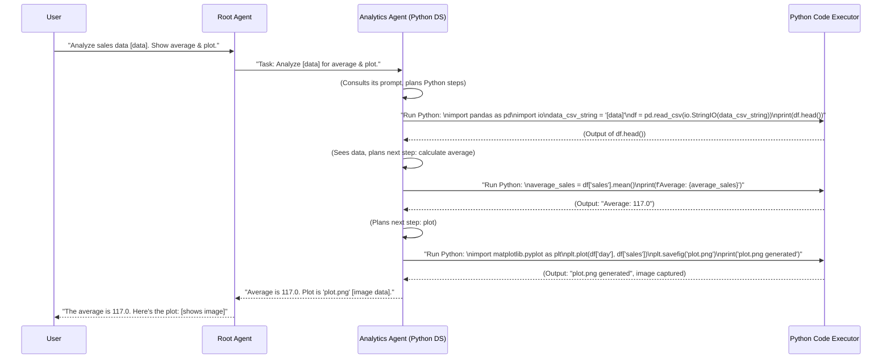

# Chapter 5: Analytics Agent (Python Data Scientist)

Welcome to Chapter 5! In the [previous chapter on Tools (Capabilities)](04_tools__capabilities_.md), we learned that agents use tools to perform actions and interact with the world, like fetching data or calling other agents. Now, what if we have some data, perhaps retrieved by our Database Agent, and we want to perform more complex analysis, like calculating trends, finding averages, or even creating charts?

This is where our **Analytics Agent**, the Python Data Scientist of our team, shines!

Imagine you've just received a spreadsheet of last month's sales figures. You could ask a data scientist on your team:
**"Here's the sales data. Can you tell me the average daily sales, show me if sales are generally increasing, and maybe create a simple plot?"**

Our Analytics Agent is designed to handle exactly these kinds of requests.

## What's the Big Idea? Your On-Demand Python Data Scientist

The Analytics Agent is a specialized [Sub-Agent (Specialist)](02_sub_agents__specialists_.md) whose expertise lies in performing data analysis and data science tasks using the Python programming language. Think of it as having a data scientist who:

*   Understands your analysis questions.
*   Writes Python code to answer them.
*   Uses popular Python libraries like Pandas (for data manipulation) and Matplotlib (for plotting).
*   Can actually *run* this Python code and show you the results.

Typically, the Analytics Agent receives data that might have been fetched by another agent (like the Database Agent we met in [Chapter 2: Sub-Agents (Specialists)](02_sub_agents__specialists_.md)) and then performs calculations, statistical analysis, or visualizations on it.

## How Does the Analytics Agent Work Its Magic?

Let's say the [Root Agent (Orchestrator)](01_root_agent__orchestrator_.md) has received a user request like: "I have the sales data for last week. What was the average daily sale and can you plot the trend?"

1.  **Data Handover:** The Root Agent, possibly after getting data from the Database Agent, has the raw sales data.
2.  **Task Delegation:** The Root Agent uses a [Tool](04_tools__capabilities_.md) (like `call_ds_agent` from `data_science/tools.py`) to pass the data and the analysis question to the Analytics Agent.
3.  **Analytics Agent Takes Over:** The Analytics Agent, guided by its own detailed [Agent Prompts (Instructions)](03_agent_prompts__instructions_.md), understands it needs to:
    *   Parse the provided data (if needed).
    *   Calculate the average sale.
    *   Plot the sales trend.
4.  **Writes Python Code:** It then generates Python code snippets to perform these tasks.
5.  **Executes Code:** This is the cool part! The Analytics Agent uses a special tool called a **Code Executor** to run the Python code it just wrote.
6.  **Gets Results:** The Code Executor runs the code and returns any output (like a calculated average or a generated plot image).
7.  **Reports Back:** The Analytics Agent then takes these results and sends them back to the Root Agent, who delivers the final answer to you.

### Key Concept: The Code Executor

A crucial component for the Analytics Agent is the **Code Executor**. This is a secure environment where the Python code generated by the agent can be safely run.
In our project, we use `VertexAiCodeExecutor` (from the `google.adk.code_executors` library).

Think of it like this:
*   The Analytics Agent is the data scientist who writes the recipe (Python code).
*   The Code Executor is the kitchen where the recipe is cooked, producing the dish (the analysis results or plot).

This ability to generate and execute code dynamically allows the Analytics Agent to tackle a vast range of data analysis problems.

## Example: Analyzing Weekly Sales

Let's walk through a simplified scenario:

**User to Root Agent:** "Here's a string representing daily sales for last week: `day,sales\nMon,100\nTue,120\nWed,110\nThu,130\nFri,125`. Can you tell me the average daily sales and plot this data?"

1.  **Root Agent to Analytics Agent:** The Root Agent uses the `call_ds_agent` tool, passing along the data string and the request: "Calculate average and plot for this data: `day,sales\nMon,100\nTue,120...`"

2.  **Analytics Agent Thinks & Writes Code (Step 1: Load Data):**
    Guided by its prompt, the Analytics Agent decides the first step is to load this data into a Pandas DataFrame. It generates Python code like this:
    ```python
    # Snippet 1: Load data
    import pandas as pd
    import io

    # Data comes from the prompt/request
    data_csv_string = "day,sales\nMon,100\nTue,120\nWed,110\nThu,130\nFri,125"
    df = pd.read_csv(io.StringIO(data_csv_string))
    print("Data loaded. DataFrame head:")
    print(df.head())
    ```
    *Explanation:* This code uses Pandas to read the comma-separated string data into a DataFrame called `df` and prints its first few lines.

3.  **Code Executor Runs Snippet 1:** The Analytics Agent sends this code to the Code Executor.
    *Output from Executor:*
    ```text
    Data loaded. DataFrame head:
       day  sales
    0  Mon    100
    1  Tue    120
    2  Wed    110
    3  Thu    130
    4  Fri    125
    ```

4.  **Analytics Agent Thinks & Writes Code (Step 2: Calculate Average):**
    The agent receives the output. Its prompt reminds it that variables are "stateful" (they persist). So, `df` is available. Now, it calculates the average:
    ```python
    # Snippet 2: Calculate average
    # df is already loaded from the previous step
    average_sales = df['sales'].mean()
    print(f"Average daily sales: {average_sales}")
    ```

5.  **Code Executor Runs Snippet 2:**
    *Output from Executor:*
    ```text
    Average daily sales: 117.0
    ```

6.  **Analytics Agent Thinks & Writes Code (Step 3: Plot Data):**
    It gets the average. Now for the plot:
    ```python
    # Snippet 3: Plot data
    # df and matplotlib (plt) are available
    import matplotlib.pyplot as plt # Usually pre-imported or agent adds if needed

    plt.figure(figsize=(8, 5))
    plt.plot(df['day'], df['sales'], marker='o')
    plt.title('Weekly Sales Trend')
    plt.xlabel('Day')
    plt.ylabel('Sales')
    plt.grid(True)
    plt.savefig('sales_plot.png') # Saves the plot
    print("Plot saved as sales_plot.png. This plot shows daily sales.")
    ```
    *Explanation:* This uses Matplotlib to create a line plot and saves it as an image file. The `print` statement confirms the action and can provide context.

7.  **Code Executor Runs Snippet 3:**
    *Output from Executor:*
    ```text
    Plot saved as sales_plot.png. This plot shows daily sales.
    ```
    (The actual `sales_plot.png` image file is also generated and made available by the executor.)

8.  **Analytics Agent Compiles Answer:** The agent now has the average (117.0) and the plot. It formulates a response for the Root Agent.

9.  **Root Agent to User:** "The average daily sales last week was 117.0. Here is a plot of the sales trend: [Image: sales_plot.png]"

This step-by-step execution of code snippets, with the ability to see intermediate results, makes the Analytics Agent very powerful and flexible.

## A Peek Under the Hood: The Agent's Setup

The Analytics Agent is defined in `data_science/sub_agents/analytics/agent.py`. Let's look at a simplified version:

```python
# data_science/sub_agents/analytics/agent.py (Simplified)
import os
from google.adk.agents import Agent
from google.adk.code_executors import VertexAiCodeExecutor # For running Python
from .prompts import return_instructions_ds # Agent's specific rules

# This 'root_agent' is actually our specialized Analytics Agent
analytics_agent_instance = Agent(
    name="data_science_agent", # A descriptive name
    instruction=return_instructions_ds(), # Its "script" from prompts.py
    code_executor=VertexAiCodeExecutor( # The tool to run Python
        optimize_data_file=True, # Helps handle large data efficiently
        stateful=True, # Remembers variables between code runs!
    ),
    model=os.getenv("ANALYTICS_AGENT_MODEL"), # Specifies the LLM to use
)
```
Let's break this down:
*   `name="data_science_agent"`: This identifies our Analytics specialist.
*   `instruction=return_instructions_ds()`: This is crucial. It provides the detailed [Agent Prompts (Instructions)](03_agent_prompts__instructions_.md) that tell the Analytics Agent *how* to behave, *how* to write Python code for analysis, and *how* to use the Code Executor. The actual prompt in `prompts.py` is quite comprehensive, guiding it on using libraries, formatting output, and handling data.
*   `code_executor=VertexAiCodeExecutor(...)`: This is where the magic happens!
    *   `VertexAiCodeExecutor`: Specifies that this agent can execute Python code using Google Cloud's Vertex AI.
    *   `optimize_data_file=True`: A smart feature. If the data passed to the agent is large, instead of trying to stuff it all into the code or prompt, the executor can save it to a temporary file and the Python code can then read from that file. This is more efficient.
    *   `stateful=True`: This is very important! It means the Code Executor remembers the state (like variables) from one piece of executed code to the next. In our example, when `df` was created in Snippet 1, it was still available for Snippet 2 and Snippet 3. This allows for complex, multi-step analyses.
*   `model=os.getenv("ANALYTICS_AGENT_MODEL")`: Tells the agent which specific Large Language Model (LLM) to use for its "thinking" process.

### The Analytics Agent's "Script" (Prompt)

The instructions in `data_science/sub_agents/analytics/prompts.py` (returned by `return_instructions_ds()`) are key. A highly simplified conceptual snippet of such a prompt might look like:

```python
# data_science/sub_agents/analytics/prompts.py (Highly Simplified Conceptual Snippet)

def return_instructions_ds_simplified() -> str:
    instruction = """
    You are an expert Python Data Analyst.
    Your goal is to help users analyze data by writing and executing Python code.
    The Python environment has pandas, numpy, and matplotlib already available.
    Code is executed in a stateful environment: variables from one run are available in the next.

    Workflow:
    1. Understand the data provided and the user's analysis request.
    2. Write a Python code snippet to perform ONE step of the analysis.
       - To load data: Use pandas.
       - To calculate: Use pandas or numpy.
       - To plot: Use matplotlib. Always save plots using `plt.savefig('filename.png')` and print a confirmation.
    3. The system will execute your code and show you the output (print statements, errors).
    4. Review the output. Decide if more Python code is needed or if you can answer the user.
    5. If more steps are needed, go back to step 2.
    6. If the analysis is complete, summarize your findings and mention any plots created.

    IMPORTANT: Always `print()` results or data you want to see or return. For plots, save them and print the filename.
    """
    return instruction
```
The actual prompt is much more detailed, covering aspects like pre-imported libraries (`io`, `math`, `re`, `matplotlib.pyplot as plt`, `numpy as np`, `pandas as pd`, `scipy`), how to handle data passed in the prompt, and specific output formatting.

### Visualizing the Flow

Here's how the interaction might look when the Analytics Agent is involved:



## Why is the Analytics Agent So Useful?

*   **Handles Complex Analysis:** Goes beyond simple data lookups to perform actual calculations, statistical modeling, and generate insights.
*   **Dynamic Code Generation:** Can adapt its Python code to the specific data and question at hand.
*   **Leverages Python Ecosystem:** Taps into the power of libraries like Pandas for data manipulation, Matplotlib for visualization, Scipy for scientific computing, etc.
*   **Visualizations:** "A picture is worth a thousand words." The ability to generate plots makes data much easier to understand.
*   **Extensibility:** As new Python libraries or analysis techniques become popular, the agent's prompts and capabilities can be updated.

## Conclusion

The Analytics Agent acts as our project's dedicated Python Data Scientist. By generating and executing Python code through a Code Executor, it can perform in-depth data analysis, create visualizations, and run statistical models, often on data first retrieved by other agents like the Database Agent. Its ability to work in a stateful manner, building up an analysis step-by-step, makes it a powerful tool for uncovering insights hidden in your data.

This agent truly brings data to life by not just fetching it, but by actively working with it using the versatility of Python.

In the next chapter, we'll explore another specialized analyst: the [BQML Agent (BigQuery ML Specialist)](06_bqml_agent__bigquery_ml_specialist_.md), which focuses on machine learning tasks directly within BigQuery.

---

Generated by [AI Codebase Knowledge Builder](https://github.com/The-Pocket/Tutorial-Codebase-Knowledge)