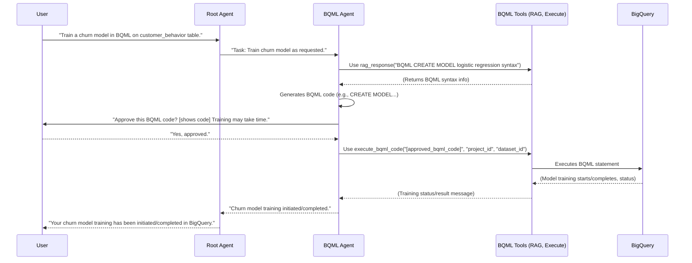

# Chapter 6: BQML Agent (BigQuery ML Specialist)

Welcome to Chapter 6! In the [previous chapter on the Analytics Agent](05_analytics_agent__python_data_scientist_.md), we saw how our system can use Python for detailed data analysis and visualization. But what if we want to perform machine learning tasks directly within our database, Google BigQuery, without moving data around or writing extensive Python ML code?

This is where our **BQML Agent**, the BigQuery ML Specialist, steps in!

## What's the Big Idea? Machine Learning with SQL!

Imagine you have a lot of customer data in BigQuery and you want to predict which customers might stop using your service (this is called "churn prediction"). You could:

1.  Export all that data from BigQuery.
2.  Load it into a Python environment.
3.  Use Python ML libraries (like scikit-learn or TensorFlow) to train a model.
4.  Then figure out how to use that model for predictions.

That's a lot of steps! **BigQuery ML (BQML)** offers a powerful alternative: it lets you create, train, and use machine learning models directly inside BigQuery using familiar SQL-like commands.

Our **BQML Agent** is a specialized [Sub-Agent](02_sub_agents__specialists_.md) designed to be your expert for all things BQML. If you have a request like:

**"Can you train a simple model in BigQuery to predict customer churn based on our `customer_activity` table?"**

The BQML Agent is the one for the job!

Think of it as a specialized construction worker on the "BigQuery" site. This worker only uses "BigQuery ML" branded tools and follows specific BQML blueprints (SQL-like commands) to build machine learning structures (models) directly within the construction site (BigQuery), without having to bring materials in from elsewhere or use different kinds of tools.

Its main tasks include:
*   **Creating** new ML models in BigQuery.
*   **Training** these models with your data in BigQuery.
*   **Evaluating** how well these models perform.
*   **Inspecting** existing BQML models.
*   Answering your questions about BQML by consulting reference guides.

## How the BQML Agent Handles a Request: Training a Churn Model

Let's say you ask the [Root Agent (Orchestrator)](01_root_agent__orchestrator_.md): **"Train a logistic regression model using BQML to predict customer churn. Use the `is_active` column as the target, and features `total_purchases` and `days_since_last_login` from the `my_project.my_dataset.customer_behavior` table."**

Here's a simplified way the BQML Agent might handle this, once the Root Agent delegates the task:

1.  **Understanding the Goal:** The BQML Agent receives the request. Its [Agent Prompts (Instructions)](03_agent_prompts__instructions_.md) tell it what to do.

2.  **Consulting the Manual (Tool: `rag_response`):**
    *   Before writing any BQML code, the agent's instructions often tell it to first consult its BQML reference guide. It uses a special [Tool](04_tools__capabilities_.md) called `rag_response`.
    *   **BQML Agent to `rag_response` tool:** "What's the BQML syntax for creating a logistic regression model?"
    *   **`rag_response` tool output:** (Provides example syntax and explanations for `CREATE MODEL ... OPTIONS(model_type='LOGISTIC_REG') AS SELECT ...`)

3.  **Generating BQML Code:**
    *   Armed with the syntax, the agent now constructs the BQML code. It will use the `project_id` and `dataset_id` that are available to it from its context (we'll see how later).
    *   **Generated BQML (example):**
        ```sql
        CREATE OR REPLACE MODEL `my_project.my_dataset.churn_predictor_model`
        OPTIONS(model_type='LOGISTIC_REG', input_label_cols=['is_active']) AS
        SELECT
          is_active,
          total_purchases,
          days_since_last_login
        FROM
          `my_project.my_dataset.customer_behavior`;
        ```
    *   This SQL-like statement tells BigQuery: "Create (or replace) a model named `churn_predictor_model` of type logistic regression. The column we want to predict is `is_active`. Use `total_purchases` and `days_since_last_login` as features, from the `customer_behavior` table."

4.  **User Verification (Super Important!):**
    *   The BQML Agent's instructions are very clear: **NEVER run BQML code that creates or modifies models without user approval.**
    *   **BQML Agent to User (via Root Agent):** "I've generated the following BQML code to train the churn model. Please review and approve: [shows the BQML code above]. Note: Training this model might take some time."

5.  **Execution (Tool: `execute_bqml_code`):**
    *   **User to BQML Agent:** "Looks good, please proceed!"
    *   The BQML Agent now uses another tool, `execute_bqml_code`, to run the approved BQML.
    *   **BQML Agent to `execute_bqml_code` tool:** "Run this BQML: [the approved BQML code]"
    *   **`execute_bqml_code` tool output:** (Connects to BigQuery, submits the BQML statement. BigQuery then starts training the model. The tool might return a message like "BigQuery ML code executed successfully. Model training initiated.")

6.  **Reporting Back:**
    *   The BQML Agent informs the Root Agent (who then informs you) that the model training has started or completed.

This careful workflow – consult, generate, verify, execute – ensures that machine learning tasks are performed correctly and with your oversight.

## A Peek Under the Hood: The BQML Agent's Setup

The BQML Agent is defined in `data_science/sub_agents/bqml/agent.py`. Let's look at a simplified view of its setup:

```python
# data_science/sub_agents/bqml/agent.py (Simplified)
import os
from google.adk.agents import Agent
from .prompts import return_instructions_bqml # The agent's "script"
from .tools import execute_bqml_code, check_bq_models, rag_response # Its special tools
# ... other imports like call_db_agent tool, setup_before_agent_call function

# This 'root_agent' is actually our specialized BQML Agent instance
bqml_specialist_agent = Agent(
    name="bq_ml_agent",
    instruction=return_instructions_bqml(), # Its detailed instructions
    tools=[
        execute_bqml_code,  # Tool to run BQML commands
        check_bq_models,    # Tool to list existing BQML models
        rag_response,       # Tool to query BQML documentation
        # call_db_agent      # It can also call the DB agent for data exploration!
    ],
    before_agent_callback=setup_before_agent_call, # Runs before agent acts
    model=os.getenv("BQML_AGENT_MODEL"), # Specifies which LLM to use
)
```

Let's break this down:
*   `name="bq_ml_agent"`: Identifies our BQML specialist.
*   `instruction=return_instructions_bqml()`: This provides the detailed [Agent Prompts (Instructions)](03_agent_prompts__instructions_.md) for the BQML Agent. These instructions are quite specific about its workflow (e.g., always use `rag_response` first, always get user approval before `execute_bqml_code`). You can find these in `data_science/sub_agents/bqml/prompts.py`.
*   `tools=[...]`: This is the list of [Tools (Capabilities)](04_tools__capabilities_.md) the BQML Agent can use:
    *   `execute_bqml_code`: To run BQML statements in BigQuery.
    *   `check_bq_models`: To list existing models in your BigQuery dataset.
    *   `rag_response`: To get information from a BQML reference guide (RAG stands for Retrieval Augmented Generation).
    *   It can even have access to `call_db_agent` (not shown in full list for brevity), meaning it could ask the regular Database Agent to explore data with SQL *before* deciding on an ML approach!
*   `before_agent_callback=setup_before_agent_call`: This is a cool feature. The `setup_before_agent_call` function (also in `agent.py`) runs *before* the BQML agent tries to answer your request. It typically fetches the latest schema (structure) of your BigQuery tables and adds this information to the agent's prompt. This way, the agent knows what tables and columns are available when generating BQML code.
*   `model=os.getenv("BQML_AGENT_MODEL")`: Tells the agent which specific Large Language Model (LLM) to use for its "thinking."

### The BQML Agent's "Script" (Prompt)

The instructions in `data_science/sub_agents/bqml/prompts.py` (returned by `return_instructions_bqml()`) are the core of the agent's behavior. Here's a *very* simplified conceptual snippet:

```python
# data_science/sub_agents/bqml/prompts.py (Highly Simplified Conceptual Snippet)

def return_instructions_bqml_simplified() -> str:
    instruction = """
    You are a BigQuery ML (BQML) expert agent.
    Your job is to help users with BQML tasks like model creation, training, and inspection.

    Workflow:
    1.  **Get Info:** ALWAYS start by using the `rag_response` tool to query the BQML Reference Guide.
    2.  **Check Models (if needed):** If user asks about existing models, use `check_bq_models` tool.
    3.  **Generate BQML Code:** If creating/training a model:
        a. Use info from `rag_response` to help write the BQML.
        b. Use the `project_id` and `dataset_id` from the session context in your BQML.
        c. **CRITICAL:** Show the generated BQML to the user for approval.
        d. Inform the user that BQML model training can take time.
    4.  **Execute BQML (if approved):** If user approves, use `execute_bqml_code` tool.
    5.  **Data Exploration (if needed):** If user asks for data exploration before ML, use `call_db_agent` tool.

    IMPORTANT:
    - NEVER use `execute_bqml_code` without user approval for the BQML.
    - Always use `project_id` and `dataset_id` from context. You have this info!
    """
    return instruction
```
The actual prompt (like `instruction_prompt_bqml_v2` in the file) is much more detailed, ensuring the agent is robust and safe.

### Key Tools for the BQML Agent

Let's look at simplified versions of its main tools, found in `data_science/sub_agents/bqml/tools.py`:

*   **`rag_response(query: str) -> str`**:
    *   **Input:** A question for the BQML documentation (e.g., `"How to create a time series BQML model?"`).
    *   **Action:** Queries a pre-indexed BQML reference guide.
    *   **Output:** Relevant text snippets from the documentation.
    ```python
    # data_science/sub_agents/bqml/tools.py (Simplified rag_response)
    # import vertexai.rag # Actual library used

    def rag_response(query: str) -> str:
        """Gets info from BQML documentation using RAG."""
        print(f"RAG Tool: Searching docs for '{query}'...")
        # In reality, this calls a RAG service.
        # corpus_name = os.getenv("BQML_RAG_CORPUS_NAME")
        # response = rag.retrieval_query(...)
        if "logistic regression" in query:
            return "Syntax: CREATE MODEL ... OPTIONS(model_type='LOGISTIC_REG')..."
        return "No specific info found for this simplified example."
    ```

*   **`execute_bqml_code(bqml_code: str, project_id: str, dataset_id: str) -> str`**:
    *   **Input:** The BQML code string to run, plus project and dataset IDs.
    *   **Action:** Connects to BigQuery and executes the BQML statement. It also monitors the job.
    *   **Output:** A message indicating success, errors, or results (if the BQML returns data, like `ML.EVALUATE`).
    ```python
    # data_science/sub_agents/bqml/tools.py (Simplified execute_bqml_code)
    # from google.cloud import bigquery # Actual library used

    def execute_bqml_code(bqml_code: str, project_id: str, dataset_id: str) -> str:
        """Runs BQML code in BigQuery."""
        print(f"Executing BQML in {project_id}.{dataset_id}: {bqml_code[:50]}...")
        # client = bigquery.Client(project=project_id)
        # query_job = client.query(bqml_code)
        # query_job.result() # Waits for completion
        if "CREATE MODEL" in bqml_code:
            return "BigQuery ML model creation/training statement executed successfully."
        return "BQML statement executed."
    ```

*   **`check_bq_models(dataset_id: str) -> str`**:
    *   **Input:** The dataset ID (e.g., `"my_project.my_dataset"`).
    *   **Action:** Lists all BQML models within that BigQuery dataset.
    *   **Output:** A string representing a list of models and their types.
    ```python
    # data_science/sub_agents/bqml/tools.py (Simplified check_bq_models)
    # from google.cloud import bigquery

    def check_bq_models(dataset_id: str) -> str:
        """Lists BQML models in a dataset."""
        print(f"Checking models in dataset: {dataset_id}...")
        # client = bigquery.Client()
        # models = client.list_models(dataset_id)
        # model_list = [{"name": m.model_id, "type": m.model_type} for m in models]
        # return str(model_list)
        return "[{'name': 'existing_model_1', 'type': 'LINEAR_REG'}]" # Example
    ```

## Visualizing the BQML Agent's Workflow

Here's how the BQML Agent might interact with other components to train a model:



## Why is the BQML Agent Important?

*   **Simplifies ML:** Allows you to leverage ML without being an expert in traditional ML frameworks or complex data pipelines. If you know SQL, you can start using BQML.
*   **Data Stays Put:** You train models where your data already lives (in BigQuery), reducing data movement, security concerns, and complexity.
*   **Scalability:** Leverages BigQuery's massive processing power to train models on large datasets.
*   **Integrated Workflow:** The BQML Agent, with its tools and careful prompt, provides a safe and guided way to interact with BQML capabilities.
*   **Specialized Expertise:** It focuses solely on BQML, ensuring it uses best practices and understands the nuances of BQML syntax and operations.

## Conclusion

The BQML Agent is your go-to specialist for performing machine learning directly within Google BigQuery using SQL-like commands. It can help you create, train, evaluate, and inspect BQML models, all while following a safe, user-verified workflow. By consulting documentation with its `rag_response` tool, generating BQML code, asking for your approval, and then executing it with `execute_bqml_code`, this agent makes the power of BigQuery ML accessible and manageable.

This allows our `data-science` project to not only analyze past data but also to build predictive models for the future, all within the robust BigQuery environment.

Next up, we'll explore a fascinating capability that underpins how our agents understand database-related questions: [NL2SQL (Natural Language to SQL Conversion)](07_nl2sql__natural_language_to_sql_conversion_.md).

---

Generated by [AI Codebase Knowledge Builder](https://github.com/The-Pocket/Tutorial-Codebase-Knowledge)