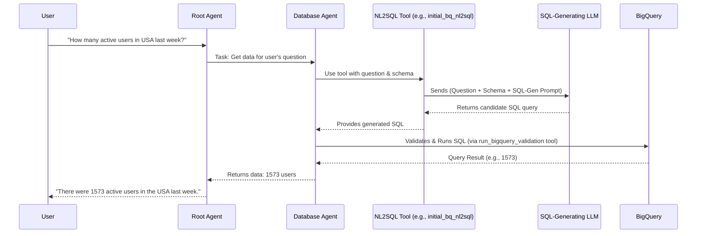

# Chapter 7: NL2SQL (Natural Language to SQL Conversion)

Welcome to Chapter 7! In the [previous chapter on the BQML Agent](06_bqml_agent__bigquery_ml_specialist_.md), we saw how our system can perform machine learning tasks directly within BigQuery. But what if you just want to ask a simple question about your data, like "How many products did we sell last month?" or "Which customers live in New York?"

Most people don't "speak" SQL, the Structured Query Language databases understand. Wouldn't it be great if you could ask your database questions in plain English? That's exactly what NL2SQL, or Natural Language to SQL conversion, is all about!

## What's the Big Idea? Your Personal Database Translator!

Imagine you're traveling in a foreign country and you don't speak the local language. You'd need a translator to ask for directions or order food, right?

**NL2SQL is like a universal translator for databases.**

It takes your questions, written or spoken in everyday English (natural language), and converts them into precise SQL queries that our BigQuery database can understand and execute. This means you don't have to learn SQL to get answers from your data!

**Use Case:**
Let's say you want to know:
**"How many active users did we have in the USA last week?"**

Instead of figuring out the SQL, which might look something like this:
```sql
SELECT COUNT(DISTINCT user_id)
FROM user_activity_table
WHERE country = 'USA'
  AND event_date >= DATE_SUB(CURRENT_DATE(), INTERVAL 7 DAY)
  AND status = 'active';
```

You can just ask the question in English, and the NL2SQL capability will work behind the scenes to generate the correct SQL query. This is incredibly powerful because it makes data accessible to everyone, not just data engineers or analysts.

## Who Handles NL2SQL in Our Project?

Remember our [Sub-Agents (Specialists)](02_sub_agents__specialists_.md) from Chapter 2? One of them is the **Database Agent** (or `db_agent`), our BigQuery specialist. When the [Root Agent (Orchestrator)](01_root_agent__orchestrator_.md) receives a question that needs data from the database, it often passes this task to the Database Agent.

The Database Agent is equipped with the NL2SQL capability. It's the one responsible for understanding your English question and translating it into a valid BigQuery SQL query.

## How Does NL2SQL Work? The Magic Ingredients

To translate your English question into SQL, the Database Agent (and its NL2SQL tools) needs a few key things:

1.  **Your Natural Language Question:** This is the input, e.g., "Show me total sales for Product X."
2.  **The Database Schema:** The agent needs to know the structure of your database – what tables exist, what columns are in those tables, and what kind of data they hold (text, numbers, dates, etc.). Without this "map" of the database, it can't write a correct query. We'll learn more about this in the next chapter, [BigQuery Schema Integration](08_bigquery_schema_integration.md).
3.  **A Large Language Model (LLM):** This is the "brain" that does the actual translation. LLMs are trained on vast amounts of text and code, including SQL, so they are good at understanding language and generating code.
4.  **A Specialized Prompt:** Just like we learned in [Agent Prompts (Instructions)](03_agent_prompts__instructions_.md), the LLM needs specific instructions for this translation task. This "NL2SQL prompt" guides the LLM on how to convert the question into SQL based on the given schema.

## NL2SQL in Action: A Step-by-Step Example

Let's go back to our user asking: **"How many active users did we have in the USA last week?"**

Here's a simplified flow of how the NL2SQL process might work within our system:

1.  **User asks the Root Agent:** "How many active users did we have in the USA last week?"
2.  **Root Agent delegates:** The Root Agent recognizes this needs data and passes the task to the `Database Agent`.
3.  **Database Agent prepares for NL2SQL:** The Database Agent's instructions tell it to use one of its [Tools (Capabilities)](04_tools__capabilities_.md) to handle this. A key tool for this is often called something like `initial_bq_nl2sql` (which you can find in `data_science/sub_agents/bigquery/tools.py`).
4.  **The `initial_bq_nl2sql` Tool at Work:**
    *   The tool receives your question: "How many active users did we have in the USA last week?"
    *   It also gets the **database schema** (the structure of your tables, e.g., `user_activity_table` has `user_id`, `country`, `event_date`, `status` columns). This schema information is often loaded into the agent's context (more on that in [Chapter 9: Callback Context & State Management](09_callback_context___state_management_.md)).
    *   The tool constructs a **specialized NL2SQL prompt**. This prompt is *different* from the Database Agent's main prompt. It's highly focused on SQL generation. It might look conceptually like this:

        ```
        You are a BigQuery SQL expert.
        Given this database schema:
        [...details of user_activity_table and other relevant tables...]

        And this user question:
        "How many active users did we have in the USA last week?"

        Generate a valid BigQuery SQL query to answer the question.
        Make sure to use correct table and column names from the schema.
        For "last week", consider the past 7 days from today.
        ```
    *   The tool sends this detailed prompt (containing your question, the schema, and SQL generation instructions) to a **Large Language Model (LLM)**.
5.  **LLM Generates SQL:** The LLM processes the prompt and generates a candidate SQL query, for example:
    ```sql
    SELECT COUNT(DISTINCT user_id)
    FROM my_project.my_dataset.user_activity_table
    WHERE country = 'USA'
      AND event_date >= DATE_SUB(CURRENT_DATE(), INTERVAL 7 DAY)
      AND status = 'active'
    ```
6.  **Database Agent Validates and Runs SQL:** The `initial_bq_nl2sql` tool returns this SQL to the Database Agent. The Database Agent's instructions often tell it to then use *another* tool, like `run_bigquery_validation` (also in `data_science/sub_agents/bigquery/tools.py`), to:
    *   Check if the SQL is valid (syntax check).
    *   Actually run the SQL query against BigQuery.
7.  **Results are Returned:** BigQuery runs the query and returns the result (e.g., the number `1573`). This result is passed back through the Database Agent to the Root Agent, and finally to you.

### Visualizing the NL2SQL Flow

Here's a simplified diagram of this process:



## A Look at the Code: The NL2SQL Tool and Its Prompt

The actual NL2SQL magic happens within tools used by the Database Agent. In our `data-science` project, you'll find the implementation for a baseline NL2SQL approach in `data_science/sub_agents/bigquery/tools.py`.

Let's look at a *highly simplified* idea of what the `initial_bq_nl2sql` tool does:

```python
# data_science/sub_agents/bigquery/tools.py (Highly Simplified Concept)

# This function is a tool the Database Agent can use.
def initial_bq_nl2sql_simplified(
    question: str, # e.g., "How many users in USA?"
    tool_context # This object holds shared info, like the database schema
) -> str:
    # 1. Get the database schema (table structures)
    # The real tool gets this from tool_context.state["database_settings"]["bq_ddl_schema"]
    database_schema_info = "TABLE customers (user_id TEXT, country TEXT, status TEXT, ...);"
    # ... and details for other tables

    # 2. Create the specialized NL2SQL prompt
    nl2sql_prompt_template = """
    You are a BigQuery SQL expert.
    Schema: {SCHEMA}
    Question: {QUESTION}
    Generate a BigQuery SQL query.
    """
    full_prompt_for_llm = nl2sql_prompt_template.format(
        SCHEMA=database_schema_info,
        QUESTION=question
    )

    # 3. Send to LLM (Large Language Model)
    # The real tool uses something like:
    # response = llm_client.models.generate_content(model="some-model", contents=full_prompt_for_llm)
    # generated_sql = response.text
    # For this example, let's pretend the LLM returns this:
    if "users in USA" in question:
        generated_sql = "SELECT COUNT(user_id) FROM customers WHERE country = 'USA';"
    else:
        generated_sql = "-- Could not generate SQL for this simplified example"

    # 4. Return the generated SQL
    # The real tool also stores this in tool_context.state["sql_query"]
    return generated_sql
```
**Explanation:**
*   This simplified function shows the core steps: get the question, get the schema, build a very specific prompt for the LLM, and then ask the LLM to generate the SQL.
*   The `tool_context` is super important because it's how the tool gets access to the current database schema. The `setup_before_agent_call` function in the Database Agent's definition (`data_science/sub_agents/bigquery/agent.py`) often populates this schema information.
*   The actual `initial_bq_nl2sql` function in `tools.py` is more robust, using a detailed prompt template and interacting with the `llm_client` to call the Gemini model.

### The Database Agent's Role

The `Database Agent` itself is defined in `data_science/sub_agents/bigquery/agent.py`. Its [Agent Prompts (Instructions)](03_agent_prompts__instructions_.md) (from `data_science/sub_agents/bigquery/prompts.py`) tell it to use tools like `initial_bq_nl2sql` and `run_bigquery_validation` in a sequence to answer questions.

```python
# data_science/sub_agents/bigquery/agent.py (Snippet)

database_agent = Agent(
    # ... other parameters
    name="database_agent",
    instruction=return_instructions_bigquery(), # Tells it its workflow
    tools=[
        tools.initial_bq_nl2sql, # Our NL2SQL tool
        tools.run_bigquery_validation, # Tool to run the SQL
    ],
    # ...
)
```
The `instruction` (from `return_instructions_bigquery()` in `prompts.py`) guides the Database Agent's overall behavior. For instance, it might say: "First, use `initial_bq_nl2sql` to get SQL. Then, use `run_bigquery_validation` to execute it."

### Different Flavors of NL2SQL: BASELINE vs. CHASE

You might notice in `data_science/sub_agents/bigquery/agent.py` and `prompts.py` references to an environment variable `NL2SQL_METHOD` which can be "BASELINE" or "CHASE".
*   **"BASELINE"**: This generally refers to a more straightforward NL2SQL approach, like the one we discussed using the `initial_bq_nl2sql` function directly from `tools.py`.
*   **"CHASE"**: This likely refers to a more advanced NL2SQL technique, possibly involving more complex prompting strategies or decomposition of the question. The code for this can be found in the `data_science/sub_agents/bigquery/chase_sql/` directory, including `chase_db_tools.py` (with another `initial_bq_nl2sql` tailored for CHASE) and different prompt templates like `dc_prompt_template.py` (Divide and Conquer) and `qp_prompt_template.py` (Query Plan).

For beginners, understanding the "BASELINE" concept is sufficient: NL2SQL uses the user's question, the database schema, and a smart LLM with good instructions to generate SQL. The "CHASE" method is an example of how this core idea can be refined and made more powerful with advanced techniques.

## Why is NL2SQL a Core Capability?

*   **Accessibility:** It opens up database querying to users who don't know SQL. This is a huge win for democratizing data!
*   **Speed & Efficiency:** For many common questions, asking in English can be much faster than manually writing and debugging an SQL query.
*   **Empowerment:** It allows business users, managers, and other non-technical staff to directly explore data and get insights without always needing to rely on a data analyst or engineer for simple queries.

While NL2SQL is powerful, it's also a complex area. Ambiguity in natural language can sometimes lead to misinterpretations. That's why having an accurate database schema and well-crafted prompts are so critical for success.

## Conclusion

NL2SQL is a transformative technology that acts as a bridge between human language and the structured language of databases. By converting your everyday English questions into executable SQL queries, it allows our `data-science` project to offer a much more intuitive and user-friendly way to interact with data stored in BigQuery. The Database Agent, armed with tools like `initial_bq_nl2sql` and knowledge of the database schema, is the key enabler of this capability.

Understanding the database's structure is fundamental for effective NL2SQL. In the next chapter, we'll dive deeper into how our system integrates with and understands the [BigQuery Schema Integration](08_bigquery_schema_integration.md).

---
Relevant Code Snippets:
(These are provided for reference to show where the discussed functionalities are implemented in the project. You are not expected to understand every line, but to see how the concepts connect to the actual codebase.)

--- File: `data_science/sub_agents/bigquery/agent.py` ---
```python
# Copyright 2025 Google LLC
#
# Licensed under the Apache License, Version 2.0 (the "License");
# you may not use this file except in compliance with the License.
# You may obtain a copy of the License at
#
#     http://www.apache.org/licenses/LICENSE-2.0
#
# Unless required by applicable law or agreed to in writing, software
# distributed under the License is distributed on an "AS IS" BASIS,
# WITHOUT WARRANTIES OR CONDITIONS OF ANY KIND, either express or implied.
# See the License for the specific language governing permissions and
# limitations under the License.

"""Database Agent: get data from database (BigQuery) using NL2SQL."""

import os

from google.adk.agents import Agent
from google.adk.agents.callback_context import CallbackContext
from google.genai import types

from . import tools
from .chase_sql import chase_db_tools
from .prompts import return_instructions_bigquery

NL2SQL_METHOD = os.getenv("NL2SQL_METHOD", "BASELINE")


def setup_before_agent_call(callback_context: CallbackContext) -> None:
    """Setup the agent."""

    if "database_settings" not in callback_context.state:
        callback_context.state["database_settings"] = \
            tools.get_database_settings()


database_agent = Agent(
    model=os.getenv("BIGQUERY_AGENT_MODEL"),
    name="database_agent",
    instruction=return_instructions_bigquery(),
    tools=[
        (
            chase_db_tools.initial_bq_nl2sql
            if NL2SQL_METHOD == "CHASE"
            else tools.initial_bq_nl2sql
        ),
        tools.run_bigquery_validation,
    ],
    before_agent_callback=setup_before_agent_call,
    generate_content_config=types.GenerateContentConfig(temperature=0.01),
)
```
*Self-reflection: This file defines the `database_agent`. Note how it selects `initial_bq_nl2sql` based on `NL2SQL_METHOD` and includes `run_bigquery_validation` as another tool. The `setup_before_agent_call` is key for loading database schema into `callback_context.state` which the NL2SQL tool will need.*

--- File: `data_science/sub_agents/bigquery/prompts.py` ---
```python
# Copyright 2025 Google LLC
#
# Licensed under the Apache License, Version 2.0 (the "License");
# you may not use this file except in compliance with the License.
# You may obtain a copy of the License at
#
#     http://www.apache.org/licenses/LICENSE-2.0
#
# Unless required by applicable law or agreed to in writing, software
# distributed under the License is distributed on an "AS IS" BASIS,
# WITHOUT WARRANTIES OR CONDITIONS OF ANY KIND, either express or implied.
# See the License for the specific language governing permissions and
# limitations under the License.

"""Module for storing and retrieving agent instructions.

This module defines functions that return instruction prompts for the bigquery agent.
These instructions guide the agent's behavior, workflow, and tool usage.
"""

import os


def return_instructions_bigquery() -> str:

    NL2SQL_METHOD = os.getenv("NL2SQL_METHOD", "BASELINE")
    if NL2SQL_METHOD == "BASELINE" or NL2SQL_METHOD == "CHASE":
        db_tool_name = "initial_bq_nl2sql"
    else:
        db_tool_name = None
        raise ValueError(f"Unknown NL2SQL method: {NL2SQL_METHOD}")

    instruction_prompt_bqml_v1 = f"""
      You are an AI assistant serving as a SQL expert for BigQuery.
      Your job is to help users generate SQL answers from natural language questions (inside Nl2sqlInput).
      You should proeuce the result as NL2SQLOutput.

      Use the provided tools to help generate the most accurate SQL:
      1. First, use {db_tool_name} tool to generate initial SQL from the question.
      2. You should also validate the SQL you have created for syntax and function errors (Use run_bigquery_validation tool). If there are any errors, you should go back and address the error in the SQL. Recreate the SQL based by addressing the error.
      4. Generate the final result in JSON format with four keys: "explain", "sql", "sql_results", "nl_results".
          "explain": "write out step-by-step reasoning to explain how you are generating the query based on the schema, example, and question.",
          "sql": "Output your generated SQL!",
          "sql_results": "raw sql execution query_result from run_bigquery_validation if it's available, otherwise None",
          "nl_results": "Natural language about results, otherwise it's None if generated SQL is invalid"
      ```
      You should pass one tool call to another tool call as needed!

      NOTE: you should ALWAYS USE THE TOOLS ({db_tool_name} AND run_bigquery_validation) to generate SQL, not make up SQL WITHOUT CALLING TOOLS.
      Keep in mind that you are an orchestration agent, not a SQL expert, so use the tools to help you generate SQL, but do not make up SQL.

    """

    return instruction_prompt_bqml_v1
```
*Self-reflection: This file contains the instructions for the `database_agent`. The prompt clearly states the workflow: use `initial_bq_nl2sql` first, then `run_bigquery_validation`. This is the agent's overall "script" for handling database queries.*

--- File: `data_science/sub_agents/bigquery/tools.py` ---
```python
# Copyright 2025 Google LLC
#
# Licensed under the Apache License, Version 2.0 (the "License");
# you may not use this file except in compliance with the License.
# You may obtain a copy of the License at
#
#     http://www.apache.org/licenses/LICENSE-2.0
#
# Unless required by applicable law or agreed to in writing, software
# distributed under the License is distributed on an "AS IS" BASIS,
# WITHOUT WARRANTIES OR CONDITIONS OF ANY KIND, either express or implied.
# See the License for the specific language governing permissions and
# limitations under the License.

"""This file contains the tools used by the database agent."""

import datetime
import logging
import os
import re

from data_science.utils.utils import get_env_var
from google.adk.tools import ToolContext
from google.cloud import bigquery
from google.genai import Client

from .chase_sql import chase_constants

# Assume that `BQ_PROJECT_ID` is set in the environment. See the
# `data_agent` README for more details.
project = os.getenv("BQ_PROJECT_ID", None)
location = os.getenv("GOOGLE_CLOUD_LOCATION", "us-central1")
llm_client = Client(vertexai=True, project=project, location=location)

MAX_NUM_ROWS = 80


database_settings = None
bq_client = None


def get_bq_client():
    """Get BigQuery client."""
    global bq_client
    if bq_client is None:
        bq_client = bigquery.Client(project=get_env_var("BQ_PROJECT_ID"))
    return bq_client


def get_database_settings():
    """Get database settings."""
    global database_settings
    if database_settings is None:
        database_settings = update_database_settings()
    return database_settings


def update_database_settings():
    """Update database settings."""
    global database_settings
    ddl_schema = get_bigquery_schema(
        get_env_var("BQ_DATASET_ID"),
        client=get_bq_client(),
        project_id=get_env_var("BQ_PROJECT_ID"),
    )
    database_settings = {
        "bq_project_id": get_env_var("BQ_PROJECT_ID"),
        "bq_dataset_id": get_env_var("BQ_DATASET_ID"),
        "bq_ddl_schema": ddl_schema,
        # Include ChaseSQL-specific constants.
        **chase_constants.chase_sql_constants_dict,
    }
    return database_settings


def get_bigquery_schema(dataset_id, client=None, project_id=None):
    """Retrieves schema and generates DDL with example values for a BigQuery dataset.

    Args:
        dataset_id (str): The ID of the BigQuery dataset (e.g., 'my_dataset').
        client (bigquery.Client): A BigQuery client.
        project_id (str): The ID of your Google Cloud Project.

    Returns:
        str: A string containing the generated DDL statements.
    """

    if client is None:
        client = bigquery.Client(project=project_id)

    # dataset_ref = client.dataset(dataset_id)
    dataset_ref = bigquery.DatasetReference(project_id, dataset_id)

    ddl_statements = ""

    for table in client.list_tables(dataset_ref):
        table_ref = dataset_ref.table(table.table_id)
        table_obj = client.get_table(table_ref)

        # Check if table is a view
        if table_obj.table_type != "TABLE":
            continue

        ddl_statement = f"CREATE OR REPLACE TABLE `{table_ref}` (\n"

        for field in table_obj.schema:
            ddl_statement += f"  `{field.name}` {field.field_type}"
            if field.mode == "REPEATED":
                ddl_statement += " ARRAY"
            if field.description:
                ddl_statement += f" COMMENT '{field.description}'"
            ddl_statement += ",\n"

        ddl_statement = ddl_statement[:-2] + "\n);\n\n"

        # Add example values if available (limited to first row)
        rows = client.list_rows(table_ref, max_results=5).to_dataframe()
        if not rows.empty:
            ddl_statement += f"-- Example values for table `{table_ref}`:\n"
            for _, row in rows.iterrows():  # Iterate over DataFrame rows
                ddl_statement += f"INSERT INTO `{table_ref}` VALUES\n"
                example_row_str = "("
                for value in row.values:  # Now row is a pandas Series and has values
                    if isinstance(value, str):
                        example_row_str += f"'{value}',"
                    elif value is None:
                        example_row_str += "NULL,"
                    else:
                        example_row_str += f"{value},"
                example_row_str = (
                    example_row_str[:-1] + ");\n\n"
                )  # remove trailing comma
                ddl_statement += example_row_str

        ddl_statements += ddl_statement

    return ddl_statements


def initial_bq_nl2sql(
    question: str,
    tool_context: ToolContext,
) -> str:
    """Generates an initial SQL query from a natural language question.

    Args:
        question (str): Natural language question.
        tool_context (ToolContext): The tool context to use for generating the SQL
          query.

    Returns:
        str: An SQL statement to answer this question.
    """

    prompt_template = """
You are a BigQuery SQL expert tasked with answering user's questions about BigQuery tables by generating SQL queries in the GoogleSql dialect.  Your task is to write a Bigquery SQL query that answers the following question while using the provided context.

**Guidelines:**

- **Table Referencing:** Always use the full table name with the database prefix in the SQL statement.  Tables should be referred to using a fully qualified name with enclosed in backticks (`) e.g. `project_name.dataset_name.table_name`.  Table names are case sensitive.
- **Joins:** Join as few tables as possible. When joining tables, ensure all join columns are the same data type. Analyze the database and the table schema provided to understand the relationships between columns and tables.
- **Aggregations:**  Use all non-aggregated columns from the `SELECT` statement in the `GROUP BY` clause.
- **SQL Syntax:** Return syntactically and semantically correct SQL for BigQuery with proper relation mapping (i.e., project_id, owner, table, and column relation). Use SQL `AS` statement to assign a new name temporarily to a table column or even a table wherever needed. Always enclose subqueries and union queries in parentheses.
- **Column Usage:** Use *ONLY* the column names (column_name) mentioned in the Table Schema. Do *NOT* use any other column names. Associate `column_name` mentioned in the Table Schema only to the `table_name` specified under Table Schema.
- **FILTERS:** You should write query effectively  to reduce and minimize the total rows to be returned. For example, you can use filters (like `WHERE`, `HAVING`, etc. (like 'COUNT', 'SUM', etc.) in the SQL query.
- **LIMIT ROWS:**  The maximum number of rows returned should be less than {MAX_NUM_ROWS}.

**Schema:**

The database structure is defined by the following table schemas (possibly with sample rows):

```
{SCHEMA}
```

**Natural language question:**

```
{QUESTION}
```

**Think Step-by-Step:** Carefully consider the schema, question, guidelines, and best practices outlined above to generate the correct BigQuery SQL.

   """

    ddl_schema = tool_context.state["database_settings"]["bq_ddl_schema"]

    prompt = prompt_template.format(
        MAX_NUM_ROWS=MAX_NUM_ROWS, SCHEMA=ddl_schema, QUESTION=question
    )

    response = llm_client.models.generate_content(
        model=os.getenv("BASELINE_NL2SQL_MODEL"),
        contents=prompt,
        config={"temperature": 0.1},
    )

    sql = response.text
    if sql:
        sql = sql.replace("```sql", "").replace("```", "").strip()

    print("\n sql:", sql)

    tool_context.state["sql_query"] = sql

    return sql


def run_bigquery_validation(
    sql_string: str,
    tool_context: ToolContext,
) -> str:
    """Validates BigQuery SQL syntax and functionality.

    This function validates the provided SQL string by attempting to execute it
    against BigQuery in dry-run mode. It performs the following checks:

    1. **SQL Cleanup:**  Preprocesses the SQL string using a `cleanup_sql`
    function
    2. **DML/DDL Restriction:**  Rejects any SQL queries containing DML or DDL
       statements (e.g., UPDATE, DELETE, INSERT, CREATE, ALTER) to ensure
       read-only operations.
    3. **Syntax and Execution:** Sends the cleaned SQL to BigQuery for validation.
       If the query is syntactically correct and executable, it retrieves the
       results.
    4. **Result Analysis:**  Checks if the query produced any results. If so, it
       formats the first few rows of the result set for inspection.

    Args:
        sql_string (str): The SQL query string to validate.
        tool_context (ToolContext): The tool context to use for validation.

    Returns:
        str: A message indicating the validation outcome. This includes:
             - "Valid SQL. Results: ..." if the query is valid and returns data.
             - "Valid SQL. Query executed successfully (no results)." if the query
                is valid but returns no data.
             - "Invalid SQL: ..." if the query is invalid, along with the error
                message from BigQuery.
    """

    def cleanup_sql(sql_string):
        """Processes the SQL string to get a printable, valid SQL string."""

        # 1. Remove backslashes escaping double quotes
        sql_string = sql_string.replace('\\"', '"')

        # 2. Remove backslashes before newlines (the key fix for this issue)
        sql_string = sql_string.replace("\\\n", "\n")  # Corrected regex

        # 3. Replace escaped single quotes
        sql_string = sql_string.replace("\\'", "'")

        # 4. Replace escaped newlines (those not preceded by a backslash)
        sql_string = sql_string.replace("\\n", "\n")

        # 5. Add limit clause if not present
        if "limit" not in sql_string.lower():
            sql_string = sql_string + " limit " + str(MAX_NUM_ROWS)

        return sql_string

    logging.info("Validating SQL: %s", sql_string)
    sql_string = cleanup_sql(sql_string)
    logging.info("Validating SQL (after cleanup): %s", sql_string)

    final_result = {"query_result": None, "error_message": None}

    # More restrictive check for BigQuery - disallow DML and DDL
    if re.search(
        r"(?i)(update|delete|drop|insert|create|alter|truncate|merge)", sql_string
    ):
        final_result["error_message"] = (
            "Invalid SQL: Contains disallowed DML/DDL operations."
        )
        return final_result

    try:
        query_job = get_bq_client().query(sql_string)
        results = query_job.result()  # Get the query results

        if results.schema:  # Check if query returned data
            rows = [
                {
                    key: (
                        value
                        if not isinstance(value, datetime.date)
                        else value.strftime("%Y-%m-%d")
                    )
                    for (key, value) in row.items()
                }
                for row in results
            ][
                :MAX_NUM_ROWS
            ]  # Convert BigQuery RowIterator to list of dicts
            # return f"Valid SQL. Results: {rows}"
            final_result["query_result"] = rows

            tool_context.state["query_result"] = rows

        else:
            final_result["error_message"] = (
                "Valid SQL. Query executed successfully (no results)."
            )

    except (
        Exception
    ) as e:  # Catch generic exceptions from BigQuery  # pylint: disable=broad-exception-caught
        final_result["error_message"] = f"Invalid SQL: {e}"

    print("\n run_bigquery_validation final_result: \n", final_result)

    return final_result
```
*Self-reflection: This file is crucial for NL2SQL. `get_bigquery_schema()` fetches the database structure. `initial_bq_nl2sql()` (for the "BASELINE" method) takes the user's question, combines it with the schema and a detailed prompt template, then calls an LLM (`llm_client.models.generate_content`) to produce SQL. This is the heart of the NL2SQL translation. `run_bigquery_validation()` then takes this SQL to execute it.*

--- File: `data_science/sub_agents/bigquery/chase_sql/chase_db_tools.py` ---
```python
# Copyright 2025 Google LLC
#
# Licensed under the Apache License, Version 2.0 (the "License");
# you may not use this file except in compliance with the License.
# You may obtain a copy of the License at
#
#     http://www.apache.org/licenses/LICENSE-2.0
#
# Unless required by applicable law or agreed to in writing, software
# distributed under the License is distributed on an "AS IS" BASIS,
# WITHOUT WARRANTIES OR CONDITIONS OF ANY KIND, either express or implied.
# See the License for the specific language governing permissions and
# limitations under the License.

"""This code contains the implementation of the tools used for the CHASE-SQL agent."""

import enum
import os

from google.adk.tools import ToolContext

# pylint: disable=g-importing-member
from .dc_prompt_template import DC_PROMPT_TEMPLATE
from .llm_utils import GeminiModel
from .qp_prompt_template import QP_PROMPT_TEMPLATE
from .sql_postprocessor import sql_translator

# pylint: enable=g-importing-member

BQ_PROJECT_ID = os.getenv("BQ_PROJECT_ID")


class GenerateSQLType(enum.Enum):
    """Enum for the different types of SQL generation methods.

    DC: Divide and Conquer ICL prompting
    QP: Query Plan-based prompting
    """

    DC = "dc"
    QP = "qp"


def exception_wrapper(func):
    """A decorator to catch exceptions in a function and return the exception as a string.

    Args:
       func (callable): The function to wrap.

    Returns:
       callable: The wrapped function.
    """

    def wrapped_function(*args, **kwargs):
        try:
            return func(*args, **kwargs)
        except Exception as e:  # pylint: disable=broad-exception-caught
            return f"Exception occurred in {func.__name__}: {str(e)}"

    return wrapped_function


def parse_response(response: str) -> str:
    """Parses the output to extract SQL content from the response.

    Args:
       response (str): The output string containing SQL query.

    Returns:
       str: The SQL query extracted from the response.
    """
    query = response
    try:
        if "```sql" in response and "```" in response:
            query = response.split("```sql")[1].split("```")[0]
    except ValueError as e:
        print(f"Error in parsing response: {e}")
        query = response
    return query.strip()


def initial_bq_nl2sql(
    question: str,
    tool_context: ToolContext,
) -> str:
    """Generates an initial SQL query from a natural language question.

    Args:
      question: Natural language question.
      tool_context: Function context.

    Returns:
      str: An SQL statement to answer this question.
    """
    print("****** Running agent with ChaseSQL algorithm.")
    ddl_schema = tool_context.state["database_settings"]["bq_ddl_schema"]
    project = tool_context.state["database_settings"]["bq_project_id"]
    db = tool_context.state["database_settings"]["bq_dataset_id"]
    transpile_to_bigquery = tool_context.state["database_settings"][
        "transpile_to_bigquery"
    ]
    process_input_errors = tool_context.state["database_settings"][
        "process_input_errors"
    ]
    process_tool_output_errors = tool_context.state["database_settings"][
        "process_tool_output_errors"
    ]
    number_of_candidates = tool_context.state["database_settings"][
        "number_of_candidates"
    ]
    model = tool_context.state["database_settings"]["model"]
    temperature = tool_context.state["database_settings"]["temperature"]
    generate_sql_type = tool_context.state["database_settings"]["generate_sql_type"]

    if generate_sql_type == GenerateSQLType.DC.value:
        prompt = DC_PROMPT_TEMPLATE.format(
            SCHEMA=ddl_schema, QUESTION=question, BQ_PROJECT_ID=BQ_PROJECT_ID
        )
    elif generate_sql_type == GenerateSQLType.QP.value:
        prompt = QP_PROMPT_TEMPLATE.format(
            SCHEMA=ddl_schema, QUESTION=question, BQ_PROJECT_ID=BQ_PROJECT_ID
        )
    else:
        raise ValueError(f"Unsupported generate_sql_type: {generate_sql_type}")

    model = GeminiModel(model_name=model, temperature=temperature)
    requests = [prompt for _ in range(number_of_candidates)]
    responses = model.call_parallel(requests, parser_func=parse_response)
    # Take just the first response.
    responses = responses[0]

    # If postprocessing of the SQL to transpile it to BigQuery is required,
    # then do it here.
    if transpile_to_bigquery:
        translator = sql_translator.SqlTranslator(
            model=model,
            temperature=temperature,
            process_input_errors=process_input_errors,
            process_tool_output_errors=process_tool_output_errors,
        )
        # pylint: disable=g-bad-todo
        # pylint: enable=g-bad-todo
        responses: str = translator.translate(
            responses, ddl_schema=ddl_schema, db=db, catalog=project
        )

    return responses
```
*Self-reflection: This file implements the `initial_bq_nl2sql` tool specifically for the "CHASE" method. It uses different, more complex prompt templates (`DC_PROMPT_TEMPLATE` or `QP_PROMPT_TEMPLATE`) based on the `generate_sql_type`. This showcases a more advanced approach to NL2SQL compared to the baseline.*

--- File: `data_science/sub_agents/bigquery/chase_sql/dc_prompt_template.py` ---
```python
# Copyright 2025 Google LLC
#
# Licensed under the Apache License, Version 2.0 (the "License");
# you may not use this file except in compliance with the License.
# You may obtain a copy of the License at
#
#     http://www.apache.org/licenses/LICENSE-2.0
#
# Unless required by applicable law or agreed to in writing, software
# distributed under the License is distributed on an "AS IS" BASIS,
# WITHOUT WARRANTIES OR CONDITIONS OF ANY KIND, either express or implied.
# See the License for the specific language governing permissions and
# limitations under the License.

"""Divide-and-Conquer prompt template."""

DC_PROMPT_TEMPLATE = """
You are an experienced database expert.
Now you need to generate a GoogleSQL or BigQuery query given the database information, a question and some additional information.
The database structure is defined by table schemas (some columns provide additional column descriptions in the options).

Given the table schema information description and the `Question`. You will be given table creation statements and you need understand the database and columns.

You will be using a way called "recursive divide-and-conquer approach to SQL query generation from natural language".

Here is a high level description of the steps.
1. **Divide (Decompose Sub-question with Pseudo SQL):** The complex natural language question is recursively broken down into simpler sub-questions. Each sub-question targets a specific piece of information or logic required for the final SQL query.
2. **Conquer (Real SQL for sub-questions):**  For each sub-question (and the main question initially), a "pseudo-SQL" fragment is formulated. This pseudo-SQL represents the intended SQL logic but might have placeholders for answers to the decomposed sub-questions.
3. **Combine (Reassemble):** Once all sub-questions are resolved and their corresponding SQL fragments are generated, the process reverses. The SQL fragments are recursively combined by replacing the placeholders in the pseudo-SQL with the actual generated SQL from the lower levels.
4. **Final Output:** This bottom-up assembly culminates in the complete and correct SQL query that answers the original complex question.

Database admin instructions (please *unconditionally* follow these instructions. Do *not* ignore them or use them as hints.):
1. **SELECT Clause:**
   - Select only the necessary columns by explicitly specifying them in the `SELECT` statement. Avoid redundant columns or values.

2. **Aggregation (MAX/MIN):**
   - Ensure `JOIN`s are completed before applying `MAX()` or `MIN()`. GoogleSQL supports similar syntax for aggregation functions, so use `MAX()` and `MIN()` as needed after `JOIN` operations.

3. **ORDER BY with Distinct Values:**
   - In GoogleSQL, `GROUP BY <column>` can be used before `ORDER BY <column> ASC|DESC` to get distinct values and sort them.

4. **Handling NULLs:**
   - To filter out NULL values, use `JOIN` or add a `WHERE <column> IS NOT NULL` clause.

5. **FROM/JOIN Clauses:**
   - Only include tables essential to the query. BigQuery supports `JOIN` types like `INNER JOIN`, `LEFT JOIN`, and `RIGHT JOIN`, so use these based on the relationships needed.

6. **Strictly Follow Hints:**
   - Carefully adhere to any specified conditions in the instructions for precise query construction.

7. **Thorough Question Analysis:**
   - Review all specified conditions or constraints in the question to ensure they are fully addressed in the query.

8. **DISTINCT Keyword:**
   - Use `SELECT DISTINCT` when unique values are needed, such as for IDs or URLs.

9. **Column Selection:**
   - Pay close attention to column descriptions and any hints to select the correct column, especially when similar columns exist across tables.

10. **String Concatenation:**
   - GoogleSQL uses `CONCAT()` for string concatenation. Avoid using `||` and instead use `CONCAT(column1, ' ', column2)` for concatenation.

11. **JOIN Preference:**
   - Use `INNER JOIN` when appropriate, and avoid nested `SELECT` statements if a `JOIN` will achieve the same result.

12. **GoogleSQL Functions Only:**
   - Use functions available in GoogleSQL. Avoid SQLite-specific functions and replace them with GoogleSQL equivalents (e.g., `FORMAT_DATE` instead of `STRFTIME`).

13. **Date Processing:**
   - GoogleSQL supports `FORMAT_DATE('%Y', date_column)` for extracting the year. Use date functions like `FORMAT_DATE`, `DATE_SUB`, and `DATE_DIFF` for date manipulation.

14. **Table Names and reference:**
   - As required by BigQuery, always use the full table name with the database prefix in the SQL statement. For example, "SELECT * FROM example_bigquery_database.table_a", not just "SELECT * FROM table_a"

15. **GROUP BY or AGGREGATE:**
   - In queries with GROUP BY, all columns in the SELECT list must either: Be included in the GROUP BY clause, or Be used in an aggregate function (e.g., MAX, MIN, AVG, COUNT, SUM).

Here are some examples
===========
Example 1

**************************
【Table creation statements】
CREATE TABLE {BQ_PROJECT_ID}.restaurant.generalinfo
(
 id_restaurant INT64,
 food_type STRING OPTIONS(description="the food type"),
 city STRING OPTIONS(description="the city where the restaurant is located in"),
);

CREATE TABLE {BQ_PROJECT_ID}.restaurant.location
(
 id_restaurant INT64,
 street_name STRING OPTIONS(description="the street name of the restaurant"),
 city STRING OPTIONS(description="the city where the restaurant is located in foreign key (id_restaurant) references generalinfo (id_restaurant) on update cascade on delete cascade"),
);

**************************
【Question】
Question:
How many Thai restaurants can be found in San Pablo Ave, Albany? Thai restaurant refers to food_type = 'thai'; San Pablo Ave Albany refers to street_name = 'san pablo ave' AND T1.city = 'albany'

**************************
【Answer】
Repeating the question and generating the SQL with Recursive Divide-and-Conquer.
**Question**: How many Thai restaurants can be found in San Pablo Ave, Albany? Thai restaurant refers to food_type = 'thai'; San Pablo Ave Albany refers to street_name = 'san pablo ave' AND T1.city = 'albany'

**1. Divide and Conquer:**

* **Main Question:** How many Thai restaurants can be found in San Pablo Ave, Albany?
   * **Analysis:** The question asks for a count of restaurants, so we'll use `COUNT()` for that. The count should include only Thai restaurants, which we can identify using the `food_type` column in the `restaurant.generalinfo` table.  The location "San Pablo Ave, Albany" spans two columns (`street_name` and `city`) in the `restaurant.location` table, requiring us to join these two tables.
   * **Pseudo SQL:** SELECT COUNT(`T1`.`id_restaurant`) FROM `restaurantgeneralinfo` AS `T1` INNER JOIN `restaurant.location` AS `T2` ON `T1`.`id_restaurant` = `T2`.`id_restaurant` WHERE  <Thai restaurant> AND <in San Pablo Ave, Albany>

   * **Sub-question 1:** Thai restaurant
       * **Analysis:** This is a straightforward filter on the `restaurant.generalinfo` table using the `food_type` column.
       * **Pseudo SQL:** `T1`.`food_type` = 'thai'

   * **Sub-question 2:** in San Pablo Ave, Albany
       * **Analysis:** This location information is spread across two columns in the `restaurant.location` table. We need to combine these conditions with an "AND" operator to ensure both are met.
       * **Pseudo SQL:** `T2`.`street_name` = 'san pablo ave' AND `T2`.`city` = 'albany'

**2. Assembling SQL:**

* **Sub-question 1 (Thai restaurant):**
   * **SQL:** `T1`.`food_type` = 'thai'

* **Sub-question 2 (in San Pablo Ave, Albany):**
   * **SQL:** `T2`.`street_name` = 'san pablo ave' AND `T2`.`city` = 'albany'

* **Main Question (count of restaurants):**
   * **SQL:** SELECT COUNT(`T1`.`id_restaurant`) FROM `{BQ_PROJECT_ID}.restaurant.generalinfo` AS `T1` INNER JOIN `{BQ_PROJECT_ID}.restaurant.location` AS `T2` ON `T1`.`id_restaurant` = `T2`.`id_restaurant` WHERE `T1`.`food_type` = 'thai' AND `T2`.`street_name` = 'san pablo ave' AND `T2`.`city` = 'albany'

**3. Simplification and Optimization:**

* The SQL query from step 2 is already quite efficient. We've used `INNER JOIN` to combine the tables based on their relationship, and the `WHERE` clause clearly defines our filtering criteria. There's no need for nested queries or complex sub-selections in this case.

**Final Optimized SQL Query:**
```sql
SELECT COUNT(T1.id_restaurant)
 FROM {BQ_PROJECT_ID}.restaurant.generalinfo AS T1
 INNER JOIN {BQ_PROJECT_ID}.restaurant.location AS T2 ON T1.id_restaurant = T2.id_restaurant
 WHERE T1.food_type = 'thai' AND T1.city = 'albany' AND T2.street_name = 'san pablo ave'
```

===========
Example 2

**************************
【Database Info】
CREATE TABLE {BQ_PROJECT_ID}.financial.account (
   account_id INT64,
   district_id INT64,
   frequency STRING,
   date DATE,
);
CREATE TABLE {BQ_PROJECT_ID}.financial.client (
   client_id INT64,
   gender STRING,
   birth_date DATE,
   district_id INT64,
);
CREATE TABLE {BQ_PROJECT_ID}.financial.district (
   district_id INT64,
   a4 STRING OPTIONS(description="Assuming A4 and A11 are strings due to examples"),
   a11 STRING,
);

**************************
【Question】
Question:
What is the gender of the youngest client who opened account in the lowest average salary branch? Given that Later birthdate refers to younger age; A11 refers to average salary

**************************
【Answer】
Repeating the question and generating the SQL with Recursive Divide-and-Conquer.
**Question**: What is the gender of the youngest client who opened account in the lowest average salary branch? Given that Later birthdate refers to younger age; A11 refers to average salary

**1. Divide and Conquer:**

* **Main Question:** What is the gender of the youngest client who opened account in the lowest average salary branch?
   * **Analysis:** The question is asking about `gender`, and it appears in the table `financial.client`. We will use this as the output column, selecting it from the youngest client in the lowest average salary branch.
   * **Pseudo **Final Optimized SQL Query:**** SELECT `T1`.`gender` FROM `{BQ_PROJECT_ID}.financial.client` AS `T1` WHERE <youngest client in the lowest average salary branch>

   * **Sub-question 1:** youngest client in the lowest average salary branch
       * **Analysis:** According to the hint, we need to use the `A11` from `financial.district` to get the salary info, and the youngest client can be obtained from using the `birth_date` column of table `financial.client`. The items between these two tables can be INNER JOIN using district_id.
       * **Pseudo SQL:** SELECT `T1`.`client_id` FROM `{BQ_PROJECT_ID}.financial.client` AS `T1` INNER JOIN `{BQ_PROJECT_ID}.financial.district` AS `T2` ON `T1`.`district_id` = `T2`.`district_id` WHERE <lowest average salary branch> ORDER BY `T1`.`birth_date` DESC NULLS LAST LIMIT 1

       * **Sub-question 1.1:** lowest average salary branch
           * **Analysis:** We can get the lowest average salary branch using order by `A11` ASC and pick top 1. The column `A11` is not NULLABLE, so we do not need to add "IS NOT NULL" filter
           * **Pseudo SQL:**  SELECT `district_id` FROM `{BQ_PROJECT_ID}.financial.district` ORDER BY `A11` ASC LIMIT 1

**2. Assembling SQL:**

* **Sub-question 1.1 (lowest average salary branch):**
   * **SQL:** SELECT `district_id` FROM `{BQ_PROJECT_ID}.financial.district` ORDER BY `A11` ASC LIMIT 1

* **Sub-question 1 (youngest client in the lowest average salary branch):**
   * **SQL:** SELECT `T1`.`client_id` FROM `{BQ_PROJECT_ID}.financial.client` AS `T1` INNER JOIN `{BQ_PROJECT_ID}.financial.district` AS `T2` ON `T1`.`district_id` = `T2`.`district_id` WHERE `T2`.`district_id` IN (SELECT `district_id` FROM `financial.district` ORDER BY `A11` ASC LIMIT 1) ORDER BY `T1`.`birth_date` DESC NULLS LAST LIMIT 1

* **Main Question (gender of the client):**
   * **SQL:** SELECT `T1`.`gender` FROM `{BQ_PROJECT_ID}.financial.client` AS `T1` WHERE `T1`.`client_id` = (SELECT `T1`.`client_id` FROM `{BQ_PROJECT_ID}.financial.client` AS `T1` INNER JOIN `{BQ_PROJECT_ID}.financial.district` AS `T2` ON `T1`.`district_id` = `T2`.`district_id` WHERE `T2`.`district_id` IN (SELECT `district_id` FROM `{BQ_PROJECT_ID}.financial.district` ORDER BY `A11` ASC LIMIT 1) ORDER BY `T1`.`birth_date` DESC NULLS LAST LIMIT 1)

**3. Simplification and Optimization:**

* The final SQL query from step 2 can be simplified and optimized. The nested queries can be combined using a single `INNER JOIN` and the filtering can be done within a single `ORDER BY` clause.

**Final Optimized SQL Query:**
```sql
SELECT `T1`.`gender`
 FROM `{BQ_PROJECT_ID}.financial.client` AS `T1`
 INNER JOIN `{BQ_PROJECT_ID}.financial.district` AS `T2`
 ON `T1`.`district_id` = `T2`.`district_id`
 ORDER BY `T2`.`A11` ASC, `T1`.`birth_date` DESC NULLS LAST
 LIMIT 1
```
===========
Example 3 (dividing into two parallel sub-questions)

**************************
【Database Info】
CREATE TABLE {BQ_PROJECT_ID}.olympics.games
(
 id INT64,
 games_year INT64 OPTIONS(description="description: the year of the game"),
 games_name STRING,
);

CREATE TABLE {BQ_PROJECT_ID}.olympics.games_city
(
 games_id INT64,
 city_id INT64 OPTIONS(description="the id of the city that held the game Maps to city(id)"),
);

CREATE TABLE {BQ_PROJECT_ID}.olympics.city
(
 id INT64,
 city_name STRING,
);

**************************
【Question】
Question:
From 1900 to 1992, how many games did London host? From 1900 to 1992 refers to games_year BETWEEN 1900 AND 1992; London refers to city_name = 'London'; games refer to games_name;

**************************
【Answer】
Repeating the question and generating the SQL with Recursive Divide-and-Conquer.
**Question**: From 1900 to 1992, how many games did London host? From 1900 to 1992 refers to games_year BETWEEN 1900 AND 1992; London refers to city_name = 'London'; games refer to games_name;

**1. Divide and Conquer:**

* **Main Question:** From 1900 to 1992, how many games did London host?
   * **Analysis:** The question requires us to count games, which are represented by the `id` column in the `olympics.games` table.  We need to filter these games based on two criteria: they were hosted in London and occurred between 1900 and 1992.
   * **Pseudo SQL:** SELECT COUNT(`T1`.`id`) FROM `{BQ_PROJECT_ID}.olympics.games` AS `T1`  WHERE  <games are in London> AND <games year between 1900 and 1992>

   * **Sub-question 1:** games are in London
       * **Analysis:**  To determine which games were hosted in London, we need to join the `olympics.games` table with the `olympics.games_city` table on `games_id` and then join with the `city` table on `city_id`. We'll use `INNER JOIN` to ensure only matching records are considered.  The filtering on 'London' will be applied to the `city_name` column.
       * **Pseudo SQL:**  `T1`.`id` IN (SELECT `T1`.`games_id` FROM `{BQ_PROJECT_ID}.olympics.games_city` AS `T1` INNER JOIN `{BQ_PROJECT_ID}.olympics.city` AS `T2` ON `T1`.`city_id` = `T2`.`id` WHERE `T2`.`city_name` = 'London')

   * **Sub-question 2:** games year between 1900 and 1992
       * **Analysis:** This involves filtering the `olympics.games` table directly based on the `games_year` column using the `BETWEEN` operator.
       * **Pseudo SQL:** `T1`.`games_year` BETWEEN 1900 AND 1992

**2. Assembling SQL:**

* **Sub-question 1 (games are in London):**
   * **SQL:**  `T1`.`id` IN (SELECT `T1`.`games_id` FROM `{BQ_PROJECT_ID}.olympics.games_city` AS `T1` INNER JOIN `{BQ_PROJECT_ID}.olympics.city` AS `T2` ON `T1`.`city_id` = `T2`.`id` WHERE `T2`.`city_name` = 'London')

* **Sub-question 2 (games year between 1900 and 1992):**
   * **SQL:**  `T1`.`games_year` BETWEEN 1900 AND 1992

* **Main Question (count of games):**
   * **SQL:** SELECT COUNT(`T1`.`id`) FROM `{BQ_PROJECT_ID}.olympics.games` AS `T1` WHERE `T1`.`id` IN (SELECT `T1`.`games_id` FROM `{BQ_PROJECT_ID}.olympics.games_city` AS `T1` INNER JOIN `{BQ_PROJECT_ID}.olympics.city` AS `T2` ON `T1`.`city_id` = `T2`.`id` WHERE `T2`.`city_name` = 'London') AND `T1`.`games_year` BETWEEN 1900 AND 1992

**3. Simplification and Optimization:**

* The nested query can be converted into a more efficient `JOIN` operation. We'll use `INNER JOIN` to combine `{BQ_PROJECT_ID}.olympics.games`, `{BQ_PROJECT_ID}.olympics.games_city`, and `{BQ_PROJECT_ID}.olympics.city` based on the relationships between them.

**Final Optimized SQL Query:**
```sql
SELECT COUNT(T3.id)
 FROM {BQ_PROJECT_ID}.olympics.games_city AS T1
 INNER JOIN {BQ_PROJECT_ID}.olympics.city AS T2 ON T1.city_id = T2.id
 INNER JOIN {BQ_PROJECT_ID}.olympics.games AS T3 ON T1.games_id = T3.id
 WHERE T2.city_name = 'London' AND T3.games_year
 BETWEEN 1900 AND 1992
```

===========
Example 4 (When it's not clear which column should be used for a string matching, use a loosen condition such as string LIKE and OR condition to cover multiple possible columns.)

**************************
【Database Info】
CREATE TABLE `{BQ_PROJECT_ID}.academics.student_programs` (
   `Program Type` STRING,
   `Participants (Ages 10-15)` FLOAT64,
   `Total Enrollment (Ages 10-15)` FLOAT64,
   `School Category` STRING,
);

**************************
【Question】
Question:
Please list the lowest three participation rates for students aged 10-15 in online programs. Participation rate for students aged 10-15 = `Participants (Ages 10-15)` / `Total Enrollment (Ages 10-15)`

**************************
【Answer】
Repeating the question and generating the SQL with Recursive Divide-and-Conquer.
**Question:** Please list the lowest three participation rates for students aged 10-15 in online programs. Participation rate for students aged 10-15 = `Participants (Ages 10-15)` / `Total Enrollment (Ages 10-15)`

**1. Divide and Conquer:**

* **Main Question:** Please list the lowest three participation rates for students aged 10-15 in online programs.
   * **Analysis:** The question is asking about the ratio between `Participants (Ages 10-15)` and `Total Enrollment (Ages 10-15)`. We need to filter the data to only include online programs.
   * **Pseudo SQL:** SELECT (`Participants (Ages 10-15)` / `Total Enrollment (Ages 10-15)`) FROM `{BQ_PROJECT_ID}.academics.student_programs` WHERE <online programs> ORDER BY (`Participants (Ages 10-15)` / `Total Enrollment (Ages 10-15)`) ASC NULLS LAST LIMIT 3

   * **Sub-question 1:** online programs
       * **Analysis:** We will get the information from the table `{BQ_PROJECT_ID}.academics.student_programs`.
       * **Pseudo SQL:** SELECT program_id FROM `academics.student_programs` WHERE <condition for online programs>

       * **Sub-question 1.1:** condition for online programs (Note: This requires external knowledge or database schema information. We need to identify which column(s) indicate "online programs".)
           * **Analysis:** We'll assume either "School Category" or "Program Type" columns might contain the term "online."
           * **Pseudo SQL:**  LOWER(`School Category`) LIKE '%online%' OR LOWER(`Program Type`) LIKE '%online%'

**2. Assembling SQL:**

* **Sub-question 1.1 (condition for online programs):**
   * **SQL:** LOWER(`School Category`) LIKE '%online%' OR LOWER(`Program Type`) LIKE '%online%'

* **Sub-question 1 (online programs):**
   * **SQL:** SELECT program_id FROM `{BQ_PROJECT_ID}.academics.student_programs` WHERE LOWER(`School Category`) LIKE '%online%' OR LOWER(`Program Type`) LIKE '%online%'

* **Main Question (lowest three participation rates):**
   * **SQL:** SELECT (`Participants (Ages 10-15)` / `Total Enrollment (Ages 10-15)`) FROM `{BQ_PROJECT_ID}.academics.student_programs` WHERE program_id IN (SELECT program_id FROM `{BQ_PROJECT_ID}.academics.student_programs` WHERE LOWER(`School Category`) LIKE '%online%' OR LOWER(`Program Type`) LIKE '%online%') ORDER BY (`Participants (Ages 10-15)` / `Total Enrollment (Ages 10-15)`) ASC NULLS LAST LIMIT 3

**3. Simplification and Optimization:**

* We can directly incorporate the condition for online programs into the main query.

**Final Optimized SQL Query:**
```sql
SELECT `Participants (Ages 10-15)` / `Total Enrollment (Ages 10-15)` FROM `{BQ_PROJECT_ID}.academics.student_programs`
 WHERE LOWER(`School Category`) LIKE '%online%' OR LOWER(`Program Type`) LIKE '%online%'
 AND `Participants (Ages 10-15)` / `Total Enrollment (Ages 10-15)` IS NOT NULL
 ORDER BY `Participants (Ages 10-15)` / `Total Enrollment (Ages 10-15)` ASC NULLS LAST LIMIT 3;
```

===========
Example 5

**************************
【Database Info】
CREATE TABLE {BQ_PROJECT_ID}.retails.employees (
   employee_id INT64,
   department_id INT64,
   salary INT64,
);

**************************
【Question】
Question:
How many employees earn over $100,000?

**************************
【Answer】
Repeating the question and generating the SQL with Recursive Divide-and-Conquer.
**Question:** How many employees earn over $100,000?

**1. Divide and Conquer:**

* **Main Question:** How many employees earn over $100,000?

   * **Pseudo SQL:** SELECT COUNT(*) FROM {BQ_PROJECT_ID}.retails.employees WHERE <employees earning over 100000>
   * **Analysis:** The question is asking about the COUNT of employees. We need to filter the data to only include employees earning over $100,000.

   * **Sub-question 1:** employees earning over 100000
       * **Analysis:** Simple condition on the `salary` column.
       * **Pseudo SQL:** SELECT employee_id FROM {BQ_PROJECT_ID}.retails.employees WHERE salary > 100000

**2. Assembling SQL:**

* **Sub-question 1 (employees earning over 100000):**
   * **SQL:** SELECT employee_id FROM {BQ_PROJECT_ID}.retails.employees WHERE salary > 100000

* **Main Question (count of employees):**
   * **SQL:** SELECT COUNT(*) FROM {BQ_PROJECT_ID}.retails.employees WHERE employee_id IN (SELECT employee_id FROM {BQ_PROJECT_ID}.retails.employees WHERE salary > 100000)

**3. Simplification and Optimization:**

* We can achieve the same result more efficiently within a single WHERE clause.

**Final Optimized SQL Query:**
```sql
SELECT COUNT(*) FROM {BQ_PROJECT_ID}.retails.employees WHERE salary > 100000;
```

===========
Example 6

**************************
【Database Info】
CREATE TABLE {BQ_PROJECT_ID}.airlines.Airlines
(
 FL_DATE STRING OPTIONS(description="flight date"),
 ORIGIN STRING OPTIONS(description="airport of origin"),
 DEST STRING OPTIONS(description="Destination airport"),
);

CREATE TABLE {BQ_PROJECT_ID}.airlines.Airports
(
 Code STRING,
 Description STRING,
);

**************************
【Question】
Question:
How many flights were there from San Diego International airport to Los Angeles International airport in the August of 2018?
flights from refers to ORIGIN; San Diego International airport refers to Description = 'San Diego, CA: San Diego International'; flights to refers to DEST; Los Angeles International airport refers to Description = 'Los Angeles, CA: Los Angeles International'; in the August of 2018 refers to FL_DATE like '2018/8%';

**************************
【Answer】
**Repeating the question and generating the SQL with Recursive Divide-and-Conquer.**

**Question**: How many flights were there from San Diego International airport to Los Angeles International airport in the August of 2018? flights from refers to ORIGIN; San Diego International airport refers to Description = 'San Diego, CA: San Diego International'; flights to refers to DEST; Los Angeles International airport refers to Description = 'Los Angeles, CA: Los Angeles International'; in the August of 2018 refers to FL_DATE like '2018/8%';

**1. Divide and Conquer:**

* **Main Question:** How many flights were there from San Diego International airport to Los Angeles International airport in the August of 2018?
   * **Analysis:** The question asks for a count of flights, which can be obtained by counting the `FL_DATE` entries in the `airlines.Airlines` table. We need to apply three filters: flights originating from San Diego International, flights destined for Los Angeles International, and flights occurring in August 2018.
   * **Pseudo SQL:** SELECT COUNT(`FL_DATE`) FROM `{BQ_PROJECT_ID}.airlines.Airlines` WHERE <flights are in August 2018> AND <flights are from San Diego International> AND <flights are to Los Angeles International>

   * **Sub-question 1:** flights are in August 2018
       * **Analysis:** This filter can be directly applied to the `{BQ_PROJECT_ID}.airlines.Airlines` table using the `FL_DATE` column and the `LIKE` operator, as indicated by the evidence.
       * **Pseudo SQL:** `FL_DATE` LIKE '2018/8%'

   * **Sub-question 2:** flights are from San Diego International
       * **Analysis:**  We need to find the airport code (`ORIGIN`) corresponding to 'San Diego, CA: San Diego International' from the `{BQ_PROJECT_ID}.airlines.Airports` table and use it to filter the `airlines.Airlines` table. This requires joining `airlines.Airports` and `airlines.Airlines` based on `airlines.Airports`.`Code` = `airlines.Airlines`.`ORIGIN`.
       * **Pseudo SQL:** `ORIGIN` = (SELECT `T2`.`ORIGIN` FROM `{BQ_PROJECT_ID}.airlines.Airports` AS `T1` INNER JOIN `{BQ_PROJECT_ID}.airlines.Airlines` AS `T2` ON `T1`.`Code` = `T2`.`ORIGIN` WHERE `T1`.`Description` = 'San Diego, CA: San Diego International')

   * **Sub-question 3:** flights are to Los Angeles International
       * **Analysis:** Similar to sub-question 2, we need to find the airport code (`DEST`) for 'Los Angeles, CA: Los Angeles International' from the `airlines.Airports` table and use it to filter the `airlines.Airlines` table. This also requires joining `airlines.Airports` and `airlines.Airlines`, but this time on `airlines.Airports`.`Code` = `airlines.Airlines`.`DEST`.
       * **Pseudo SQL:** `DEST` = (SELECT `T4`.`DEST` FROM `{BQ_PROJECT_ID}.airlines.Airports` AS `T3` INNER JOIN `{BQ_PROJECT_ID}.airlines.Airlines` AS `T4` ON `T3`.`Code` = `T4`.`DEST` WHERE `T3`.`Description` = 'Los Angeles, CA: Los Angeles International')

**2. Assembling SQL:**

* **Sub-question 1 (flights are in August 2018):**
   * **SQL:** `FL_DATE` LIKE '2018/8%'

* **Sub-question 2 (flights are from San Diego International):**
   * **SQL:** `ORIGIN` = (SELECT DISTINCT `T2`.`ORIGIN` FROM `{BQ_PROJECT_ID}.airlines.Airports` AS `T1` INNER JOIN `{BQ_PROJECT_ID}.airlines.Airlines` AS `T2` ON `T1`.`Code` = `T2`.`ORIGIN` WHERE `T1`.`Description` = 'San Diego, CA: San Diego International')

* **Sub-question 3 (flights are to Los Angeles International):**
   * **SQL:** `DEST` = (SELECT DISTINCT `T4`.`DEST` FROM `{BQ_PROJECT_ID}.airlines.Airports` AS `T3` INNER JOIN `{BQ_PROJECT_ID}.airlines.Airlines` AS `T4` ON `T3`.`Code` = `T4`.`DEST` WHERE `T3`.`Description` = 'Los Angeles, CA: Los Angeles International')

* **Main Question (count of flights):**
   * **SQL:** SELECT COUNT(`FL_DATE`) FROM `{BQ_PROJECT_ID}.airlines.Airlines` WHERE `FL_DATE` LIKE '2018/8%' AND `ORIGIN` = (SELECT `T2`.`ORIGIN` FROM `{BQ_PROJECT_ID}.airlines.Airports` AS `T1` INNER JOIN `{BQ_PROJECT_ID}.airlines.Airlines` AS `T2` ON `T1`.`Code` = `T2`.`ORIGIN` WHERE `T1`.`Description` = 'San Diego, CA: San Diego International') AND `DEST` = (SELECT `T4`.`DEST` FROM `{BQ_PROJECT_ID}.airlines.Airports` AS `T3` INNER JOIN `{BQ_PROJECT_ID}.airlines.Airlines` AS `T4` ON `T3`.`Code` = `T4`.`DEST` WHERE `T3`.`Description` = 'Los Angeles, CA: Los Angeles International')

**3. Simplification and Optimization:**

* The query in step 2 is already quite optimized. We are using nested queries to avoid joining the `airlines.Airports` table multiple times in the main query, which could potentially impact performance.

**Final Optimized SQL Query:**
```sql
SELECT COUNT(FL_DATE)
 FROM {BQ_PROJECT_ID}.airlines.Airlines
 WHERE FL_DATE LIKE '2018/8%'
 AND ORIGIN = (
   SELECT DISTINCT T2.ORIGIN
   FROM {BQ_PROJECT_ID}.airlines.Airports AS T1
   INNER JOIN {BQ_PROJECT_ID}.airlines.Airlines AS T2 ON T1.Code = T2.ORIGIN
   WHERE T1.Description = 'San Diego, CA: San Diego International' )
 AND DEST = (
   SELECT DISTINCT T4.DEST
   FROM {BQ_PROJECT_ID}.airlines.Airports AS T3
   INNER JOIN {BQ_PROJECT_ID}.airlines.Airlines AS T4 ON T3.Code = T4.DEST
   WHERE T3.Description = 'Los Angeles, CA: Los Angeles International' )
```

===========
Example 7

**************************
【Database Info】
CREATE TABLE {BQ_PROJECT_ID}.food_inspection.businesses
(
       `business_id` INT64,
       `name` STRING OPTIONS(description="the name of the eatery"),
);

CREATE TABLE {BQ_PROJECT_ID}.food_inspection.inspections
(
       `business_id` INT64 OPTIONS(description="the unique id of the business"),
       `score` INT64 OPTIONS(description="description: the inspection score"),
       `date` DATE,
);

CREATE TABLE {BQ_PROJECT_ID}.food_inspection.violations
(
       `business_id` INT64,
       `date` DATE,
);

**************************
【Question】
Question:
What are the names of the establishments that met all the required standards for 4 consecutive years?
establishment has the same meaning as business; score of 90 or more refers to score ≥ 90; year(date) = 2015; ; met all required standards for 4 consecutive years refers to COUNT(year(date)) = 4 where score = 100;

**************************
【Answer】
Repeating the question and generating the SQL with Recursive Divide-and-Conquer.

**Question**: What are the names of the establishments that met all the required standards for 4 consecutive years? establishment has the same meaning as business; score of 90 or more refers to score ≥ 90; year(date) = 2015; ; met all required standards for 4 consecutive years refers to COUNT(year(date)) = 4 where score = 100;

**1. Divide and Conquer:**

* **Main Question:** What are the names of the establishments that met all the required standards for 4 consecutive years?
   * **Analysis:** We need to find the names of businesses that have a score of 100 for 4 consecutive years. The `food_inspection.businesses` table contains the `name` and the `{BQ_PROJECT_ID}.food_inspection.inspections` table contains the `score` and `date`. We will need to join these tables and filter by score. To check for consecutive years, we'll need to group by business and year, then check if each group has a count of 4.
   * **Pseudo SQL:** SELECT DISTINCT `T2`.`name` FROM `{BQ_PROJECT_ID}.food_inspection.inspections` AS `T1` INNER JOIN `{BQ_PROJECT_ID}.food_inspection.businesses` AS `T2` ON `T1`.`business_id` = `T2`.`business_id` WHERE  <score = 100> AND <4 consecutive years>

   * **Sub-question 1:** score = 100
       * **Analysis:** This is a simple filter on the `{BQ_PROJECT_ID}.food_inspection.inspections` table where we select rows with a `score` of 100.
       * **Pseudo SQL:** `T1`.`score` = 100

   * **Sub-question 2:** 4 consecutive years
       * **Analysis:** This is more complex. We need to group the inspections by business and year, then check if the count for each group is 4. To get the year from the `date` column, we'll use the `FORMAT_DATE('%Y', date)` function. We'll also need to use window functions to assign a rank to each year within a business, allowing us to check for consecutiveness.
       * **Pseudo SQL:** `T2`.`name` IN (SELECT `T4`.`name` FROM (SELECT `T3`.`name`, `T3`.`years`, row_number() OVER (PARTITION BY `T3`.`name` ORDER BY `T3`.`years`) AS `rowNumber` FROM (SELECT DISTINCT `name`, FORMAT_DATE('%Y', date) AS `years` FROM `{BQ_PROJECT_ID}.food_inspection.inspections` AS `T1` INNER JOIN `{BQ_PROJECT_ID}.food_inspection.businesses` AS `T2` ON `T1`.`business_id` = `T2`.`business_id` WHERE `T1`.`score` = 100) AS `T3`) AS `T4` GROUP BY `T4`.`name`, date(`T4`.`years` || '-01-01', '-' || (`T4`.`rowNumber` - 1) || ' years') HAVING COUNT(`T4`.`years`) = 4)

       * **Sub-question 2.1:** Get distinct businesses and their inspection years where the score is 100
           * **Analysis:** We need to join `{BQ_PROJECT_ID}.food_inspection.inspections` and `{BQ_PROJECT_ID}.food_inspection.businesses` tables, filter by `score` = 100, and select distinct business names and their inspection years.
           * **Pseudo SQL:** SELECT DISTINCT `name`, FORMAT_DATE('%Y', date) AS `years` FROM `{BQ_PROJECT_ID}.food_inspection.inspections` AS `T1` INNER JOIN `{BQ_PROJECT_ID}.food_inspection.businesses` AS `T2` ON `T1`.`business_id` = `T2`.`business_id` WHERE `T1`.`score` = 100

       * **Sub-question 2.2:** Assign a rank to each year within a business
           * **Analysis:** We'll use the `row_number()` window function to assign a rank to each year within each business, ordered chronologically. This will help us identify consecutive years later.
           * **Pseudo SQL:** SELECT `T3`.`name`, `T3`.`years`, row_number() OVER (PARTITION BY `T3`.`name` ORDER BY `T3`.`years`) AS `rowNumber` FROM `{BQ_PROJECT_ID}.food_inspection.inspections` AS `T1` INNER JOIN `{BQ_PROJECT_ID}.food_inspection.businesses` AS `T2` ON `T1`.`business_id` = `T2`.`business_id` WHERE `T1`.`score` = 100` AS `T3`

       * **Sub-question 2.3:** Group by business and consecutive year groups and check if the count is 4
           * **Analysis:** We'll group the results by business name and a calculated date representing the start of each potential 4-year period. This date is calculated by adding (`rowNumber` - 1) years to the first day of the year extracted from the `years` column. We then filter for groups with a count of 4, indicating 4 consecutive years.
           * **Pseudo SQL:** SELECT `T4`.`name` FROM (<previous sub-query>) AS `T4` GROUP BY `T4`.`name`, date(`T4`.`years` || '-01-01', '-' || (`T4`.`rowNumber` - 1) || ' years') HAVING COUNT(`T4`.`years`) = 4

**2. Assembling SQL:**

* **Sub-question 2.1 (distinct businesses and years with score 100):**
   * **SQL:** SELECT DISTINCT `name`, FORMAT_DATE('%Y', date) AS `years` FROM `{BQ_PROJECT_ID}.food_inspection.inspections` AS `T1` INNER JOIN `{BQ_PROJECT_ID}.food_inspection.businesses` AS `T2` ON `T1`.`business_id` = `T2`.`business_id` WHERE `T1`.`score` = 100

* **Sub-question 2.2 (assign rank to each year within a business):**
   * **SQL:** SELECT `T3`.`name`, `T3`.`years`, row_number() OVER (PARTITION BY `T3`.`name` ORDER BY `T3`.`years`) AS `rowNumber` FROM (SELECT DISTINCT `name`, FORMAT_DATE('%Y', date) AS `years` FROM `{BQ_PROJECT_ID}.food_inspection.inspections` AS `T1` INNER JOIN `{BQ_PROJECT_ID}.food_inspection.businesses` AS `T2` ON `T1`.`business_id` = `T2`.`business_id` WHERE `T1`.`score` = 100) AS `T3`

* **Sub-question 2.3 (group by business and consecutive year groups):**
   * **SQL:** SELECT `T4`.`name` FROM (SELECT `T3`.`name`, `T3`.`years`, row_number() OVER (PARTITION BY `T3`.`name` ORDER BY `T3`.`years`) AS `rowNumber` FROM (SELECT DISTINCT `name`, FORMAT_DATE('%Y', date) AS `years` FROM `{BQ_PROJECT_ID}.food_inspection.inspections` AS `T1` INNER JOIN `{BQ_PROJECT_ID}.food_inspection.businesses` AS `T2` ON `T1`.`business_id` = `T2`.`business_id` WHERE `T1`.`score` = 100) AS `T3`) AS `T4` GROUP BY `T4`.`name`, DATE_SUB(DATE(CONCAT(T4.years, '-01-01')), INTERVAL (T4.rowNumber - 1) YEAR)  HAVING COUNT(`T4`.`years`) = 4

* **Sub-question 2 (4 consecutive years):**
   * **SQL:** `T2`.`name` IN (SELECT `T4`.`name` FROM (SELECT `T3`.`name`, `T3`.`years`, row_number() OVER (PARTITION BY `T3`.`name` ORDER BY `T3`.`years`) AS `rowNumber` FROM (SELECT DISTINCT `name`, FORMAT_DATE('%Y', date) AS `years` FROM `{BQ_PROJECT_ID}.food_inspection.inspections` AS `T1` INNER JOIN `{BQ_PROJECT_ID}.food_inspection.businesses` AS `T2` ON `T1`.`business_id` = `T2`.`business_id` WHERE `T1`.`score` = 100) AS `T3`) AS `T4` GROUP BY `T4`.`name`, DATE_SUB(DATE(CONCAT(T4.years, '-01-01')), INTERVAL (T4.rowNumber - 1) YEAR)  HAVING COUNT(`T4`.`years`) = 4)

* **Main Question (names of establishments):**
   * **SQL:** SELECT DISTINCT `T2`.`name` FROM `{BQ_PROJECT_ID}.inspections` AS `T1` INNER JOIN `{BQ_PROJECT_ID}.businesses` AS `T2` ON `T1`.`business_id` = `T2`.`business_id` WHERE  `T1`.`score` = 100 AND `T2`.`name` IN (SELECT `T4`.`name` FROM (SELECT `T3`.`name`, `T3`.`years`, row_number() OVER (PARTITION BY `T3`.`name` ORDER BY `T3`.`years`) AS `rowNumber` FROM (SELECT DISTINCT `name`, FORMAT_DATE('%Y', date) AS `years` FROM `{BQ_PROJECT_ID}.food_inspection.inspections` AS `T1` INNER JOIN `{BQ_PROJECT_ID}.food_inspection.businesses` AS `T2` ON `T1`.`business_id` = `T2`.`business_id` WHERE `T1`.`score` = 100) AS `T3`) AS `T4` GROUP BY `T4`.`name`, DATE_SUB(DATE(CONCAT(T4.years, '-01-01')), INTERVAL (T4.rowNumber - 1) YEAR) HAVING COUNT(`T4`.`years`) = 4)

**3. Simplification and Optimization:**

* The final SQL query from step 2 can be simplified by merging the nested queries into a single query with a `WITH` clause. This improves readability and potentially performance.

**Final Optimized SQL Query:**
```sql
SELECT DISTINCT T4.name
 FROM ( SELECT T3.name, T3.years, row_number()
 OVER (PARTITION BY T3.name ORDER BY T3.years)
 AS rowNumber FROM ( SELECT DISTINCT name, FORMAT_DATE('%Y', date)
 AS years FROM {BQ_PROJECT_ID}.food_inspection.inspections AS T1
 INNER JOIN {BQ_PROJECT_ID}.food_inspection.businesses AS T2 ON T1.business_id = T2.business_id
 WHERE T1.score = 100 ) AS T3 ) AS T4
 GROUP BY T4.name, DATE_SUB(DATE(CONCAT(T4.years, '-01-01')), INTERVAL (T4.rowNumber - 1) YEAR) HAVING COUNT(T4.years) = 4
```
===========
Example 8

**************************
【Database Info】
CREATE TABLE `bigquery-public-data.covid19_symptom_search.symptom_search_sub_region_2_daily`
(
  country_region_code STRING,
  country_region STRING,
  sub_region_1 STRING,
  sub_region_1_code STRING,
  sub_region_2 STRING,
  sub_region_2_code STRING,
  place_id STRING,
  date DATE,
  symptom_Abdominal_obesity FLOAT64,
  symptom_Abdominal_pain FLOAT64,
  symptom_Acne FLOAT64
)
PARTITION BY date
CLUSTER BY country_region_code, sub_region_1_code, sub_region_2_code, sub_region_2;

**************************
【Question】
Question:
Find the day in which the symptom that occurs most frequently is headache.

**************************
【Answer】
Repeating the question and generating the SQL with Recursive Divide-and-Conquer.

**Question**: Find the day in which the symptom that occurs most frequently is headache.

Analysis: We need to determine the day (day of the week) when the frequency of searches for the symptom "headache" is the highest. This involves:
   - Grouping the data by the day of the week.
   - Counting the occurrences of searches for "headache."
   - Sorting the counts in descending order and selecting the day with the highest count.

Pseudo SQL:
   SELECT FORMAT_DATE('%A', date) AS day, COUNT(*) AS headache_count
   FROM `bigquery-public-data.covid19_symptom_search.symptom_search_sub_region_2_daily`
   WHERE symptom_Headache > 0
   GROUP BY day
   ORDER BY headache_count DESC
   LIMIT 1

Sub-question 1: Extract the day of the week from the date column.
   - Analysis: Use the FORMAT_DATE function with the %A format specifier to extract the day name (e.g., "Monday," "Tuesday") from the date column.

Pseudo SQL:
   SELECT FORMAT_DATE('%A', date) AS day
   FROM `bigquery-public-data.covid19_symptom_search.symptom_search_sub_region_2_daily`

Sub-question 2: Filter rows where "headache" searches occurred.
   - Analysis: Only include rows where the symptom "headache" has a positive value (symptom_Headache > 0).

Pseudo SQL:
   SELECT date
   FROM `bigquery-public-data.covid19_symptom_search.symptom_search_sub_region_2_daily`
   WHERE symptom_Headache > 0

Sub-question 3: Count the occurrences of "headache" searches grouped by day of the week.
   - Analysis: After filtering the data for rows where symptom_Headache > 0, group the data by the day of the week and count the number of rows for each day.

Pseudo SQL:
   SELECT FORMAT_DATE('%A', date) AS day, COUNT(*) AS headache_count
   FROM `bigquery-public-data.covid19_symptom_search.symptom_search_sub_region_2_daily`
   WHERE symptom_Headache > 0
   GROUP BY day

Sub-question 4: Sort the results by the count in descending order and get the top day.
   - Analysis: Use the ORDER BY clause to sort by the count of "headache" searches in descending order. Limit the result to 1 to get the top day.

Pseudo SQL:
   SELECT FORMAT_DATE('%A', date) AS day, COUNT(*) AS headache_count
   FROM `bigquery-public-data.covid19_symptom_search.symptom_search_sub_region_2_daily`
   WHERE symptom_Headache > 0
   GROUP BY day
   ORDER BY headache_count DESC
   LIMIT 1

Assembling SQL
   - Combining all sub-questions into the final query:

**Final Optimized SQL Query:**
```sql
SELECT 
  FORMAT_DATE('%A', PARSE_DATE('%Y-%m-%d', date)) AS day,
  COUNT(*) AS headache_count
FROM 
  `bigquery-public-data`.`covid19_symptom_search`.`symptom_search_country_daily`
GROUP BY 
  day
ORDER BY 
  headache_count DESC
LIMIT 1;
```

Now is the real question, following the instruction and examples, generate the GoogleSQL with Recursive Divide-and-Conquer approach.
Follow all steps from the strategy. When you get to the final query, output the query string ONLY in the format ```sql ... ```. Make sure you only output one single query.
Table names always should be exactly the same as the table names mentioned in the database schema, for example, `{BQ_PROJECT_ID}.airlines.Airlines` instead of `Airlines`.

**************************
【Table creation statements】
{SCHEMA}

**************************
【Question】
Question:
{QUESTION}

**************************
【Answer】
Repeating the question and generating the SQL with Recursive Divide-and-Conquer.
"""
```
*Self-reflection: This is an example of a very detailed NL2SQL prompt template used by the "CHASE" (Divide and Conquer) method. It's much more complex than the baseline prompt, providing the LLM with extensive instructions, examples, and a specific methodology (recursive divide-and-conquer) to follow for SQL generation. It aims for higher accuracy on complex questions.*

--- File: `data_science/sub_agents/bigquery/chase_sql/qp_prompt_template.py` ---
```python
# Copyright 2025 Google LLC
#
# Licensed under the Apache License, Version 2.0 (the "License");
# you may not use this file except in compliance with the License.
# You may obtain a copy of the License at
#
#     http://www.apache.org/licenses/LICENSE-2.0
#
# Unless required by applicable law or agreed to in writing, software
# distributed under the License is distributed on an "AS IS" BASIS,
# WITHOUT WARRANTIES OR CONDITIONS OF ANY KIND, either express or implied.
# See the License for the specific language governing permissions and
# limitations under the License.

"""Query Plan (QP) prompt template."""

QP_PROMPT_TEMPLATE = """
You are an experienced database expert.
Now you need to generate a GoogleSQL or BigQuery query given the database information, a question and some additional information.
The database structure is defined by table schemas (some columns provide additional column descriptions in the options).

Given the table schema information description and the `Question`. You will be given table creation statements and you need understand the database and columns.

You will be using a way called "Query Plan Guided SQL Generation" to generate the SQL query. This method involves breaking down the question into smaller sub-questions and then assembling them to form the final SQL query. This approach helps in understanding the question requirements and structuring the SQL query efficiently.

Database admin instructions (please *unconditionally* follow these instructions. Do *not* ignore them or use them as hints.):
1. **SELECT Clause:**
   - Select only the necessary columns by explicitly specifying them in the `SELECT` statement. Avoid redundant columns or values.

2. **Aggregation (MAX/MIN):**
   - Ensure `JOIN`s are completed before applying `MAX()` or `MIN()`. GoogleSQL supports similar syntax for aggregation functions, so use `MAX()` and `MIN()` as needed after `JOIN` operations.

3. **ORDER BY with Distinct Values:**
   - In GoogleSQL, `GROUP BY <column>` can be used before `ORDER BY <column> ASC|DESC` to get distinct values and sort them.

4. **Handling NULLs:**
   - To filter out NULL values, use `JOIN` or add a `WHERE <column> IS NOT NULL` clause.

5. **FROM/JOIN Clauses:**
   - Only include tables essential to the query. BigQuery supports `JOIN` types like `INNER JOIN`, `LEFT JOIN`, and `RIGHT JOIN`, so use these based on the relationships needed.

6. **Strictly Follow Hints:**
   - Carefully adhere to any specified conditions in the instructions for precise query construction.

7. **Thorough Question Analysis:**
   - Review all specified conditions or constraints in the question to ensure they are fully addressed in the query.

8. **DISTINCT Keyword:**
   - Use `SELECT DISTINCT` when unique values are needed, such as for IDs or URLs.

9. **Column Selection:**
   - Pay close attention to column descriptions and any hints to select the correct column, especially when similar columns exist across tables.

10. **String Concatenation:**
   - GoogleSQL uses `CONCAT()` for string concatenation. Avoid using `||` and instead use `CONCAT(column1, ' ', column2)` for concatenation.

11. **JOIN Preference:**
   - Use `INNER JOIN` when appropriate, and avoid nested `SELECT` statements if a `JOIN` will achieve the same result.

12. **GoogleSQL Functions Only:**
   - Use functions available in GoogleSQL. Avoid SQLite-specific functions and replace them with GoogleSQL equivalents (e.g., `FORMAT_DATE` instead of `STRFTIME`).

13. **Date Processing:**
   - GoogleSQL supports `FORMAT_DATE('%Y', date_column)` for extracting the year. Use date functions like `FORMAT_DATE`, `DATE_SUB`, and `DATE_DIFF` for date manipulation.

14. **Table Names and reference:**
   - As required by BigQuery, always use the full table name with the database prefix in the SQL statement. For example, "SELECT * FROM example_bigquery_database.table_a", not just "SELECT * FROM table_a"

15. **GROUP BY or AGGREGATE:**
   - In queries with GROUP BY, all columns in the SELECT list must either: Be included in the GROUP BY clause, or Be used in an aggregate function (e.g., MAX, MIN, AVG, COUNT, SUM).

Here are some examples
===========
Example 1

**************************
【Table creation statements】
CREATE TABLE {BQ_PROJECT_ID}.restaurant.generalinfo
(
 id_restaurant INT64,
 food_type STRING OPTIONS(description="the food type"),
 city STRING OPTIONS(description="the city where the restaurant is located in"),
);

CREATE TABLE {BQ_PROJECT_ID}.restaurant.location
(
 id_restaurant INT64,
 street_name STRING OPTIONS(description="the street name of the restaurant"),
 city STRING OPTIONS(description="the city where the restaurant is located in foreign key (id_restaurant) references generalinfo (id_restaurant) on update cascade on delete cascade"),
);

**************************
【Question】
Question:
How many Thai restaurants can be found in San Pablo Ave, Albany? Thai restaurant refers to food_type = 'thai'; San Pablo Ave Albany refers to street_name = 'san pablo ave' AND T1.city = 'albany'

**************************
【Answer】
Repeating the question and generating the SQL with Recursive Divide-and-Conquer.
**Question**: How many Thai restaurants can be found in San Pablo Ave, Albany? Thai restaurant refers to food_type = 'thai'; San Pablo Ave Albany refers to street_name = 'san pablo ave' AND T1.city = 'albany'


**Query Plan**:

** Preparation Steps:**
1. Initialize the process: Start preparing to execute the query.
2. Prepare storage: Set up storage space (registers) to hold temporary results, initializing them to NULL.
3. Open the location table: Open the location table so we can read from it.
4. Open the generalinfo table: Open the generalinfo table so we can read from it.

** Matching Restaurants:**
1. Start reading the location table: Move to the first row in the location table.
2. Check if the street matches: Look at the street_name column of the current row in location. If it’s not "san pablo ave," skip this row.
3. Identify the matching row: Store the identifier (row ID) of this location entry.
4. Find the corresponding row in generalinfo: Use the row ID from location to directly find the matching row in generalinfo.
5. Check if the food type matches: Look at the food_type column in generalinfo. If it’s not "thai," skip this row.
6. Check if the city matches: Look at the city column in generalinfo. If it’s not "albany," skip this row.

** Counting Restaurants:**
1. Prepare to count this match: If all checks pass, prepare to include this row in the final count.
2. Count this match: Increment the count for each row that meets all the criteria.
3. Move to the next row in location: Go back to the location table and move to the next row, repeating the process until all rows are checked.
4. Finalize the count: Once all rows have been checked, finalize the count of matching rows.
5. Prepare the result: Copy the final count to prepare it for output.

** Delivering the Result:**
1. Output the result: Output the final count, which is the number of restaurants that match all the specified criteria.
2. End the process: Stop the query execution process.
3. Setup phase: Before starting the actual query execution, the system prepares the specific values it will be looking for, like "san pablo ave," "thai," and "albany."

**Final Optimized SQL Query:**
```sql
SELECT COUNT(T1.id_restaurant)
 FROM {BQ_PROJECT_ID}.restaurant.generalinfo AS T1
 INNER JOIN {BQ_PROJECT_ID}.restaurant.location AS T2 ON T1.id_restaurant = T2.id_restaurant
 WHERE T1.food_type = 'thai' AND T1.city = 'albany' AND T2.street_name = 'san pablo ave'
```

===========
Example 2

**************************
【Database Info】
CREATE TABLE {BQ_PROJECT_ID}.financial.account (
   account_id INT64,
   district_id INT64,
   frequency STRING,
   date DATE,
);
CREATE TABLE {BQ_PROJECT_ID}.financial.client (
   client_id INT64,
   gender STRING,
   birth_date DATE,
   district_id INT64,
);
CREATE TABLE {BQ_PROJECT_ID}.financial.district (
   district_id INT64,
   a4 STRING OPTIONS(description="Assuming A4 and A11 are strings due to examples"),
   a11 STRING,
);

**************************
【Question】
Question:
What is the gender of the youngest client who opened account in the lowest average salary branch? Given that Later birthdate refers to younger age; A11 refers to average salary

**************************
【Answer】
Repeating the question and generating the SQL with Recursive Divide-and-Conquer.
**Question**: What is the gender of the youngest client who opened account in the lowest average salary branch? Given that Later birthdate refers to younger age; A11 refers to average salary

**Query Plan**:

** Preparation Steps: **
1. Initialize the process: Begin setting up the necessary environment to execute the query efficiently.
2. Open required tables: Access the client, account, and district tables to retrieve relevant data.
3. Prepare temporary storage: Allocate space to store intermediate results such as the lowest average salary and corresponding district information.

** Identify the Branch with Lowest Average Salary: **
1. Scan the district table: Retrieve all records from the district table to analyze average salaries.
2. Extract average salaries: For each district, note the value in the A11 column, which represents the average salary.
3. Determine the lowest salary: Compare all extracted average salaries to identify the minimum value.
4. Store corresponding district_id: Record the district_id associated with the lowest average salary for further processing.

** Find Clients in the Identified District: **
1. Join client and account tables: Merge records where client.client_id matches account.account_id to associate clients with their accounts.
2. Filter by district_id: Select only those records where account.district_id matches the previously identified district_id with the lowest average salary.
3. Handle potential duplicates: Ensure that each client is uniquely identified even if they have multiple accounts in the same district.

** Identify the Youngest Client: **
1. Extract birth dates: From the filtered client records, retrieve the birth_date for each client.
2. Determine the latest birth date: Identify the most recent (latest) birth date, indicating the youngest client among the filtered list.
3. Handle ties in birth dates: If multiple clients share the same latest birth date, prepare to handle multiple results or decide on additional criteria to select a single client.

** Retrieve Gender Information: **
1. Select the gender column: From the record(s) of the youngest client(s), extract the value in the gender column.
2. Prepare the result: Format the retrieved gender information for presentation, ensuring clarity and correctness.

** Finalize and Deliver the Result: **
1. Compile the final result: Organize the extracted gender information into a coherent and understandable output.
2. Clean up resources: Close any open table connections and release temporary storage used during query execution.
3. Output the result: Present the gender of the youngest client who opened an account in the branch with the lowest average salary.

**Final Optimized SQL Query:**
```sql
SELECT `T1`.`gender`
 FROM `{BQ_PROJECT_ID}.financial.client` AS `T1`
 INNER JOIN `{BQ_PROJECT_ID}.financial.district` AS `T2`
 ON `T1`.`district_id` = `T2`.`district_id`
 ORDER BY `T2`.`A11` ASC, `T1`.`birth_date` DESC NULLS LAST
 LIMIT 1
```
===========
Example 3 (dividing into two parallel sub-questions)

**************************
【Database Info】
CREATE TABLE {BQ_PROJECT_ID}.olympics.games
(
 id INT64,
 games_year INT64 OPTIONS(description="description: the year of the game"),
 games_name STRING,
);

CREATE TABLE {BQ_PROJECT_ID}.olympics.games_city
(
 games_id INT64,
 city_id INT64 OPTIONS(description="the id of the city that held the game Maps to city(id)"),
);

CREATE TABLE {BQ_PROJECT_ID}.olympics.city
(
 id INT64,
 city_name STRING,
);

**************************
【Question】
Question:
From 1900 to 1992, how many games did London host? From 1900 to 1992 refers to games_year BETWEEN 1900 AND 1992; London refers to city_name = 'London'; games refer to games_name;

**************************
【Answer】
Repeating the question and generating the SQL with Recursive Divide-and-Conquer.
**Question**: From 1900 to 1992, how many games did London host? From 1900 to 1992 refers to games_year BETWEEN 1900 AND 1992; London refers to city_name = 'London'; games refer to games_name;

**Query Plan**:

** Preparation Steps: **
1.Initialize the process: Set up the environment to begin query execution, including necessary variables and temporary storage.
2. Open required tables: Open the games_city, city, and games tables to access relevant data.
3. Prepare filtering values: Set up the specific values to filter the data, such as the year range (1900-1992) and the city name 'London'.

** Filter and Identify Relevant Data: **
1. Scan games_city table: Retrieve records from the games_city table to match games with the cities where they were hosted.
2. Fetch the corresponding city_id: For each row in games_city, extract the city_id to find out which city hosted the game.
3 .Match city_id with city_name: Use the city_id to look up the corresponding city_name in the city table.
4. Filter by city_name = 'London': Select only those rows where the city_name is 'London'.

** Further Filter by Year Range: **
1. Extract games_id: For rows that match 'London', retrieve the games_id from the games_city table.
2. Find matching games_year: Use the games_id to look up the corresponding games_year in the games table.
3. Filter by games_year between 1900 and 1992: Select only those rows where the games_year falls within the specified range (1900-1992).

** Count the Matching Rows: **
1. Initialize the count: Prepare to count the number of matching rows that meet all the criteria.
2. Count the valid entries: For each row that matches the conditions (city_name = 'London' and games_year between 1900 and 1992), increment the count.
3. Store the final count: Once all rows have been processed, store the total count as the final result.

** Finalize and Deliver the Result: **
1. Prepare the result for output: Format the final count of games hosted by London between 1900 and 1992.
2. Output the final count: Deliver the count as the query result.
3. Clean up resources: Close any open table connections and release temporary storage used during query execution.

**Final Optimized SQL Query:**
```sql
SELECT COUNT(T3.id)
 FROM {BQ_PROJECT_ID}.olympics.games_city AS T1
 INNER JOIN {BQ_PROJECT_ID}.olympics.city AS T2 ON T1.city_id = T2.id
 INNER JOIN {BQ_PROJECT_ID}.olympics.games AS T3 ON T1.games_id = T3.id
 WHERE T2.city_name = 'London' AND T3.games_year
 BETWEEN 1900 AND 1992
```

===========
Example 4

**************************
【Database Info】
CREATE TABLE {BQ_PROJECT_ID}.retails.employees (
   employee_id INT64,
   department_id INT64,
   salary INT64,
);

**************************
【Question】
Question:
How many employees earn over $100,000?

**************************
【Answer】
Repeating the question and generating the SQL with Recursive Divide-and-Conquer.
**Question:** How many employees earn over $100,000?

** Query Plan**:

** Preparation Steps: **
1.cInitialize the process: Begin by setting up the environment for query execution, including initializing variables and temporary storage.
2. Open the employees table: Access the employees table to retrieve the relevant data.

** Filtering Employees by Salary: **
1. Scan the employees table: Begin reading rows from the employees table.
2. Fetch the salary column: For each row, retrieve the value from the salary column.
3. Compare salary against $100,000: Check if the salary value is greater than $100,000.
4. Identify matching rows: For rows where the salary exceeds $100,000, prepare to count these entries.

** Counting the Matches: **
1. Initialize the count: Set up a counter to keep track of how many employees meet the salary condition.
2. Increment the count: For each row where the salary is above $100,000, increment the counter.
3. Store the final count: Once all rows have been processed, store the total count of matching employees.

** Finalize and Deliver the Result: **
1. Prepare the result for output: Format the final count for presentation.
2. Output the final count: Deliver the count as the query result, indicating how many employees earn over $100,000.
3. Clean up resources: Close the employees table and release any temporary storage used during query execution.

**Final Optimized SQL Query:**
```sql
SELECT COUNT(*) FROM {BQ_PROJECT_ID}.retails.employees WHERE salary > 100000;
```

===========
Example 6

**************************
【Database Info】
CREATE TABLE {BQ_PROJECT_ID}.airlines.Airlines
(
 FL_DATE STRING OPTIONS(description="flight date"),
 ORIGIN STRING OPTIONS(description="airport of origin"),
 DEST STRING OPTIONS(description="Destination airport"),
);

CREATE TABLE {BQ_PROJECT_ID}.airlines.Airports
(
 Code STRING,
 Description STRING,
);

**************************
【Question】
Question:
How many flights were there from San Diego International airport to Los Angeles International airport in the August of 2018?
flights from refers to ORIGIN; San Diego International airport refers to Description = 'San Diego, CA: San Diego International'; flights to refers to DEST; Los Angeles International airport refers to Description = 'Los Angeles, CA: Los Angeles International'; in the August of 2018 refers to FL_DATE like '2018/8%';

**************************
【Answer】
**Repeating the question and generating the SQL with Recursive Divide-and-Conquer.**

**Question**: How many flights were there from San Diego International airport to Los Angeles International airport in the August of 2018? flights from refers to ORIGIN; San Diego International airport refers to Description = 'San Diego, CA: San Diego International'; flights to refers to DEST; Los Angeles International airport refers to Description = 'Los Angeles, CA: Los Angeles International'; in the August of 2018 refers to FL_DATE like '2018/8%';

** Query Plan**:

** Preparation Steps: **
1. Initialize the process: Set up the environment and prepare for query execution by initializing variables and temporary storage.
2. Open required tables: Open the Airlines and Airports tables to access relevant data.

** Identify Relevant Flights: **
1. Fetch the FL_DATE column: Start reading the FL_DATE column from the Airlines table.
2. Filter by August 2018: Use the condition FL_DATE LIKE '2018/8%' to filter flights that occurred in August 2018.
3. Join with Airports for ORIGIN: Identify flights originating from 'San Diego, CA: San Diego International' by joining the Airlines table with the Airports table on the ORIGIN field.
4. Join with Airports for DEST: Similarly, identify flights destined for 'Los Angeles, CA: Los Angeles International' by joining the Airlines table with the Airports table on the DEST field.

** Count the Matching Flights: **
1. Initialize the count: Set up a counter to keep track of how many flights match the criteria.
2. Increment the count: For each flight that meets the conditions (originating from San Diego International and destined for Los Angeles International in August 2018), increment the counter.
3. Store the final count: Once all rows have been processed, store the total count of matching flights.

** Finalize and Deliver the Result: **
1. Prepare the result for output: Format the final count for presentation, ensuring clarity and correctness.
2. Output the final count: Deliver the count as the query result, indicating how many flights met the specified criteria.
3. Clean up resources: Close any open table connections and release temporary storage used during query execution.

**Final Optimized SQL Query:**
```sql
SELECT COUNT(FL_DATE)
 FROM {BQ_PROJECT_ID}.airlines.Airlines
 WHERE FL_DATE LIKE '2018/8%'
 AND ORIGIN = (
   SELECT DISTINCT T2.ORIGIN
   FROM {BQ_PROJECT_ID}.airlines.Airports AS T1
   INNER JOIN {BQ_PROJECT_ID}.airlines.Airlines AS T2 ON T1.Code = T2.ORIGIN
   WHERE T1.Description = 'San Diego, CA: San Diego International' )
 AND DEST = (
   SELECT DISTINCT T4.DEST
   FROM {BQ_PROJECT_ID}.airlines.Airports AS T3
   INNER JOIN {BQ_PROJECT_ID}.airlines.Airlines AS T4 ON T3.Code = T4.DEST
   WHERE T3.Description = 'Los Angeles, CA: Los Angeles International' )
```

===========
Example 7

**************************
【Database Info】
CREATE TABLE {BQ_PROJECT_ID}.food_inspection.businesses
(
       `business_id` INT64,
       `name` STRING OPTIONS(description="the name of the eatery"),
);

CREATE TABLE {BQ_PROJECT_ID}.food_inspection.inspections
(
       `business_id` INT64 OPTIONS(description="the unique id of the business"),
       `score` INT64 OPTIONS(description="description: the inspection score"),
       `date` DATE,
);

CREATE TABLE {BQ_PROJECT_ID}.food_inspection.violations
(
       `business_id` INT64,
       `date` DATE,
);

**************************
【Question】
Question:
What are the names of the establishments that met all the required standards for 4 consecutive years?
establishment has the same meaning as business; score of 90 or more refers to score ≥ 90; year(date) = 2015; ; met all required standards for 4 consecutive years refers to COUNT(year(date)) = 4 where score = 100;

**************************
【Answer】
Repeating the question and generating the SQL with Recursive Divide-and-Conquer.

**Question**: What are the names of the establishments that met all the required standards for 4 consecutive years? establishment has the same meaning as business; score of 90 or more refers to score ≥ 90; year(date) = 2015; ; met all required standards for 4 consecutive years refers to COUNT(year(date)) = 4 where score = 100;

** Query Plan**:

** Preparation Steps: **
1. Initialize the process: Set up the environment and prepare for query execution, including initializing variables and temporary storage.
2. Open required tables: Open the businesses, inspections, and violations tables to access relevant data.

** Filter and Identify Relevant Inspections: **
1. Scan the inspections table: Start reading rows from the inspections table.
2. Filter by score of 100: Select only those inspections where the score is 100, indicating that the establishment met all required standards.
3. Extract year from the inspection date: Use the FORMAT_DATE('%Y', date) function to extract the year from the inspection date.
4. Join with businesses table: Match each inspection to the corresponding business by joining on business_id.

** Identify Businesses Meeting Standards for 4 Consecutive Years: **
1. Aggregate by business and year: Group the data by business name and the extracted year to count the number of years each business met the required standards.
3. Apply row numbering: Use ROW_NUMBER() with a partition by business name and order by year to identify consecutive years.
3. Filter for 4 consecutive years: Group by business name and ensure that the count of years with the required score is exactly 4, indicating 4 consecutive years of meeting the standards.

** Count and Finalize the Results: **
1. Count the matching businesses: For each business, count the number of years that meet the criteria.
2. Select distinct business names: Extract the names of businesses that have met the required standards for 4 consecutive years.
3. Store and prepare the result: Once all businesses have been processed, store the result and prepare it for output.

** Deliver the Final Result: **
1. Prepare the result for output: Format the final list of business names for presentation.
2. Output the final result: Deliver the names of the businesses that met the required standards for 4 consecutive years.
3. Clean up resources: Close any open table connections and release temporary storage used during query execution.

**Final Optimized SQL Query:**
```sql
SELECT DISTINCT T4.name
 FROM ( SELECT T3.name, T3.years, row_number()
 OVER (PARTITION BY T3.name ORDER BY T3.years)
 AS rowNumber FROM ( SELECT DISTINCT name, FORMAT_DATE('%Y', date)
 AS years FROM {BQ_PROJECT_ID}.food_inspection.inspections AS T1
 INNER JOIN {BQ_PROJECT_ID}.food_inspection.businesses AS T2 ON T1.business_id = T2.business_id
 WHERE T1.score = 100 ) AS T3 ) AS T4
 GROUP BY T4.name, DATE_SUB(DATE(CONCAT(T4.years, '-01-01')), INTERVAL (T4.rowNumber - 1) YEAR) HAVING COUNT(T4.years) = 4
```

===========
Example 8

**************************
【Database Info】
CREATE TABLE `bigquery-public-data.covid19_symptom_search.symptom_search_sub_region_2_daily`
(
  country_region_code STRING,
  country_region STRING,
  sub_region_1 STRING,
  sub_region_1_code STRING,
  sub_region_2 STRING,
  sub_region_2_code STRING,
  place_id STRING,
  date DATE,
  symptom_Abdominal_obesity FLOAT64,
  symptom_Abdominal_pain FLOAT64,
  symptom_Acne FLOAT64
)
PARTITION BY date
CLUSTER BY country_region_code, sub_region_1_code, sub_region_2_code, sub_region_2;

**************************
【Question】
Question:
Find the day in which the symptom that occurs most frequently is headache.

**************************
【Answer】
Repeating the question and generating the SQL with Recursive Divide-and-Conquer.

**Question**: Find the day in which the symptom that occurs most frequently is headache.

** Query Plan**:

**  Preparation Steps : **
1. Initialize the process: Set up the environment and prepare for query execution, including initializing variables and temporary storage.
2. Open the symptom_search_sub_region_2_daily table: Access the table containing daily symptom search data.

** Extract the headache symptom: **
1. Scan the table: Start reading rows from the symptom_search_sub_region_2_daily table.
2. Identify the headache symptom: Look for the column containing the headache symptom data.
3. Extract the headache symptom value: For each row, extract the value from the headache symptom column.
4. Aggregate by date: Group the data by date to count the occurrences of the headache symptom on each day.

** Sort by frequency: **
1. Order the results in descending order of symptom frequency.
2. Limit the results: Extract the single day with the highest count.

** Step 2: Identify Subtasks **
1. Extract relevant symptom column: While "headache" is not explicitly listed, its frequency might be tracked in a related table (e.g., symptom_search_country_daily) as per the given gold query.
2. Group data by day of the week: Use FORMAT_DATE('%A', date) to extract the day of the week from each date.
3. Aggregate by count: Count the occurrences of the "headache" symptom across dates and group by the day of the week.
4. Sort by frequency: Order the results in descending order of symptom frequency.
5. Limit the results: Extract the single day with the highest count.

** Step 3: Formulate the Query **
1. From the subtasks, the query will:
2. Select the day of the week using FORMAT_DATE('%A', date).
3. Aggregate counts grouped by the day.
4. Sort the results by the aggregated count in descending order.
5. Limit the results to the top record.

** Step 4: Construct the Query **
1. Combining all subtasks, the final query is:
2. SELECT COUNT(symptom_headache) FROM {BQ_PROJECT_ID}.covid19_symptom_search.symptom_search_sub_region_2_daily GROUP BY FORMAT_DATE('%A', date) ORDER BY COUNT(symptom_headache) DESC LIMIT 1;

** Step 5: Finalize the Query **
**Final Optimized SQL Query:**
```sql
SELECT 
  FORMAT_DATE('%A', PARSE_DATE('%Y-%m-%d', date)) AS day,
  COUNT(*) AS headache_count
FROM 
  {BQ_PROJECT_ID}.covid19_symptom_search.symptom_search_country_daily
GROUP BY 
  day
ORDER BY 
  headache_count DESC
LIMIT 1;
```

Now is the real question, following the instruction and examples, generate the GoogleSQL with Recursive Divide-and-Conquer approach.
Follow all steps from the strategy. When you get to the final query, output the query string ONLY in the format ```sql ... ```. Make sure you only output one single query.

**************************
【Table creation statements】
{SCHEMA}

**************************
【Question】
Question:
{QUESTION}

**************************
【Answer】
Repeating the question and generating the SQL with Recursive Divide-and-Conquer.
"""
```
*Self-reflection: This is another advanced prompt template for the "CHASE" method, this time outlining a "Query Plan" guided approach. Similar to the "Divide and Conquer" prompt, it's rich with instructions and examples to guide the LLM in generating SQL by first thinking about a step-by-step query plan. These advanced prompts aim to handle more complex NL2SQL requests.*

---

Generated by [AI Codebase Knowledge Builder](https://github.com/The-Pocket/Tutorial-Codebase-Knowledge)