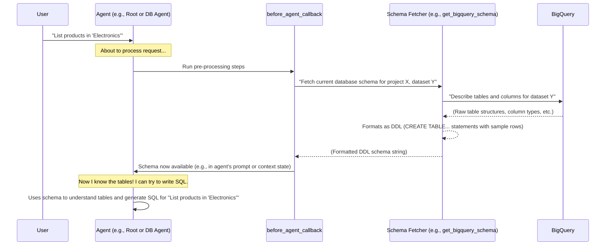

# Chapter 8: BigQuery Schema Integration - Giving Agents the Blueprints

Welcome to Chapter 8! In the [previous chapter on NL2SQL (Natural Language to SQL Conversion)](07_nl2sql__natural_language_to_sql_conversion_.md), we saw how our system can translate your everyday English questions into database queries. But how does the system know *what* it can query? If you ask, "How many customers bought product X?", how does the agent know there's a `customers` table, a `products` table, and how they relate?

That's where **BigQuery Schema Integration** comes in.

## What's the Big Idea? The Database Blueprints

Imagine you're an architect asked to plan renovations for a building. What's the first thing you'd need? The blueprints! Without knowing the building's current structure – where the walls are, what rooms exist, the electrical wiring – you can't make sensible plans.

For our data agents (especially those that generate SQL, like the Database Agent or the BQML Agent), the **database schema** is their set of blueprints.

**BigQuery Schema Integration** is the process our system uses to:
1.  **Fetch** the "blueprints" (schema information) from your BigQuery database.
2.  **Provide** this information as context to the agents.

This ensures that when an agent tries to write an SQL query, it "knows" about the available tables, columns, their data types, and sometimes even relationships between them. This is crucial for generating accurate and executable SQL.

### What is a Database Schema?

Simply put, a database schema describes the organization of data in a database. For our BigQuery context, this includes:

*   **Tables:** Like spreadsheets, e.g., `customers`, `orders`, `products`.
*   **Columns (Fields):** The individual pieces of information within a table, e.g., in a `customers` table, you might have columns like `customer_id`, `name`, `email`, `city`, `state`.
*   **Data Types:** What kind of data each column holds, e.g., `customer_id` might be an `INTEGER`, `name` a `STRING`, and `order_date` a `DATE`.
*   **Relationships (sometimes inferred):** How tables connect, e.g., an `orders` table might have a `customer_id` column that links to the `customer_id` in the `customers` table.

Knowing this structure is essential for writing correct SQL. If an agent tries to query a column named `customer_address` but the actual column name is `address_line_1`, the query will fail.

## How Schema Integration Works: Getting the Blueprints to the Agent

Our `data-science` project has a clever way to make sure agents get the schema information they need, just when they need it. This often happens "just-in-time" before an agent (like the Root Agent or a specialist Sub-Agent) starts processing your request.

This is typically handled by a special function called a `before_agent_callback`.

Here's a step-by-step overview:

1.  **Your Request Arrives:** You ask a question, for example, "Show me all products in the 'Electronics' category."
2.  **Agent Prepares:** Before the relevant agent (e.g., the [Root Agent (Orchestrator)](01_root_agent__orchestrator_.md) or the `Database Agent`) attempts to understand or act on your request, its `before_agent_callback` function is triggered.
3.  **Fetching the Schema:** This callback function calls helper utilities to connect to your BigQuery project and dataset.
4.  **Asking BigQuery for its Structure:** The utilities then query BigQuery's special `INFORMATION_SCHEMA` tables or use BigQuery client library functions to:
    *   List all tables in your dataset.
    *   For each table, list all its columns, their data types, and any descriptions.
5.  **Formatting the Schema:** This raw schema information is then formatted into a human-readable (and LLM-friendly) format. Often, this is done by generating **DDL (Data Definition Language)** statements, which look like `CREATE TABLE ...` SQL commands. This format clearly shows table names, column names, and data types. Our system even includes a few sample rows from each table in this DDL!
6.  **Providing Schema to the Agent:** This formatted DDL schema string is then:
    *   Stored in a shared [Callback Context & State Management](09_callback_context___state_management_.md) object (often in `callback_context.state`), making it accessible to tools the agent might use.
    *   OR, it can be directly inserted into the agent's [Agent Prompts (Instructions)](03_agent_prompts__instructions_.md), effectively giving the LLM the database blueprints as part of its operating instructions for the current task.

Now, when the agent's LLM processes your request, it has the database schema right there in its context!

### Visualizing the Schema Fetch

Let's see a simplified diagram of this schema fetching process:



## A Peek Under the Hood: Code Examples

Let's look at some simplified code snippets to see how this is implemented.

### 1. Fetching the Schema from BigQuery

The core logic for fetching the schema resides in a function, typically something like `get_bigquery_schema`. In our project, this is in `data_science/sub_agents/bigquery/tools.py`.

```python
# data_science/sub_agents/bigquery/tools.py (Highly Simplified Concept)
# from google.cloud import bigquery # Used to talk to BigQuery

def get_bigquery_schema_simplified(dataset_id: str, project_id: str) -> str:
    """Retrieves schema and generates DDL for a BigQuery dataset."""
    # client = bigquery.Client(project=project_id) # Connect to BigQuery
    ddl_statements = ""
    print(f"Fetching schema for {project_id}.{dataset_id}...")

    # Pretend we have a list of tables:
    tables_in_dataset = [
        {"name": "products", "columns": [("product_id", "INT64"), ("product_name", "STRING"), ("category", "STRING")]},
        {"name": "inventory", "columns": [("product_id", "INT64"), ("stock_quantity", "INT64")]}
    ]

    for table_info in tables_in_dataset:
        table_name = table_info["name"]
        ddl_statement = f"CREATE TABLE `{project_id}.{dataset_id}.{table_name}` (\n"
        for col_name, col_type in table_info["columns"]:
            ddl_statement += f"  `{col_name}` {col_type},\n"
        ddl_statement = ddl_statement.rstrip(",\n") + "\n);\n"

        # The real function also adds a few sample rows here!
        # e.g., INSERT INTO `products` VALUES (1, 'Laptop', 'Electronics');
        ddl_statement += f"-- Sample rows for {table_name} would go here...\n\n"
        ddl_statements += ddl_statement

    print("Schema DDL generated.")
    return ddl_statements
```
**Explanation:**
*   This function (in its real version) connects to BigQuery.
*   It iterates through each table in your specified dataset.
*   For each table, it builds a `CREATE TABLE` statement including column names and their data types.
*   Crucially, the actual `get_bigquery_schema` function in our project also queries a few sample rows from each table and includes them as `INSERT INTO` statements (or comments) in the DDL. This is super helpful for the LLM to understand the *kind* of data in each column.
*   It returns a single string containing all these DDL statements.

### 2. Storing Schema in Settings

This DDL is then often stored as part of "database settings" that are accessible during the agent's operation. This is handled by a function like `update_database_settings` (also in `data_science/sub_agents/bigquery/tools.py`).

```python
# data_science/sub_agents/bigquery/tools.py (Simplified Concept)

# Global variable to cache settings
database_settings_cache = None

def update_database_settings_simplified():
    global database_settings_cache
    project_id = "your-gcp-project" # Usually from environment variables
    dataset_id = "your_bigquery_dataset" # Usually from environment variables

    # Call the function to get the actual schema DDL
    schema_ddl = get_bigquery_schema_simplified(dataset_id, project_id)

    database_settings_cache = {
        "bq_project_id": project_id,
        "bq_dataset_id": dataset_id,
        "bq_ddl_schema": schema_ddl, # <--- The important DDL string!
        # ... other settings
    }
    print("Database settings updated with new schema.")
    return database_settings_cache

def get_database_settings_simplified():
    """Gets database settings, updating if not already loaded."""
    global database_settings_cache
    if database_settings_cache is None:
        database_settings_cache = update_database_settings_simplified()
    return database_settings_cache
```
**Explanation:**
*   `update_database_settings_simplified` calls our schema fetching function.
*   It stores the returned DDL string (along with project and dataset IDs) in a dictionary.
*   `get_database_settings_simplified` is a convenient way to access these settings, fetching them if they haven't been loaded yet.

### 3. The `before_agent_callback`: Making Schema Available

Now, how does an agent get these settings? Through a `before_agent_callback` function. This function is specified when an `Agent` is created.

Let's look at the `setup_before_agent_call` for the `Database Agent` from `data_science/sub_agents/bigquery/agent.py`:

```python
# data_science/sub_agents/bigquery/agent.py (Simplified Snippet)
from google.adk.agents import Agent
from google.adk.agents.callback_context import CallbackContext
# from . import tools # This would import the real get_database_settings

# This is a simplified version of the actual get_database_settings
def get_db_settings_for_callback():
    # In reality, this calls tools.get_database_settings()
    print("Callback: Getting database settings...")
    # Let's assume it returns our simplified settings with DDL
    return {
        "bq_project_id": "your-gcp-project",
        "bq_dataset_id": "your_bigquery_dataset",
        "bq_ddl_schema": "CREATE TABLE `products` (...); -- Sample rows...",
    }

def setup_before_agent_call(callback_context: CallbackContext) -> None:
    """Setup the agent with database schema."""
    print("Database Agent: Running setup_before_agent_call...")
    if "database_settings" not in callback_context.state:
        # This call ensures schema is fetched and stored in the shared state
        callback_context.state["database_settings"] = get_db_settings_for_callback()
        print("Database Agent: Schema loaded into callback_context.state.")

# ... (Database Agent definition)
# database_agent = Agent(
#     ...,
#     before_agent_callback=setup_before_agent_call, # Hooking up the callback
#     ...
# )
```
**Explanation:**
*   The `setup_before_agent_call` function is executed *before* the `Database Agent` processes a request.
*   It calls `get_db_settings_for_callback()` (which in the real code is `tools.get_database_settings()`).
*   The returned settings (including the crucial `bq_ddl_schema` string) are stored in `callback_context.state["database_settings"]`.
*   Now, any [Tool](04_tools__capabilities_.md) used by the Database Agent can access this schema from the `tool_context.state` (which is the same as `callback_context.state` within a tool's execution). For example, the `initial_bq_nl2sql` tool relies on this to generate SQL.

The [Root Agent (Orchestrator)](01_root_agent__orchestrator_.md) uses a similar `setup_before_agent_call` mechanism (in `data_science/agent.py`). However, it goes one step further and directly appends the fetched schema DDL to its main instructions:

```python
# data_science/agent.py (Simplified Snippet from setup_before_agent_call)
# from .prompts import return_instructions_root # Gets base instructions

# (Inside setup_before_agent_call for the Root Agent)
# ... schema_ddl_string is fetched similar to above ...
# schema_ddl_string = "CREATE TABLE `products`(...); CREATE TABLE `customers`(...);"

# Get the base instructions for the Root Agent
base_instructions = "You are a helpful data assistant..." # return_instructions_root()

# Append the fetched schema directly to the agent's instructions for this call
callback_context._invocation_context.agent.instruction = (
    base_instructions
    + f"""

--------- The BigQuery schema of the relevant data with a few sample rows. ---------
{schema_ddl_string}
"""
)
print("Root Agent: Schema DDL appended to current instructions.")
```
**Explanation:**
*   The Root Agent also fetches the schema DDL.
*   It then modifies its own `instruction` for the current request by adding the DDL string to it.
*   This means the LLM powering the Root Agent sees the database structure as part of its core "script" for how to handle the user's query.

Both methods – storing in `state` for tools or injecting into the main `instruction` – achieve the goal of making the schema available to the LLM.

## Why is Schema Integration So Important?

*   **Accuracy in NL2SQL:** For [NL2SQL (Natural Language to SQL Conversion)](07_nl2sql__natural_language_to_sql_conversion_.md) to work, the agent *must* know the correct table and column names. The schema provides this ground truth.
*   **Correct BQML Code:** The [BQML Agent (BigQuery ML Specialist)](06_bqml_agent__bigquery_ml_specialist_.md) also needs to know table structures to write valid BQML `CREATE MODEL` statements that reference the correct data.
*   **Reduced Errors:** Prevents agents from "hallucinating" or guessing table/column names, which would lead to invalid SQL.
*   **Contextual Understanding:** Sample data in the schema helps the LLM understand the *meaning* of the data in columns, leading to better query generation.
*   **Up-to-Date Information:** By fetching the schema "just-in-time," the agent works with the latest database structure, even if tables have been recently changed.

## Conclusion

BigQuery Schema Integration is the vital process of equipping our agents with the "blueprints" of your database. By fetching the current table structures, column names, data types, and even sample data from BigQuery (often as DDL statements), and then providing this information to the agents (either in their prompts or through a shared context), we enable them to generate accurate and effective SQL queries.

It's like ensuring our architect always has the latest, correct building plans before drawing up any renovation designs. Without this, our agents would be working in the dark!

This schema information becomes especially critical for managing context and state, which we'll explore in the next chapter: [Callback Context & State Management](09_callback_context___state_management_.md).

---

Generated by [AI Codebase Knowledge Builder](https://github.com/The-Pocket/Tutorial-Codebase-Knowledge)