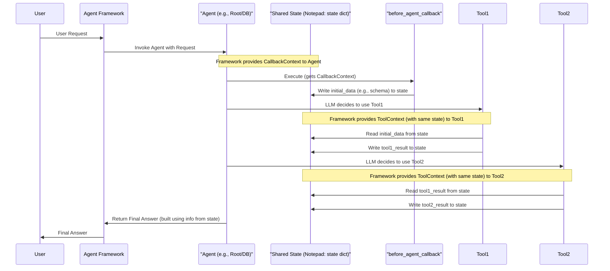

# Chapter 9: Callback Context & State Management - The Agent's Memory

Welcome to Chapter 9! In [Chapter 8: BigQuery Schema Integration](08_bigquery_schema_integration.md), we learned how our agents get the "blueprints" of our database – the schema. We saw that a special function called `setup_before_agent_call` fetches this schema and makes it available. But *how* exactly does that schema information get passed around? And what if an agent needs to remember something from one step of its task to the next?

That's where **Callback Context & State Management** comes in. It's the agent's way of having a short-term memory or a handy notepad during a task.

## What's the Big Idea? Giving Agents a Notepad

Imagine you're solving a complex math problem that has multiple steps:
1.  First, you calculate value A.
2.  Then, you use value A to calculate value B.
3.  Finally, you use value B to get the final answer.

You wouldn't try to keep all these intermediate values (A and B) just in your head, right? You'd probably jot them down on a piece of paper – a notepad! This notepad helps you remember things from one step to the next.

Our agents often face similar multi-step tasks. For example:
*   The [Root Agent (Orchestrator)](01_root_agent__orchestrator_.md) might ask the `Database Agent` to fetch some sales data.
*   Once the data is fetched, the Root Agent might then ask the `Analytics Agent` to analyze *that specific data* to find a trend.

For this to work, the system needs a way to:
1.  "Remember" the sales data fetched by the `Database Agent`.
2.  "Pass" this sales data to the `Analytics Agent`.

This "remembering and passing" of information is what we call **State Management**. The "notepad" our agents use is an object called `CallbackContext` (and its close relative, `ToolContext`).

## Meet the "Notepad": `CallbackContext` and `ToolContext`

Whenever an agent is about to do some work, or when one of its [Tools (Capabilities)](04_tools__capabilities_.md) is used, a special context object is involved.

*   **`CallbackContext`**: This object is provided to functions like `before_agent_callback` (which runs before the agent thinks) and `after_agent_callback` (which runs after).
*   **`ToolContext`**: This object is provided to every tool function when it's called by an agent.

The most important part of both these context objects, for our discussion on memory, is an attribute called **`state`**.

**`state` is simply a Python dictionary (`dict`).** Think of this dictionary as the agent's shared notepad for the current task.

*   You can store any information in this `state` dictionary (like text, numbers, lists, or even other dictionaries).
*   Information written to `state` by one part of the agent's process (like a `before_agent_callback` or a tool) can be read by another part later in the same process.

**Crucial Point:** Within a single, continuous operation of an agent (from its `before_agent_callback`, through its thinking and tool calls, to its `after_agent_callback`), the `state` dictionary in `CallbackContext` and `ToolContext` refers to the **very same notepad**. It's not a copy; it's the actual shared dictionary.

## How the Notepad is Used: A Journey of Information

Let's trace how information (our "state") flows using this notepad.

### 1. Starting with Notes: `before_agent_callback`

Remember from [Chapter 8: BigQuery Schema Integration](08_bigquery_schema_integration.md), the `setup_before_agent_call` function in our `Database Agent` fetches the database schema? Here's a simplified look at how it uses `callback_context.state` to store that schema:

```python
# data_science/sub_agents/bigquery/agent.py (Simplified)
from google.adk.agents.callback_context import CallbackContext
# from . import tools # This would import the real get_database_settings

# A simplified function that pretends to get database settings including schema
def get_simplified_db_settings_with_schema():
    print("Fetching schema and settings...")
    return {
        "bq_project_id": "my-project",
        "bq_dataset_id": "my_dataset",
        "bq_ddl_schema": "CREATE TABLE my_table (id INT64, name STRING); -- etc."
    }

# This function runs BEFORE the Database Agent starts its main task
def setup_before_agent_call(callback_context: CallbackContext) -> None:
    """Puts database schema and settings onto the 'notepad'."""
    print("Database Agent: 'setup_before_agent_call' is running...")

    # If the notepad doesn't have 'database_settings' yet...
    if "database_settings" not in callback_context.state:
        # ...fetch them and write them onto the notepad!
        callback_context.state["database_settings"] = get_simplified_db_settings_with_schema()
        print("Database Agent: Wrote 'database_settings' to the notepad (state).")
```
**Explanation:**
*   When the `Database Agent` is about to handle a request, `setup_before_agent_call` runs.
*   It receives a `CallbackContext` object.
*   It calls `get_simplified_db_settings_with_schema()` to get database details (including the DDL schema string).
*   It then stores this entire dictionary of settings under the key `"database_settings"` in `callback_context.state`.
*   Now, the "notepad" has the database schema written on it!

### 2. Tools Reading the Notepad: Accessing Schema

Later, when the `Database Agent` decides to use its `initial_bq_nl2sql` tool (from `data_science/sub_agents/bigquery/tools.py`) to convert a question to SQL, this tool needs the schema.

Here's a simplified version of how the tool reads from the notepad (`tool_context.state`):

```python
# data_science/sub_agents/bigquery/tools.py (Simplified)
from google.adk.tools import ToolContext

def initial_bq_nl2sql_simplified(
    question: str,
    tool_context: ToolContext, # The tool gets its own context object
) -> str:
    """Generates SQL using schema from the 'notepad'."""
    print(f"NL2SQL Tool: Received question '{question}'.")

    # Read 'database_settings' from the notepad
    db_settings = tool_context.state.get("database_settings")
    if not db_settings:
        return "Error: Database settings not found on notepad!"

    schema_ddl = db_settings.get("bq_ddl_schema")
    if not schema_ddl:
        return "Error: Schema DDL not found in database settings!"

    print(f"NL2SQL Tool: Read schema from notepad: '{schema_ddl[:30]}...'")

    # (The tool would now use this schema_ddl and the question to generate SQL...)
    generated_sql = f"SELECT * FROM some_table WHERE name = '{question}';" # Example
    print(f"NL2SQL Tool: Generated SQL: '{generated_sql}'")

    # The tool can also WRITE to the notepad for the next tool!
    tool_context.state["generated_sql_query"] = generated_sql
    print("NL2SQL Tool: Wrote 'generated_sql_query' to notepad.")

    return generated_sql
```
**Explanation:**
*   The `initial_bq_nl2sql_simplified` tool receives a `ToolContext` object.
*   It accesses `tool_context.state` (which is the *same notepad* as `callback_context.state` from before).
*   It reads the `"database_settings"` dictionary and then the `"bq_ddl_schema"` from it.
*   After generating the SQL, it writes this `generated_sql` back to the notepad under a new key, `"generated_sql_query"`. This makes it available for the *next* tool.

### 3. Tools Reading Previous Tool's Notes

Now, the `Database Agent` might use another tool, `run_bigquery_validation`, to execute the SQL generated by `initial_bq_nl2sql`.

```python
# data_science/sub_agents/bigquery/tools.py (Simplified)
from google.adk.tools import ToolContext

def run_bigquery_validation_simplified(
    # This tool might not even need an explicit SQL string argument
    # if it knows it can find it on the notepad.
    tool_context: ToolContext,
) -> str:
    """Runs SQL read from the 'notepad' and stores results."""
    print("RunSQL Tool: Starting...")

    # Read the 'generated_sql_query' written by the previous tool
    sql_to_run = tool_context.state.get("generated_sql_query")
    if not sql_to_run:
        return "Error: No SQL query found on notepad to run!"

    print(f"RunSQL Tool: Read SQL from notepad: '{sql_to_run}'")

    # (The tool would now execute this SQL against BigQuery...)
    query_result_data = [{"id": 1, "name": "Sample Product"}] # Example result
    print(f"RunSQL Tool: Got query result: {query_result_data}")

    # Store the actual query result data on the notepad
    tool_context.state["last_query_result"] = query_result_data
    print("RunSQL Tool: Wrote 'last_query_result' to notepad.")

    return f"Successfully ran SQL. Result: {query_result_data}"
```
**Explanation:**
*   `run_bigquery_validation_simplified` reads the `"generated_sql_query"` that the previous tool wrote to `tool_context.state`.
*   After running the query, it gets some `query_result_data`.
*   It then writes this `query_result_data` to the notepad under the key `"last_query_result"`.

This `last_query_result` is then available for the `Database Agent` to formulate its final answer, or for the [Root Agent (Orchestrator)](01_root_agent__orchestrator_.md) if it was the one that called the `Database Agent`.

### 4. Sharing Between Agents: The Root Agent's Notepad

When the Root Agent calls a sub-agent (like the `Database Agent`) using a tool, the information flow continues. Consider the `call_db_agent` tool used by the Root Agent (from `data_science/tools.py`):

```python
# data_science/tools.py (Simplified)
from google.adk.tools import ToolContext
# from .sub_agents import db_agent # The actual Database Agent
# from google.adk.tools.agent_tool import AgentTool

async def call_db_agent_simplified(
    question: str,
    tool_context: ToolContext, # Root Agent's ToolContext
):
    """Tool for Root Agent to call Database Sub-Agent and store its output."""
    print(f"Root Agent's 'call_db_agent' tool: Calling DB agent for '{question}'")

    # In a real scenario, this calls the db_agent:
    # agent_as_tool = AgentTool(agent=db_agent)
    # db_agent_response_data = await agent_as_tool.run_async(...)
    # Let's simulate the db_agent's response (which would include data it put on its own notepad)
    # For example, the db_agent itself would ensure its "last_query_result" is part of its final output.
    simulated_db_agent_output = {
        "explain": "Found 10 customers.",
        "sql": "SELECT ... FROM customers ...",
        "sql_results": [{"id": 1, "name": "Alice"}, {"id": 2, "name": "Bob"}], # This came from DB Agent's state
        "nl_results": "Found 2 customers: Alice, Bob."
    }
    print(f"Root Agent's 'call_db_agent' tool: DB agent returned (simulated): {simulated_db_agent_output}")

    # Root Agent stores the DB agent's entire output (or parts of it)
    # on ITS OWN notepad for later use (e.g., by call_ds_agent tool).
    tool_context.state["db_agent_output_data"] = simulated_db_agent_output
    tool_context.state["data_for_analytics"] = simulated_db_agent_output.get("sql_results")
    print("Root Agent's 'call_db_agent' tool: Stored DB output and data on Root Agent's notepad.")

    return simulated_db_agent_output["nl_results"] # Return a user-friendly part
```
**Explanation:**
*   The Root Agent's `call_db_agent_simplified` tool is running. It has access to the *Root Agent's* `tool_context.state`.
*   When `db_agent` (the sub-agent) runs, it has its *own* `CallbackContext` and `state` for its internal operations (like fetching schema, generating SQL, running SQL, as we saw above).
*   The `db_agent` returns its final result.
*   The `call_db_agent_simplified` tool then takes this result (which might contain the data fetched from the database, originally stored in the `db_agent`'s `state["last_query_result"]`) and writes it to the *Root Agent's* `tool_context.state` under keys like `"db_agent_output_data"` or `"data_for_analytics"`.
*   Now, if the Root Agent subsequently calls its `call_ds_agent` tool to perform analytics, that tool can read `"data_for_analytics"` from the Root Agent's notepad!

This is how information is effectively passed from one agent (Database Agent) to another (Analytics Agent) via the orchestrating Root Agent, all using their respective "notepads."

## Under the Hood: The Magic Postman

You might wonder: who is passing this `CallbackContext` and `ToolContext` around? This is handled by the agent framework (the `google.adk.agents.Agent` system).

When you call an agent:
1.  The framework creates a `CallbackContext`.
2.  It calls your `before_agent_callback` function, passing this context.
3.  When the agent's LLM decides to use a tool, the framework creates a `ToolContext` (making sure its `state` is the same dictionary as in `CallbackContext`) and passes it to your tool function.
4.  This continues for all tool calls.
5.  Finally, the framework might call your `after_agent_callback`, again with the original `CallbackContext`.

Think of the agent framework as a diligent postman, ensuring the correct "notepad" (`state` dictionary) is delivered to each function (callback or tool) that needs it during the agent's processing of a single request.

Here’s a simplified diagram illustrating the flow and the shared "notepad":


This diagram shows the `AgentState` (our notepad dictionary) being accessed and modified by different components throughout a single agent's processing cycle.

## Why is This "Notepad" So Important?

1.  **Memory for Multi-Step Tasks:** Allows agents to perform sequences of actions where the output of one step is the input to the next.
2.  **Information Sharing:**
    *   Callbacks can set up information (like database schema) that tools need.
    *   Tools can pass results to subsequent tools.
    *   An orchestrating agent (like the Root Agent) can collect results from one sub-agent via a tool and pass them to another sub-agent via another tool.
3.  **Contextual Operations:** Tools can operate more intelligently if they have access to relevant context (e.g., the full user query, previous tool outputs) stored in the `state`.
4.  **Efficiency:** Avoids having to re-fetch or re-calculate information repeatedly if it can be stored on the notepad once.
5.  **Flexibility:** The `state` is a simple dictionary, so you can store various types of data as needed for your agent's logic.

## Conclusion

Callback Context (`CallbackContext`, `ToolContext`) and its `state` dictionary are the cornerstone of an agent's short-term memory in our `data-science` project. This "shared notepad" allows information like database schemas, intermediate calculations, or results from sub-agents to be seamlessly passed between different stages of an agent's operation – from setup callbacks to tool executions.

This state management mechanism is what enables our agents to go beyond simple one-shot answers and engage in more complex, coherent, multi-step reasoning and task execution, much like a human uses a notepad to work through a problem.

Understanding this "notepad" is key to seeing how all the pieces of our agent system – the Root Agent, Sub-Agents, Prompts, and Tools – work together harmoniously.

Now that we've seen how agents can remember and share information, we're ready to look at the bigger picture of how these intelligent agents are brought together and deployed. In the next chapter, we'll explore the [Deployment Framework (Reasoning Engine)](10_deployment_framework__reasoning_engine_.md).

---

Generated by [AI Codebase Knowledge Builder](https://github.com/The-Pocket/Tutorial-Codebase-Knowledge)