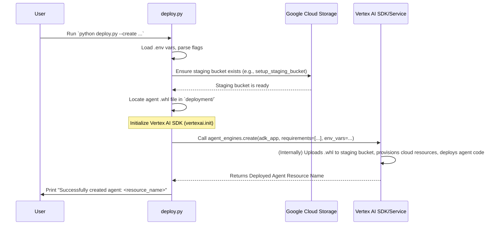

# Chapter 10: Deployment Framework (Reasoning Engine) - Launching Your Agent!

Welcome to the final chapter of our `data-science` project tutorial! In [Chapter 9: Callback Context & State Management](09_callback_context___state_management_.md), we explored how our agents use a "notepad" (the `state` in `CallbackContext` and `ToolContext`) to remember information and manage multi-step tasks. We've built a sophisticated multi-agent system with a [Root Agent (Orchestrator)](01_root_agent__orchestrator_.md), specialized [Sub-Agents (Specialists)](02_sub_agents__specialists_.md), powerful [Tools (Capabilities)](04_tools__capabilities_.md), and clear [Agent Prompts (Instructions)](03_agent_prompts__instructions_.md).

Our agent system works great on our local computer. But what's the next step? How do we make this intelligent system available for others to use, perhaps as part of a larger application, or as a reliable, scalable service that others can call?

Imagine you've spent months designing and building a complex, amazing satellite in your workshop. It's packed with sensors and communication gear (like our agent system). But it's not very useful sitting in the workshop, is it? You need a powerful launch system to take that satellite and put it into orbit, where it can do its job.

This chapter is all about that "launch system" for our multi-agent system!

## What's the Big Idea? From Workshop to Orbit!

The **Deployment Framework** in our `data-science` project refers to all the scripts, tools, and processes we use to package up our entire multi-agent system and "launch" it onto Google Cloud's Vertex AI.

Once deployed on Vertex AI, our agent system becomes a **"Reasoning Engine."** This means:
*   It runs as a **managed service:** Google Cloud takes care of the underlying servers, maintenance, and much of the operational heavy lifting.
*   It's **scalable:** If many users start sending requests to our agent, Google Cloud can automatically provide more resources to handle the load.
*   It's **accessible:** Once deployed, our agent system gets an endpoint (like a web address) that other applications can use to send requests and get responses.

Think of it like this:
*   **Our multi-agent system:** The complex satellite.
*   **The Deployment Framework:** The complete launch system (rockets, launchpad, control systems).
*   **Vertex AI Reasoning Engine:** The satellite successfully in orbit, doing its job.

This "Deployment Framework" is what takes our locally developed agent and turns it into a professional, production-ready service.

## Key Ingredients for Launch

To get our agent system into "orbit" as a Vertex AI Reasoning Engine, we need a few key things:

1.  **Packaged Agent Code (The Satellite in a Box):**
    Our agent's Python code (including the [Root Agent (Orchestrator)](01_root_agent__orchestrator_.md), all [Sub-Agents (Specialists)](02_sub_agents__specialists_.md), their [Agent Prompts (Instructions)](03_agent_prompts__instructions_.md), and [Tools (Capabilities)](04_tools__capabilities_.md)) needs to be bundled up. In Python, this is often done by creating a **wheel file** (a file ending in `.whl`). This single file contains all our agent's logic and its dependencies.
    In our project, we use a tool called Poetry to build this wheel file. You'd typically run a command in your terminal like:
    ```bash
    poetry build --format=wheel --output=deployment
    ```
    This command tells Poetry to package our project and put the resulting `.whl` file (e.g., `data_science-0.1-py3-none-any.whl`) into the `deployment/` directory.

2.  **Staging Area (The Assembly Hangar):**
    We need a temporary place in Google Cloud to store this wheel file and any other files needed for deployment. This is a **Google Cloud Storage (GCS) bucket**, often called a "staging bucket."

3.  **The Launch Script (`deploy.py`):**
    We have an automated script located at `deployment/deploy.py`. This script handles the complex steps of talking to Google Cloud, setting up the staging bucket, and telling Vertex AI to create and run our agent.

4.  **Configuration (The Flight Plan):**
    Our deployed agent needs to know certain things, like which AI models to use, what Google Cloud project it's in, or which BigQuery dataset to connect to. We provide this information using **environment variables**, often managed in a `.env` file locally. The `deploy.py` script reads these and passes them to the deployed agent.

## Launch Control: Using the `deploy.py` Script

The `deployment/deploy.py` script is our main tool for managing the deployment of our agent to Vertex AI.

### Before You Launch: Prerequisites

*   **Google Cloud SDK:** Make sure you have the `gcloud` command-line tool installed and configured to connect to your Google Cloud project.
*   **Python Environment:** Your Python environment should have the necessary libraries (like `google-cloud-aiplatform`, `python-dotenv`).
*   **Build the Wheel:** You must have built the agent's wheel file (e.g., `data_science-0.1-py3-none-any.whl`) and it should be in the `deployment/` directory.
*   **`.env` File:** Create a `.env` file in the root of your project. This file will store environment variables that your agent needs when it runs in the cloud. The `deploy.py` script will tell you if any essential variables are missing. Example content for `.env`:
    ```env
    # --- General GCP Settings (deploy.py will use these if flags aren't set) ---
    GOOGLE_CLOUD_PROJECT="your-gcp-project-id"
    GOOGLE_CLOUD_LOCATION="us-central1" # e.g., us-central1
    GOOGLE_CLOUD_STORAGE_BUCKET="your-unique-staging-bucket-name"

    # --- Agent Specific Model Names (these get passed to the deployed agent) ---
    ROOT_AGENT_MODEL="gemini-1.5-flash-001"
    ANALYTICS_AGENT_MODEL="gemini-1.5-pro-001"
    # ... other model names for BQML, NL2SQL agents ...

    # --- BigQuery and BQML Settings (passed to the deployed agent) ---
    BQ_PROJECT_ID="your-gcp-project-id" # Project where BQ data resides
    BQ_DATASET_ID="your_bq_dataset"
    BQML_RAG_CORPUS_NAME="projects/your-gcp-project-id/locations/us-central1/ragCorpora/your-rag-corpus-id" # If using RAG for BQML docs
    NL2SQL_METHOD="BASELINE" # or "CHASE"
    ```
    **Important:** Replace placeholder values with your actual project details and desired model names. The staging bucket name needs to be globally unique.

### Launch Commands

You'll run the `deploy.py` script from your terminal, usually from the root directory of the `data-science` project.

**1. To Create and Deploy a New Agent:**

```bash
python deployment/deploy.py --create
```
*   You can also specify GCP details with flags if they are not in your `.env` file or you want to override them:
    ```bash
    python deployment/deploy.py --create \
        --project_id "your-gcp-project-id" \
        --location "us-central1" \
        --bucket "your-staging-bucket-name"
    ```
*   **What happens?**
    1.  The script reads your configuration (from flags and `.env`).
    2.  It checks if the specified GCS staging bucket exists. If not, it tries to create it for you.
    3.  It verifies that the agent's `.whl` file (e.g., `data_science-0.1-py3-none-any.whl`) is present in the `deployment/` directory.
    4.  It then uses the Vertex AI SDK to instruct Google Cloud to:
        *   Create a new "Reasoning Engine."
        *   Upload your agent's `.whl` file.
        *   Set up the necessary environment for your agent to run, including the environment variables you defined.
    5.  Vertex AI then builds and deploys your agent. This can take a few minutes.
    6.  If successful, the script will print a **Resource Name** for your deployed agent. This unique ID looks something like: `projects/your-gcp-project-id/locations/us-central1/reasoningEngines/1234567890123456789`. You'll need this ID to interact with or delete your agent later.

**2. To Delete an Existing Deployed Agent:**

You'll need the **Resource Name** you got when you created the agent.

```bash
python deployment/deploy.py --delete --resource_id "projects/your-gcp-project-id/locations/us-central1/reasoningEngines/your-agent-id"
```
*   This command tells Vertex AI to remove the specified Reasoning Engine and its associated resources.

## Inside the Launch Control (`deploy.py` simplified)

Let's peek at some key, simplified parts of the `deployment/deploy.py` script to understand how it works with the Vertex AI SDK.

**1. Setting up Staging Bucket (Conceptual):**
The script has a function to ensure your GCS staging bucket is ready.

```python
# deployment/deploy.py (Simplified concept of setup_staging_bucket)
# from google.cloud import storage

def setup_staging_bucket_simplified(project_id: str, location: str, bucket_name: str) -> str:
    """Checks/creates the GCS bucket."""
    storage_client = storage.Client(project=project_id)
    bucket = storage_client.lookup_bucket(bucket_name)
    if not bucket:
        print(f"Bucket gs://{bucket_name} not found. Creating...")
        # storage_client.create_bucket(bucket_name, project=project_id, location=location)
        print(f"Bucket gs://{bucket_name} created (simulated).")
    else:
        print(f"Bucket gs://{bucket_name} already exists.")
    return f"gs://{bucket_name}" # Returns the full path
```
**Explanation:** This function uses Google Cloud client libraries to interact with GCS. The actual function in `deploy.py` is more robust, handling permissions and potential conflicts.

**2. Creating the Agent (Conceptual):**
The core logic for deploying the agent uses `vertexai.agent_engines.create`.

```python
# deployment/deploy.py (Simplified concept of the 'create' function)
# import vertexai
# from vertexai import agent_engines
# from vertexai.preview.reasoning_engines import AdkApp
# from data_science.agent import root_agent # Our main agent instance

AGENT_WHL_FILE = "data_science-0.1-py3-none-any.whl" # Name of our package

def create_agent_simplified(env_vars_for_agent: dict, staging_bucket_uri: str):
    """Creates and deploys the agent to Vertex AI."""
    print("Preparing AdkApp with our root_agent...")
    # Wrap our main agent (from data_science.agent.py) for deployment
    adk_app = AdkApp(
        agent=root_agent, # This is the entry point to our multi-agent system
        enable_tracing=False,
    )

    print(f"Checking for agent wheel file: {AGENT_WHL_FILE}")
    # if not os.path.exists(AGENT_WHL_FILE): raise FileNotFoundError(...)

    print("Starting deployment to Vertex AI Reasoning Engines...")
    # This is the key SDK call to deploy our agent!
    remote_agent = agent_engines.create(
        adk_app,
        requirements=[AGENT_WHL_FILE], # Tells Vertex AI what code to run
        extra_packages=[AGENT_WHL_FILE], # Ensures our package is installed
        env_vars=env_vars_for_agent, # Passes our .env variables
        # The staging_bucket is now typically handled by vertexai.init()
    )
    print(f"Agent deployed! Resource Name: {remote_agent.resource_name}")
    return remote_agent.resource_name
```
**Explanation:**
*   `AdkApp(agent=root_agent, ...)`: This wraps our main `root_agent` (which we defined in `data_science/agent.py` and which knows about all its sub-agents and tools) into a format that Vertex AI can understand. "ADK" likely stands for Agent Development Kit.
*   `agent_engines.create(...)`: This is the magic function from the Vertex AI SDK.
    *   `adk_app`: Our packaged agent.
    *   `requirements=[AGENT_WHL_FILE]`: Tells Vertex AI that our agent's code is in this wheel file.
    *   `env_vars`: Passes the environment variables (like model names, BigQuery dataset ID) to the deployed agent.
*   The `vertexai.init(project=..., location=..., staging_bucket=...)` call (done earlier in the script) configures the SDK with project details and the staging bucket to use for uploading files.

### Visualizing the Deployment

Here's a simplified sequence diagram of the `create` process:



## Why is This Framework Important? "Houston, We Have an Agent!"

The Deployment Framework is critical because it:

1.  **Bridges Development and Production:** Takes your carefully crafted agent from your local machine to a robust cloud environment.
2.  **Enables Real-World Use:** Makes your agent accessible to other applications or users via an API endpoint.
3.  **Provides Scalability & Reliability:** Leverages Google Cloud's infrastructure to handle many requests and ensure your agent is available.
4.  **Automates Complexity:** The `deploy.py` script and Vertex AI SDK hide a lot of the intricate details of cloud deployment, making the process much simpler.
5.  **Manages Configuration:** Ensures your deployed agent has all the necessary settings (like API keys, model names, project IDs) through environment variables.

Without this framework, our agent system would remain an impressive experiment. With it, it becomes a powerful tool ready to be integrated and used.

## Conclusion: Your Agent is Ready for the World!

You've now seen the entire lifecycle of our `data-science` multi-agent project! We started by understanding the [Root Agent (Orchestrator)](01_root_agent__orchestrator_.md) and its team of [Sub-Agents (Specialists)](02_sub_agents__specialists_.md). We explored how they are guided by [Agent Prompts (Instructions)](03_agent_prompts__instructions_.md), empowered by [Tools (Capabilities)](04_tools__capabilities_.md), and how they manage information using [Callback Context & State Management](09_callback_context___state_management_.md). We saw specialized agents like the [Analytics Agent (Python Data Scientist)](05_analytics_agent__python_data_scientist_.md) and the [BQML Agent (BigQuery ML Specialist)](06_bqml_agent__bigquery_ml_specialist_.md), and core technologies like [NL2SQL (Natural Language to SQL Conversion)](07_nl2sql__natural_language_to_sql_conversion_.md) and [BigQuery Schema Integration](08_bigquery_schema_integration.md).

This final chapter showed you how to take this entire system and launch it as a scalable, managed Vertex AI Reasoning Engine using our Deployment Framework. Your intelligent agent is no longer confined to your computer; it's ready to be put to work in the cloud!

Congratulations on completing this journey through the `data-science` multi-agent project! We hope this tutorial has given you a solid foundation in understanding and building complex agentic AI systems. The world of AI agents is rapidly evolving, and the principles you've learned here will serve you well as you explore further. Happy building!

---

Generated by [AI Codebase Knowledge Builder](https://github.com/The-Pocket/Tutorial-Codebase-Knowledge)