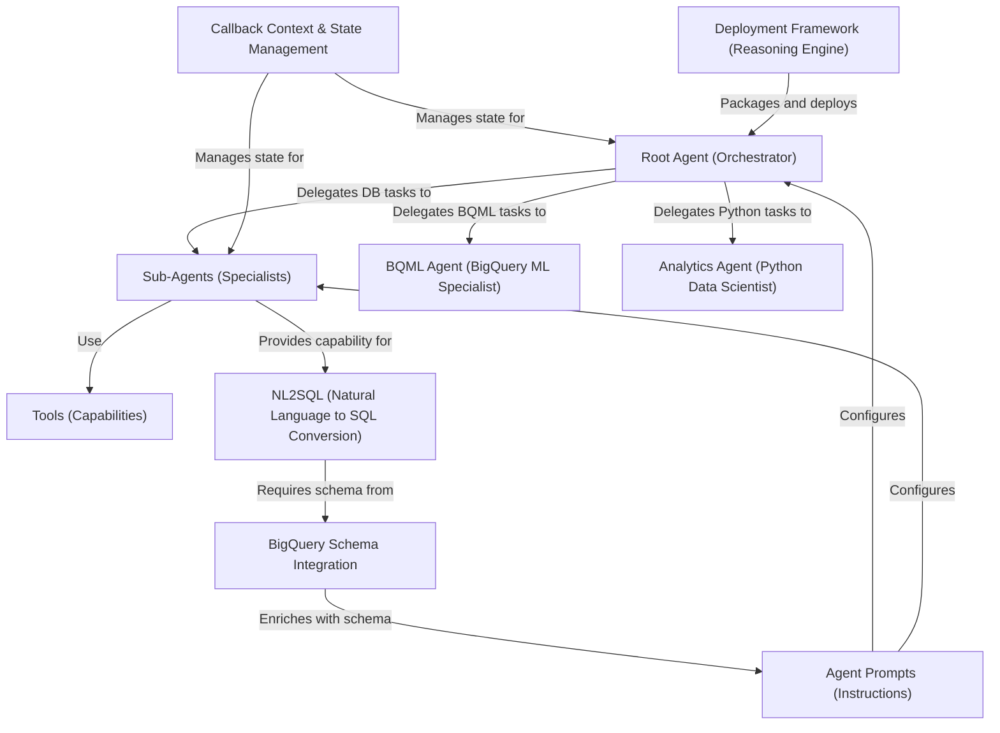

# Tutorial: data-science

This project creates a smart *data assistant* designed to understand and respond to user questions about data stored in BigQuery.
It features a central **Root Agent** (Orchestrator) that acts like a project manager. When a user makes a request, the Root Agent figures out the best expert to handle it.
These experts are specialized **Sub-Agents**, such as:
- A *BigQuery agent* that translates plain English questions into SQL queries (**NL2SQL**) to fetch data, using knowledge of the **BigQuery Schema**.
- An **Analytics Agent** (a Python Data Scientist) that can perform complex data analysis and generate visualizations using Python.
- A **BQML Agent** that specializes in BigQuery Machine Learning tasks like training or inspecting models.
All agents follow specific **Agent Prompts** (instructions) and use **Tools** (capabilities) to perform actions.
The system uses **Callback Context & State Management** to remember previous interactions and maintain context.
Finally, the entire system is designed to be packaged and deployed on Google Cloud's Vertex AI using a **Deployment Framework**, making it a scalable "Reasoning Engine".

**Source Repository:** [None](None)

## Chapters

1. [Root Agent (Orchestrator)](01_root_agent__orchestrator_.md)
2. [Sub-Agents (Specialists)](02_sub_agents__specialists_.md)
3. [Agent Prompts (Instructions)](03_agent_prompts__instructions_.md)
4. [Tools (Capabilities)](04_tools__capabilities_.md)
5. [Analytics Agent (Python Data Scientist)](05_analytics_agent__python_data_scientist_.md)
6. [BQML Agent (BigQuery ML Specialist)](06_bqml_agent__bigquery_ml_specialist_.md)
7. [NL2SQL (Natural Language to SQL Conversion)](07_nl2sql__natural_language_to_sql_conversion_.md)
8. [BigQuery Schema Integration](08_bigquery_schema_integration.md)
9. [Callback Context & State Management](09_callback_context___state_management.md)
10. [Deployment Framework (Reasoning Engine)](10_deployment_framework__reasoning_engine_.md)

---

Generated by [AI Codebase Knowledge Builder](https://github.com/The-Pocket/Tutorial-Codebase-Knowledge)