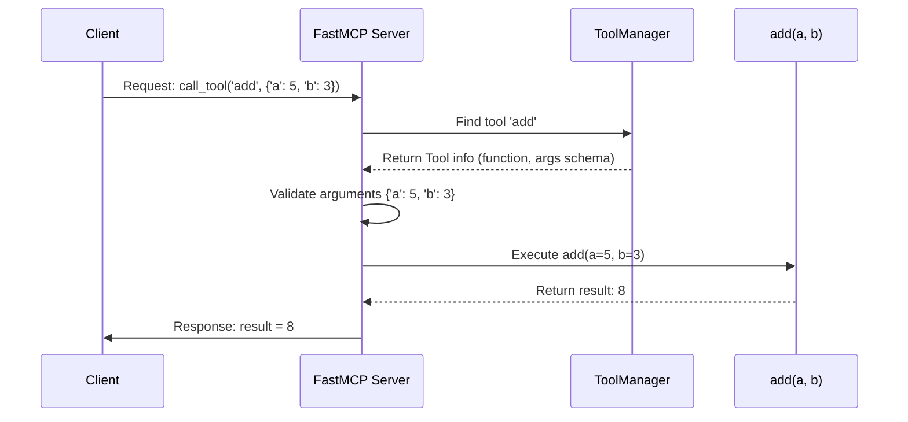

# Chapter 1: Tool

Welcome to the `fastmcp` tutorial! This is the very first chapter, so let's start with a fundamental building block: the **Tool**.

Imagine you have a smart assistant, like a Large Language Model (LLM). You can ask it questions, but it can't *do* things in the real world directly. It can't check the weather outside *your* window, add numbers like a calculator, or see what's on *your* computer screen.

This is where `fastmcp` comes in. It lets you give your smart assistant (the "client") special abilities by connecting it to a `fastmcp` server running on your machine. These special abilities are called **Tools**.

Our goal in this chapter is to understand what a Tool is and how to create a simple one – specifically, a tool that can add two numbers.

## What is a Tool?

Think of a Tool like a button on a remote control for your server. Each button performs a specific action.

*   **Button:** `Add Numbers`
*   **Action:** Takes two numbers as input and returns their sum.

*   **Button:** `Take Screenshot`
*   **Action:** Captures your screen and returns the image.

In `fastmcp`, you define these "buttons" (Tools) using regular Python functions. You then tell `fastmcp` that a particular function is a Tool using a special marker called a **decorator**: `@mcp.tool()`.

When a client (like an LLM) wants to use a tool, it sends a request to your `fastmcp` server. The server finds the corresponding Python function, runs it with the inputs provided by the client, and sends the result back.

Key things about Tools:

1.  **They are Python functions:** You write standard Python code.
2.  **They are decorated:** You use `@mcp.tool()` above the function definition.
3.  **They take inputs:** Defined as function arguments with type hints (e.g., `a: int`). `fastmcp` uses these hints to check if the client sent the correct type of data.
4.  **They return results:** The `return` value of the function is sent back to the client.
5.  **They have names and descriptions:** Usually taken from the function name and its docstring (the comment right below `def`).

All the tools you define are managed by an internal component called the `ToolManager`, which keeps track of them so the server knows what actions it can perform.

## Creating Your First Tool: The Adder

Let's build our first tool: one that adds two integers.

1.  **Import `FastMCP`:** We need the main class from the library.
2.  **Create a Server Instance:** We create an object representing our `fastmcp` server. We'll give it a name, like "Calculator".
3.  **Define the Function:** Write a standard Python function, let's call it `add`, that takes two arguments (`a` and `b`).
4.  **Add Type Hints:** Specify that `a` and `b` should be integers (`int`) and the function will return an integer (`-> int`). This helps `fastmcp` validate inputs.
5.  **Add a Docstring:** Write a short description of what the tool does. This helps the client understand when to use the tool.
6.  **Decorate it!** Put `@mcp.tool()` right before the `def` line.

Here's the complete code:

```python
# examples/simple_adder.py (modified for simplicity)
from fastmcp.server import FastMCP

# Create a FastMCP server instance
mcp = FastMCP("Calculator")

# Use the @mcp.tool() decorator to define a tool
@mcp.tool()
def add(a: int, b: int) -> int:
  """Add two numbers together."""
  print(f"Tool 'add' called with a={a}, b={b}")
  result = a + b
  print(f"Tool 'add' returning {result}")
  return result

# (Code to run the server would go here, covered in a later chapter)
```

**Explanation:**

*   `mcp = FastMCP("Calculator")`: We create our server named "Calculator".
*   `@mcp.tool()`: This line tells `fastmcp` that the *next* function (`add`) is a Tool.
*   `def add(a: int, b: int) -> int:`: This is our Python function.
    *   `a: int`, `b: int`: These are the inputs (arguments). The `: int` part tells `fastmcp` they must be integers.
    *   `-> int`: This tells `fastmcp` the function will return an integer.
*   `"""Add two numbers together."""`: This is the docstring. `fastmcp` uses this as the tool's description.
*   `return a + b`: This is the core logic. The result is returned.

Now, our "Calculator" server has one tool available: `add`.

## How Tools are Called (High-Level View)

Let's imagine a client wants to calculate `5 + 3`. Here's the basic flow:

1.  **Client Request:** The client sends a message to our `fastmcp` server. The message basically says: "Please use the tool named `add` with these inputs: `a` is `5` and `b` is `3`."
2.  **Server Receives:** The [FastMCP Server](04_fastmcp_server.md) gets the request.
3.  **Server Finds Tool:** The server asks its internal `ToolManager`, "Do we have a tool called `add`?" The `ToolManager` confirms and provides the details (like the actual `add` Python function).
4.  **Server Validates Inputs:** The server checks if the inputs (`a=5`, `b=3`) match the expected types (`int`, `int`). They do!
5.  **Server Executes Function:** The server calls the Python function: `add(a=5, b=3)`.
6.  **Function Runs:** Our `add` function calculates `5 + 3` which is `8`.
7.  **Function Returns:** The `add` function returns the value `8`.
8.  **Server Sends Response:** The server takes the result (`8`) and sends it back to the client in a response message.
9.  **Client Receives:** The client gets the response containing the result `8`.

## More Tool Examples

Tools can do much more than simple math.

**Echo Tool:** Takes text and sends it back.

```python
# examples/simple_echo.py
from fastmcp import FastMCP

mcp = FastMCP("Echo Server")

@mcp.tool()
def echo(text: str) -> str:
  """Echo the input text"""
  return text
```

**Screenshot Tool:** Takes no input, but returns an image.

```python
# examples/screenshot.py (simplified)
import io
# We need extra libraries for screenshots
from fastmcp import FastMCP, Image
import pyautogui # Needs installation: pip install Pillow pyautogui
import PIL.Image # Needs installation: pip install Pillow pyautogui

mcp = FastMCP("Screenshot Demo")

@mcp.tool()
def take_screenshot() -> Image:
  """Take a screenshot and return it as an image."""
  # Use pyautogui library to capture the screen
  screenshot_pil = pyautogui.screenshot()

  # Convert to JPEG format in memory
  buffer = io.BytesIO()
  screenshot_pil.convert("RGB").save(buffer, format="JPEG", quality=60)

  # Return as a special FastMCP Image type
  return Image(data=buffer.getvalue(), format="jpeg")
```
*Note: This tool requires installing extra libraries (`Pillow`, `pyautogui`). It returns a special `Image` type, which we'll touch upon when discussing [Resource](02_resource.md)s.*

**Complex Input Tool:** Takes structured data (like a list of items) using Pydantic models.

```python
# examples/complex_inputs.py (simplified)
from typing import Annotated
from pydantic import BaseModel, Field
from fastmcp.server import FastMCP

mcp = FastMCP("Shrimp Tank")

# Define the structure of expected input data
class ShrimpTank(BaseModel):
    class Shrimp(BaseModel):
        name: str
    shrimp: list[Shrimp]

@mcp.tool()
def list_shrimp_names(tank: ShrimpTank) -> list[str]:
    """List all shrimp names in the tank"""
    return [s.name for s in tank.shrimp]
```
*Note: This uses Pydantic for defining complex input shapes (`ShrimpTank`). This allows for more structured data exchange and validation.*

## Under the Hood: How `@mcp.tool()` Works

When you run your Python script containing `@mcp.tool()`, several things happen behind the scenes *before* the server even starts waiting for requests:

1.  **Decorator Execution:** When Python encounters `@mcp.tool()` above your `add` function, it calls the `mcp.tool()` method.
2.  **Registration:** This method takes your `add` function and passes it to the `ToolManager` associated with the `mcp` server instance.
3.  **Metadata Extraction:** The `ToolManager` inspects your `add` function. It reads:
    *   Its name (`add`).
    *   Its docstring (`"""Add two numbers together."""`) for the description.
    *   Its parameters (`a`, `b`) and their type hints (`int`, `int`).
    *   Its return type hint (`int`).
4.  **Tool Object Creation:** The `ToolManager` creates an internal `Tool` object holding all this information, including a reference to the actual `add` function code.
5.  **Storage:** This `Tool` object is stored in a dictionary inside the `ToolManager`, using the tool's name (`'add'`) as the key.

Now, the `ToolManager` knows about the `add` tool and is ready for the server to receive requests to call it.

**Visualizing a Tool Call**

Here's a diagram showing the sequence of events when a client calls our `add` tool:



**Code References (Simplified View)**

*   **Decorator:** The `@mcp.tool()` decorator is defined in `FastMCP.tool` (`src/fastmcp/server/server.py`). It mainly calls `self.add_tool`.

    ```python
    # src/fastmcp/server/server.py (simplified)
    class FastMCP:
        # ... (other methods) ...
        def tool(self, name: str | None = None, ...):
            def decorator(fn: AnyFunction) -> AnyFunction:
                # Calls add_tool internally
                self.add_tool(fn, name=name, ...)
                return fn
            return decorator

        def add_tool(self, fn: AnyFunction, ...):
            # Delegates to ToolManager
            self._tool_manager.add_tool(fn, ...)
    ```

*   **Adding to Manager:** `ToolManager.add_tool` (`src/fastmcp/tools/tool_manager.py`) creates the `Tool` object.

    ```python
    # src/fastmcp/tools/tool_manager.py (simplified)
    class ToolManager:
        # ...
        def add_tool(self, fn: Callable[..., Any], ...):
            # Creates the Tool object by inspecting the function
            tool = Tool.from_function(fn, ...)
            self._tools[tool.name] = tool # Stores the tool
            return tool
    ```

*   **Tool Object:** `Tool.from_function` (`src/fastmcp/tools/base.py`) does the inspection work.

    ```python
    # src/fastmcp/tools/base.py (simplified)
    class Tool(BaseModel):
        # ... fields like name, description, fn ...
        @classmethod
        def from_function(cls, fn: Callable[..., Any], ...):
            # Inspect function name, docstring, signature, type hints
            func_name = name or fn.__name__
            func_doc = description or fn.__doc__
            # ... (extract parameters schema from type hints) ...
            return cls(fn=fn, name=func_name, description=func_doc, ...)
    ```

*   **Calling the Tool:** When a request comes in, `FastMCP.call_tool` (`src/fastmcp/server/server.py`) uses the manager.

    ```python
    # src/fastmcp/server/server.py (simplified)
    class FastMCP:
        # ...
        async def call_tool(self, name: str, arguments: dict[str, Any]):
            # Delegates to ToolManager
            result = await self._tool_manager.call_tool(name, arguments, ...)
            # ... convert result to response format ...
            return converted_result
    ```

*   **Executing the Tool:** `ToolManager.call_tool` (`src/fastmcp/tools/tool_manager.py`) finds the `Tool` object and runs it.

    ```python
    # src/fastmcp/tools/tool_manager.py (simplified)
    class ToolManager:
        # ...
        async def call_tool(self, name: str, arguments: dict[str, Any], ...):
            tool = self.get_tool(name) # Find the Tool object
            if not tool:
                raise ToolError(f"Unknown tool: {name}")
            # Run the tool's function via the Tool object
            return await tool.run(arguments, ...)
    ```

*   **Running the Function:** Finally, `Tool.run` (`src/fastmcp/tools/base.py`) validates the arguments against the stored schema and executes your original Python function.

    ```python
    # src/fastmcp/tools/base.py (simplified)
    class Tool:
        # ...
        async def run(self, arguments: dict[str, Any], ...):
            # Validate the received 'arguments' against the schema
            validated_args = self.fn_metadata.validate_args(arguments)
            # Call the original function (self.fn)
            if self.is_async:
                return await self.fn(**validated_args)
            else:
                return self.fn(**validated_args)
    ```

## Conclusion

You've learned about the core concept of a **Tool** in `fastmcp`. Tools are simply Python functions, marked with the `@mcp.tool()` decorator, that allow a `fastmcp` server to perform actions requested by a client. You saw how to define a simple `add` tool, understand the flow of a tool call, and got a glimpse into how `fastmcp` manages and executes these tools internally.

Tools are powerful, but they often need data to work with (like a file to analyze or a database to query). How does `fastmcp` handle exposing data or files to clients? That's where our next concept comes in: **Resources**.

[Next Chapter: Resource](02_resource.md)

---

Generated by [AI Codebase Knowledge Builder](https://github.com/The-Pocket/Tutorial-Codebase-Knowledge)