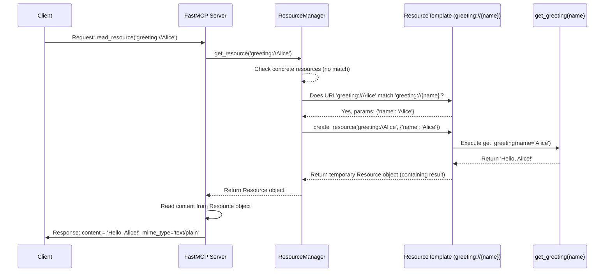

# Chapter 2: Resource

In the [previous chapter](01_tool.md), we learned about **Tools** – the "actions" or "buttons" our `fastmcp` server can perform when asked by a client. Think of the `add` tool: it *does* something (addition) based on inputs.

But what if the client just needs to *read* some information from the server? Maybe it needs the content of a specific file, the current time, or a list of items on your desktop. This is where **Resources** come in.

## What is a Resource?

Think of a **Resource** as a specific piece of information or data that a client can access by "looking it up". It's like asking for a specific document from a filing cabinet or checking a specific display on a dashboard.

*   **Filing Cabinet Analogy:**
    *   You might ask for the document located at `file:///Users/You/Documents/report.txt`. This specific location (the path) identifies the resource (the file content).
*   **Dashboard Analogy:**
    *   You might look at the display labelled `weather://london/current`. This label identifies the resource (the current weather in London).

In `fastmcp`, Resources are identified by a unique address called a **URI** (Uniform Resource Identifier). Just like a web address (`http://...`) or a file path (`file://...`), a resource URI tells the server *which* piece of information the client wants.

Key things about Resources:

1.  **Identified by URI:** Each resource has a unique address (e.g., `data://my_notes`, `config://settings.json`).
2.  **Read-Only (for the Client):** Clients use a standard command (`read_resource`) to get the content of a resource. They can't easily *change* the resource through this mechanism (unlike a Tool, which performs an action).
3.  **Static or Dynamic:**
    *   **Static:** The content is fixed, like a simple string or the contents of a specific file that doesn't change often.
    *   **Dynamic:** The content is generated *when requested*, usually by running a Python function. This is great for information that changes, like the current time or weather.
4.  **Defined with `@mcp.resource()`:** Similar to tools, you use a decorator to tell `fastmcp` that a function provides a resource.
5.  **Managed by `ResourceManager`:** Just like `ToolManager` keeps track of tools, `ResourceManager` keeps track of all the available resources.

## Defining Your First Resources

Let's create a couple of simple resources. We'll use the same `FastMCP` instance we might have used for tools.

### 1. A Simple "Static" Text Resource

Imagine you want to provide a fixed welcome message. We can define a function that returns this message and decorate it.

```python
# examples/echo.py (simplified resource part)
from fastmcp import FastMCP

# Create a FastMCP server instance
mcp = FastMCP("Info Server")

# Use the @mcp.resource() decorator to define a resource
@mcp.resource("info://welcome")
def welcome_message() -> str:
  """Provides a simple welcome message."""
  print("Resource 'info://welcome' was read.")
  return "Hello from the FastMCP server!"

# (Code to run the server would go here, covered in a later chapter)
```

**Explanation:**

*   `mcp = FastMCP("Info Server")`: We create our server.
*   `@mcp.resource("info://welcome")`: This is the key part!
    *   It tells `fastmcp` that the function `welcome_message` defines a Resource.
    *   `"info://welcome"` is the **URI** that clients will use to access this resource.
*   `def welcome_message() -> str:`: A simple Python function that takes no arguments and returns a string (`str`).
*   `return "Hello from the FastMCP server!"`: This is the actual content of the resource.

Now, if a client asks the server to read the resource at `info://welcome`, the server will run the `welcome_message` function and send back the string "Hello from the FastMCP server!".

### 2. A Dynamic Resource: Listing Desktop Files

Let's make something a bit more dynamic. How about a resource that lists the files on your Desktop?

*(Note: This requires Python 3.4+ for the `pathlib` module)*

```python
# examples/desktop.py (simplified)
from pathlib import Path
from fastmcp.server import FastMCP

# Create server
mcp = FastMCP("Desktop Lister")

# Define a resource for the desktop directory
@mcp.resource("dir://desktop")
def list_desktop_files() -> list[str]:
    """List the files in the user's desktop directory."""
    print("Resource 'dir://desktop' was read.")
    try:
        # Find the path to the Desktop
        desktop_path = Path.home() / "Desktop"
        # Get a list of items (files and folders)
        items = desktop_path.iterdir()
        # Return their names as strings
        return [item.name for item in items]
    except FileNotFoundError:
        return ["Desktop directory not found."]

# (Code to run the server would go here)
```

**Explanation:**

*   `@mcp.resource("dir://desktop")`: We define a resource with the URI `dir://desktop`.
*   `def list_desktop_files() -> list[str]:`: The function returns a list of strings (`list[str]`).
*   `desktop_path = Path.home() / "Desktop"`: We use Python's `pathlib` to find the user's Desktop folder path.
*   `items = desktop_path.iterdir()`: We get an iterator over the contents of the Desktop folder.
*   `return [item.name for item in items]`: We create a list containing the names of all items found and return it.

Now, when a client reads `dir://desktop`, this function runs, finds the current files on the Desktop, and returns their names. If you add or remove a file, reading the resource again will show the updated list! This is dynamic content.

### 3. Dynamic Resource Templates: Using URI Parameters

What if you want a resource where part of the URI determines the output? For example, a greeting resource that greets a specific person based on the name in the URI, like `greeting://Alice` or `greeting://Bob`.

This is where **Resource Templates** come in. You define a URI with placeholders (like `{name}`) and a function that accepts arguments corresponding to those placeholders.

```python
# examples/readme-quickstart.py (resource part)
from fastmcp import FastMCP

# Create an MCP server
mcp = FastMCP("Greeter")

# Add a dynamic greeting resource template
@mcp.resource("greeting://{name}")
def get_greeting(name: str) -> str:
    """Get a personalized greeting based on the name in the URI."""
    print(f"Resource template 'greeting://{{name}}' was read with name={name}")
    return f"Hello, {name}!"

# (Code to run the server would go here)
```

**Explanation:**

*   `@mcp.resource("greeting://{name}")`: Notice the `{name}` in the URI. This tells `fastmcp` it's a template. The part inside the curly braces `{}` is a parameter name.
*   `def get_greeting(name: str) -> str:`: Crucially, the function now takes an argument named `name` (matching the placeholder in the URI). `fastmcp` will automatically extract the value from the requested URI and pass it to this argument.
*   `return f"Hello, {name}!"`: The function uses the provided `name` to generate the greeting.

How it works:

*   If a client reads `greeting://Alice`, `fastmcp` matches this URI to the template. It extracts `Alice` as the value for the `name` parameter. Then, it calls `get_greeting(name="Alice")`, which returns `"Hello, Alice!"`.
*   If a client reads `greeting://World`, it calls `get_greeting(name="World")`, returning `"Hello, World!"`.

Resource Templates allow you to create flexible, dynamic resources without defining a separate function for every possible variation. The `ResourceManager` handles matching the incoming URI to the correct template and extracting the parameters.

## How Resources are Accessed (Simplified Flow)

Let's trace what happens when a client wants to read our dynamic greeting for "Alice" (`greeting://Alice`):

1.  **Client Request:** The client sends a message to the `fastmcp` server: "Please `read_resource` with URI `greeting://Alice`."
2.  **Server Receives:** The [FastMCP Server](04_fastmcp_server.md) gets the request.
3.  **Server Asks Manager:** The server asks its internal `ResourceManager`, "Do you have a resource for the URI `greeting://Alice`?"
4.  **Manager Checks:** The `ResourceManager`:
    *   Looks for an exact match for `greeting://Alice` in its list of simple resources. (No match found).
    *   Looks through its list of `ResourceTemplate`s. It finds the `greeting://{name}` template.
    *   It checks if `greeting://Alice` *matches* the pattern `greeting://{name}`. Yes, it does!
    *   It extracts the parameter: `name` is `Alice`.
5.  **Manager Creates Resource (Temporarily):** The `ResourceManager` uses the template and the extracted parameters (`name="Alice"`) to prepare to call the underlying function (`get_greeting`). It essentially creates a temporary resource instance ready to be read.
6.  **Server Reads Resource:** The server asks this temporary resource to provide its content by calling its internal `read()` method.
7.  **Function Runs:** The `read()` method calls our actual Python function: `get_greeting(name="Alice")`.
8.  **Function Returns:** Our `get_greeting` function returns the string `"Hello, Alice!"`.
9.  **Server Sends Response:** The server takes the result (`"Hello, Alice!"`) and sends it back to the client in a response message.
10. **Client Receives:** The client gets the response containing the greeting.

## Under the Hood: ResourceManager and Decorators

How does `fastmcp` know about these resources and templates? It's similar to how tools work.

**Registration Time (when your script starts):**

1.  **Decorator Runs:** When Python executes `@mcp.resource("greeting://{name}")`, it calls the `mcp.resource()` method.
2.  **Template Detection:** The method sees the `{name}` in the URI and recognizes it needs to create a template.
3.  **Manager Informed:** It calls `self._resource_manager.add_template(...)`, passing the URI template (`"greeting://{name}"`), the function (`get_greeting`), and other details like name and description (often from the function's name and docstring).
4.  **Template Stored:** The `ResourceManager` creates a `ResourceTemplate` object. This object stores the URI template string, the function to call (`get_greeting`), and information about the expected parameters (like `name` needing to be a `str`). It stores this `ResourceTemplate` object, typically keyed by the template string itself.
5.  **(For non-template resources):** If the URI had no `{}`, like `@mcp.resource("info://welcome")`, it would call `self._resource_manager.add_resource(...)`. This creates a `FunctionResource` object (which wraps the `welcome_message` function) and stores it in a dictionary keyed by the exact URI (`"info://welcome"`).

**Resource Reading Time (when a client sends `read_resource`):**

Here's a diagram showing the flow for reading `greeting://Alice`:



**Code References (Simplified View):**

*   **Decorator:** The `@mcp.resource()` decorator is defined in `FastMCP.resource` (`src/fastmcp/server/server.py`). It decides whether to add a resource or a template.

    ```python
    # src/fastmcp/server/server.py (simplified)
    class FastMCP:
        # ...
        def resource(self, uri: str, ...):
            def decorator(fn: AnyFunction) -> AnyFunction:
                is_template = "{" in uri and "}" in uri # Simplified check
                if is_template:
                    self._resource_manager.add_template(fn, uri_template=uri, ...)
                else:
                    resource = FunctionResource(uri=uri, fn=fn, ...)
                    self._resource_manager.add_resource(resource)
                return fn
            return decorator
    ```

*   **Adding Template:** `ResourceManager.add_template` (`src/fastmcp/resources/resource_manager.py`) creates the `ResourceTemplate` object.

    ```python
    # src/fastmcp/resources/resource_manager.py (simplified)
    class ResourceManager:
        # ...
        def add_template(self, fn: Callable[..., Any], uri_template: str, ...):
            template = ResourceTemplate.from_function(fn, uri_template=uri_template, ...)
            self._templates[template.uri_template] = template # Stores the template
            return template
    ```

*   **Template Object:** `ResourceTemplate.from_function` (`src/fastmcp/resources/templates.py`) inspects the function and stores details.

    ```python
    # src/fastmcp/resources/templates.py (simplified)
    class ResourceTemplate(BaseModel):
        # ... fields like uri_template, name, fn, parameters ...
        @classmethod
        def from_function(cls, fn: Callable[..., Any], uri_template: str, ...):
            # Inspect function, get parameters schema etc.
            # ...
            return cls(uri_template=uri_template, fn=fn, ...)
    ```

*   **Getting Resource:** `FastMCP.read_resource` calls `ResourceManager.get_resource`.

    ```python
    # src/fastmcp/server/server.py (simplified)
    class FastMCP:
        # ...
        async def read_resource(self, uri: AnyUrl | str) -> list[ReadResourceContents]:
            resource = await self._resource_manager.get_resource(uri)
            if not resource:
                 raise ResourceError(f"Unknown resource: {uri}")
            content = await resource.read() # Calls the resource's read method
            return [ReadResourceContents(content=content, mime_type=resource.mime_type)]
    ```

*   **Finding/Creating Resource:** `ResourceManager.get_resource` (`src/fastmcp/resources/resource_manager.py`) checks concrete resources first, then templates.

    ```python
    # src/fastmcp/resources/resource_manager.py (simplified)
    class ResourceManager:
        # ...
        async def get_resource(self, uri: AnyUrl | str) -> Resource | None:
            uri_str = str(uri)
            # 1. Check concrete resources
            if resource := self._resources.get(uri_str):
                return resource
            # 2. Check templates
            for template in self._templates.values():
                if params := template.matches(uri_str): # Check if URI matches template
                    # If matches, create the resource instance by running the function
                    return await template.create_resource(uri_str, params)
            raise ValueError(f"Unknown resource: {uri}")
    ```

*   **Running Template Function:** `ResourceTemplate.create_resource` (`src/fastmcp/resources/templates.py`) actually executes your decorated function.

    ```python
    # src/fastmcp/resources/templates.py (simplified)
    class ResourceTemplate:
        # ...
        async def create_resource(self, uri: str, params: dict[str, Any]) -> Resource:
            # Call the original function (self.fn) with extracted params
            result = self.fn(**params)
            if inspect.iscoroutine(result):
                result = await result
            # Wrap the result in a FunctionResource so it can be read later
            return FunctionResource(uri=uri, fn=lambda: result, ...)
    ```

*   **Reading the Content:** The `read()` method of the returned `Resource` (often a `FunctionResource`) provides the actual data. `FunctionResource.read` (`src/fastmcp/resources/types.py`) simply calls the wrapped function (or returns the already computed result).

## Conclusion

You've now learned about **Resources**, the way `fastmcp` allows clients to read data or state from the server. You saw how to define simple resources and powerful dynamic **Resource Templates** using the `@mcp.resource()` decorator and Python functions. Resources are identified by URIs, and the `ResourceManager` handles finding or generating the requested data.

While Tools let clients *do* things and Resources let clients *read* things, sometimes you need a more structured way to guide a client (especially an LLM) on *how* to ask for information or actions. This is where **Prompts** come in handy.

[Next Chapter: Prompt](03_prompt.md)

---

Generated by [AI Codebase Knowledge Builder](https://github.com/The-Pocket/Tutorial-Codebase-Knowledge)