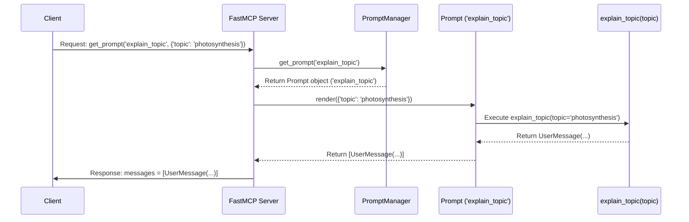

# Chapter 3: Prompt

In the last two chapters, we learned about [Tool](01_tool.md)s (actions the server can perform) and [Resource](02_resource.md)s (data the server can provide). These are great when a client knows exactly what action to take or what data to request.

But sometimes, especially when the client is a smart assistant like a Large Language Model (LLM), you want to guide it more. You might want to give it a template for asking a question or starting a conversation about a specific topic, perhaps including some data from the server. This is where **Prompts** come in handy.

## What Problem Do Prompts Solve?

Imagine you want your LLM assistant (the client) to analyze the content of a specific file on your server.

*   A [Tool](01_tool.md) could *perform* the analysis if you wrote the analysis code yourself.
*   A [Resource](02_resource.md) could let the client *read* the file content using a URI like `file:///path/to/your/file.txt`.

But how do you tell the LLM *client*: "Hey, please read the file at `file:///path/to/your/file.txt` and then tell me the main points"? You need to construct a message for the LLM that includes both the instruction ("tell me the main points") and the file content.

**Prompts** help you create these structured conversational messages dynamically. They act like templates.

## What is a Prompt?

Think of a Prompt like a "Mad Libs" template or a fill-in-the-blanks form for creating conversational messages. You define the basic structure of the message(s), leaving blanks (arguments) that can be filled in later.

*   **Mad Libs Analogy:**
    *   Template: "Please tell me a story about a `[adjective]` `[noun]` who loved to `[verb]`."
    *   Arguments: `adjective="brave"`, `noun="knight"`, `verb="sing"`
    *   Resulting Message: "Please tell me a story about a brave knight who loved to sing."

In `fastmcp`, you define these templates using Python functions decorated with `@mcp.prompt()`.

Key things about Prompts:

1.  **They are Python functions:** You write standard Python code.
2.  **They are decorated:** You use `@mcp.prompt()` above the function definition.
3.  **They take inputs (optional):** Defined as function arguments with type hints (e.g., `topic: str`). These are the "blanks" to fill in.
4.  **They return messages:** The function should return one or more conversational messages. These can be simple strings (which `fastmcp` assumes are user messages) or specific `UserMessage` or `AssistantMessage` objects.
5.  **They have names:** Usually taken from the function name (or specified in the decorator). This name is how clients request the prompt template.
6.  **Managed by `PromptManager`:** Similar to `ToolManager` and `ResourceManager`, the `PromptManager` keeps track of all defined prompts.

When a client wants to use a prompt, it sends a request to your `fastmcp` server, specifying the prompt's name and any arguments needed to fill in the blanks. The server finds the corresponding Python function, runs it with the provided arguments, gets the resulting message(s), and sends them back to the client. The client (e.g., an LLM) can then use these messages to continue the conversation or make its next request.

## Creating Your First Prompts

Let's create a couple of simple prompts.

### 1. A Simple Prompt (No Arguments)

Let's define a prompt that just returns a fixed request to tell a joke.

```python
# examples/simple_prompts.py (simplified)
from fastmcp import FastMCP
from fastmcp.prompts import UserMessage # We can use this for clarity

# Create a FastMCP server instance
mcp = FastMCP("Prompt Server")

# Use the @mcp.prompt() decorator
@mcp.prompt("tell_joke") # We give it the name "tell_joke"
def joke_prompt() -> str:
  """Returns a simple request to tell a joke."""
  print("Prompt 'tell_joke' was requested.")
  # Return a simple string - fastmcp treats this as a UserMessage
  return "Tell me a funny joke!"

# (Code to run the server would go here)
```

**Explanation:**

*   `@mcp.prompt("tell_joke")`: This tells `fastmcp` that the `joke_prompt` function defines a Prompt named `tell_joke`.
*   `def joke_prompt() -> str:`: A simple Python function that takes no arguments and returns a string (`str`).
*   `return "Tell me a funny joke!"`: This is the content of the message that will be generated.

Now, if a client asks the server for the prompt named `tell_joke`, the server will run the `joke_prompt` function and send back a message structure essentially representing: `User: Tell me a funny joke!`. The client (e.g., an LLM) receives this message and can then act on it (like actually telling a joke).

### 2. A Prompt with Arguments

Let's create a prompt that takes a topic and asks the client to explain it simply. This is like our Mad Libs example.

```python
# examples/simple_prompts.py (continued)
from fastmcp import FastMCP
from fastmcp.prompts import UserMessage, AssistantMessage # Import message types

# (mcp instance already created)

@mcp.prompt() # No name needed, defaults to "explain_topic"
def explain_topic(topic: str) -> UserMessage:
  """Generates a request to explain a topic simply."""
  print(f"Prompt 'explain_topic' requested with topic='{topic}'")
  # We explicitly create a UserMessage object
  return UserMessage(f"Explain the topic '{topic}' like I'm five years old.")

# (Code to run the server would go here)
```

**Explanation:**

*   `@mcp.prompt()`: We decorate the function. Since we didn't provide a name, `fastmcp` uses the function name `explain_topic`.
*   `def explain_topic(topic: str) -> UserMessage:`: The function now takes one argument, `topic`, which must be a string (`str`). It's declared to return a `UserMessage`.
*   `return UserMessage(f"Explain the topic '{topic}' like I'm five years old.")`: We construct the message content using the provided `topic` argument and wrap it in a `UserMessage` object.

How it works:

*   If a client requests the prompt `explain_topic` with the argument `topic="black holes"`, `fastmcp` will:
    1.  Find the `explain_topic` function.
    2.  Call it like `explain_topic(topic="black holes")`.
    3.  The function returns a `UserMessage` object containing the text "Explain the topic 'black holes' like I'm five years old.".
    4.  The server sends this message structure back to the client.

### 3. A Prompt Returning Multiple Messages

Sometimes, a prompt might need to generate a sequence of messages to set up a context. For example, maybe you want to provide some background information (as the "assistant") before asking the user (the LLM client) a question.

```python
# examples/simple_prompts.py (continued)
from fastmcp import FastMCP
from fastmcp.prompts import UserMessage, AssistantMessage, Message # Import base Message

# (mcp instance already created)

@mcp.prompt()
def multi_turn_example(character_name: str) -> list[Message]:
  """Generates a multi-turn prompt example."""
  print(f"Prompt 'multi_turn_example' requested with character_name='{character_name}'")
  # Return a list containing different message types
  return [
      AssistantMessage(f"Imagine you are {character_name}, a famous detective."),
      UserMessage("A valuable painting has been stolen. What's your first step?")
  ]

# (Code to run the server would go here)
```

**Explanation:**

*   `def multi_turn_example(character_name: str) -> list[Message]:`: Takes a `character_name` and returns a list (`list`) where each item is a `Message` (either `UserMessage` or `AssistantMessage`).
*   `return [...]`: We return a list containing two messages:
    1.  An `AssistantMessage` setting the scene.
    2.  A `UserMessage` asking the actual question to the client LLM.

If a client requests `multi_turn_example` with `character_name="Sherlock"`, the server will send back *both* messages in order. This helps set the stage for the LLM client's response.

## How Prompts are Used (Simplified Flow)

Let's trace what happens when a client asks for our `explain_topic` prompt with `topic="photosynthesis"`:

1.  **Client Request:** The client sends a message to the `fastmcp` server: "Please `get_prompt` with name `explain_topic` and arguments `{'topic': 'photosynthesis'}`."
2.  **Server Receives:** The [FastMCP Server](04_fastmcp_server.md) gets the request.
3.  **Server Asks Manager:** The server asks its internal `PromptManager`, "Do you have a prompt named `explain_topic`?"
4.  **Manager Finds Prompt:** The `PromptManager` finds the `Prompt` object associated with the name `explain_topic`. This object contains information about the prompt, including a reference to our `explain_topic` Python function and details about its expected arguments (`topic: str`).
5.  **Server Renders Prompt:** The server asks the `Prompt` object to render itself using the provided arguments (`{'topic': 'photosynthesis'}`).
6.  **Function Runs:** The `Prompt` object's rendering logic calls our actual Python function: `explain_topic(topic="photosynthesis")`.
7.  **Function Returns Message:** Our `explain_topic` function runs and returns the `UserMessage` object containing "Explain the topic 'photosynthesis' like I'm five years old.".
8.  **Server Sends Response:** The server takes the resulting message(s) (just one in this case), formats them as needed, and sends them back to the client in a response message.
9.  **Client Receives:** The client gets the response containing the structured message(s). It can now process this message, perhaps by feeding it into its LLM core to generate an explanation.

## Under the Hood: PromptManager and Decorators

Like Tools and Resources, Prompts are registered when your Python script starts up.

**Registration Time:**

1.  **Decorator Runs:** When Python sees `@mcp.prompt()`, it calls the `mcp.prompt()` method.
2.  **Prompt Object Creation:** This method calls `Prompt.from_function()`, passing in your decorated function (e.g., `explain_topic`).
3.  **Function Inspection:** `Prompt.from_function` looks at your function:
    *   Gets its name (`explain_topic`).
    *   Gets its docstring (`"""Generates a request..."""`) for the description.
    *   Inspects its parameters (`topic: str`) to figure out the required arguments and their types.
    *   Creates a `Prompt` object containing all this info and a reference to the function itself.
4.  **Manager Informed:** The `mcp.prompt()` method then calls `self._prompt_manager.add_prompt()`, passing the newly created `Prompt` object.
5.  **Prompt Stored:** The `PromptManager` stores this `Prompt` object in a dictionary, keyed by the prompt's name (`'explain_topic'`).

**Prompt Request Time:**

Here's a diagram showing the flow for getting the `explain_topic` prompt:



**Code References (Simplified View):**

*   **Decorator:** `@mcp.prompt()` defined in `FastMCP.prompt` (`src/fastmcp/server/server.py`).

    ```python
    # src/fastmcp/server/server.py (simplified)
    class FastMCP:
        # ...
        def prompt(self, name: str | None = None, ...):
            def decorator(func: AnyFunction) -> AnyFunction:
                # Create Prompt object from the function
                prompt_obj = Prompt.from_function(func, name=name, ...)
                # Add it to the manager
                self.add_prompt(prompt_obj)
                return func
            return decorator

        def add_prompt(self, prompt: Prompt) -> None:
            self._prompt_manager.add_prompt(prompt)
    ```

*   **Prompt Object Creation:** `Prompt.from_function` (`src/fastmcp/prompts/base.py`) inspects the function.

    ```python
    # src/fastmcp/prompts/base.py (simplified)
    class Prompt(BaseModel):
        # ... fields like name, description, arguments, fn ...
        @classmethod
        def from_function(cls, fn: Callable[..., PromptResult], ...):
            # Inspect function name, docstring, signature (for arguments)
            # ... uses Pydantic/TypeAdapter to get argument schema ...
            arguments = # ... extract PromptArgument list ...
            return cls(name=func_name, description=doc, arguments=arguments, fn=fn, ...)
    ```

*   **Adding to Manager:** `PromptManager.add_prompt` (`src/fastmcp/prompts/prompt_manager.py`) stores the prompt.

    ```python
    # src/fastmcp/prompts/prompt_manager.py (simplified)
    class PromptManager:
        # ...
        def add_prompt(self, prompt: Prompt):
            if prompt.name in self._prompts:
                 # Handle duplicates
                 pass
            self._prompts[prompt.name] = prompt # Store in dict
            return prompt
    ```

*   **Handling Client Request:** `FastMCP.get_prompt` (`src/fastmcp/server/server.py`) is the handler called by the underlying MCP server.

    ```python
    # src/fastmcp/server/server.py (simplified)
    class FastMCP:
        # ...
        async def get_prompt(self, name: str, arguments: dict | None = None):
            # Delegate to PromptManager to render
            messages = await self._prompt_manager.render_prompt(name, arguments)
            # Convert messages to the format expected by the MCP protocol
            return GetPromptResult(messages=pydantic_core.to_jsonable_python(messages))
    ```

*   **Rendering the Prompt:** `PromptManager.render_prompt` (`src/fastmcp/prompts/prompt_manager.py`) finds the prompt and calls its render method.

    ```python
    # src/fastmcp/prompts/prompt_manager.py (simplified)
    class PromptManager:
        # ...
        async def render_prompt(self, name: str, arguments: dict | None = None) -> list[Message]:
            prompt = self.get_prompt(name) # Find the Prompt object
            if not prompt:
                raise ValueError(f"Unknown prompt: {name}")
            # Call the Prompt object's render method
            return await prompt.render(arguments)
    ```

*   **Executing the Function:** `Prompt.render` (`src/fastmcp/prompts/base.py`) validates arguments and runs your original function.

    ```python
    # src/fastmcp/prompts/base.py (simplified)
    class Prompt:
        # ...
        async def render(self, arguments: dict | None = None) -> list[Message]:
            # Validate arguments against stored schema
            # ...
            # Call the original function (self.fn)
            result = self.fn(**(arguments or {}))
            if inspect.iscoroutine(result):
                result = await result # Handle async functions

            # Convert the result (str, Message, list, etc.) into a list[Message]
            messages = # ... logic to normalize result into list of Message objects ...
            return messages
    ```

## Conclusion

You've now learned about **Prompts** in `fastmcp`! They are like dynamic templates for generating structured conversational messages, defined using Python functions and the `@mcp.prompt()` decorator. They are especially useful for guiding LLM clients, allowing you to create starting points for conversations or requests that include specific details filled in via arguments. The `PromptManager` keeps track of all available prompts.

We've covered the building blocks: [Tool](01_tool.md)s (actions), [Resource](02_resource.md)s (data), and Prompts (message templates). How do we actually make these available to clients over the network? That's the job of the **FastMCP Server**.

[Next Chapter: FastMCP Server](04_fastmcp_server.md)

---

Generated by [AI Codebase Knowledge Builder](https://github.com/The-Pocket/Tutorial-Codebase-Knowledge)