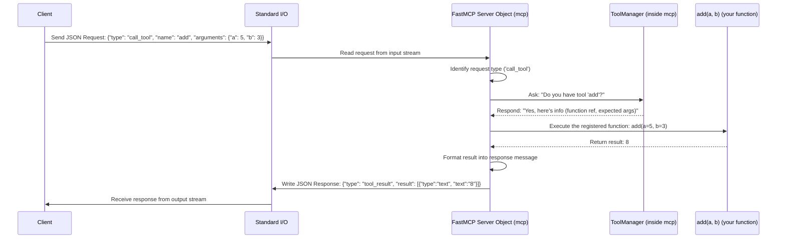

# Chapter 4: FastMCP Server

In the previous chapters, we learned about the building blocks of a `fastmcp` application:
*   [Tool](01_tool.md)s: The actions your application can perform.
*   [Resource](02_resource.md)s: The data your application can provide access to.
*   [Prompt](03_prompt.md)s: Templates for generating conversational messages.

But how do these pieces come together? Where do they "live", and how does a client actually interact with them? That's the job of the **FastMCP Server**.

## Why Do We Need a Server?

Imagine you've written several Python functions for your tools (like `add`), resources (like `get_greeting`), and prompts (like `explain_topic`). These are just regular Python functions sitting in your code.

For a client (like an LLM assistant running elsewhere, or even just a command-line tool on your own machine) to be able to use these functions, we need something that:

1.  **Knows about** all your defined tools, resources, and prompts.
2.  **Listens** for incoming requests from clients over some communication channel (like your computer's standard input/output, or over the network).
3.  **Understands** those requests (e.g., "call the tool named 'add' with these numbers").
4.  **Runs** the correct Python function with the right inputs.
5.  **Sends** the result back to the client.

This "something" is the **FastMCP Server**. It's the central headquarters for your application.

## What is the FastMCP Server?

In `fastmcp`, the server is represented by an object you create from the `FastMCP` class. Think of it as the main application object.

```python
# Import the main class
from fastmcp import FastMCP

# Create an instance of the server
# We give it a name, like "MyHelperApp"
mcp = FastMCP("MyHelperApp")
```

This `mcp` object is the core of your server application. It plays several key roles:

1.  **Container:** It holds references to all the tools, resources, and prompts you define. When you use decorators like `@mcp.tool()`, `@mcp.resource()`, or `@mcp.prompt()`, you're actually calling methods on *this specific `mcp` object* to register your functions with it. It uses internal managers (`ToolManager`, `ResourceManager`, `PromptManager`) to keep everything organized.
2.  **Orchestrator:** When a client sends a request (e.g., "read resource `greeting://World`"), the `mcp` object receives it. It figures out what the client wants (read a resource), finds the corresponding function (the `get_greeting` function associated with that resource URI), runs it with the necessary arguments (`name="World"`), and gets the result (`"Hello, World!"`).
3.  **Protocol Handler:** It handles the low-level details of communication. Whether the client is talking to the server via standard input/output (stdio) or a web protocol like Server-Sent Events (SSE), the `FastMCP` object manages this connection so you don't have to worry about the technical details of sending and receiving messages. We'll learn more about this in the [Transport](07_transport.md) chapter.

**Analogy: The Restaurant Kitchen**

*   The `FastMCP` object (`mcp`) is like the **Head Chef** and the entire **Kitchen Operation**.
*   Using `@mcp.tool()`, `@mcp.resource()`, `@mcp.prompt()` is like adding **Recipes** to the Chef's cookbook.
*   Running the server (`mcp.run()`) is like **Opening the Restaurant** for business.
*   A **Client** is a **Customer** placing an order.
*   The **Transport** is the **Waiter** taking the order to the kitchen and bringing the food back.
*   The Head Chef receives the order, finds the right recipe in the cookbook, tells the cooks (your Python functions) what to do, prepares the dish (executes the function), and gives it to the waiter (sends the response).

## Creating and Populating Your Server

Let's see how the server object connects everything.

1.  **Import `FastMCP`**.
2.  **Create an instance**: `mcp = FastMCP("ExampleServer")`.
3.  **Define functions and register them using decorators *on that instance***:

```python
# Import the main class
from fastmcp import FastMCP

# 1. Create the server instance
mcp = FastMCP("CalculatorAndGreeter")

# 2. Define and register a Tool using the instance's decorator
@mcp.tool()
def add(a: int, b: int) -> int:
  """Adds two numbers."""
  print(f"Server executing add({a}, {b})")
  return a + b

# 3. Define and register a Resource using the instance's decorator
@mcp.resource("greeting://{name}")
def get_greeting(name: str) -> str:
  """Provides a personalized greeting."""
  print(f"Server executing get_greeting({name})")
  return f"Hello from the server, {name}!"

# (We would add mcp.run() later to make it actually run)
print("Server defined with one tool and one resource.")
```

**Explanation:**

*   `mcp = FastMCP(...)`: We create our central server object.
*   `@mcp.tool()`: This is *specifically* calling the `tool` method *of our `mcp` object*. It tells *this* server instance, "Hey, the `add` function is one of your tools."
*   `@mcp.resource(...)`: Similarly, this calls the `resource` method *of our `mcp` object*, registering the `get_greeting` function as a resource template.

Now, our `mcp` object knows about the `add` tool and the `greeting://{name}` resource.

## Running the Server

Defining the server and its functionalities is step one. Step two is actually starting it so it can listen for client requests. You do this by calling the `run()` method on your `FastMCP` instance.

```python
# Import the main class
from fastmcp import FastMCP

# Create the server instance
mcp = FastMCP("SimpleAdder")

# Define and register a Tool
@mcp.tool()
def add(a: int, b: int) -> int:
  """Adds two numbers."""
  print(f"Executing add({a}, {b})")
  return a + b

# --- This is the new part ---
# Check if this script is being run directly
if __name__ == "__main__":
  print("Starting the FastMCP server...")
  # Tell the server instance to start running and listening
  mcp.run()
  # The script will usually stay here, waiting for client requests
  print("Server stopped.") # This line might not be reached until you stop the server
```

**Explanation:**

*   `if __name__ == "__main__":`: This is a standard Python pattern. The code inside this block only runs when you execute the script directly (e.g., `python your_script.py`).
*   `mcp.run()`: This is the crucial call. It starts the server's main loop. By default, it usually uses "stdio" (standard input/output) for communication, meaning it listens for requests typed into the console where it's running and prints responses back out. It will keep running, waiting for requests, until you stop it (e.g., by pressing Ctrl+C).

Now, if you save this code as `adder_server.py` and run `python adder_server.py` in your terminal, the server will start and wait. Another program ([Client](06_client.md)) could then connect to it and ask it to add numbers.

*(Note: We'll cover different ways to run the server, like using web protocols (SSE), in the [Transport](07_transport.md) chapter. The `run()` method handles starting the appropriate listener.)*

## Under the Hood: How Requests are Handled

Let's visualize the flow when a client sends a request to call the `add` tool with `a=5, b=3`, assuming the server is running via stdio:



**Key Code Connections (`src/fastmcp/server/server.py`):**

*   **Initialization (`FastMCP.__init__`)**: When you do `mcp = FastMCP(...)`, the `__init__` method is called. Inside, it creates instances of `ToolManager`, `ResourceManager`, and `PromptManager` and stores them (e.g., as `self._tool_manager`).

    ```python
    # src/fastmcp/server/server.py (simplified __init__)
    class FastMCP:
        def __init__(self, name: str | None = None, ...):
            # ... setup basic MCP server ...
            self._tool_manager = ToolManager(...)
            self._resource_manager = ResourceManager(...)
            self._prompt_manager = PromptManager(...)
            # ... setup handlers ...
    ```

*   **Decorators (`FastMCP.tool`, `FastMCP.resource`, `FastMCP.prompt`)**: These methods are called when Python processes your `@mcp.tool()`, etc. lines. They take your function and pass it to the appropriate manager's `add_` method.

    ```python
    # src/fastmcp/server/server.py (simplified tool decorator)
    class FastMCP:
        # ...
        def tool(self, name: str | None = None, ...):
            def decorator(fn: AnyFunction) -> AnyFunction:
                # Delegate registration to the ToolManager
                self._tool_manager.add_tool(fn, name=name, ...)
                return fn
            return decorator
        # Similar methods exist for resource() and prompt()
    ```

*   **Request Handlers (`FastMCP.call_tool`, `FastMCP.read_resource`, etc.)**: These methods are internally registered with the underlying MCP machinery. When a corresponding request comes in (like `call_tool`), this method is executed. It typically uses the appropriate manager to find and run your function.

    ```python
    # src/fastmcp/server/server.py (simplified call_tool handler)
    class FastMCP:
        # ...
        async def call_tool(self, name: str, arguments: dict[str, Any]):
            # Get context (more on this later)
            context = self.get_context()
            # Delegate execution to the ToolManager
            result = await self._tool_manager.call_tool(name, arguments, context=context)
            # Convert the Python result to the MCP message format
            converted_result = _convert_to_content(result)
            return converted_result
        # Similar handlers exist for read_resource, get_prompt etc.
    ```

*   **Running the Server (`FastMCP.run`, `FastMCP.run_async`)**: These methods start the underlying communication layer (like `stdio_server` or `uvicorn` for SSE) and tell the core MCP server logic to begin processing requests using the handlers defined above.

    ```python
    # src/fastmcp/server/server.py (simplified run method)
    class FastMCP:
        # ...
        def run(self, transport: Literal["stdio", "sse"] | None = None) -> None:
            # Run the async version using anyio
            anyio.run(self.run_async, transport)

        async def run_async(self, transport: Literal["stdio", "sse"] | None = None) -> None:
            transport = transport or "stdio"
            if transport == "stdio":
                await self.run_stdio_async() # Starts stdio listener
            elif transport == "sse":
                await self.run_sse_async() # Starts SSE/HTTP listener via uvicorn
            else:
                raise ValueError(f"Unknown transport: {transport}")

        async def run_stdio_async(self) -> None:
             # Use the low-level stdio server from the mcp library
             async with stdio_server() as (read_stream, write_stream):
                 # Run the core MCP server loop with these streams
                 await self._mcp_server.run(read_stream, write_stream, ...)
    ```

## Conclusion

You've learned that the **FastMCP Server**, created as an instance of the `FastMCP` class, is the heart of your application. It acts as the central container and orchestrator for all your [Tool](01_tool.md)s, [Resource](02_resource.md)s, and [Prompt](03_prompt.md)s. You register these functionalities using decorators (`@mcp.tool()`, etc.) directly on the server instance. Finally, calling `mcp.run()` brings your server to life, allowing it to listen for and respond to client requests, while hiding the complexities of the underlying communication protocol.

Now that we know how to define and run a server, how do we actually run these server scripts easily from our terminal, perhaps with different configurations? That's where the `fastmcp` Command Line Interface (CLI) comes in.

[Next Chapter: CLI (Command Line Interface)](05_cli__command_line_interface_.md)

---

Generated by [AI Codebase Knowledge Builder](https://github.com/The-Pocket/Tutorial-Codebase-Knowledge)