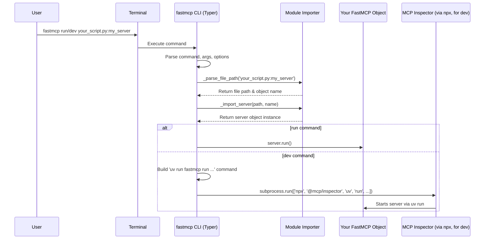
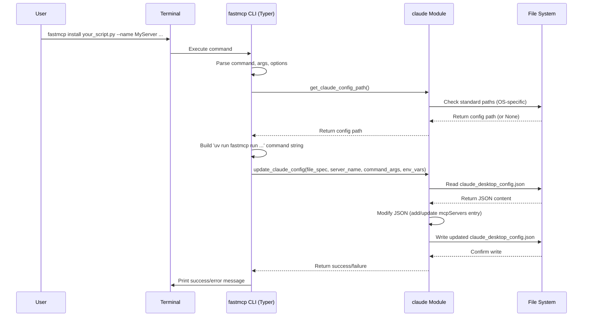

# Chapter 5: CLI (Command Line Interface)

In the [previous chapter](04_fastmcp_server.md), we learned how the `FastMCP` server object acts as the central hub for our tools, resources, and prompts, and how `mcp.run()` starts the server. That's great, but how do we actually tell Python to run our server script? And how do we manage different ways of running it, like for development or installation?

This is where the `fastmcp` **Command Line Interface (CLI)** comes in.

## What Problem Does the CLI Solve?

Imagine you just wrote your `adder_server.py` script from the last chapter. To run it, you'd open your terminal and type:

```bash
python adder_server.py
```

That works fine for a simple case. But what if:

*   You want to run it with a special **debugging tool** that shows you the messages going back and forth?
*   You want to easily **install** your server so that another application, like the Claude Desktop app, can find and use it automatically?
*   Your server needs specific Python **packages** installed to work correctly, and you want an easy way to manage that?

Doing all this manually would require writing complicated setup scripts or remembering long commands. The `fastmcp` CLI provides simple, built-in commands to handle these common tasks for you.

## What is the FastMCP CLI?

Think of the `fastmcp` CLI as your **developer's control panel** or a **Swiss army knife** for managing your FastMCP projects directly from your terminal (the command line).

When you install the `fastmcp` Python library, it also installs a command-line tool named `fastmcp`. You can use this tool by typing `fastmcp` followed by a specific **subcommand** (like `run`, `dev`, or `install`) and some options.

It simplifies tasks like:

*   **Running** your server normally.
*   **Running** your server with a **development inspector**.
*   **Installing** your server for use by other applications (like Claude Desktop).

Let's look at the main commands.

## Using the CLI

### 1. `fastmcp run`: Running Your Server

This is the most basic command. It tells `fastmcp` to find your server script, import the `FastMCP` object, and call its `run()` method.

**Use Case:** Let's run the `adder_server.py` we created earlier.

```python
# adder_server.py
from fastmcp import FastMCP

# Create the server instance
mcp = FastMCP("SimpleAdder")

# Define and register a Tool
@mcp.tool()
def add(a: int, b: int) -> int:
  """Adds two numbers."""
  print(f"Executing add({a}, {b})")
  return a + b

# --- Run the server if script is executed directly ---
# NOTE: For 'fastmcp run', this __main__ block might not even be needed
# if you specify the object name (see below).
if __name__ == "__main__":
  print("Starting the FastMCP server via direct script execution...")
  mcp.run()
```

**How to run it using the CLI:**

Open your terminal in the directory containing `adder_server.py` and type:

```bash
fastmcp run adder_server.py
```

**What happens:**

*   The `fastmcp` CLI tool starts.
*   It sees the `run` command.
*   It looks for the file `adder_server.py`.
*   It imports the code inside `adder_server.py`.
*   It looks for a standard variable name like `mcp`, `server`, or `app` that holds your `FastMCP` instance. (It found `mcp` in our case).
*   It calls the `run()` method on that `mcp` object.
*   Your terminal will likely show something like "Starting the FastMCP server..." and then wait for connections (using stdio by default).

**Specifying the Server Object:**

What if your `FastMCP` object isn't named `mcp`, `server`, or `app`? Or what if you have multiple server objects in one file? You can tell the CLI exactly which object to use with a colon (`:`):

```bash
# If your server object was named 'my_calculator_app' in adder_server.py
fastmcp run adder_server.py:my_calculator_app
```

**Choosing the Communication Method (Transport):**

While the [Transport](07_transport.md) chapter covers this in detail, you can tell `run` to use a different communication method like Server-Sent Events (SSE) instead of the default stdio:

```bash
fastmcp run adder_server.py --transport sse
```

### 2. `fastmcp dev`: Running with the Inspector

When developing your server, it's helpful to see the raw messages being exchanged between the client and server. The `dev` command runs your server and launches a web-based "MCP Inspector" tool alongside it.

**(Requires Node.js/npx):** This command uses `npx`, a tool that comes with Node.js, to run the inspector. Make sure you have Node.js installed!

**How to run it:**

```bash
fastmcp dev adder_server.py
```

**What happens:**

*   The `fastmcp` CLI starts with the `dev` command.
*   It finds and prepares to run your `adder_server.py` (similar to `run`).
*   It uses `npx` to download and run the `@modelcontextprotocol/inspector` tool.
*   It tells the inspector tool *how* to start your Python server (it actually constructs a `fastmcp run` command internally!).
*   The inspector starts your server and also opens a web page in your browser (or gives you a URL) showing a dashboard where you can see requests and responses in real-time.

This is super useful for debugging! You can see exactly what arguments the client sent for a tool call and exactly what result your server sent back.

You can also specify the server object (`adder_server.py:mcp`) just like with `run`.

### 3. `fastmcp install`: Installing for Claude Desktop

If you want to use your custom tools within the Claude Desktop application, you need to tell Claude where to find your server and how to run it. The `install` command automates this.

**How to run it:**

```bash
fastmcp install adder_server.py --name CalculatorServer
```

**What happens:**

*   The `fastmcp` CLI starts with the `install` command.
*   It finds the configuration file used by the Claude Desktop application on your computer. (It knows where to look based on your operating system).
*   It reads the configuration file (which is in JSON format).
*   It adds a new entry for your server (named "CalculatorServer" in this example). This entry includes:
    *   The **full path** to your `adder_server.py`.
    *   Instructions on how to run it, typically using `uv run` (a fast Python installer/runner) to ensure dependencies like `fastmcp` itself are available.
*   It saves the updated configuration file.

Now, when you open Claude Desktop, it will see "CalculatorServer" in its list of available MCP servers and will know how to start it when needed.

**Optional Arguments:**

*   `--name` or `-n`: Specifies the name Claude Desktop will use (defaults to the server object's `name` attribute or the filename).
*   `--with-editable` or `-e`: If your server is part of a larger Python package you're developing, this points to the package directory so it's installed in "editable" mode.
*   `--with`: Lists extra Python packages your server needs (e.g., `--with requests --with beautifulsoup4`).
*   `--env-var` or `-v`: Sets environment variables for your server (e.g., `-v API_KEY=12345`).
*   `--env-file` or `-f`: Loads environment variables from a `.env` file.

These options help ensure your server runs correctly within the environment managed by Claude Desktop.

## Under the Hood

How does the `fastmcp` command actually work? It uses libraries like `typer` to parse your command-line arguments and then performs different actions based on the subcommand.

### `run` and `dev` Flow

When you type `fastmcp run your_script.py:my_server` or `fastmcp dev ...`:

1.  **Parsing:** The `typer` library parses the command (`run` or `dev`), the arguments (`your_script.py:my_server`), and any options (`--transport sse`).
2.  **File Handling:** The CLI code (`_parse_file_path` function) splits the file path (`your_script.py`) from the optional object name (`my_server`) and makes sure the file exists.
3.  **Importing:** The `_import_server` function dynamically imports the Python code from `your_script.py`. It carefully adds the script's directory to the Python path so relative imports within your script work. It then finds the specified server object (`my_server`) or looks for default names (`mcp`, `server`, `app`).
4.  **Execution (`run`):** The `run` command's function simply calls the `.run()` method on the imported server object, passing any relevant options like `transport`.
5.  **Execution (`dev`):** The `dev` command's function first figures out the necessary Python packages (including `fastmcp`). It constructs a command line that uses `uv run` to execute `fastmcp run your_script.py:my_server`. It then constructs *another* command line using `npx @modelcontextprotocol/inspector` followed by the `uv run ...` command. Finally, it executes this `npx` command using Python's `subprocess` module.



**Code Snippets (Simplified):**

*   **CLI Entry Point (`src/fastmcp/cli/cli.py`)**: Uses `typer` to define commands.

    ```python
    # src/fastmcp/cli/cli.py (simplified run command)
    import typer
    # ... other imports ...

    app = typer.Typer(...)

    @app.command()
    def run(
        file_spec: str = typer.Argument(...),
        transport: str | None = typer.Option(None, "--transport", "-t"),
    ) -> None:
        """Run a MCP server."""
        file, server_object = _parse_file_path(file_spec)
        logger.debug("Running server", ...)
        try:
            server = _import_server(file, server_object) # Import
            kwargs = {"transport": transport} if transport else {}
            server.run(**kwargs) # Execute
        except Exception as e:
            # ... error handling ...
            sys.exit(1)
    ```

*   **Importing Logic (`src/fastmcp/cli/cli.py`)**: Handles finding and loading the server object.

    ```python
    # src/fastmcp/cli/cli.py (simplified _import_server)
    import importlib.util
    # ... other imports ...

    def _import_server(file: Path, server_object: str | None = None):
        # ... add file's directory to sys.path ...
        spec = importlib.util.spec_from_file_location("server_module", file)
        # ... error check spec ...
        module = importlib.util.module_from_spec(spec)
        spec.loader.exec_module(module) # Actually load the code

        if not server_object:
            # Look for default names mcp, server, app
            # ... logic ...
        else:
            # Get the specified object
            server = getattr(module, server_object, None)

        # ... error check if server found ...
        return server
    ```

### `install` Flow

When you type `fastmcp install your_script.py --name MyServer ...`:

1.  **Parsing:** `typer` parses the command, arguments, and options.
2.  **Find Claude Config:** The `claude.get_claude_config_path()` function checks standard locations for the Claude Desktop config directory based on your OS (Windows, macOS, Linux).
3.  **Build Command:** The CLI constructs the command string that Claude Desktop should use to run your server. This usually involves `uv run` to handle dependencies. It adds options like `--with <package>` or `--with-editable <path>` based on your CLI options. It also includes the `fastmcp run your_script.py` part.
4.  **Load Config:** It reads the `claude_desktop_config.json` file.
5.  **Update Config:** It adds or updates an entry under the `mcpServers` key in the JSON data. It uses the provided `--name` (or a default) as the key for your server. It carefully merges any new environment variables (`--env-var`, `--env-file`) with existing ones.
6.  **Save Config:** It writes the modified JSON data back to the `claude_desktop_config.json` file.



**Code Snippets (Simplified):**

*   **Install Command (`src/fastmcp/cli/cli.py`)**: Orchestrates the install process.

    ```python
    # src/fastmcp/cli/cli.py (simplified install command)
    # ... imports: typer, claude, Path, dotenv ...

    @app.command()
    def install(
        file_spec: str = typer.Argument(...),
        server_name: str | None = typer.Option(None, "--name", "-n"),
        # ... other options like with_editable, with_packages, env_vars ...
    ) -> None:
        """Install a MCP server in the Claude desktop app."""
        file, server_object = _parse_file_path(file_spec)
        logger.debug("Installing server", ...)

        if not claude.get_claude_config_path(): # Check if Claude config exists
            logger.error("Claude app not found")
            sys.exit(1)

        # ... logic to determine server name (from option, server attr, or file) ...
        name = server_name or file.stem # Simplified fallback

        # ... logic to gather dependencies (server.dependencies + --with options) ...
        packages = [] # Placeholder

        # ... logic to process --env-var and --env-file into env_dict ...
        env_dict = {} # Placeholder

        # Call the function that modifies the config file
        if claude.update_claude_config(
            file_spec, name, with_packages=packages, env_vars=env_dict, ...
        ):
            logger.info(f"Successfully installed {name} in Claude app")
        else:
            logger.error(f"Failed to install {name} in Claude app")
            sys.exit(1)
    ```

*   **Claude Config Update (`src/fastmcp/cli/claude.py`)**: Handles the JSON manipulation.

    ```python
    # src/fastmcp/cli/claude.py (simplified update_claude_config)
    import json
    from pathlib import Path
    # ... other imports ...

    def update_claude_config(
        file_spec: str,
        server_name: str,
        *,
        with_packages: list[str] | None = None,
        env_vars: dict[str, str] | None = None,
        # ... other args like with_editable ...
    ) -> bool:
        config_dir = get_claude_config_path()
        if not config_dir:
             # ... error handling ...
             return False
        config_file = config_dir / "claude_desktop_config.json"
        # ... ensure config file exists ...

        try:
            config = json.loads(config_file.read_text())
            if "mcpServers" not in config:
                config["mcpServers"] = {}

            # --- Build the command Claude should run ---
            args = ["run"]
            packages = {"fastmcp"} # Always include fastmcp
            if with_packages:
                 packages.update(pkg for pkg in with_packages if pkg)
            for pkg in sorted(packages):
                 args.extend(["--with", pkg])
            # ... add --with-editable if needed ...

            # Resolve file path and add 'fastmcp run file_spec'
            resolved_file_spec = # ... logic to resolve path ...
            args.extend(["fastmcp", "run", resolved_file_spec])
            # --- Command built ---

            server_config = {"command": "uv", "args": args}

            # Merge existing env vars with new ones
            existing_env = config.get("mcpServers", {}).get(server_name, {}).get("env", {})
            merged_env = {**existing_env, **(env_vars or {})}
            if merged_env:
                server_config["env"] = merged_env

            config["mcpServers"][server_name] = server_config # Add/update entry
            config_file.write_text(json.dumps(config, indent=2)) # Save
            return True
        except Exception as e:
            # ... error handling ...
            return False
    ```

## Conclusion

The `fastmcp` CLI is a powerful tool that simplifies managing your FastMCP servers. You've learned about the key commands:

*   `fastmcp run`: To start your server directly.
*   `fastmcp dev`: To run your server with a helpful debugging inspector.
*   `fastmcp install`: To register your server with the Claude Desktop application.

By using the CLI, you can focus more on building your server's capabilities (the tools, resources, and prompts) and less on the mechanics of running and deploying them.

Now that we understand how to build and manage the server side, how does another program actually *talk* to our running `fastmcp` server? That's the role of the **Client**.

[Next Chapter: Client](06_client.md)

---

Generated by [AI Codebase Knowledge Builder](https://github.com/The-Pocket/Tutorial-Codebase-Knowledge)