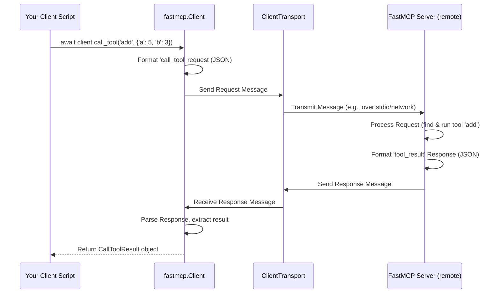

# Chapter 6: Client

In the [previous chapter](05_cli__command_line_interface_.md), we saw how the `fastmcp` CLI helps us run and manage our `fastmcp` servers from the command line. That's great for starting the server, but how do we actually *use* that running server from another program?

Imagine you've built a fantastic `fastmcp` server with tools to check the weather, take screenshots, and maybe even control your smart lights. Now, you want to write a separate Python script – maybe a simple chatbot or an automation task – that needs to use those tools. How does your script "talk" to the `fastmcp` server?

This is where the **Client** comes in.

## What Problem Does the Client Solve?

Let's use our simple `adder_server.py` example. Suppose you run it using the CLI:

```bash
# In one terminal
fastmcp run adder_server.py
```

Now the adder server is running, waiting for requests. How can a *different* Python script send it the numbers `5` and `3` and get back the result `8`?

You need a way for your script to:

1.  **Connect** to the running `adder_server`.
2.  **Send a message** saying "Please call the tool named 'add' with arguments `a=5` and `b=3`".
3.  **Receive the response** message containing the result `8`.

The `fastmcp` **Client** is the component designed specifically for this job.

## What is the Client?

Think of the `fastmcp` **Client** as the **remote control** or the **telephone** you use to interact with your [FastMCP Server](04_fastmcp_server.md) (the headquarters).

*   **Remote Control Analogy:** The server is your TV. The `Client` is the remote you use to change channels (call tools), check the volume level (read resources), etc.
*   **Telephone Analogy:** The server is the office you want to call. The `Client` is the phone you use to dial the number (connect), make a request ("Can I speak to the 'add' department?"), and get an answer ("The result is 8.").

The `Client` object in your script handles all the communication details. You tell it which server to connect to and what you want to do (e.g., "call tool 'add'"), and it takes care of:

1.  **Establishing the connection** (using a communication method called a [Transport](07_transport.md)).
2.  **Formatting your request** into the specific message format defined by the MCP standard.
3.  **Sending the request** over the connection.
4.  **Waiting for and receiving the response**.
5.  **Parsing the response** and giving you back the result in a usable format (like a number or a string).

You use the `Client` class from the `fastmcp.client` module to create a client object in your Python code.

## Using the Client: A Simple Example

Let's write a new Python script (`client_script.py`) that uses the `Client` to talk to our `adder_server`.

**Step 1: Create the Server Code (if you don't have it)**

First, make sure you have the server code saved as `adder_server.py`:

```python
# adder_server.py
from fastmcp import FastMCP

# Create the server instance
mcp = FastMCP("SimpleAdder")

# Define and register a Tool
@mcp.tool()
def add(a: int, b: int) -> int:
  """Adds two numbers."""
  print(f"Server: Executing add({a}, {b})")
  return a + b

# Note: We don't need the `if __name__ == "__main__": mcp.run()` part
# if we plan to run it using `fastmcp run adder_server.py`
# or if the client will start it directly (shown below).
```

**Step 2: Write the Client Script (`client_script.py`)**

Now, let's write the script that will act as the client. For this *first* example, we'll show how a client can directly connect to a server object *if they are running in the same script*. This is useful for testing but less common in real applications where client and server are separate processes.

```python
# client_script.py
import asyncio
from fastmcp.client import Client
from adder_server import mcp as server_instance # Import the server object

async def main():
    print("Client: Creating a Client instance connected to the server object...")
    # Create a Client, telling it to connect directly to our server object
    # This uses a special in-memory "Transport" automatically.
    async with Client(server_instance) as client:
        print("Client: Connected!")

        # Let's see what tools the server has
        print("Client: Asking the server to list its tools...")
        tools_result = await client.list_tools()
        print(f"Client: Server reported tools: {tools_result.tools}")

        # Now, let's use the 'add' tool
        a = 10
        b = 5
        print(f"Client: Asking the server to call 'add' with a={a}, b={b}...")
        # The arguments are passed as a dictionary
        result = await client.call_tool("add", {"a": a, "b": b})

        # The result object contains the content. We expect simple text here.
        # result.content is a list, we take the first item's text.
        sum_result = result.content[0].text
        print(f"Client: Server returned the result: {sum_result}")

    print("Client: Disconnected.")

# Run the asynchronous main function
if __name__ == "__main__":
    asyncio.run(main())
```

**Explanation:**

1.  `import asyncio`: Client operations are asynchronous (they use `async`/`await`), so we need this library.
2.  `from fastmcp.client import Client`: We import the main `Client` class.
3.  `from adder_server import mcp as server_instance`: We import the actual `FastMCP` object from our server file.
4.  `async def main():`: We define an asynchronous function to run our client logic.
5.  `async with Client(server_instance) as client:`: This is the core part.
    *   We create a `Client` instance, passing our `server_instance` object to its constructor. `fastmcp` is smart enough to see this is a server object and sets up a direct, in-memory connection (using `FastMCPTransport` internally).
    *   The `async with` statement automatically handles connecting when entering the block and disconnecting when exiting. The connected client object is available as `client`.
6.  `await client.list_tools()`: We call the `list_tools()` method on the client object. This sends a `tools/list` request to the server and waits (`await`) for the response.
7.  `await client.call_tool("add", {"a": a, "b": b})`: We call the `call_tool()` method.
    *   The first argument is the **name** of the tool (`"add"`).
    *   The second argument is a **dictionary** containing the arguments the tool expects (`{"a": 10, "b": 5}`).
    *   This sends a `tools/call` request and waits for the result.
8.  `result.content[0].text`: The `call_tool` method returns a result object (like `CallToolResult`). The actual data is usually in a list called `content`. Since our `add` tool returns simple text, we access the first content item (`[0]`) and get its `.text` attribute.
9.  `asyncio.run(main())`: This line runs our `main` asynchronous function.

**Running the Example:**

Because this specific example imports the server object directly, you just run the client script:

```bash
python client_script.py
```

You should see output like this (order might vary slightly due to async nature):

```
Client: Creating a Client instance connected to the server object...
Client: Connected!
Client: Asking the server to list its tools...
Client: Server reported tools: [Tool(name='add', description='Adds two numbers.', inputSchema={'type': 'object', 'properties': {'a': {'type': 'integer'}, 'b': {'type': 'integer'}}, 'required': ['a', 'b']})]
Client: Asking the server to call 'add' with a=10, b=5...
Server: Executing add(10, 5)
Client: Server returned the result: 15
Client: Disconnected.
```

Notice how the `print` statement from inside the server's `add` function also appeared! This confirms the client successfully triggered the tool on the server.

## Connecting to a Separate Server Process

The previous example was simple because the client and server were in the same script execution. More realistically, your server will be running as a separate process (started via `fastmcp run` or `fastmcp dev`).

How does the client connect then? Instead of passing the server object, you tell the `Client` *how* to reach the server process. This is done via a [Transport](07_transport.md).

Let's modify `client_script.py` to connect to `adder_server.py` running via `stdio` (standard input/output).

**Step 1: Start the Server**

Open a terminal and run:

```bash
fastmcp run adder_server.py
```
Leave this terminal running.

**Step 2: Modify and Run the Client Script**

Now, modify `client_script.py`:

```python
# client_script.py (modified for stdio connection)
import asyncio
from fastmcp.client import Client
# We no longer import the server object directly

async def main():
    # Define the path to the server script
    server_script_path = "adder_server.py"

    print(f"Client: Creating Client to connect to '{server_script_path}' via stdio...")
    # Instead of the server object, pass the path to the script.
    # fastmcp infers we want to use PythonStdioTransport.
    async with Client(server_script_path) as client:
        print("Client: Connected!")

        print("Client: Asking the server to list tools...")
        tools_result = await client.list_tools()
        print(f"Client: Server reported tools: {tools_result.tools}")

        a = 50
        b = 30
        print(f"Client: Asking the server to call 'add' with a={a}, b={b}...")
        result = await client.call_tool("add", {"a": a, "b": b})
        sum_result = result.content[0].text
        print(f"Client: Server returned the result: {sum_result}")

    print("Client: Disconnected.")

if __name__ == "__main__":
    asyncio.run(main())
```

**Explanation of Changes:**

*   We removed `from adder_server import mcp as server_instance`.
*   `async with Client(server_script_path) as client:`: We now pass the *path* to the server script (`"adder_server.py"`) to the `Client` constructor. The `Client` uses a helper (`infer_transport`) to figure out that since this is a `.py` file path, it should use a `PythonStdioTransport`. This transport knows how to start `python adder_server.py` as a separate process and communicate with it over its standard input and output pipes.

**Running the Example:**

1.  Make sure `fastmcp run adder_server.py` is running in the first terminal.
2.  Open a **second** terminal in the same directory.
3.  Run the client script: `python client_script.py`

In the second terminal (client), you'll see:

```
Client: Creating Client to connect to 'adder_server.py' via stdio...
Client: Connected!
Client: Asking the server to list tools...
Client: Server reported tools: [Tool(name='add', description='Adds two numbers.', inputSchema={'type': 'object', 'properties': {'a': {'type': 'integer'}, 'b': {'type': 'integer'}}, 'required': ['a', 'b']})]
Client: Asking the server to call 'add' with a=50, b=30...
Client: Server returned the result: 80
Client: Disconnected.
```

And in the first terminal (server), you'll see the message from the tool:

```
Server: Executing add(50, 30)
```

It worked! The client script successfully started and communicated with the separate server process.

Other `Client` methods you might use include:

*   `client.list_resources()`
*   `client.read_resource("some-uri://like/this")`
*   `client.list_prompts()`
*   `client.get_prompt("prompt_name", {"arg": "value"})`

## Under the Hood: How `client.call_tool` Works

What happens internally when you `await client.call_tool("add", {"a": 5, "b": 3})`?

1.  **Format Request:** The `Client` object takes the tool name (`"add"`) and arguments (`{"a": 5, "b": 3}`) and creates a standard MCP request message. This message is usually formatted as JSON, looking something like:
    ```json
    {
      "type": "call_tool",
      "id": "request-123", // A unique ID for the request
      "name": "add",
      "arguments": {"a": 5, "b": 3}
    }
    ```
2.  **Send via Transport:** The `Client` hands this formatted message to its associated [Transport](07_transport.md) (e.g., `PythonStdioTransport`, `SSETransport`).
3.  **Transmission:** The `Transport` sends the message bytes over the communication channel (e.g., writes to the server process's stdin, sends over an HTTP connection).
4.  **Server Processing:** The [FastMCP Server](04_fastmcp_server.md) receives the bytes, parses the message, identifies it as a `call_tool` request, finds the `add` tool function, validates arguments, executes `add(a=5, b=3)`, gets the result `8`, and formats a response message (e.g., `{"type": "tool_result", "id": "request-123", "result": {"content": [{"type": "text", "text": "8"}]}}`).
5.  **Transport Receives:** The `Transport` on the client side receives the response bytes from the communication channel.
6.  **Deliver to Client:** The `Transport` passes the raw response message back to the `Client` object.
7.  **Parse Response:** The `Client` parses the response message (JSON), matches it to the original request using the ID (`"request-123"`), extracts the relevant result part (`{"content": [{"type": "text", "text": "8"}]}`), and converts it into a Python object (like `CallToolResult`).
8.  **Return Result:** The `await` finishes, and the `CallToolResult` object is returned to your script.

Here's a simplified diagram:



**Code References (Simplified View):**

*   **`Client` Class (`src/fastmcp/client/client.py`)**:
    *   `__init__`: Takes the `transport` argument (server object, path, URL) and calls `infer_transport` to get a `ClientTransport` instance. Stores callbacks and settings.
    *   `__aenter__`: Calls `self.transport.connect_session(**self._session_kwargs)` to establish the connection via the transport. This returns an `mcp.ClientSession` object from the underlying `mcp` library, which handles the raw protocol. Stores the session in `self._session`.
    *   `call_tool`: Calls `self.session.call_tool(name, arguments)`. This delegates the actual request formatting and sending/receiving logic to the `mcp.ClientSession`.
    *   Other methods (`list_tools`, `read_resource`, etc.) similarly delegate to the corresponding methods on `self.session`.

    ```python
    # src/fastmcp/client/client.py (simplified)
    class Client:
        def __init__(self, transport: ClientTransport | FastMCP | ..., ...):
            self.transport = infer_transport(transport) # Get the right transport
            self._session: ClientSession | None = None
            self._session_cm: AbstractAsyncContextManager[ClientSession] | None = None
            self._session_kwargs = { ... } # Store callbacks etc.

        async def __aenter__(self):
            # Connect using the transport
            self._session_cm = self.transport.connect_session(**self._session_kwargs)
            self._session = await self._session_cm.__aenter__()
            return self

        async def call_tool(self, name: str, args: dict | None = None):
            # Delegate to the underlying MCP session
            return await self.session.call_tool(name, args)
        # ... other methods like list_tools, read_resource ...
    ```

*   **Transport Inference (`src/fastmcp/client/transports.py`)**:
    *   `infer_transport`: Contains the logic to decide which `ClientTransport` subclass to create based on the input (server object -> `FastMCPTransport`, `.py` path -> `PythonStdioTransport`, `http://` URL -> `SSETransport`, `ws://` URL -> `WSTransport`, etc.).

    ```python
    # src/fastmcp/client/transports.py (simplified)
    def infer_transport(transport: Any) -> ClientTransport:
        if isinstance(transport, ClientTransport): return transport
        elif isinstance(transport, FastMCPServer): return FastMCPTransport(mcp=transport)
        elif isinstance(transport, Path | str) and Path(transport).exists():
            if str(transport).endswith(".py"): return PythonStdioTransport(...)
            # ... other script types ...
        elif str(transport).startswith("http"): return SSETransport(...)
        elif str(transport).startswith("ws"): return WSTransport(...)
        else: raise ValueError(...)
    ```

*   **Transports (`src/fastmcp/client/transports.py`)**:
    *   Each transport class (e.g., `PythonStdioTransport`, `SSETransport`) implements the `connect_session` async context manager.
    *   Inside `connect_session`, they use functions from the base `mcp` library (like `mcp.client.stdio.stdio_client` or `mcp.client.sse.sse_client`) to establish the actual connection and get read/write streams.
    *   They then create and initialize the `mcp.ClientSession` with these streams and yield it.

    ```python
    # src/fastmcp/client/transports.py (simplified PythonStdioTransport)
    class PythonStdioTransport(StdioTransport):
        # ... __init__ sets up command/args ...
        @contextlib.asynccontextmanager
        async def connect_session(self, **session_kwargs) -> AsyncIterator[ClientSession]:
            server_params = StdioServerParameters(command=self.command, args=self.args, ...)
            # Use the low-level stdio_client from mcp library
            async with stdio_client(server_params) as transport:
                read_stream, write_stream = transport
                # Create the session with the streams
                async with ClientSession(read_stream, write_stream, **session_kwargs) as session:
                    await session.initialize() # Handshake
                    yield session # Provide the active session to the Client
    ```

## Conclusion

You've learned that the **Client** is your way to programmatically interact with a running [FastMCP Server](04_fastmcp_server.md) from another Python script. You create a `Client` instance, tell it how to connect to the server, and then use its methods (`call_tool`, `read_resource`, etc.) within an `async with` block to send requests and receive results. The `Client` handles the details of formatting messages and communicating according to the MCP standard.

But *how* does the client actually send and receive those messages? It relies on a **Transport**. Different transports handle different communication methods like stdio, WebSockets, or Server-Sent Events. Let's dive into those next.

[Next Chapter: Transport](07_transport.md)

---

Generated by [AI Codebase Knowledge Builder](https://github.com/The-Pocket/Tutorial-Codebase-Knowledge)