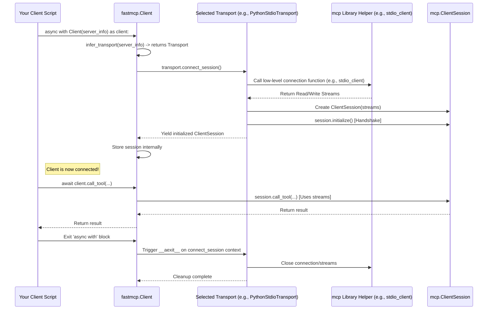

# Chapter 7: Transport

In the [previous chapter](06_client.md), we learned about the `fastmcp` **Client** – our "remote control" for interacting with a running [FastMCP Server](04_fastmcp_server.md). We saw how to use the `Client` object to call tools or read resources.

But we glossed over a crucial detail: *how* does the `Client` actually send its messages to the `Server`, and how does it get the responses back? What if the server is running locally as a simple script, or what if it's running as a web service? The communication method needs to match!

This is where the concept of **Transport** comes in.

## What Problem Does Transport Solve?

Imagine you have a remote control (`Client`) and a TV (`Server`). You need a way to connect them.

*   Maybe you use an **infrared (IR)** signal. That's one way to communicate.
*   Maybe you use a **Bluetooth** connection. That's a different way.
*   Maybe you use **Wi-Fi** and a phone app. Yet another way.

You need the *right kind of connection* for the remote control to work with the TV. You can't use an IR remote if the TV only understands Bluetooth.

Similarly, a `fastmcp` `Client` needs to know *how* the `Server` expects to communicate.

*   Is the server running as a simple Python script that the client should start and talk to via **standard input/output (stdio)**?
*   Is the server running as a web service using **WebSockets (WS)**?
*   Is the server running as a web service using **Server-Sent Events (SSE)**?
*   Is the server object running *in the same Python script* as the client (for testing)?

The **Transport** defines *which communication method* the `Client` should use to connect to the `Server`.

## What is a Transport?

Think of a **Transport** in `fastmcp` as the specific **type of cable or wireless signal** used to link the `Client` (remote control) to the `Server` (TV). It handles the low-level details of sending and receiving data using a particular method.

`fastmcp` provides different `ClientTransport` classes, each specializing in a different communication protocol:

*   **`PythonStdioTransport`**: Used when the server is a Python script (`.py` file) that the client should run and communicate with via its standard input and output streams. It's like connecting two programs with simple pipes.
*   **`SSETransport`**: Used to connect to a server running over HTTP using Server-Sent Events. This is common for web-based servers that need to push updates to the client. Think of it like a one-way radio broadcast *from* the server, but over the web.
*   **`WSTransport`**: Used to connect to a server running over the web using WebSockets. This allows for efficient, two-way communication, like a dedicated phone line between the client and server.
*   **`FastMCPTransport`**: A special transport for connecting a `Client` directly to a `Server` object *within the same Python process*. This is like plugging the remote control directly into the TV's circuit board – very fast, mainly used for testing.

The `Client` needs to be configured with the correct `Transport` based on how the `Server` is being run.

## Choosing the Right Transport (Client-Side)

Luckily, you usually don't have to *manually* create the `Transport` object yourself. When you create a `Client` instance, you typically pass it information about *how to find* the server, and the `Client` uses a helper function (`infer_transport`) to figure out the right `Transport` to use.

Let's revisit the `Client` examples from the [previous chapter](06_client.md) and see how the Transport was chosen implicitly:

**Example 1: Connecting via Python Stdio**

```python
# client_script_stdio.py
import asyncio
from fastmcp.client import Client

async def main():
    # We pass the PATH to the server script
    server_script_path = "adder_server.py"
    print(f"Client: Connecting to '{server_script_path}'...")

    # Client infers PythonStdioTransport because we passed a '.py' file path
    async with Client(server_script_path) as client:
        print("Client: Connected (using PythonStdioTransport implicitly)!")
        # ... call tools ...
        result = await client.call_tool("add", {"a": 1, "b": 2})
        print(f"Result: {result.content[0].text}")

# asyncio.run(main())
```

*   **Input to `Client()`:** `"adder_server.py"` (a string that is a path to a `.py` file)
*   **Inferred Transport:** `PythonStdioTransport`. The client knows it needs to run `python adder_server.py` and talk via stdin/stdout.

**Example 2: Connecting via Server-Sent Events (SSE)**

Imagine the server is running as a web service at `http://localhost:8000` using SSE.

```python
# client_script_sse.py
import asyncio
from fastmcp.client import Client

async def main():
    # We pass the URL of the SSE endpoint
    server_sse_url = "http://localhost:8000/mcp" # Example URL
    print(f"Client: Connecting to '{server_sse_url}'...")

    # Client infers SSETransport because we passed an 'http://' URL
    async with Client(server_sse_url) as client:
        print("Client: Connected (using SSETransport implicitly)!")
        # ... call tools ...
        result = await client.call_tool("add", {"a": 3, "b": 4})
        print(f"Result: {result.content[0].text}")

# asyncio.run(main())
```

*   **Input to `Client()`:** `"http://localhost:8000/mcp"` (a string starting with `http://`)
*   **Inferred Transport:** `SSETransport`. The client knows it needs to make an HTTP connection to this URL and communicate using the SSE protocol.

**Example 3: Connecting via WebSockets (WS)**

If the server was using WebSockets at `ws://localhost:8001/mcp`:

```python
# client_script_ws.py
import asyncio
from fastmcp.client import Client

async def main():
    # We pass the WebSocket URL
    server_ws_url = "ws://localhost:8001/mcp" # Example URL
    print(f"Client: Connecting to '{server_ws_url}'...")

    # Client infers WSTransport because we passed a 'ws://' URL
    async with Client(server_ws_url) as client:
        print("Client: Connected (using WSTransport implicitly)!")
        # ... call tools ...
        result = await client.call_tool("add", {"a": 5, "b": 6})
        print(f"Result: {result.content[0].text}")

# asyncio.run(main())
```

*   **Input to `Client()`:** `"ws://localhost:8001/mcp"` (a string starting with `ws://`)
*   **Inferred Transport:** `WSTransport`. The client knows it needs to establish a WebSocket connection.

**Example 4: Connecting In-Memory**

This was our first example in the [Client](06_client.md) chapter, where the client and server are in the same process.

```python
# client_script_inmemory.py
import asyncio
from fastmcp.client import Client
# Assume adder_server defines 'mcp' as the FastMCP object
from adder_server import mcp as server_instance

async def main():
    # We pass the actual FastMCP server OBJECT
    print(f"Client: Connecting directly to server object...")

    # Client infers FastMCPTransport because we passed a FastMCP server instance
    async with Client(server_instance) as client:
        print("Client: Connected (using FastMCPTransport implicitly)!")
        # ... call tools ...
        result = await client.call_tool("add", {"a": 7, "b": 8})
        print(f"Result: {result.content[0].text}")

# asyncio.run(main())
```

*   **Input to `Client()`:** `server_instance` (an actual `FastMCP` object)
*   **Inferred Transport:** `FastMCPTransport`. The client knows it can connect directly in memory.

So, the `Client` is smart enough to pick the right "cable" (Transport) based on what you tell it you want to connect to!

## The Server Side

The server also needs to use a matching transport to listen for connections.

*   When you run `fastmcp run your_server.py`, it defaults to using the **stdio** transport on the server side.
*   When you run `fastmcp run your_server.py --transport sse`, it uses the **SSE** transport on the server side (starting a web server).
*   If you were building a custom server integration (less common), you might use `fastmcp`'s underlying WebSocket server components.

The key is that the client's transport must match the server's listening method.

## Under the Hood: `ClientTransport` and `connect_session`

How does this work internally?

1.  **Abstraction:** There's a base class called `ClientTransport`. All specific transports (like `PythonStdioTransport`, `SSETransport`) inherit from this.
2.  **Core Method:** The most important method defined by `ClientTransport` is `connect_session`. This is an *asynchronous context manager* (you use it with `async with`).
3.  **Connection Logic:** When the `Client` starts (`async with Client(...)`), it calls `connect_session` on the chosen `Transport` object.
4.  **Specific Implementation:** Each transport type implements `connect_session` differently:
    *   `PythonStdioTransport.connect_session` starts the server script as a subprocess and uses helper functions from the underlying `mcp` library (`mcp.client.stdio.stdio_client`) to get communication streams connected to the subprocess's stdin/stdout.
    *   `SSETransport.connect_session` uses an HTTP client library (like `httpx`) and `mcp.client.sse.sse_client` to establish an SSE connection to the given URL and get communication streams.
    *   `WSTransport.connect_session` uses a WebSocket library and `mcp.client.websocket.websocket_client` to connect.
    *   `FastMCPTransport.connect_session` uses a special `mcp` function (`create_connected_server_and_client_session`) to create linked in-memory communication streams.
5.  **Session Object:** Once the connection is made and the streams are ready, `connect_session` creates and yields a `ClientSession` object (from the `mcp` library). This `ClientSession` handles the actual MCP message sending/receiving logic over the streams provided by the transport.
6.  **Client Uses Session:** The `Client` object receives this `ClientSession` and uses it internally to perform actions like `call_tool` or `read_resource`.

Here's a simplified view of the client connection process:



**Code Snippets (Simplified View):**

*   **Base Transport (`src/fastmcp/client/transports.py`)**:

    ```python
    # src/fastmcp/client/transports.py (simplified)
    import abc
    from contextlib import asynccontextmanager
    from mcp import ClientSession

    class ClientTransport(abc.ABC):
        @abc.abstractmethod
        @asynccontextmanager
        async def connect_session(self, **session_kwargs) -> AsyncIterator[ClientSession]:
            """Establishes connection and yields an active ClientSession."""
            raise NotImplementedError
            yield None # Required for type checking
    ```

*   **Python Stdio Transport (`src/fastmcp/client/transports.py`)**:

    ```python
    # src/fastmcp/client/transports.py (simplified PythonStdioTransport)
    from mcp.client.stdio import stdio_client, StdioServerParameters

    class PythonStdioTransport(StdioTransport): # Inherits from StdioTransport base
        # ... __init__ takes script_path, sets up command/args ...

        @asynccontextmanager
        async def connect_session(self, **session_kwargs) -> AsyncIterator[ClientSession]:
            server_params = StdioServerParameters(command=self.command, args=self.args)
            # Use low-level stdio_client from mcp library
            async with stdio_client(server_params) as transport:
                read_stream, write_stream = transport
                # Create session with the established streams
                async with ClientSession(read_stream, write_stream, **session_kwargs) as session:
                    await session.initialize() # MCP Handshake
                    yield session # Provide session to the Client object
    ```

*   **SSE Transport (`src/fastmcp/client/transports.py`)**:

    ```python
    # src/fastmcp/client/transports.py (simplified SSETransport)
    from mcp.client.sse import sse_client

    class SSETransport(ClientTransport):
        def __init__(self, url: str, ...):
            self.url = url
            # ... store headers etc. ...

        @asynccontextmanager
        async def connect_session(self, **session_kwargs) -> AsyncIterator[ClientSession]:
            # Use low-level sse_client from mcp library
            async with sse_client(self.url, headers=self.headers) as transport:
                read_stream, write_stream = transport
                 # Create session with the established streams
                async with ClientSession(read_stream, write_stream, **session_kwargs) as session:
                    await session.initialize() # MCP Handshake
                    yield session # Provide session to the Client object
    ```

The `Transport` acts as the bridge, handling the specific connection details and providing the standard `ClientSession` interface that the `Client` object uses, regardless of the underlying communication method.

## Conclusion

You've learned that **Transport** defines *how* a [Client](06_client.md) connects and communicates with a [FastMCP Server](04_fastmcp_server.md). It's like the specific cable or wireless signal linking them. We explored common transports like `PythonStdioTransport` (for local scripts), `SSETransport` / `WSTransport` (for web services), and `FastMCPTransport` (for in-memory testing).

Crucially, the `Client` usually infers the correct transport automatically based on how you tell it to find the server (script path, URL, or server object). The `Transport` handles the connection details and provides a consistent `ClientSession` for the `Client` to use.

This separation allows you to write your client code consistently, regardless of whether the server is running locally or over the network, just by changing how you initialize the `Client`.

Now that we understand how clients and servers connect, how can the server provide specific information or capabilities *during* a tool call? For example, how can a tool report progress or log messages back to the client? This is managed through the **Context** object.

[Next Chapter: Context](08_context.md)

---

Generated by [AI Codebase Knowledge Builder](https://github.com/The-Pocket/Tutorial-Codebase-Knowledge)