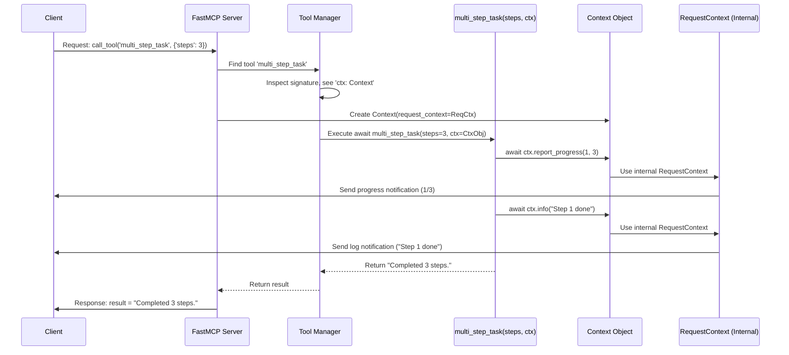

# Chapter 8: Context

Welcome to the final chapter on core `fastmcp` concepts! In the [previous chapter](07_transport.md), we explored how the `Client` and `Server` communicate using different **Transports** like stdio or SSE. Now, let's look inside a running `Server` function.

Imagine you've created a [Tool](01_tool.md) that performs a task which takes several steps, like processing a large file or making multiple web requests. While your tool function is running, wouldn't it be useful if it could:

*   Send updates back to the client, like "Processing step 1 of 5..."?
*   Log detailed messages (for debugging or information) that the client can see?
*   Access other information available on the server, like reading a configuration [Resource](02_resource.md)?

This is exactly what the **Context** object allows you to do.

## What is Context?

Think of the **Context** object as a special **"backstage pass"** or a **"control panel"** that `fastmcp` automatically gives to your function *while it's handling a specific request*. This pass grants the function temporary access to the server's capabilities related to the ongoing communication with the client.

Key features of the Context:

1.  **Automatic Injection:** You don't create the Context object yourself. If your Tool or Resource function signature includes a parameter with the type hint `Context`, `fastmcp` automatically creates and passes the correct Context object for that specific request when calling your function.
2.  **Request-Specific:** Each request gets its own Context object. Actions performed via the Context (like sending a log message) are tied to the specific client request being processed.
3.  **Provides Capabilities:** It offers methods to interact with the ongoing MCP session:
    *   Send log messages back to the client (`ctx.info()`, `ctx.debug()`, etc.).
    *   Report progress updates (`ctx.report_progress()`).
    *   Read other resources defined on the same server (`ctx.read_resource()`).
    *   Request the client's LLM to generate text (sampling) (`ctx.sample()`).

## Using Context in a Tool

Let's make our simple Tool concept a bit more interactive. Suppose we have a tool that simulates a multi-step task and wants to report its progress and log some messages.

**1. Define the Tool and Request Context**

First, define your tool function as usual, but add a parameter annotated with `Context`. The parameter name can be anything (commonly `ctx` or `context`), but the type hint `Context` is crucial.

```python
# examples/context_demo.py
import asyncio
from fastmcp import FastMCP, Context # Import Context

# Create server instance
mcp = FastMCP("ContextDemoServer")

# Define the tool, requesting Context via type hint
@mcp.tool()
async def multi_step_task(steps: int, ctx: Context) -> str:
    """
    Simulates a task with multiple steps, reporting progress and logging.
    """
    # We'll use 'ctx' inside this function
    await ctx.info(f"Starting multi-step task with {steps} steps.")

    # Simulate doing work... (details below)

    await ctx.info("Multi-step task finished successfully.")
    return f"Completed {steps} steps."

# (Code to run the server would go here, e.g., using the CLI)
# fastmcp run context_demo.py
```

**Explanation:**

*   `from fastmcp import Context`: We import the necessary `Context` class.
*   `async def multi_step_task(steps: int, ctx: Context) -> str:`: We define an asynchronous tool function. Crucially, we add `ctx: Context` as a parameter. `fastmcp` will see this and automatically provide the Context object when this tool is called.

**2. Sending Log Messages**

Inside your function, you can use methods like `ctx.info()`, `ctx.debug()`, `ctx.warning()`, and `ctx.error()` to send log messages back to the client that initiated the tool call.

```python
# Inside the multi_step_task function:
await ctx.info(f"Starting multi-step task with {steps} steps.")
if steps > 10:
    await ctx.warning("This might take a bit longer than usual.")
await ctx.debug("Initialization complete.") # Debug messages might only show if client requests them
```

**Explanation:**

*   `await ctx.info(...)`: Sends an informational message.
*   `await ctx.warning(...)`: Sends a warning message.
*   `await ctx.debug(...)`: Sends a debug message (often less visible by default).
*   `await ctx.error(...)`: Sends an error message (useful for reporting issues during execution).

These messages are sent *immediately* back to the client as notifications, they don't wait for the tool function to finish.

**3. Reporting Progress**

For tasks that take time, you can report progress using `ctx.report_progress()`. This allows the client (if it's designed to) to show a progress indicator.

```python
# Inside the multi_step_task function:
total_steps = steps
await ctx.info(f"Starting multi-step task with {total_steps} steps.")

for i in range(total_steps):
    current_step = i + 1
    await ctx.debug(f"Working on step {current_step}...")
    # Simulate doing some work for this step
    await asyncio.sleep(0.5) # Pause for half a second

    # Report progress (current value, total value)
    await ctx.report_progress(current_step, total_steps)

await ctx.info("Multi-step task finished successfully.")
return f"Completed {total_steps} steps."
```

**Explanation:**

*   `await ctx.report_progress(current_step, total_steps)`: Sends a progress update notification to the client, indicating that `current_step` out of `total_steps` are complete.

**4. Reading Resources**

If your tool needs access to data defined elsewhere on the *same* server as a [Resource](02_resource.md), it can use `ctx.read_resource()`.

```python
# Inside a tool function (assuming a resource "config://settings" exists)
try:
    # Read resource content using the context
    settings_content = await ctx.read_resource("config://settings")
    # settings_content is a list, access the first item's content
    settings_data = settings_content[0].content
    await ctx.info(f"Successfully read settings: {settings_data}")
    # ... use settings_data ...
except ResourceError as e:
    await ctx.error(f"Failed to read settings resource: {e}")
    # Handle error...
```

**Explanation:**

*   `await ctx.read_resource("config://settings")`: This tells the server to internally execute the logic for reading the resource identified by the URI `"config://settings"`. The result is returned *to the tool function*, not directly to the external client.

**5. (Advanced) Sampling from Client LLM**

The context also allows the *server* tool to ask the *client* (if it's an LLM client that supports this) to generate text. This is called sampling.

```python
# Inside a tool function:
await ctx.info("Asking the client's LLM for a suggestion...")
# Request the client LLM to complete the prompt
suggestion_response = await ctx.sample("Suggest a name for a pet snake.")
suggestion_text = suggestion_response.text
await ctx.info(f"Client LLM suggested: {suggestion_text}")
```

**Explanation:**

*   `await ctx.sample(...)`: Sends a request *back* to the client asking it to perform an LLM completion using the provided prompt. The client runs its LLM and sends the result back, which the tool receives. This requires specific client-side setup (see `examples/sampling.py`).

## Under the Hood: How Context is Provided

How does your tool function actually get this magical `Context` object?

1.  **Client Request:** A client sends a request, e.g., `call_tool('multi_step_task', {'steps': 3})`.
2.  **Server Receives:** The [FastMCP Server](04_fastmcp_server.md) receives the request.
3.  **Tool Lookup:** The server's `ToolManager` finds the registered `multi_step_task` function.
4.  **Signature Check:** Before calling the function, the `ToolManager` (specifically the `Tool` object wrapping the function) inspects its signature. It sees the parameter `ctx: Context`.
5.  **Context Creation:** The server knows a `Context` is needed. It retrieves the internal `RequestContext` associated with the current client session and request. It then creates a `fastmcp.Context` object, wrapping this internal `RequestContext`.
6.  **Function Call:** The `ToolManager` calls your actual Python function, passing the regular arguments (`steps=3`) and the newly created `Context` object for the `ctx` parameter: `multi_step_task(steps=3, ctx=the_context_object)`.
7.  **Context Usage:** When your function calls `await ctx.info("...")` or `await ctx.report_progress(...)`:
    *   The `Context` object's method (e.g., `info`) is executed.
    *   This method uses the *internal* `RequestContext` it holds.
    *   The `RequestContext` interacts with the underlying MCP server session to format and send the appropriate notification message (e.g., `log` or `progress`) back to the client over the established [Transport](07_transport.md).

**Sequence Diagram:**



**Code References (Simplified):**

*   **Context Class (`src/fastmcp/server/context.py`):** Defines the `Context` class and its methods (`log`, `info`, `report_progress`, `read_resource`, `sample`). These methods primarily delegate actions to the internal `_request_context`.

    ```python
    # src/fastmcp/server/context.py (simplified)
    class Context:
        # ... stores _request_context and _fastmcp instance ...
        async def report_progress(self, progress: float, total: float | None = None) -> None:
            # ... get progressToken from meta ...
            if progress_token:
                # Uses the underlying session from request_context
                await self.request_context.session.send_progress_notification(...)

        async def log(self, level, message, ...):
            # Uses the underlying session from request_context
            await self.request_context.session.send_log_message(...)

        async def info(self, message: str, ...): await self.log("info", message, ...)
        async def read_resource(self, uri):
            # Uses the _fastmcp instance to call its read_resource method
            return await self._fastmcp.read_resource(uri)
        # ... etc ...
    ```

*   **Context Creation (`src/fastmcp/server/server.py`):** The `FastMCP.get_context` method is responsible for creating the `Context` object, typically called just before invoking a tool.

    ```python
    # src/fastmcp/server/server.py (simplified get_context)
    class FastMCP:
        # ...
        def get_context(self) -> "Context":
            try:
                # Get the low-level request context if available
                request_context = self._mcp_server.request_context
            except LookupError:
                request_context = None
            from fastmcp.server.context import Context
            # Create our Context wrapper
            return Context(request_context=request_context, fastmcp=self)
    ```

*   **Tool Execution (`src/fastmcp/tools/tool_manager.py` and `src/fastmcp/tools/base.py`):** The `ToolManager` uses the `Tool` object's `run` method, which handles injecting the context if needed.

    ```python
    # src/fastmcp/tools/tool_manager.py (simplified call_tool)
    class ToolManager:
        async def call_tool(self, name: str, arguments: dict, context: Context):
             tool = self.get_tool(name)
             # Call the Tool object's run method, passing the context
             return await tool.run(arguments, context=context)

    # src/fastmcp/tools/base.py (simplified Tool.run)
    class Tool:
        async def run(self, arguments: dict, context: Context | None = None):
            # Prepare arguments for the function call
            kwargs = {}
            if self.context_kwarg is not None and context is not None:
                 kwargs[self.context_kwarg] = context # Add context if needed

            # Validate regular arguments and call the original function
            return await self.fn_metadata.call_fn_with_arg_validation(
                 self.fn, self.is_async, arguments, kwargs
            )
    ```

## Conclusion

The **Context** object is your function's dynamic link back to the `fastmcp` server and the client during a request. By simply adding a `ctx: Context` parameter to your tool or resource function, you gain the ability to send logs, report progress, read other server resources, and even trigger LLM sampling on the client side. It provides essential capabilities for building more interactive and informative server functions.

This concludes our tour of the core concepts in `fastmcp`: [Tool](01_tool.md)s, [Resource](02_resource.md)s, [Prompt](03_prompt.md)s, the [FastMCP Server](04_fastmcp_server.md), the [CLI](05_cli__command_line_interface_.md), the [Client](06_client.md), the [Transport](07_transport.md), and finally, the **Context**. With these building blocks, you're now equipped to start creating your own powerful MCP applications!

---

Generated by [AI Codebase Knowledge Builder](https://github.com/The-Pocket/Tutorial-Codebase-Knowledge)