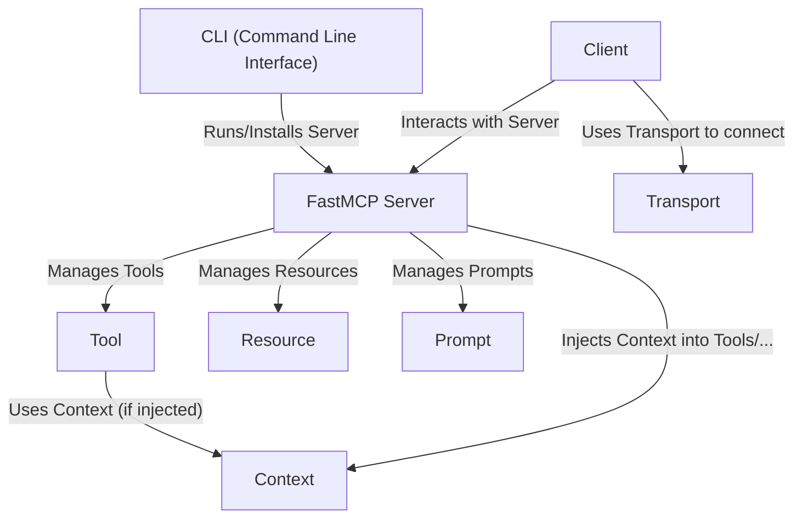

# Tutorial: fastmcp

**FastMCP** helps you create servers that *LLMs* (like Claude) or other programs can interact with.
Think of it like building a custom remote control for your applications.
You define **Tools** (actions the server can perform), **Resources** (data the server can provide), and **Prompts** (conversation templates) using simple Python decorators on your functions.
A **Client** can then connect to your **FastMCP Server** (using a specific **Transport**) to list and use these capabilities.
The **CLI** helps you run and manage these servers.

**Source Repository:** [https://github.com/jlowin/fastmcp](https://github.com/jlowin/fastmcp)

## Chapters

1. [Tool](01_tool.md)
2. [Resource](02_resource.md)
3. [Prompt](03_prompt.md)
4. [FastMCP Server](04_fastmcp_server.md)
5. [CLI (Command Line Interface)](05_cli__command_line_interface_.md)
6. [Client](06_client.md)
7. [Transport](07_transport.md)
8. [Context](08_context.md)

---

Generated by [AI Codebase Knowledge Builder](https://github.com/The-Pocket/Tutorial-Codebase-Knowledge)