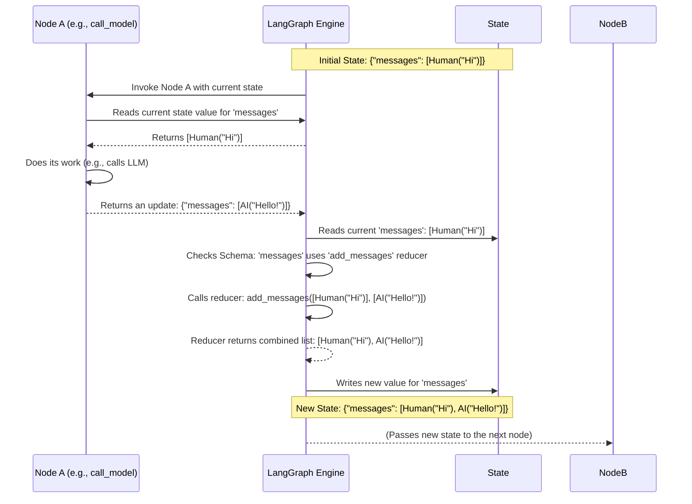

# Chapter 1: State Schema

Welcome to the LangGraph tutorial! We're excited to help you learn how to build powerful, stateful, multi-step applications with LLMs.

Think about building a simple chatbot. When you chat with it, the bot needs to remember what you've said previously to carry on a coherent conversation. This "memory" or shared information that changes over time is what we call **state** in LangGraph.

But how do we tell LangGraph *what* information to keep track of? That's where the **State Schema** comes in.

## What's the Problem?

In any process that involves multiple steps, the steps often need to share information.

*   A chatbot needs to remember the conversation history.
*   An agent using tools needs to know the original request, which tools it has decided to call, and the results of those calls.
*   A data analysis workflow might need to pass dataframes, summaries, and final plots between steps.

Without a defined structure for this shared information, things can get messy quickly. How does step B know what kind of data to expect from step A? How do we combine information if multiple steps try to update the same piece of data (like adding messages to a chat history)?

The **State Schema** solves this by acting as a blueprint for the shared data that flows through your LangGraph graph.

## What is a State Schema?

The State Schema defines the structure of the shared data (the **state**) that gets passed between the different steps (called **nodes**) in your graph. It's like defining the columns and data types for a database table, or the fields in a web form.

You typically define this schema using standard Python tools:

1.  **`TypedDict`**: A standard Python way to define dictionary-like structures with type hints for keys. It's simple and built-in.
2.  **Pydantic `BaseModel`**: A popular library for data validation and settings management. It offers more features like automatic data validation.

This schema tells LangGraph:

*   What pieces of information (keys) exist in the state (e.g., `messages`, `user_query`, `search_results`).
*   What type of data each key should hold (e.g., a list of messages, a string, a list of documents).
*   *Crucially*, how to update the data if multiple nodes try to write to the same key.

Let's look at a simple example from a chatbot agent.

```python
# From: libs/cli/examples/graphs/agent.py
from typing import Annotated, Sequence, TypedDict
from langchain_core.messages import BaseMessage
from langgraph.graph import add_messages

# --- State Schema Definition ---
class AgentState(TypedDict):
    # The 'messages' key holds a sequence (list) of BaseMessages.
    # The `Annotated` part tells LangGraph how to combine new messages
    # with existing ones: use the `add_messages` function.
    messages: Annotated[Sequence[BaseMessage], add_messages]
    # We could add more keys here if our agent needed to track other information
    # e.g., user_name: str
    # e.g., search_queries: list[str]
```

In this code:

1.  We define a class `AgentState` using `TypedDict`. This means our state will be a dictionary-like object.
2.  We specify one key: `messages`.
3.  The type hint `Sequence[BaseMessage]` tells us `messages` should hold a list of LangChain message objects.
4.  `Annotated[..., add_messages]` is the special part. `Annotated` allows us to add metadata. Here, we're telling LangGraph: "When a node returns a new value for `messages`, don't just replace the old list. Instead, use the `add_messages` function to combine the old list and the new value." The `add_messages` function (provided by LangGraph) intelligently appends new messages, or updates existing messages if they share the same ID.

This schema acts as the blueprint for the data record that each step in our agent workflow will operate on.

## How Updates Work: Reducers

The `add_messages` function we saw is an example of a **reducer**. A reducer is simply a function that takes two values (the current value in the state and the new value from a node's output) and returns a single, combined value.

You can define your own reducers! For example, if you wanted a counter that always increases:

```python
import operator
from typing import Annotated, TypedDict

class CounterState(TypedDict):
    # Use operator.add as a simple reducer to sum numbers
    count: Annotated[int, operator.add]

# If current state is {'count': 5}
# And a node returns {'count': 2}
# LangGraph will use operator.add(5, 2) to get 7
# The new state will be {'count': 7}
```

If you *don't* provide a reducer using `Annotated`, LangGraph defaults to a "last write wins" approach: the new value simply replaces the old value for that key.

```python
from typing import TypedDict

class SimpleState(TypedDict):
    # No reducer specified
    user_input: str
    last_tool_output: str

# If current state is {'user_input': 'Hello', 'last_tool_output': 'Weather is sunny'}
# And a node returns {'last_tool_output': 'Search results found'}
# The new state will be {'user_input': 'Hello', 'last_tool_output': 'Search results found'}
# The old 'last_tool_output' is replaced.
```

## Defining the Graph with the Schema

Once you have your State Schema defined, you pass it to the `StateGraph` constructor when you create your graph:

```python
# From: libs/cli/examples/graphs/agent.py

# Define the schema (as shown before)
class AgentState(TypedDict):
    messages: Annotated[Sequence[BaseMessage], add_messages]

# Define a new graph using this schema
workflow = StateGraph(AgentState)

# Now we can add nodes and edges that operate on this state structure
# (We'll cover nodes and edges in the next chapter)
# workflow.add_node(...)
# workflow.add_edge(...)
```

This tells the `workflow` instance what structure to expect for its shared state and how to manage updates to that state according to the schema and any reducers defined within it.

## Under the Hood: How State Flows

Let's visualize the process conceptually when a node runs and updates the state.



**Key Steps:**

1.  **Node Executes:** A node in the graph runs. It might read parts of the current state.
2.  **Node Returns Update:** The node finishes and returns a dictionary containing *updates* for specific keys in the state (e.g., `{"messages": [AIMessage(...)]}`).
3.  **LangGraph Intercepts:** The LangGraph engine receives this update dictionary.
4.  **Check Schema & Reduce:** For each key in the update dictionary:
    *   It looks at the State Schema.
    *   If `Annotated` specifies a reducer (like `add_messages` for the `messages` key), LangGraph calls the reducer function, passing it the *current* value from the state and the *new* value from the node's update. The reducer's return value becomes the new value for that key.
    *   If no reducer is specified, the value from the node's update simply overwrites the current value in the state.
5.  **State Updated:** LangGraph updates its internal state record with the new values.
6.  **Pass to Next Node:** This updated state is then passed to the next node(s) in the graph.

The State Schema is defined when you instantiate `StateGraph` (see `langgraph/graph/state.py`). LangGraph parses this schema (using helper functions like `_get_channels`) to understand the keys, their types, and any associated reducers (often derived from the `Annotated` metadata using standard Python introspection). When processing updates, it refers back to this parsed schema information to decide whether to replace a value or combine it using a reducer.

## Conclusion

The **State Schema** is the foundation for managing shared information in LangGraph. It provides a clear structure (`TypedDict` or Pydantic `BaseModel`) for the data that flows through your graph and allows you to define custom logic (`Annotated` with reducers like `add_messages`) for how updates to the state should be combined.

By defining a schema, you make your graph's data flow predictable and robust.

Now that we understand how to define the *data* that flows through our graph, let's move on to defining the *steps* that operate on this data. In the next chapter, we'll explore **[Nodes & Edges](02_nodes___edges.md)**.

---

Generated by [AI Codebase Knowledge Builder](https://github.com/The-Pocket/Tutorial-Codebase-Knowledge)