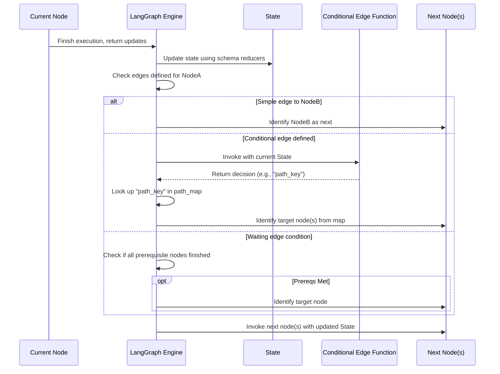

# Chapter 2: Nodes & Edges

In [Chapter 1: State Schema](01_state_schema.md), we learned how to define the *structure* of the shared information (the **state**) that flows through our LangGraph application. That's like designing the layout of data in a shared notebook.

But how do we define the *steps* that read from and write to this notebook? How do we tell LangGraph which step should run after another?

That's where **Nodes** and **Edges** come in. They are the fundamental building blocks that define the *actions* and the *flow* of your LangGraph workflow.

## What's the Problem?

Imagine you're building a simple research assistant. When you ask it a question, it might need to:

1.  **Understand the Question:** Call a Language Model (LLM) to rephrase or analyze the query.
2.  **Decide:** Should it search the web or just answer from its knowledge?
3.  **Act:** Either call a web search tool or call the LLM again to generate an answer.
4.  **Respond:** Format the final answer.

Each of these is a distinct step. Some steps always follow others (like understanding before deciding), while others depend on a decision (searching vs. answering). We need a way to represent these steps and the connections between them.

## Nodes: The Workhorses

A **Node** in LangGraph represents a single unit of work or computation. Think of it as a specific task or function in your workflow. This could be:

*   Calling an LLM.
*   Running a specific tool (like a web search).
*   Executing any custom Python function you write.

Each node typically receives the current **state** (remember our shared notebook from Chapter 1?), performs its task, and can return updates to that state.

**Analogy:** If your workflow is a building, nodes are the individual **rooms** where specific activities happen (e.g., the "LLM Thinking Room", the "Web Search Room").

### Adding a Node

You add nodes to your graph using the `add_node` method. You give each node a unique name (a string) and provide the function or [LangChain Runnable](https://python.langchain.com/v0.2/docs/concepts/#runnables) that performs the node's work.

Let's create a simple node function and add it to a graph. We'll assume we have the `AgentState` defined in Chapter 1.

```python
from typing import TypedDict, Annotated, Sequence
from langchain_core.messages import BaseMessage, HumanMessage, AIMessage
from langgraph.graph import StateGraph, add_messages

# Define our state from Chapter 1
class AgentState(TypedDict):
   messages: Annotated[Sequence[BaseMessage], add_messages]

# Create the graph instance, telling it about our state structure
workflow = StateGraph(AgentState)

# --- Define a Node Function ---
# This function represents a step in our graph.
# It takes the current state (AgentState) as input.
def call_model(state: AgentState):
    # It reads the messages from the state.
    messages = state["messages"]
    # In a real app, this would call an LLM. Here, we'll just simulate it.
    print("--- Calling Model ---")
    response = AIMessage(content="Hi! How can I help you today?")
    # It returns a dictionary with updates to the state.
    # The key ('messages') must match a key in AgentState.
    # LangGraph will use the 'add_messages' reducer (from AgentState)
    # to append this new message.
    return {"messages": [response]}

# --- Add the Node to the Graph ---
# We give it a name ("model") and the function it should execute (call_model).
workflow.add_node("model", call_model)

# We haven't defined the flow yet (edges), so this graph doesn't do much!
```

In this example:

1.  We define a Python function `call_model` that takes the current `AgentState` dictionary.
2.  Inside the function, we simulate calling an LLM and getting a response.
3.  Crucially, the function returns a dictionary `{"messages": [response]}`. This tells LangGraph: "Update the `messages` key in the state with this new list containing the AI response." Because `messages` in our `AgentState` is annotated with `add_messages`, LangGraph knows to *append* this message, not just replace the whole list.
4.  `workflow.add_node("model", call_model)` registers this function as a node named "model".

## Edges: The Connections

Now that we have rooms (Nodes), we need hallways (Edges) to connect them! An **Edge** defines a directed link between two nodes, specifying the path of execution.

**Analogy:** Edges are the **hallways** in our building, telling you which room to go to next after you finish in the current room.

There are a few types of edges:

1.  **Entry Point Edge:** Specifies the *first* node to run when the graph starts. You connect the special `START` node to your first operational node.
2.  **Normal Edges:** Connect one node directly to another. When the first node finishes, the second one starts.
3.  **Finish Point Edge:** Specifies a node that, when finished, should end the graph's execution. You connect this node to the special `END` node.
4.  **Conditional Edges:** More complex hallways with signs! These allow the graph to branch, choosing the *next* node based on the current state.

### Adding Normal Edges

You use `add_edge(start_node_name, end_node_name)` to create a simple, direct connection.

Let's add another simple node and connect them:

```python
# (Continuing from the previous example)
import random

# --- Define another Node Function ---
def custom_logic(state: AgentState):
    print("--- Running Custom Logic ---")
    # Maybe add some internal thought or log
    thought = AIMessage(content=f"Thinking step {random.randint(1,10)} complete.")
    return {"messages": [thought]} # Append the thought

# --- Add the second node ---
workflow.add_node("logic", custom_logic)

# --- Define the Flow using Edges ---

# 1. Set the entry point: When the graph starts, run the "model" node first.
workflow.set_entry_point("model")
# This is equivalent to: workflow.add_edge(START, "model")

# 2. Connect "model" to "logic": After "model" finishes, run "logic".
workflow.add_edge("model", "logic")

# 3. Set the finish point: After "logic" finishes, end the graph execution.
workflow.set_finish_point("logic")
# This is equivalent to: workflow.add_edge("logic", END)

# --- Compile and Run (Optional Preview) ---
# We'll cover compilation in detail later, but let's see it work
app = workflow.compile()
initial_state = {"messages": [HumanMessage(content="Hello!")]}
final_state = app.invoke(initial_state)

# Expected Print Output:
# --- Calling Model ---
# --- Running Custom Logic ---

# Expected Final State (order might vary slightly due to internal processing):
# {'messages': [
#    HumanMessage(content='Hello!'),
#    AIMessage(content='Hi! How can I help you today?'),
#    AIMessage(content='Thinking step X complete.') # X is random
# ]}
```

Here, we defined a simple linear flow: `START` -> `model` -> `logic` -> `END`.

### Adding Conditional Edges

Workflows often need to make decisions. Should we call a tool? Should we ask the user for clarification? Should we loop back to the model?

**Conditional Edges** handle this branching. They use a function (the *condition*) that inspects the current state and decides which node(s) should run next.

**Analogy:** Imagine a hallway (`source_node`) leading to a junction with a signpost (`condition_function`). The signpost reads the current situation (`state`) and points you down different hallways (`path_map`) based on what it reads.

You add conditional edges using `add_conditional_edges`. You provide:

1.  `source`: The name of the node *after which* the decision should be made.
2.  `path`: A function that takes the state and returns a string (or list of strings). This string tells LangGraph which path to take. The returned string MUST match one of the keys in the `path_map`.
3.  `path_map`: A dictionary mapping the possible return values of the `path` function to the names of the *next* nodes to execute. You can also map to the special `END` node to finish execution.

Let's modify our example to add a decision:

```python
# (Continuing from the previous example, redefine the graph slightly)

workflow = StateGraph(AgentState)

# --- Nodes ---
workflow.add_node("model", call_model)
workflow.add_node("logic", custom_logic)
# Add a dummy tool node
def call_tool(state: AgentState):
    print("--- Calling Tool ---")
    # Simulate tool result
    tool_output = AIMessage(content="Tool X finished.")
    return {"messages": [tool_output]}
workflow.add_node("tool", call_tool)

# --- Condition Function ---
# This function decides the next step based on the state.
def should_continue(state: AgentState):
    # Inspect the most recent message
    last_message = state["messages"][-1]
    # If the LLM mentions help, let's use our custom logic node
    if "help" in last_message.content.lower():
        print("--- Deciding: Use Logic ---")
        return "continue_logic"
    # Otherwise, maybe use a tool (just an example decision)
    else:
        print("--- Deciding: Use Tool ---")
        return "continue_tool"

# --- Edges ---
# Start with the model
workflow.set_entry_point("model")

# After the model runs, make a decision using 'should_continue'
workflow.add_conditional_edges(
    "model", # The node providing the output
    should_continue, # The function to run to decide
    {
        # If should_continue returns "continue_logic", go to the "logic" node
        "continue_logic": "logic",
        # If should_continue returns "continue_tool", go to the "tool" node
        "continue_tool": "tool"
    }
)

# After logic or tool runs, end the graph
workflow.add_edge("logic", END)
workflow.add_edge("tool", END)

# --- Compile and Run (Optional Preview) ---
app = workflow.compile()
initial_state = {"messages": [HumanMessage(content="Hello!")]}
final_state = app.invoke(initial_state)

# Expected Print Output (because "help" is in the model's response):
# --- Calling Model ---
# --- Deciding: Use Logic ---
# --- Running Custom Logic ---

# Expected Final State:
# {'messages': [
#    HumanMessage(content='Hello!'),
#    AIMessage(content='Hi! How can I help you today?'),
#    AIMessage(content='Thinking step X complete.') # X is random
# ]}

# If the model's response didn't contain "help", the output would involve "--- Calling Tool ---" instead.
```

In this version:

1.  After the `model` node runs, the `should_continue` function is executed.
2.  `should_continue` looks at the last message in the state.
3.  Based on the message content, it returns either `"continue_logic"` or `"continue_tool"`.
4.  LangGraph uses the `path_map` provided in `add_conditional_edges` to determine the next node: `"logic"` or `"tool"`.
5.  Finally, both `"logic"` and `"tool"` are connected to `END`.

This allows our graph to dynamically change its behavior based on the evolving state!

## Under the Hood: How Flow Works

When you compile and run a LangGraph graph (which we'll cover more in [Chapter 3: StateGraph / Graph](03_stategraph___graph.md) and [Chapter 4: Pregel Execution Engine](04_pregel_execution_engine.md)), the engine manages the execution flow based on the nodes and edges you've defined.

1.  **Start:** Execution begins at the node connected to `START`.
2.  **Node Execution:** The function associated with the current node is called with the current state.
3.  **State Update:** The node returns updates, and LangGraph updates the state according to the [State Schema](01_state_schema.md).
4.  **Edge Traversal:** LangGraph looks at the edges originating from the node that just finished:
    *   **Simple Edge:** If there's a simple `add_edge` connection, the engine moves to the specified next node.
    *   **Conditional Edge:** If there's an `add_conditional_edges` connection, the engine calls the condition function with the *updated* state. The function's return value is used with the `path_map` to determine the next node(s).
    *   **Waiting Edge (Multiple Inputs):** If a node has multiple incoming edges defined via `add_edge(["node_a", "node_b"], "node_c")`, the engine waits until *all* specified incoming nodes (`node_a`, `node_b`) have finished before executing the target node (`node_c`). We'll see more complex state merging later.
5.  **Repeat:** The process repeats from Step 2 with the next node.
6.  **End:** Execution stops when a node connected to `END` finishes, or when a conditional edge explicitly directs to `END`.

Here's a simplified view of the decision process after a node runs:



Internally, `StateGraph` (in `langgraph/graph/state.py`) builds upon the basic `Graph` structure (in `langgraph/graph/graph.py`). When you call `add_node`, `add_edge`, or `add_conditional_edges`, the graph stores these definitions, usually in dictionaries or sets, mapping node names to their functions/runnables and tracking the connections. Conditional logic is often represented by `Branch` objects (`langgraph/graph/branch.py`) which bundle the condition function and the path mapping. The compilation process then transforms this definition into an executable plan used by the Pregel engine.

## Conclusion

**Nodes** are the building blocks of computation in LangGraph – the functions or steps that do the work. **Edges** are the connections that define the flow of execution between these nodes.

*   **`add_node(name, function)`:** Defines a step.
*   **`add_edge(start, end)`:** Defines a simple, direct transition. (`set_entry_point` and `set_finish_point` are helpers for `START` and `END`).
*   **`add_conditional_edges(start, condition_func, path_map)`:** Defines decision points where the next step depends on the current state.

By combining nodes and edges, you can define complex, stateful workflows. You've now learned how to define *what* data your graph manages ([State Schema](01_state_schema.md)) and the *structure* of the workflow itself (Nodes & Edges).

In the next chapter, we'll look more closely at the `StateGraph` class itself and how it brings the state schema, nodes, and edges together before we compile and run our graph. Let's dive into [Chapter 3: StateGraph / Graph](03_stategraph___graph.md).

---

Generated by [AI Codebase Knowledge Builder](https://github.com/The-Pocket/Tutorial-Codebase-Knowledge)