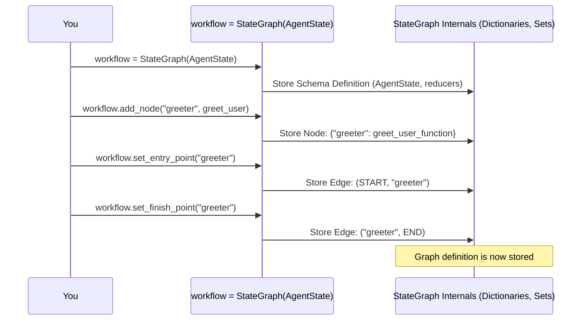

# Chapter 3: StateGraph / Graph

In [Chapter 1: State Schema](01_state_schema.md), we learned how to define the *data* (the **state**) that flows through our application. In [Chapter 2: Nodes & Edges](02_nodes___edges.md), we learned how to define the individual *steps* (the **nodes**) and the *connections* between them (the **edges**).

But how do we bring all these pieces together? We need a central place to hold the definition of our state, add our nodes, and connect them with edges.

That's exactly what the `StateGraph` class does!

## What's the Problem?

Imagine you have the blueprints for different rooms (Nodes) and sketches of the hallways connecting them (Edges). You also have a plan for the type of information that needs to be available throughout the building (State Schema).

How do you combine these into a single, coherent master plan for the entire building? You need something that understands the overall structure, knows which rooms exist, how they are connected, and what kind of information (state) they share.

Without a central coordinator, it would be difficult to manage the workflow, ensure nodes get the right data, and follow the correct paths.

## What is `StateGraph`?

`StateGraph` is the main class you'll use to build your LangGraph applications. Think of it as the **master blueprint** or the **workflow definition**.

*   It holds the **State Schema** you defined in Chapter 1, so it knows what the shared data looks like and how to update it.
*   It provides methods like `add_node` and `add_edge` (which you saw in Chapter 2) to define the computational steps and their connections.
*   It essentially acts as a container that brings together the state definition, the nodes, and the edges into a complete workflow specification.

**Analogy:** If your workflow is a building project, `StateGraph` is the **architect's master plan**. It contains the floor layout (State Schema), the room designs (Nodes), and the hallway connections (Edges).

### Creating a StateGraph

You start by creating an instance of `StateGraph`, passing in the State Schema class you defined earlier.

Let's use the `AgentState` from our previous examples:

```python
# From Chapter 1: State Schema
from typing import Annotated, Sequence, TypedDict
from langchain_core.messages import BaseMessage
from langgraph.graph import StateGraph, add_messages

# Define the state structure
class AgentState(TypedDict):
   messages: Annotated[Sequence[BaseMessage], add_messages]

# --- Create the StateGraph instance ---
# We tell the StateGraph what our shared state looks like by passing AgentState.
workflow = StateGraph(AgentState)

print("StateGraph created!")
# Expected Output: StateGraph created!
```

This simple line creates our `workflow` object. Now, this object knows that the state it manages will be a dictionary with a `messages` key, and it knows to use the `add_messages` reducer when updating that key.

### Adding Nodes and Edges to the Graph

Now that we have our `workflow` object (our master plan), we use its methods to add the nodes and edges we defined in Chapter 2.

Let's put together a minimal example:

```python
# (Continuing from above)
from langchain_core.messages import HumanMessage, AIMessage
from langgraph.graph import START, END # Import START and END

# --- Define a simple node function (from Chapter 2) ---
def greet_user(state: AgentState):
    print("--- Node: greet_user ---")
    last_message = state["messages"][-1]
    response_content = f"Hello back to you! You said: {last_message.content}"
    return {"messages": [AIMessage(content=response_content)]}

# --- Add the node TO THE WORKFLOW object ---
workflow.add_node("greeter", greet_user)
print("Node 'greeter' added.")

# --- Add edges TO THE WORKFLOW object ---
# 1. Entry point: Start at the 'greeter' node
workflow.set_entry_point("greeter")
print("Entry point set to 'greeter'.")

# 2. Finish point: End after the 'greeter' node
workflow.set_finish_point("greeter")
# Equivalent to: workflow.add_edge("greeter", END)
print("Finish point set to 'greeter'.")

# Now, the 'workflow' object contains the full definition:
# - State Schema: AgentState
# - Nodes: "greeter"
# - Edges: START -> "greeter", "greeter" -> END
```

Notice how we use the *methods* of the `workflow` object (`workflow.add_node`, `workflow.set_entry_point`, `workflow.set_finish_point`). The `StateGraph` instance is where we assemble our entire graph definition.

## `Graph` vs. `StateGraph`

You might notice there's also a base `Graph` class in LangGraph (`langgraph.graph.graph.Graph`). `StateGraph` is actually a specialized version (a subclass) of `Graph`.

*   **`Graph`:** Provides the fundamental ability to define nodes and edges. It's like a basic flowchart diagram tool. It doesn't inherently know about or manage a shared "state" object in the same way `StateGraph` does.
*   **`StateGraph`:** Inherits all the node/edge capabilities from `Graph` but *adds* the crucial layer of **state management**. It requires a State Schema and ensures that nodes receive the state, return updates, and that these updates are merged according to the schema's rules (like our `add_messages` reducer).

For most common use cases like agents, chatbots, or multi-step processes where information needs to be passed and updated between steps, **you'll almost always use `StateGraph`**. It provides the necessary structure for stateful workflows.

## Under the Hood: How `StateGraph` Stores Definitions

When you call methods like `StateGraph(AgentState)`, `workflow.add_node(...)`, or `workflow.add_edge(...)`, the `StateGraph` object isn't running anything yet. It's simply *storing* these definitions internally.

*   The State Schema (`AgentState`) is analyzed and stored, often parsing the keys and any associated reducers (`add_messages`).
*   Nodes are stored, typically in a dictionary mapping the node name (e.g., `"greeter"`) to the function or runnable that executes the node's logic (e.g., `greet_user`).
*   Edges are stored, usually in a set or list, tracking the connections between node names (e.g., `(START, "greeter")`, `("greeter", END)`). Conditional edges are stored along with their condition functions and path maps.

Think of it like the architect drawing the rooms and hallways onto the master plan.



This stored definition is just a blueprint. To actually *run* the workflow, you need to **compile** the `StateGraph`. Compilation takes this blueprint and creates an executable engine (which we'll cover in the next chapter).

Looking at the source code:
*   The `StateGraph` class is defined in `langgraph/graph/state.py`. You can see how it initializes and stores the schema.
*   It inherits from `Graph` in `langgraph/graph/graph.py`, which contains the basic `add_node` and `add_edge` logic that stores nodes in `self.nodes` (a dictionary) and edges in `self.edges` (a set).
*   `StateGraph` enhances this by understanding the state schema and how nodes interact with it. When you `compile()` a `StateGraph`, it uses this stored information (schema, nodes, edges) to build the execution logic.

```python
# Simplified snippet from langgraph/graph/state.py
class StateGraph(Graph):
    # ... (other attributes like channels, managed)

    def __init__(self, state_schema, config_schema=None, ...):
        super().__init__()
        # Stores the schema and parses it
        self.schema = state_schema
        self._add_schema(state_schema)
        # ... (rest of initialization)

    # Simplified snippet from langgraph/graph/graph.py
    # (StateGraph inherits this)
    def add_node(self, node, action=None, ...):
        # ... (validation)
        # Stores the node name and its runnable action
        self.nodes[node_name] = NodeSpec(runnable=coerce_to_runnable(action), ...)
        return self

    def add_edge(self, start_key, end_key):
        # ... (validation)
        # Stores the edge connection
        self.edges.add((start_key, end_key))
        return self

    def compile(self, ...):
        # ... (validation)
        # Creates the CompiledGraph object using self.nodes, self.edges, self.channels etc.
        compiled = CompiledStateGraph(builder=self, nodes={}, channels={...}, ...)
        # ... (attaches nodes and edges to the compiled graph)
        return compiled.validate()
```

## Conclusion

The `StateGraph` is the central orchestrator for defining your LangGraph workflows. It ties together:

1.  The **State Schema** (what data flows through).
2.  The **Nodes** (what steps are performed).
3.  The **Edges** (how the flow proceeds between steps).

You instantiate `StateGraph` with your schema and then use its methods (`add_node`, `add_edge`, `add_conditional_edges`, etc.) to build the complete definition of your graph.

This definition acts as a blueprint. It doesn't *run* the workflow itself, but it holds all the necessary information. To bring this blueprint to life, we need an execution engine.

In the next chapter, we'll explore the engine that actually runs the graphs you define: the [Pregel Execution Engine](04_pregel_execution_engine.md).

---

Generated by [AI Codebase Knowledge Builder](https://github.com/The-Pocket/Tutorial-Codebase-Knowledge)