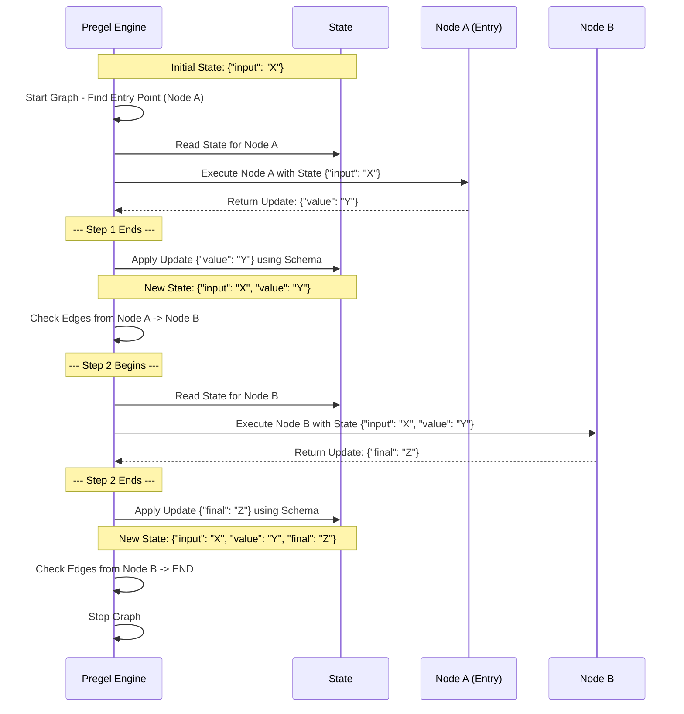
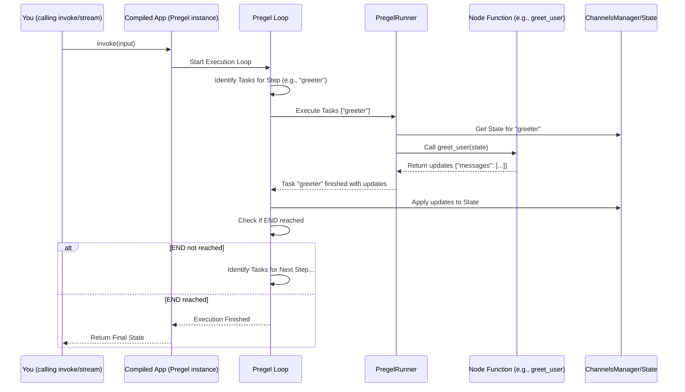

# Chapter 4: Pregel Execution Engine

In the previous chapters, we learned how to define the shared data ([State Schema](01_state_schema.md)), the steps ([Nodes & Edges](02_nodes___edges.md)), and how to bring them together into a complete blueprint using [StateGraph / Graph](03_stategraph___graph.md).

We have our architect's plan (`StateGraph`), but how does the building actually get built? How do the workers (nodes) know when to start, what materials (state) to use, and how to coordinate their efforts? We need a construction manager, a conductor for our orchestra!

## What's the Problem?

You've defined a beautiful graph with nodes representing tasks and edges showing the flow. But how does LangGraph actually *run* this?

*   How does it know which node to start with?
*   When multiple nodes *could* run, how does it decide? Can they run at the same time?
*   When a node finishes and updates the state, how does the system make sure the update is applied correctly before the *next* node reads it?
*   How does it handle loops and complex decision-making?

Simply defining the graph isn't enough; we need a runtime system to execute it reliably and efficiently.

## What is the Pregel Execution Engine?

The **Pregel Execution Engine** is the heart of LangGraph's runtime. It's the invisible engine that takes your `StateGraph` definition (the blueprint) and brings it to life, running the nodes step-by-step.

Think of it like the **conductor of an orchestra**. Your `StateGraph` is the sheet music, defining all the parts (nodes), the flow (edges), and the shared melody (state). The Pregel engine is the conductor, ensuring each musician (node) plays their part at the right time, managing the tempo, and making sure everything sounds harmonious according to the music.

It's based on an algorithm inspired by Google's Pregel paper, which uses a model called **Bulk Synchronous Parallel (BSP)**. Don't worry too much about the name! The key idea is executing the graph in **steps (or "supersteps")**:

1.  **Read:** Nodes read the current state.
2.  **Compute:** Nodes perform their work (e.g., call an LLM, run a tool).
3.  **Write:** Nodes write their updates back.

Crucially, the updates from one step are only visible to nodes in the *next* step. This keeps the state consistent during each step, even if nodes run in parallel.

## How it Works (Conceptual Steps)

When you `compile()` your `StateGraph` and then call `invoke()` or `stream()`, the Pregel engine takes over behind the scenes. Here's a simplified view of what happens:

1.  **Start:** The engine looks at your graph definition and finds the entry point (the node connected to `START`).
2.  **Step 1 Begins:**
    *   **Identify Tasks:** The engine identifies the entry node(s) as the tasks for this step.
    *   **Execute Tasks:** It runs the function associated with the entry node(s), passing the current state. (If multiple nodes could run, Pregel can potentially run them concurrently).
    *   **Collect Updates:** It gathers the updates returned by the finished node(s) (e.g., `{"messages": [AIMessage(...)]}`).
3.  **Step 1 Ends / State Update:**
    *   The engine takes all collected updates.
    *   It uses the [State Schema](01_state_schema.md) (and its reducers like `add_messages`) to merge these updates into the main state.
4.  **Step 2 Begins:**
    *   **Identify Tasks:** The engine looks at the nodes that just finished. It follows the [Edges](02_nodes___edges.md) (simple or conditional) defined for those nodes to determine which node(s) should run *next*.
    *   **Execute Tasks:** It runs the function(s) for the newly identified node(s) with the *updated* state from Step 1.
    *   **Collect Updates:** It gathers the updates from these nodes.
5.  **Step 2 Ends / State Update:**
    *   Updates are merged into the state using the schema rules.
6.  **Repeat:** The engine continues identifying tasks, executing them, and updating the state in steps.
7.  **End:** The process stops when a node connected to `END` finishes, or a conditional edge directs the flow to `END`.

Let's visualize two simple steps:



## Using the Engine (Implicitly)

The good news is that you usually **don't interact directly** with the Pregel engine object (`langgraph.pregel.Pregel`). It's an internal mechanism.

Your interaction happens through the `StateGraph` object you defined:

1.  **Compile:** You call `workflow.compile()`. This takes your `StateGraph` definition (nodes, edges, state schema) and creates an executable instance powered by the Pregel engine.
2.  **Invoke/Stream:** You call methods like `app.invoke(input)` or `app.stream(input)` on the *compiled* object (`app`). These methods trigger the underlying Pregel engine to run the steps described above.

Let's revisit our simple graph from [Chapter 3: StateGraph / Graph](03_stategraph___graph.md):

```python
# (Assuming AgentState, greet_user node are defined as before)
from langgraph.graph import StateGraph, START, END
from langchain_core.messages import HumanMessage

# Define the state structure (from Chapter 1)
class AgentState(TypedDict):
   messages: Annotated[Sequence[BaseMessage], add_messages]

# Define a simple node function (from Chapter 2)
def greet_user(state: AgentState):
    print("--- Node: greet_user ---")
    # ... (node logic)
    response_content = f"Hello back!"
    return {"messages": [AIMessage(content=response_content)]}

# Create the StateGraph instance (from Chapter 3)
workflow = StateGraph(AgentState)

# Add node and edges
workflow.add_node("greeter", greet_user)
workflow.set_entry_point("greeter")
workflow.set_finish_point("greeter") # Connects "greeter" to END

# --- Using the Pregel Engine (Implicitly) ---

# 1. Compile the graph definition into an executable app
# This creates the Pregel engine instance internally.
print("Compiling graph...")
app = workflow.compile()
print("Graph compiled!")

# 2. Invoke the app
# This tells the underlying Pregel engine to run the graph.
print("Invoking app...")
initial_state = {"messages": [HumanMessage(content="Hi")]}
final_state = app.invoke(initial_state)
print("App finished.")
print("Final State:", final_state)

# Expected Output:
# Compiling graph...
# Graph compiled!
# Invoking app...
# --- Node: greet_user ---
# App finished.
# Final State: {'messages': [HumanMessage(content='Hi'), AIMessage(content='Hello back!')]}
```

When you call `workflow.compile()`, LangGraph creates a `Pregel` instance configured with your nodes, edges, channels (derived from the state schema), etc. When you call `app.invoke()`, the `Pregel` instance's execution loop (`tick`) runs, orchestrating the steps we discussed.

## Under the Hood

The core implementation lives in `langgraph.pregel`.

*   **`Pregel` class (`langgraph/pregel/__init__.py`):** This is the main class representing the compiled, executable graph. It holds the configuration (nodes, channels, etc.) and provides the `invoke`, `stream`, `astream` methods. It doesn't contain the step-by-step logic itself but sets up and manages the execution loop.
*   **`PregelLoop` / `SyncPregelLoop` / `AsyncPregelLoop` (`langgraph/pregel/loop.py`):** These classes contain the main `tick()` method that implements the Bulk Synchronous Parallel steps. It manages the current state (`checkpoint`), identifies tasks for the current step (`prepare_next_tasks`), runs them using a `PregelRunner`, applies updates (`apply_writes`), and determines when to stop.
*   **`ChannelsManager` / `AsyncChannelsManager` (`langgraph/pregel/manager.py`):** Handles access to the channel values (state) for the nodes during execution, ensuring nodes read the correct version of the state for the current step.
*   **`PregelRunner` (`langgraph/pregel/runner.py`):** Responsible for actually executing the node functions (potentially concurrently) identified by the `PregelLoop` for a given step. It handles retries and manages the execution lifecycle of individual node calls.

Here's a simplified view of the interaction during one step:



The engine handles details like:

*   **Concurrency:** Running multiple nodes in the same step in parallel if possible.
*   **State Consistency:** Ensuring updates from one step are fully applied before the next step begins.
*   **Error Handling:** Catching errors in nodes and managing the graph state.
*   **Interrupts:** Pausing execution at specific points if configured.
*   **Persistence:** Working with [Checkpointers](06_checkpointers.md) to save and resume the graph state (covered later).

## Conclusion

The **Pregel Execution Engine** is the powerful runtime that executes the `StateGraph` you define. It works step-by-step, managing state updates and concurrency based on the Bulk Synchronous Parallel model.

You don't typically interact with it directly, but understanding its role helps grasp how LangGraph runs your complex workflows. By calling `compile()` on your `StateGraph`, you create this engine, and `invoke()` or `stream()` sets it in motion.

Now that we understand how graphs are defined and executed, let's look at some specialized tools LangGraph provides to make building common patterns easier. In the next chapter, we'll explore a powerful built-in node type for integrating tools: [ToolNode / tools_condition](05_toolnode___tools_condition.md).

---

Generated by [AI Codebase Knowledge Builder](https://github.com/The-Pocket/Tutorial-Codebase-Knowledge)