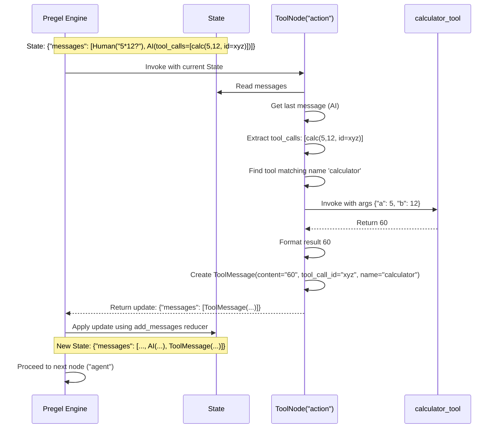

# Chapter 5: ToolNode / tools_condition

In [Chapter 4: Pregel Execution Engine](04_pregel_execution_engine.md), we saw how LangGraph takes our graph definition and runs it step-by-step. Now, let's look at some helpful pre-built components that make common tasks easier.

One very common pattern is building "agents" – programs that use an LLM to reason, but can also use external tools (like a calculator, web search, or custom functions) to get information or perform actions. Managing the cycle of "LLM thinks -> LLM asks to use a tool -> We run the tool -> We give the result back to the LLM" can involve some boilerplate code.

`ToolNode` and `tools_condition` are here to help!

## What's the Problem?

Imagine building a simple assistant that can answer math questions.

1.  You ask: "What's 5 times 12?"
2.  The LLM (the "brain") receives this. It understands it needs to multiply but might not be perfect at arithmetic. It decides to use a calculator tool. It generates a special instruction saying "Use calculator: multiply 5 and 12".
3.  **Now what?** We need code to:
    *   Detect that the LLM asked to use the calculator.
    *   Figure out *which* tool (calculator) and *what* inputs (5, 12).
    *   Actually *run* the calculator function with those inputs.
    *   Get the result (60).
    *   Format this result correctly (as a `ToolMessage`).
    *   Feed this result back to the LLM so it knows the answer.
4.  The LLM receives the calculator's result ("Result: 60") and can now give you the final answer: "5 times 12 is 60."

Steps 3.a through 3.e involve specific logic for handling tool requests. Doing this manually for every agent can be repetitive.

## What are `ToolNode` and `tools_condition`?

LangGraph provides pre-built components to handle exactly this tool-using loop:

*   **`ToolNode`**: A pre-built **node** specifically designed to execute tools.
    *   It takes the LLM's request (usually one or more `tool_calls` inside an `AIMessage`).
    *   It looks up the correct tool function you've provided.
    *   It runs the function with the arguments specified by the LLM.
    *   It automatically formats the output as `ToolMessage` objects, ready to be sent back to the LLM.
    *   **Analogy:** `ToolNode` is like a helpful workshop assistant. When the boss (LLM) asks to use a specific gadget (tool) with certain settings (arguments), the assistant grabs the gadget, uses it as requested, and reports back the result.

*   **`tools_condition`**: A pre-built **condition function** for conditional edges.
    *   It checks the *last message* in the current state.
    *   If that message contains tool calls, it returns a specific string (usually `"tools"`).
    *   If the message *doesn't* have tool calls, it returns a different string (usually `"__end__"`).
    *   This makes it easy to route the graph: if the LLM asked for tools, go to the `ToolNode`; otherwise, finish.
    *   **Analogy:** `tools_condition` is like a gatekeeper after the boss's office. If the boss left instructions to use gadgets, the gatekeeper directs you to the workshop assistant (`ToolNode`). If not, they direct you to the exit (`END`).

Let's see how to use them to build our math assistant.

## Using `ToolNode` and `tools_condition`

First, we need our usual setup: state, graph, and an LLM node. We'll also define a tool.

```python
# --- 1. Define the Tool ---
from langchain_core.tools import tool

@tool
def calculator(a: int, b: int) -> int:
  """A simple calculator tool that multiplies two numbers."""
  print(f"--- Running Calculator: {a} * {b} ---")
  return a * b

# --- 2. Define the State ---
from typing import Annotated, Sequence, TypedDict
from langchain_core.messages import BaseMessage, AIMessage, HumanMessage, ToolMessage
from langgraph.graph import StateGraph, add_messages

# We'll use the basic message state
class AgentState(TypedDict):
   messages: Annotated[Sequence[BaseMessage], add_messages]

# --- 3. Define the LLM Node ---
# Make sure your LLM supports tool calling! (e.g., OpenAI, Anthropic, Gemini)
# Replace with your actual LLM setup
from langchain_openai import ChatOpenAI
# Assume API key is set in environment variables
llm = ChatOpenAI(model="gpt-4o-mini", temperature=0)

# Bind the calculator tool to the LLM, so it knows it can use it
llm_with_tools = llm.bind_tools([calculator])

def call_model(state: AgentState):
    """Calls the LLM. May generate tool calls."""
    print("--- Calling Model ---")
    response = llm_with_tools.invoke(state["messages"])
    # Return the response to add to the messages list
    return {"messages": [response]}

# --- 4. Create the Graph ---
workflow = StateGraph(AgentState)
workflow.add_node("agent", call_model) # The LLM node
```

Now, let's add the `ToolNode` and the conditional logic using `tools_condition`.

```python
# --- 5. Create the ToolNode ---
from langgraph.prebuilt import ToolNode

# ToolNode needs the list of tools it can run
tool_node = ToolNode([calculator])

# Add it to the graph
workflow.add_node("action", tool_node) # Node that executes tools

# --- 6. Define the Edges using tools_condition ---
from langgraph.prebuilt import tools_condition
from langgraph.graph import END, START

# Start at the agent node
workflow.set_entry_point("agent")

# Add the conditional edge
workflow.add_conditional_edges(
    "agent", # Source node: After the LLM runs...
    tools_condition, # Condition function: Check if tools were called
    {
        # If tools_condition returns "tools", go to "action" (ToolNode)
        "tools": "action",
        # If tools_condition returns "__end__", go to END
        "__end__": END
    }
)

# Add a normal edge from the ToolNode back to the agent
# After running tools, we always want to go back to the LLM
workflow.add_edge("action", "agent")

# --- 7. Compile the graph ---
app = workflow.compile()
```

Let's run it!

```python
# --- 8. Run the Graph ---
inputs = {"messages": [HumanMessage(content="What is 5 * 12?")]}
result = app.invoke(inputs)

# Let's look at the final messages
for msg in result["messages"]:
    msg.pretty_print()

# Expected Print Output during run:
# --- Calling Model ---
# --- Running Calculator: 5 * 12 ---
# --- Calling Model ---

# Expected Final State Messages (pretty printed):
# ================================ Human Message =================================
# What is 5 * 12?
# ================================== Ai Message ==================================
# Tool Calls:
# calculator (call_...)
# Call ID: call_...
# Args:
#   a: 5
#   b: 12
# ================================= Tool Message =================================
# Name: calculator
# 60
# ================================== Ai Message ==================================
# 5 * 12 is 60.
```

**Explanation:**

1.  The `HumanMessage` goes to the `agent` node (`call_model`).
2.  The LLM decides to use the `calculator` tool and returns an `AIMessage` containing a `tool_calls` list.
3.  The graph reaches the conditional edge after `agent`. `tools_condition` inspects the last message (`AIMessage`), sees the `tool_calls`, and returns `"tools"`.
4.  The graph follows the path mapped to `"tools"`, which leads to the `action` node (`tool_node`).
5.  `ToolNode` receives the state. It looks at the last message's `tool_calls`. It finds the `calculator` call, extracts the arguments `a=5, b=12`, and executes our `calculator` function.
6.  `ToolNode` takes the return value (`60`) and wraps it in a `ToolMessage`, linking it to the original `tool_call_id`. It returns this `ToolMessage` to update the state.
7.  The graph follows the edge from `action` back to `agent`.
8.  `call_model` runs again, now with the `ToolMessage` result in the history.
9.  The LLM sees the result `60` and generates the final answer "5 * 12 is 60." This `AIMessage` has no `tool_calls`.
10. The graph reaches the conditional edge after `agent` again. `tools_condition` inspects the last message, sees no `tool_calls`, and returns `"__end__"`.
11. The graph follows the path mapped to `"__end__"`, which leads to `END`. Execution finishes.

`ToolNode` and `tools_condition` handled the entire tool execution loop for us!

## Under the Hood: `ToolNode`

When `ToolNode` is invoked:

1.  **Parse Input:** It finds the list of messages (using the `messages_key`, default is `"messages"`). It expects the last message to be an `AIMessage`. (`langgraph/prebuilt/tool_node.py` - `_parse_input`)
2.  **Extract Tool Calls:** It gets the `tool_calls` attribute from the last `AIMessage`. This is a list of dictionaries, each describing one tool invocation requested by the LLM.
3.  **Iterate and Execute:** For each `tool_call` dictionary in the list:
    *   **Find Tool:** It looks up the tool function/object in the `self.tools_by_name` dictionary (created when you initialized `ToolNode([calculator])`) using the `name` from the `tool_call`.
    *   **Validate:** It checks if the requested tool actually exists. If not, it generates an error `ToolMessage`.
    *   **Execute:** It calls the tool's `.invoke()` (or `.ainvoke()`) method, passing the `args` dictionary from the `tool_call`. (`langgraph/prebuilt/tool_node.py` - `_run_one` / `_arun_one`)
    *   **Handle Errors:** If the tool function raises an error, `ToolNode` catches it (by default) and returns a `ToolMessage` containing the error message. You can configure this behavior with the `handle_tool_errors` parameter.
    *   **Format Output:** It takes the return value of the tool function and converts it into a suitable string or list format for the `ToolMessage` content (`langgraph/prebuilt/tool_node.py` - `msg_content_output`).
    *   **Create ToolMessage:** It creates a `ToolMessage` object, setting its `content` to the formatted output, `name` to the tool's name, and crucially, `tool_call_id` to match the ID from the LLM's original request.
4.  **Collect Results:** It gathers all the generated `ToolMessage` objects into a list.
5.  **Return Update:** It returns a dictionary like `{"messages": [list_of_tool_messages]}` to update the graph's state. LangGraph's state mechanism (using `add_messages` in our example) appends these to the existing message list.

Here's a simplified sequence diagram:



## Under the Hood: `tools_condition`

This function is much simpler. (See `langgraph/prebuilt/tool_node.py` - `tools_condition`)

1.  **Get State:** It receives the current graph state (which could be a list of messages or a dictionary containing a `messages` key).
2.  **Find Last Message:** It accesses the last message in the list.
3.  **Check for Tool Calls:**
    *   It verifies if the last message is an `AIMessage`.
    *   If it is, it checks if the `tool_calls` attribute exists and is a non-empty list.
4.  **Return Decision:**
    *   If tool calls exist, it returns the string `"tools"`.
    *   Otherwise (not an `AIMessage`, or no `tool_calls`), it returns the string `"__end__"`.

```python
# Simplified logic of tools_condition
def simplified_tools_condition(state):
    # 1. Get messages (simplified access)
    messages = state["messages"]
    # 2. Get last message
    last_message = messages[-1]
    # 3. Check type and tool_calls attribute
    if isinstance(last_message, AIMessage) and hasattr(last_message, "tool_calls") and last_message.tool_calls:
        # 4. Return "tools" if calls exist
        return "tools"
    else:
        # 5. Return "__end__" otherwise
        return "__end__"
```

The strings `"tools"` and `"__end__"` are just conventions used in the `path_map` of `add_conditional_edges` to direct the graph flow.

## Conclusion

`ToolNode` and `tools_condition` are powerful pre-built components that significantly simplify the creation of tool-using agents in LangGraph.

*   **`ToolNode`** handles the execution of tools requested by an LLM, managing lookup, argument passing, execution, and result formatting.
*   **`tools_condition`** provides a simple way to route graph execution based on whether the LLM requested tool usage in its last turn.

By using these together, you can quickly build the core loop of an agent that interacts with external functions or APIs.

In the next chapter, we'll discuss how to save the state of our graph runs so we can resume them later or inspect their history. Let's explore [Chapter 6: Checkpointers](06_checkpointers.md).

---

Generated by [AI Codebase Knowledge Builder](https://github.com/The-Pocket/Tutorial-Codebase-Knowledge)