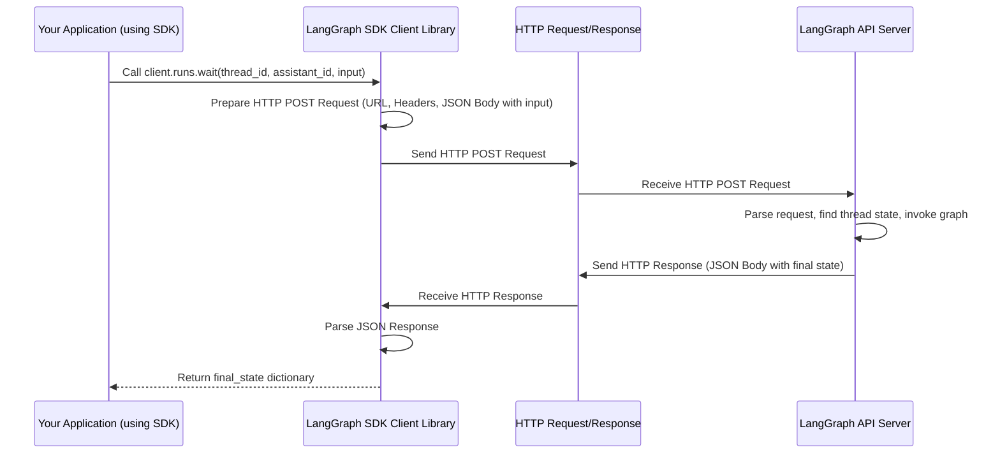

# Chapter 7: LangGraph SDK (Python/JS Clients)

In [Chapter 6: Checkpointers](06_checkpointers.md), we learned how to make our LangGraph applications persistent by saving their state. This is great for making long-running agents reliable or for allowing users to resume conversations.

But what if you've built your amazing LangGraph agent, maybe deployed it using the LangGraph CLI or on LangGraph Cloud, and now you want to *use* it from a different application? For example, how can your web application's backend trigger the agent, send user input, and get the final response back to show in the UI? Or how can another Python script programmatically interact with your deployed graph?

## What's the Problem?

Imagine your LangGraph application is like a smart appliance – say, a super-intelligent coffee machine. You've built it (defined the graph), and it's plugged in and running (deployed). Now, you need a way to tell it what to do without having to physically go to the machine and rewire it each time. You need a remote control!

How do you:

*   Tell the coffee machine (your graph) to start making coffee for a specific user?
*   Give it instructions (like "make a latte")?
*   Check on its progress or get the final result?
*   Manage different user profiles (different conversations/states)?

You need a way for external programs (like your phone app or another smart home device) to communicate with the coffee machine remotely.

## What is the LangGraph SDK?

The **LangGraph SDK (Software Development Kit)** provides libraries for **Python** and **JavaScript** that act as this remote control for your deployed LangGraph applications.

These libraries allow your *other* programs (like a web server, a command-line tool, or even another LangGraph graph!) to talk to a LangGraph API server. This server could be one you're running locally using the `langgraph up` command (which we'll see in [Chapter 9: LangGraph CLI](09_langgraph_cli.md)) or one hosted on LangGraph Cloud.

**Analogy:** Think of your deployed LangGraph graph as a TV. The LangGraph API server is the infrared receiver on the TV. The LangGraph SDK is the **remote control** you use from your couch (your other application) to change channels, adjust volume, or turn the TV on/off (invoke the graph, manage state, etc.).

Using the SDK, your external applications can:

1.  **Manage Assistants:** Create or get details about different graph configurations (like different "models" of your coffee machine). An "Assistant" in this context often refers to a specific deployed graph configuration.
2.  **Manage Threads:** Create new conversation threads (like starting a new order for a specific user) or get information about existing ones. Each thread represents a unique, independent state, often identified by a `thread_id` (similar to how [Checkpointers](06_checkpointers.md) track state).
3.  **Invoke Runs:** Trigger the execution of the graph within a specific thread, providing input. This is like pressing the "Start" button on the remote.
4.  **Get State:** Check the current state of a thread (e.g., see the latest messages in a conversation).
5.  **Manage Cron Jobs:** Schedule recurring graph runs.
6.  **Interact with the Store:** Directly read from or write to the persistent key-value store associated with the LangGraph deployment (if you're using it).

## How to Use the SDK (Python Example)

Let's focus on the most common use case: using the Python SDK to interact with a running LangGraph agent. We'll assume you have a LangGraph API server running (e.g., locally via `langgraph up`) that hosts an agent graph.

**1. Installation:**

First, you need to install the Python SDK library:

```bash
pip install langgraph-sdk
```

**2. Connecting the Client:**

You need to create a client object that knows where your LangGraph API server is.

```python
# Import the function to get a synchronous client
from langgraph_sdk import get_sync_client

# Define the URL of your running LangGraph API server
# (Replace with your actual URL, e.g., from LangGraph Cloud or local CLI)
API_URL = "http://localhost:8123" # Default for 'langgraph up'

# Create the client instance
# You might also need to provide an API key if your server requires it:
# client = get_sync_client(url=API_URL, api_key="your-api-key")
client = get_sync_client(url=API_URL)

print("Client created!")
# Expected Output: Client created!
```

This `client` object is now our remote control, connected to the specified LangGraph server. We used `get_sync_client` for simplicity here; there's also an asynchronous version (`get_client`) for `asyncio`-based applications.

**3. Invoking a Run on a Thread:**

Let's say we have an assistant (graph configuration) named `"my-agent"` deployed on the server. We want to send a message to it within a specific conversation thread, identified by `"user-session-456"`.

```python
# The unique ID for the conversation thread we want to interact with
THREAD_ID = "user-session-456"
# The ID or name of the deployed graph configuration (assistant) we want to run
ASSISTANT_ID = "my-agent"
# The input we want to send to the graph
# (The structure depends on your graph's specific state schema)
user_input = {"messages": [{"role": "user", "content": "What is LangGraph?"}]}

print(f"Sending input to assistant '{ASSISTANT_ID}' in thread '{THREAD_ID}'...")

# Use the client's 'runs' methods to invoke the graph
# client.runs.wait executes the run and waits for the final result
final_state = client.runs.wait(
    thread_id=THREAD_ID,
    assistant_id=ASSISTANT_ID,
    input=user_input,
    # If the thread doesn't exist yet, create it automatically
    if_not_exists="create",
)

print("\nRun completed! Final State:")
# The structure of final_state depends on your graph's state schema
# Let's assume it has a 'messages' key
if final_state and "messages" in final_state:
    # Print the last message (likely the AI's response)
    print(final_state["messages"][-1])
else:
    print(final_state)

# Example Expected Output (structure depends heavily on the specific agent):
# Sending input to assistant 'my-agent' in thread 'user-session-456'...
#
# Run completed! Final State:
# {'role': 'assistant', 'content': 'LangGraph is a library for building stateful, multi-actor applications with LLMs!'}
```

In this snippet:

*   We use `client.runs.wait(...)` to interact with the "runs" functionality of the API.
*   `thread_id`: Specifies the conversation or state we're working with. The LangGraph server uses this (often with its internal checkpointer) to load the correct state before running.
*   `assistant_id`: Tells the server *which* graph configuration to execute.
*   `input`: Provides the new data to be processed by the graph (e.g., the user's message).
*   `if_not_exists="create"`: A handy option that tells the server to create the thread if it doesn't already exist, making it easy to start new conversations.
*   The method waits for the graph execution to finish and returns the *final state* of the thread after the run.

There's also a `client.runs.stream(...)` method (and async versions `astream`, `await`) if you want to get intermediate results or updates as the graph executes, rather than just the final state.

**4. Getting the Current State:**

Maybe you just want to see the current state of a thread without running the graph again.

```python
# Get the latest state for our thread
print(f"Getting current state for thread '{THREAD_ID}'...")
current_state_info = client.threads.get_state(thread_id=THREAD_ID)

# The returned object contains the state ('values') and other metadata
print("\nCurrent State Values:")
print(current_state_info["values"])
print("\nCheckpoint ID:", current_state_info["checkpoint"]["checkpoint_id"])

# Example Expected Output:
# Getting current state for thread 'user-session-456'...
#
# Current State Values:
# {'messages': [{'role': 'user', 'content': 'What is LangGraph?'}, {'role': 'assistant', 'content': 'LangGraph is a library for building stateful, multi-actor applications with LLMs!'}]}
#
# Checkpoint ID: some-checkpoint-uuid-12345
```

Here, `client.threads.get_state(thread_id=...)` fetches the latest saved checkpoint for that thread from the server.

**Other Operations:**

The client object has other attributes like `client.assistants`, `client.threads`, and `client.store` that provide methods for managing those resources (e.g., `client.assistants.create(...)`, `client.threads.create(...)`, `client.store.put_item(...)`). You can explore these based on the SDK's documentation for more advanced use cases.

## Under the Hood: Client-Server Interaction

How does the SDK actually "talk" to the LangGraph API server? It's simpler than you might think!

1.  **Method Call:** When you call a method like `client.runs.wait(...)`, the SDK library code takes the arguments you provided (`thread_id`, `assistant_id`, `input`, etc.).
2.  **HTTP Request:** It packages these arguments into a standard HTTP request. For example, invoking a run might become an HTTP POST request. The `input` data is typically serialized into JSON format in the request body. The URL includes the specific endpoint (e.g., `/threads/{thread_id}/runs/wait`). Authentication info (like an API key) is added to the request headers.
3.  **Send Request:** The SDK sends this HTTP request over the network to the address you specified (`API_URL`).
4.  **Server Processing:** The LangGraph API server receives the request. It parses the URL and JSON body to understand what you want to do (e.g., "invoke run 'my-agent' on thread 'user-session-456' with this input"). It then interacts with its internal components (like the [Pregel Execution Engine](04_pregel_execution_engine.md) and [Checkpointers](06_checkpointers.md)) to perform the action.
5.  **HTTP Response:** The server sends back an HTTP response. This response contains the results (like the final state, a stream of updates, or just a confirmation), usually encoded as JSON.
6.  **Parse Response:** The SDK client receives the response, parses the JSON data, and returns it to your application code as a Python object (like the `final_state` dictionary).

Here's a simplified diagram:



The Python SDK code (`libs/sdk-py/langgraph_sdk/client.py`) defines classes like `LangGraphClient`, `SyncLangGraphClient`, `HttpClient`, `SyncHttpClient`, and specific resource clients (`AssistantsClient`, `ThreadsClient`, `RunsClient`, etc.). These classes wrap the logic of constructing and sending HTTP requests using the `httpx` library and parsing the responses. For instance, `SyncRunsClient.wait` ultimately calls `SyncHttpClient.post` to send the request to the `/runs/wait` or `/threads/{thread_id}/runs/wait` endpoint.

```python
# --- Simplified view from langgraph_sdk/client.py ---

# SyncRunsClient handles methods related to runs
class SyncRunsClient:
    def __init__(self, http: SyncHttpClient) -> None:
        self.http = http

    def wait(self, thread_id: Optional[str], assistant_id: str, *, input: Optional[dict] = None, ...) -> Any:
        # ... prepare payload dictionary from arguments ...
        payload = { "input": input, "assistant_id": assistant_id, ... }
        payload = {k: v for k, v in payload.items() if v is not None} # Remove None values

        # Determine the correct API endpoint based on whether thread_id is provided
        endpoint = (
            f"/threads/{thread_id}/runs/wait" if thread_id is not None else "/runs/wait"
        )

        # Call the underlying HTTP client to make the POST request
        return self.http.post(endpoint, json=payload) # headers are handled by http client

# SyncHttpClient handles making the actual HTTP requests
class SyncHttpClient:
    def __init__(self, client: httpx.Client) -> None:
        self.client = client # httpx.Client instance

    def post(self, path: str, *, json: Optional[dict], ...) -> Any:
        # ... Prepare headers, encode JSON body ...
        request_headers, content = encode_json(json)
        # Use the httpx client to send the POST request
        r = self.client.post(path, headers=request_headers, content=content)
        # ... Error handling ...
        # Decode the JSON response
        return decode_json(r)
```

## Conclusion

The **LangGraph SDK (Python/JS Clients)** is your essential toolkit for interacting with deployed LangGraph applications remotely. It acts as a remote control, allowing your other services, UIs, or scripts to:

*   Connect to a LangGraph API server.
*   Manage conversation threads (`thread_id`).
*   Invoke graph runs with specific inputs (`client.runs.wait`, `client.runs.stream`).
*   Retrieve the state of threads (`client.threads.get_state`).
*   And manage other resources like Assistants and Cron jobs.

By sending simple HTTP requests under the hood, the SDK bridges the gap between your deployed LangGraph logic and the rest of your software ecosystem.

So far, we've mostly defined graphs using the class-based `StateGraph` approach. LangGraph offers another, more functional way to define graphs. In the next chapter, we'll explore the [Functional API (@task/@entrypoint)](08_functional_api___task__entrypoint_.md).

---

Generated by [AI Codebase Knowledge Builder](https://github.com/The-Pocket/Tutorial-Codebase-Knowledge)