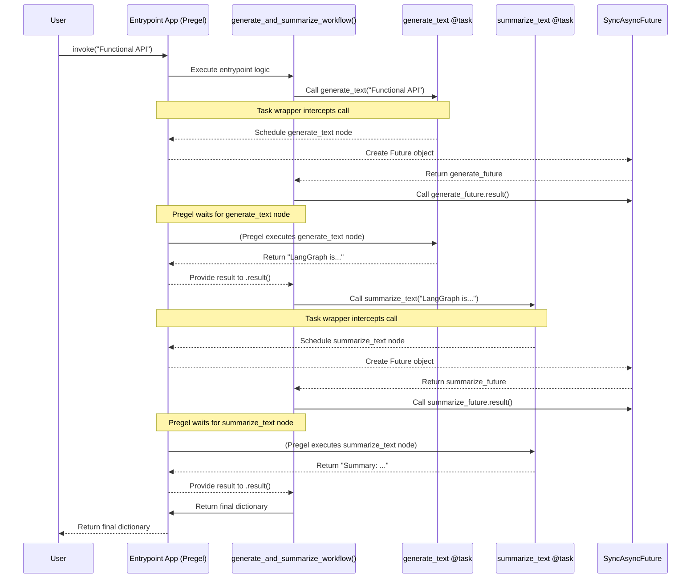

# Chapter 8: Functional API (@task/@entrypoint)

In [Chapter 7: LangGraph SDK (Python/JS Clients)](07_langgraph_sdk__python_js_clients_.md), we learned how to interact with running LangGraph applications using client libraries. So far, we've primarily used the `StateGraph` class to define the structure of our workflows by explicitly adding nodes and edges.

But what if you prefer defining your workflow in a way that looks more like a standard Python script? What if you want the flow of control to be determined by function calls rather than explicitly drawing edges?

LangGraph offers an alternative way to build graphs: the **Functional API** using the `@entrypoint` and `@task` decorators.

## What's the Problem?

Defining graphs with `StateGraph`, `add_node`, and `add_edge` is clear and explicit, especially when visualizing the graph. However, sometimes it can feel a bit verbose, particularly for workflows that follow a more linear or script-like sequence of steps.

Imagine a simple process:

1.  Take some input text.
2.  Generate a longer piece of text based on the input (e.g., write a paragraph).
3.  Summarize the generated text.

Using `StateGraph`, you would define nodes for "generate" and "summarize" and then explicitly add edges between them. Could we define this flow more directly using Python function calls?

## What are `@entrypoint` and `@task`?

The Functional API provides decorators to define graphs in a more code-centric way:

*   **`@task`**: This decorator wraps a regular Python function, marking it as a single computational step (like a node) in your workflow.
    *   **Analogy:** Think of a `@task` as a specific tool or workstation on an assembly line (e.g., the "painting station," the "polishing station").

*   **`@entrypoint`**: This decorator marks the main function that defines the overall workflow. Inside this function, you call your `@task`-decorated functions. It automatically creates the underlying LangGraph structure based on these calls.
    *   **Analogy:** The `@entrypoint` function is like the **manager** of the assembly line, directing the product from one workstation (`@task`) to the next by calling them in order.

**Key Idea: Implicit Communication via Futures**

When you call a function decorated with `@task` *from within* a function decorated with `@entrypoint`, something interesting happens:

1.  The `@task` function doesn't immediately run and return its result directly.
2.  Instead, it returns a special object called a **future**. Think of this like a receipt or an IOU for the result that is *pending*. It represents the work that has been scheduled but might not be finished yet.
    *   **Analogy:** When you order coffee, you get a receipt (the future) immediately. You have to wait a bit before you get the actual coffee (the result).
3.  To get the actual result from the future, you typically call `.result()` on it (for synchronous code) or `await` it (for asynchronous code). This tells LangGraph: "Wait here until this specific task is actually finished, and then give me its output."

The sequence of calls to `@task` functions within the `@entrypoint` function defines the flow of your graph implicitly.

## How to Use the Functional API

Let's rebuild our simple "generate then summarize" example using the Functional API.

**1. Define Tasks with `@task`:**

First, we define our individual steps as Python functions and decorate them with `@task`.

```python
from langgraph.func import task
import time

@task
def generate_text(topic: str) -> str:
    """Generates a short text about a topic."""
    print(f"--- Task: Generating text about '{topic}' ---")
    # Simulate some work
    time.sleep(1)
    generated = f"LangGraph is a powerful library for building stateful LLM applications. It allows defining complex workflows as graphs. The topic was {topic}."
    return generated

@task
def summarize_text(text: str) -> str:
    """Summarizes a piece of text."""
    print(f"--- Task: Summarizing text (length: {len(text)}) ---")
    # Simulate some work
    time.sleep(0.5)
    summary = f"Summary: LangGraph helps build stateful LLM apps using graphs. (Original topic: {text.split()[-1]})"
    return summary

# These functions are now marked as LangGraph tasks.
```

In this code:

*   We import `task` from `langgraph.func`.
*   We decorate `generate_text` and `summarize_text` with `@task`. These are now our graph nodes.

**2. Define the Workflow with `@entrypoint`:**

Next, we define the main function that orchestrates the calls to our tasks. We decorate this with `@entrypoint`.

```python
from langgraph.func import entrypoint

@entrypoint()
def generate_and_summarize_workflow(topic: str) -> dict:
    """The main workflow entrypoint."""
    print("--- Entrypoint: Starting workflow ---")

    # Call the first task. This returns a future immediately.
    generate_future = generate_text(topic)

    # To pass the result to the next task, we need the actual value.
    # Calling .result() waits for generate_text to finish and gets its output.
    generated_text = generate_future.result()

    # Call the second task, passing the result from the first.
    summarize_future = summarize_text(generated_text)

    # Get the final result.
    final_summary = summarize_future.result()

    print("--- Entrypoint: Workflow finished ---")
    return {"original": generated_text, "summary": final_summary}

# The 'generate_and_summarize_workflow' object is now a compiled LangGraph application!
```

Here's what's happening:

1.  We import `entrypoint` from `langgraph.func`.
2.  We decorate `generate_and_summarize_workflow` with `@entrypoint()`. This tells LangGraph that this function defines our workflow.
3.  Inside the function, we call `generate_text(topic)`. This schedules the `generate_text` task to run and returns `generate_future`.
4.  We call `generate_future.result()`. This pauses execution *within the entrypoint logic* until the `generate_text` task completes and its string result is available.
5.  We then call `summarize_text(generated_text)`, passing the actual text. This schedules the `summarize_text` task and returns `summarize_future`.
6.  We call `summarize_future.result()` to wait for the summary and get the final result.
7.  The function returns a dictionary containing both the original text and the summary.

**3. Running the Workflow:**

Unlike `StateGraph`, which requires `.compile()`, the `@entrypoint` decorator *directly* returns a compiled, runnable LangGraph application (specifically, a [Pregel](04_pregel_execution_engine.md) object).

```python
# The decorated function IS the runnable application
app = generate_and_summarize_workflow

# Invoke it like any other compiled LangGraph app
input_topic = "Functional API"
final_output = app.invoke(input_topic)

print("\n--- Final Output ---")
print(final_output)

# Expected Print Output during run:
# --- Entrypoint: Starting workflow ---
# --- Task: Generating text about 'Functional API' ---
# --- Task: Summarizing text (length: 146) ---
# --- Entrypoint: Workflow finished ---

# Expected Final Output:
# --- Final Output ---
# {'original': 'LangGraph is a powerful library for building stateful LLM applications. It allows defining complex workflows as graphs. The topic was Functional API.', 'summary': 'Summary: LangGraph helps build stateful LLM apps using graphs. (Original topic: API.)'}
```

We simply call `.invoke()` on the decorated `@entrypoint` function itself, passing the initial input.

**Checkpointing:**

You can easily add checkpointing by passing a checkpointer instance to the `@entrypoint` decorator, just like you pass it to `StateGraph.compile()`:

```python
from langgraph.checkpoint.memory import InMemorySaver

@entrypoint(checkpointer=InMemorySaver()) # Add checkpointer here
def checkpointed_workflow(topic: str) -> dict:
    # ... (same internal logic as before) ...
    generate_future = generate_text(topic)
    generated_text = generate_future.result()
    summarize_future = summarize_text(generated_text)
    final_summary = summarize_future.result()
    return {"original": generated_text, "summary": final_summary}

# Now run with a config
app_checkpointed = checkpointed_workflow
config = {"configurable": {"thread_id": "func-api-thread-1"}}
output1 = app_checkpointed.invoke(input_topic, config=config)
# If you invoke again with the same config, results might be loaded from cache.
# output2 = app_checkpointed.invoke(input_topic, config=config) # might skip tasks if cached
```

## Under the Hood

How does calling functions magically create and run a graph?

**Non-Code Walkthrough:**

1.  **Decoration Time:** When Python loads your code, the `@task` and `@entrypoint` decorators wrap your functions.
    *   `@task` wraps `generate_text` and `summarize_text` with logic that prepares them to be run as graph nodes.
    *   `@entrypoint` wraps `generate_and_summarize_workflow`. It analyzes the function signature (for input/output types) and prepares a [Pregel](04_pregel_execution_engine.md) execution plan structure. Crucially, it sets up a special context for when the entrypoint function is *actually called* during a graph run.
2.  **Invocation Time (`app.invoke(...)`):**
    *   The `Pregel` engine associated with the `@entrypoint` starts running. It executes the code inside your `generate_and_summarize_workflow` function.
    *   **First Task Call:** When the line `generate_future = generate_text(topic)` is reached *inside this execution context*, the `@task` wrapper intercepts the call. Instead of running `generate_text` immediately, it tells the Pregel engine: "Schedule the node corresponding to `generate_text` to run with the input `topic`." It then returns a `SyncAsyncFuture` object (`generate_future`) representing this scheduled work.
    *   **Getting Result:** When `generated_text = generate_future.result()` is reached, the execution context tells the Pregel engine: "Pause the execution of the entrypoint logic *here* and wait until the node for `generate_text` has finished running and its result is available. Then, resume the entrypoint logic with that result."
    *   **Second Task Call:** The line `summarize_future = summarize_text(generated_text)` is reached. Again, the `@task` wrapper intercepts, tells Pregel: "Schedule the node for `summarize_text` with the input `generated_text`," and returns `summarize_future`.
    *   **Final Result:** `final_summary = summarize_future.result()` waits for the `summarize_text` node to complete.
    *   **Return:** The entrypoint function finishes, returning the final dictionary. The Pregel engine marks the run as complete and returns this value.

Essentially, the `@entrypoint` function's code acts as the "conductor" script, but the actual execution of the `@task` functions is managed by the underlying Pregel engine based on the calls and `.result()` waits within the script.

**Sequence Diagram:**



**Code Dive:**

*   **`@entrypoint` (`langgraph/func/__init__.py`):** This decorator is actually a class. When you call it (`@entrypoint()`), its `__init__` stores configuration like the checkpointer. When it decorates your function (`generate_and_summarize_workflow`), its `__call__` method is invoked. This method analyzes your function's signature to determine input/output types and constructs and returns a configured `Pregel` instance. It sets up the entrypoint function itself (`bound` runnable) as the starting node (`START`) of this internal Pregel graph. The output of this node is mapped to the special `END` channel.
*   **`@task` (`langgraph/func/__init__.py`):** This decorator wraps your function (`generate_text`). When the decorated function is called *during* a Pregel run (specifically, via the `call` function triggered internally), it doesn't execute the original function directly.
*   **`call` (`langgraph/pregel/call.py`):** This utility function is the bridge. It gets the current Pregel execution context (`config[CONF][CONFIG_KEY_CALL]`). This context is responsible for scheduling the actual execution of the underlying task runnable (created by `get_runnable_for_task`) within the Pregel engine and returning a `SyncAsyncFuture`.
*   **`SyncAsyncFuture` (`langgraph/pregel/call.py`):** A subclass of `concurrent.futures.Future` that allows waiting for the result synchronously (`.result()`) or asynchronously (`__await__`). It represents the pending result of the task scheduled by `call`.

```python
# Simplified view from langgraph/func/__init__.py
class entrypoint:
    def __init__(self, checkpointer=None, ...):
        self.checkpointer = checkpointer
        # ... store other config ...

    def __call__(self, func: Callable[..., Any]) -> Pregel:
        # Analyze function signature (input/output types)
        # ... sig = inspect.signature(func) ...
        # input_type = ...
        # output_type, save_type = ...

        # Wrap the entrypoint function logic into a runnable
        bound = get_runnable_for_entrypoint(func)

        # Create and return a Pregel instance
        return Pregel(
            nodes={
                func.__name__: PregelNode(
                    bound=bound, # The entrypoint logic itself
                    triggers=[START],
                    channels=[START],
                    # Write result to END and PREVIOUS channels
                    writers=[ChannelWrite(...)],
                )
            },
            channels={START: ..., END: ..., PREVIOUS: ...},
            input_channels=START,
            output_channels=END,
            checkpointer=self.checkpointer,
            # ... other Pregel config ...
        )

# Simplified view from langgraph/func/__init__.py
def task(func, *, name=None, retry=None):
    # ... setup retry policies ...
    def decorator(func):
        # 'call' is imported from langgraph.pregel.call
        # functools.partial creates a new function that calls 'call'
        # with the original 'func' as the first argument.
        call_func = functools.partial(call, func, retry=retry_policies)
        object.__setattr__(call_func, "_is_pregel_task", True) # Mark it
        # Update metadata (like __name__, __doc__) to match original func
        return functools.update_wrapper(call_func, func)

    # ... logic to handle calling @task with or without parentheses ...
```

## Conclusion

The **Functional API (`@task` / `@entrypoint`)** provides a more Pythonic, code-centric alternative to `StateGraph` for defining LangGraph workflows.

*   `@task` marks individual computational steps.
*   `@entrypoint` defines the main workflow function where `@task`s are called.
*   Calling a `@task` within an `@entrypoint` returns a **future** (a pending result).
*   Use `.result()` (sync) or `await` (async) to get the actual value from a future, defining the execution order implicitly.
*   The `@entrypoint`-decorated function *is* the compiled, runnable graph.

This approach can feel more natural if you think of your workflow as a script where functions call each other. It might be less intuitive if you need to visualize complex branching or merging based on state conditions, where `StateGraph`'s explicit edge definitions can be clearer.

Now that we've explored both ways to define graphs, let's look at a command-line tool that helps manage and serve LangGraph applications. In the next chapter, we'll cover the [LangGraph CLI](09_langgraph_cli.md).

---

Generated by [AI Codebase Knowledge Builder](https://github.com/The-Pocket/Tutorial-Codebase-Knowledge)