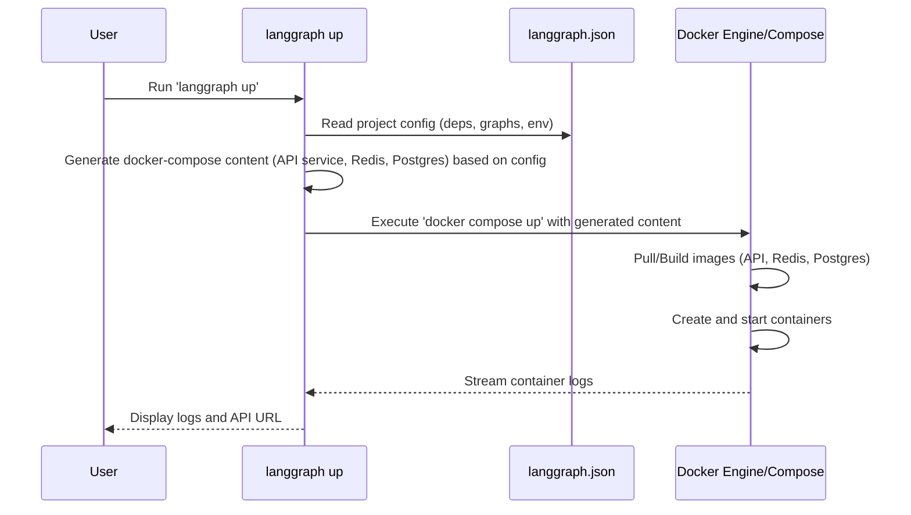

# Chapter 9: LangGraph CLI

In the previous chapters, like [Chapter 8: Functional API (@task/@entrypoint)](08_functional_api___task__entrypoint_.md), we learned different ways to define the logic and flow of our LangGraph applications. We've built the blueprints for our intelligent agents and workflows.

But how do we take these blueprints and turn them into actual running services that others can interact with? How do we handle dependencies, package everything up nicely, and maybe even deploy it using standard tools like Docker?

## What's the Problem?

Imagine you've built an amazing LangGraph chatbot using `StateGraph` or the Functional API. It works perfectly on your machine. Now you want to:

*   Share it with colleagues.
*   Deploy it as a web API so a front-end application can use it.
*   Run it reliably as a background service.
*   Ensure all its dependencies (like specific Python libraries) are correctly installed wherever it runs.

Doing this manually involves several steps: setting up a web server (like FastAPI), writing API endpoints to handle requests, figuring out how to manage the graph's state ([Chapter 6: Checkpointers](06_checkpointers.md)), installing dependencies, and potentially creating Docker containers for consistent deployment. This can be quite a bit of work, especially if you're new to deploying applications.

## What is the LangGraph CLI?

The **LangGraph CLI** (`langgraph-cli`) is your command-line toolkit designed to simplify exactly these tasks. It helps you manage, package, run, and deploy your LangGraph applications as robust API services.

Think of it as a **Swiss Army knife** for deploying your LangGraph creations. It provides commands to handle common deployment-related tasks with minimal fuss.

**What can it do?**

*   **`new`**: Initialize a new LangGraph project structure from predefined templates.
*   **`dev`**: Run your LangGraph application locally *without* Docker, using an in-memory server. Great for quick testing and development.
*   **`build`**: Package your LangGraph application and its dependencies into a Docker image.
*   **`dockerfile`**: Generate the `Dockerfile` and optional `docker-compose.yml` files needed to build and run your application with Docker manually.
*   **`up`**: Launch your LangGraph application as an API server using Docker and Docker Compose, including necessary backend services like databases if needed for checkpointers.

## Getting Started: `langgraph new`

The easiest way to start is by creating a project from a template.

**1. Installation:**

First, make sure you have the LangGraph CLI installed. You usually install it with pip:

```bash
# Install the core CLI
pip install langgraph-cli

# To use 'langgraph dev', you need the 'inmem' extra:
pip install "langgraph-cli[inmem]"
```

You also typically need Docker installed on your system to use the `build` and `up` commands.

**2. Creating a New Project:**

Open your terminal and run:

```bash
langgraph new my-first-cli-app
```

This command will:

1.  Ask you to choose a template (e.g., "New LangGraph Project", "ReAct Agent").
2.  Ask you to choose a language (Python or JS/TS).
3.  Download the template files.
4.  Create a new directory named `my-first-cli-app` (or the name you provide) with the template code.

Let's navigate into our new project:

```bash
cd my-first-cli-app
```

Inside, you'll find files like:

*   `langgraph.json`: The configuration file for the CLI.
*   A Python or JS file defining a simple LangGraph graph (e.g., `app/graph.py`).
*   Dependency files (e.g., `pyproject.toml` or `package.json`).

## The Configuration File: `langgraph.json`

This file is central to how the CLI understands your project. It tells the CLI things like:

*   Which Python or Node.js version to use (if building a Docker image).
*   What libraries your project depends on.
*   Where your compiled LangGraph graph object(s) are defined.
*   Environment variables needed by your application.
*   Optional configurations for features like [Checkpointers](06_checkpointers.md) or custom authentication.

Here's a simplified example of what `langgraph.json` might look like for a Python project:

```json
// Example langgraph.json
{
  "python_version": "3.11", // Specify Python version for Docker image
  "dependencies": [
    ".", // Look for dependencies in the current dir (e.g., pyproject.toml)
    "langchain-openai" // Add this PyPI package
  ],
  "graphs": {
    // Expose the 'graph' variable from 'app/graph.py' under the ID "my_agent"
    "my_agent": "app/graph.py:graph"
  },
  "env": {
    // Set environment variables for the running application
    "OPENAI_API_KEY": "your-api-key-here" // Replace with actual key or use .env file
  }
  // Optional sections for store, checkpointer, auth, http config...
}
```

You'll typically edit this file to add your specific dependencies and point to your graph definition.

## Running Locally (Development): `langgraph dev`

Before building containers, you often want to test your graph quickly. The `langgraph dev` command runs your graph(s) as an API server directly in your local environment *without* using Docker. It uses an in-memory backend.

```bash
# Make sure you are in your project directory (e.g., my-first-cli-app)
# Ensure you installed the 'inmem' extra: pip install "langgraph-cli[inmem]"
langgraph dev
```

This command will:

1.  Read `langgraph.json`.
2.  Load the graph(s) specified (e.g., `app/graph.py:graph`).
3.  Start a web server (often Uvicorn with FastAPI).
4.  Make your graph available at API endpoints (like `/invoke`, `/stream`, etc.).
5.  Often enables hot-reloading, so changes to your code might automatically restart the server.

The output will typically show the address where the server is running, like `http://127.0.0.1:2024`, and the available API endpoints. You can then interact with this server using tools like `curl`, Postman, or the [LangGraph SDK (Python/JS Clients)](07_langgraph_sdk__python_js_clients_.md).

```
INFO:     Uvicorn running on http://127.0.0.1:2024 (Press CTRL+C to quit)
INFO:     Started reloader process [...] using StatReload
INFO:     Started server process [...]
INFO:     Waiting for application startup.
INFO:     Application startup complete.
```

Press `Ctrl+C` to stop the server.

## Packaging for Deployment: `langgraph build`

When you're ready to create a self-contained package for deployment, you'll likely use Docker. The `langgraph build` command automates creating a Docker image for your application.

You need Docker installed and running for this command.

```bash
# Build a Docker image and tag it as 'my-app-image:latest'
langgraph build -t my-app-image
```

This command will:

1.  Read `langgraph.json` to understand dependencies, Python/Node version, and graph locations.
2.  Dynamically generate a `Dockerfile`.
3.  Run `docker build`, bundling your code, dependencies, and the LangGraph API server runtime into a single image named `my-app-image`.

Now you have a standard Docker image that you can run anywhere Docker is installed, or push to a container registry.

## Generating a Dockerfile: `langgraph dockerfile`

Sometimes you need more control over the Docker build process or want to integrate it into an existing CI/CD pipeline. The `langgraph dockerfile` command generates the necessary files for you.

```bash
# Generate Dockerfile in the current directory
langgraph dockerfile Dockerfile

# Generate Dockerfile AND docker-compose.yml, .env, .dockerignore
langgraph dockerfile Dockerfile --add-docker-compose
```

This command reads `langgraph.json` and writes out:

*   `Dockerfile`: The instructions to build the image.
*   Optionally (`--add-docker-compose`):
    *   `docker-compose.yml`: A Docker Compose file to run the application image along with services like Redis or Postgres (often needed for persistent checkpointers).
    *   `.dockerignore`: A file listing things to exclude from the build context (like `.env` files).
    *   `.env`: A template environment file.

You can then customize these files and use standard `docker build` and `docker compose up` commands.

## Running with Docker: `langgraph up`

This is often the simplest way to run your packaged application locally using Docker, especially if your application requires persistent storage or checkpointing.

```bash
# Build (if needed) and run the application using Docker Compose
langgraph up
```

This command:

1.  Reads `langgraph.json`.
2.  Dynamically generates a `docker-compose.yml` file (similar to `langgraph dockerfile --add-docker-compose`). This file defines:
    *   The service for your LangGraph application (using the image from `langgraph build` or building it based on your code).
    *   Potentially, services for Redis (for locking) and Postgres (for persistent [Checkpointers](06_checkpointers.md)).
3.  Runs `docker compose up` (or the older `docker-compose up`).

This will pull necessary base images, build your application image if it doesn't exist, and start all the containers defined in the generated Compose file. Your LangGraph API will be running inside Docker, typically accessible on a port like `http://localhost:8123` (the default).

```
[+] Running 3/3
 ✔ Container my-first-cli-app-langgraph-redis-1     Started
 ✔ Container my-first-cli-app-langgraph-postgres-1  Started
 ✔ Container my-first-cli-app-langgraph-api-1       Started
... logs from langgraph-api container ...
Ready!
- API: http://localhost:8123
- Docs: http://localhost:8123/docs
- LangGraph Studio: ...
```

Press `Ctrl+C` to stop the containers.

## Under the Hood

How do these commands work?

*   **`langgraph new`**: Clones or downloads a template project from a Git repository (like GitHub) and copies the files into your specified directory.
*   **`langgraph dev`**: Imports code from the `langgraph-api` library. It starts a web server process (like Uvicorn). It dynamically loads your graph code based on the `graphs` section in `langgraph.json` and mounts API endpoints (like `/invoke`, `/stream`) that call your graph. It uses an in-memory checkpointer and store by default.
*   **`langgraph build` / `langgraph dockerfile`**: These commands read `langgraph.json`. They use internal templates (see `langgraph_cli/config.py`) to construct the text content of a `Dockerfile` (and potentially `docker-compose.yml`). This generated Dockerfile typically starts from a base LangGraph API image, copies your project code and dependency files, installs dependencies (using `pip` or `npm`), sets environment variables, and defines the command to start the LangGraph API server inside the container. `langgraph build` then executes `docker build` using this generated Dockerfile.
*   **`langgraph up`**: Similar to `build`/`dockerfile`, it reads `langgraph.json` and generates a `docker-compose.yml` string using internal templates (`langgraph_cli/docker.py`). This defines the application service (referencing the build context or a pre-built image) and standard Redis/Postgres services. It then executes the `docker compose up` command, passing the generated configuration via standard input or a temporary file.

Here's a simplified view of what `langgraph up` does:



The CLI essentially acts as a convenient wrapper around standard tools like `pip`, `npm`, `docker build`, and `docker compose`, using your `langgraph.json` to configure them correctly for a LangGraph application.

## Conclusion

The **LangGraph CLI (`langgraph-cli`)** is your command-line companion for managing and deploying LangGraph applications. It streamlines the process of:

*   Creating new projects (`langgraph new`).
*   Running locally for development (`langgraph dev`).
*   Packaging applications into Docker images (`langgraph build`).
*   Generating Docker configuration files (`langgraph dockerfile`).
*   Running your application and its dependencies using Docker Compose (`langgraph up`).

By handling the boilerplate of setting up servers, managing dependencies, and configuring Docker, the CLI lets you focus more on building your graph's logic and less on the complexities of deployment.

So far, we've focused on the structure (nodes, edges, state) and execution. But how does data actually flow *between* nodes? LangGraph uses a concept called **Channels** for this. Let's explore them in the next chapter: [Chapter 10: Channels](10_channels.md).

---

Generated by [AI Codebase Knowledge Builder](https://github.com/The-Pocket/Tutorial-Codebase-Knowledge)