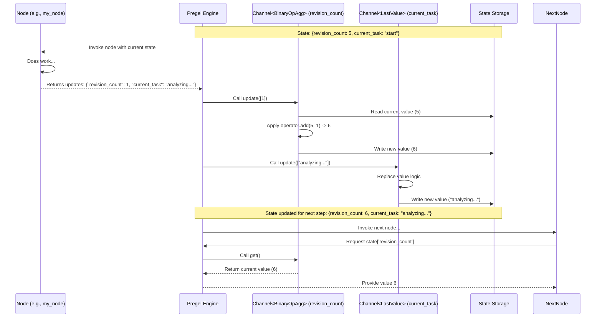

# Chapter 10: Channels

Welcome back! In [Chapter 9: LangGraph CLI](09_langgraph_cli.md), we saw how to package and run our LangGraph applications using the command-line interface. We've defined our application's steps ([Nodes & Edges](02_nodes___edges.md)) and the data structure they share ([State Schema](01_state_schema.md)). The [Pregel Execution Engine](04_pregel_execution_engine.md) orchestrates the flow.

But how does the information *actually* get passed from one node to the next? When a node returns an update like `{"messages": [AIMessage(...)]}`, how does LangGraph know *how* to merge that into the existing state?

This is where **Channels** come into play. They are the fundamental communication pathways within the graph.

## What's the Problem?

Imagine our graph's shared state is like a central whiteboard. Different team members (nodes) need to read information from the whiteboard and write updates to it.

*   One team member might just need to replace the "Current Task" section with a new task.
*   Another might need to *add* a new item to the "To-Do List" section without erasing existing items.
*   A third might need to update the "Project Budget" section by *subtracting* an expense from the current total.

We need a way to define, for *each section* of the whiteboard (each key in our state), exactly *how* new updates should be applied. Should they overwrite? Add? Combine in some other way?

Simply having nodes return dictionaries isn't enough. We need rules for merging these updates into the shared state consistently.

## What are Channels?

**Channels** are the underlying mechanism in LangGraph that manage the communication and state updates between nodes. Think of them as specialized **mailboxes** or sections on our **shared whiteboard**.

*   Each key in your [State Schema](01_state_schema.md) (e.g., `messages`, `user_input`, `count`) corresponds to a Channel.
*   Nodes **write** updates to specific channels by returning dictionaries with keys matching the channel names.
*   Nodes **read** the current value of the state by accessing the values stored in these channels.
*   Crucially, different **types** of Channels define **how updates are handled**.

**Analogy:** Imagine you have different mailboxes for different purposes:
*   A "Latest News" mailbox: Only the most recent newspaper is kept; older ones are discarded (`LastValue`).
*   An "Incoming Letters" mailbox: All letters are kept and stacked in the order they arrive (`Topic`).
*   A "Donation Tally" box: Each new donation slip is added to the running total (`BinaryOperatorAggregate`).

The type of mailbox (Channel) determines what happens when a new item arrives.

## How Channels are Defined (Usually Implicitly)

Here's the good news: when using `StateGraph` with a `TypedDict` or Pydantic schema, you **usually don't create Channel objects directly**. LangGraph intelligently infers the correct channel type based on how you define your [State Schema](01_state_schema.md).

Let's revisit the `AgentState` from [Chapter 1: State Schema](01_state_schema.md):

```python
# From Chapter 1
import operator
from typing import Annotated, Sequence, TypedDict
from langchain_core.messages import BaseMessage
from langgraph.graph import add_messages

class AgentState(TypedDict):
    # Key 1: uses a complex reducer
    messages: Annotated[Sequence[BaseMessage], add_messages]

    # Key 2: specifies a simple reducer (addition)
    revision_count: Annotated[int, operator.add]

    # Key 3: no reducer specified
    current_task: str
```

Based on this schema, LangGraph sets up the internal channels like this:

1.  **`messages`**: Because `Annotated[..., add_messages]` is used, LangGraph uses a channel that applies the `add_messages` function whenever a node returns an update for `messages`. This function has complex logic to append or merge messages, behaving somewhat like an accumulator.
2.  **`revision_count`**: Because `Annotated[int, operator.add]` is used, LangGraph uses a `BinaryOperatorAggregate` channel internally. When a node returns `{"revision_count": 1}`, this channel will take the current count, add 1 to it using `operator.add`, and store the result.
3.  **`current_task`**: Because there's no `Annotated` reducer, LangGraph defaults to using a `LastValue` channel. If a node returns `{"current_task": "new task"}`, the old value of `current_task` is simply replaced.

So, your State Schema *is* your way of configuring the Channels!

## Common Channel Types (and their Implicit Use)

Let's look at the main channel types and how they correspond to your schema definitions:

### 1. `LastValue`

*   **What it does:** Stores only the *last* value written to it. If multiple nodes try to write to a `LastValue` channel in the same step, LangGraph raises an error because it doesn't know which "last" value to pick.
*   **Implicit Usage:** This is the **default** channel type for any key in your `TypedDict` or Pydantic schema that **does not** have an `Annotated` reducer function.
*   **Example Schema:**
    ```python
    class SimpleState(TypedDict):
        user_query: str # Uses LastValue channel
        last_tool_output: str # Uses LastValue channel
    ```
*   **Behavior:** If the state is `{'user_query': 'A', 'last_tool_output': 'B'}` and a node returns `{'last_tool_output': 'C'}`, the new state becomes `{'user_query': 'A', 'last_tool_output': 'C'}`.

### 2. `BinaryOperatorAggregate`

*   **What it does:** Stores a single value. When it receives updates, it combines the *current* value with *each new update* using a specific binary function (a function that takes two inputs, like addition or merging).
*   **Implicit Usage:** Used when you define a key with `Annotated[<type>, <reducer_function>]`, where `<reducer_function>` is a simple function taking two arguments and returning one (like `operator.add`).
*   **Example Schema:**
    ```python
    import operator
    class CounterState(TypedDict):
        # Uses BinaryOperatorAggregate with operator.add
        count: Annotated[int, operator.add]
    ```
*   **Behavior:** If the state is `{'count': 5}` and a node returns `{'count': 2}`, the channel applies `operator.add(5, 2)`, and the new state becomes `{'count': 7}`. If another node in the same step returns `{'count': 3}`, it then calculates `operator.add(7, 3)` resulting in `{'count': 10}`.

### 3. `Topic`

*   **What it does:** Collects updates like a list or queue. By default (`accumulate=False`), it gathers all values written in the current step into a list, and this list becomes the channel's value for the *next* step (clearing previous values). If configured with `accumulate=True`, it appends new values to the list across multiple steps.
*   **Implicit Usage:** While not a direct 1:1 mapping for complex reducers like `add_messages`, the *idea* of accumulating items into a list is similar. A schema definition like `Annotated[list[str], operator.add]` (where `operator.add` concatenates lists) would behave very much like `Topic(accumulate=True)`. The default `add_messages` reducer provided by LangGraph for `Sequence[BaseMessage]` is more sophisticated but shares the accumulation principle.
*   **Example Schema (Conceptual):**
    ```python
    # This specific Annotated usage mimics Topic(accumulate=True)
    class HistoryState(TypedDict):
        queries: Annotated[list[str], operator.add]
    ```
*   **Behavior (Conceptual `accumulate=True`):** If state is `{'queries': ['q1']}` and two nodes return `{'queries': ['q2']}` and `{'queries': ['q3']}` in the same step, the channel might combine these using list concatenation (`['q1'] + ['q2'] + ['q3']`) resulting in `{'queries': ['q1', 'q2', 'q3']}`. (Note: The exact order depends on internal details, but the accumulation is key).

### Other Channel Types

LangGraph includes other specialized channels like `EphemeralValue` (value lasts only one step), `Context` (manages resources), and `UntrackedValue` (value doesn't trigger downstream nodes), but `LastValue`, `BinaryOperatorAggregate`, and `Topic` cover the most common state update patterns you'll define via the schema.

## Under the Hood: How Channels Work During Execution

You don't need to manage channels directly, but understanding their role helps clarify how state updates happen.

1.  **Compilation:** When you call `workflow.compile()`, LangGraph analyzes your State Schema. For each key (like `messages`, `revision_count`, `current_task`), it creates the appropriate internal Channel object (`LastValue`, `BinaryOperatorAggregate`, etc.).
2.  **Node Execution:** A node (e.g., `call_model`) runs and returns an update dictionary (e.g., `{"revision_count": 1, "current_task": "analyzing..."}`).
3.  **Pregel Routes Updates:** The [Pregel Execution Engine](04_pregel_execution_engine.md) receives the update dictionary. For each key-value pair:
    *   It finds the specific Channel object associated with that key (e.g., the `BinaryOperatorAggregate` channel for `revision_count`, the `LastValue` channel for `current_task`).
    *   It passes the update value(s) to that Channel's `update()` method.
4.  **Channel Updates State:**
    *   The `BinaryOperatorAggregate` channel for `revision_count` calls its internal logic (e.g., `self.value = operator.add(self.value, 1)`).
    *   The `LastValue` channel for `current_task` simply replaces its stored value (`self.value = "analyzing..."`).
5.  **State Ready for Next Step:** After all updates for the current step are processed by their respective channels, the overall graph state is consistent and ready for the next node(s) to read.
6.  **Node Reading:** When the next node needs the state (e.g., `state['revision_count']`), the Pregel engine calls the `get()` method on the corresponding Channel object, which returns the current stored value.



You can explore the implementations in the LangGraph library:
*   `BaseChannel`: `langgraph/channels/base.py` defines the core interface (`update`, `get`, `checkpoint`).
*   `LastValue`: `langgraph/channels/last_value.py`
*   `BinaryOperatorAggregate`: `langgraph/channels/binop.py`
*   `Topic`: `langgraph/channels/topic.py`

```python
# Simplified concept from langgraph/channels/last_value.py
class LastValue(BaseChannel):
    # ... (init, etc.) ...
    value = MISSING # Internal storage

    def update(self, values: Sequence[Value]) -> bool:
        if len(values) == 0: return False
        if len(values) != 1: raise InvalidUpdateError("Too many updates")
        # Simple replacement
        self.value = values[-1]
        return True

    def get(self) -> Value:
        if self.value is MISSING: raise EmptyChannelError()
        # Return the stored value
        return self.value

# Simplified concept from langgraph/channels/binop.py
class BinaryOperatorAggregate(BaseChannel):
    # ... (init with operator, etc.) ...
    value = MISSING # Internal storage
    operator: Callable # The reducer function (e.g., operator.add)

    def update(self, values: Sequence[Value]) -> bool:
        if not values: return False
        # Initialize if first update
        if self.value is MISSING:
            self.value = values[0]
            values = values[1:]
        # Apply operator for all updates
        for update_val in values:
            self.value = self.operator(self.value, update_val)
        return True

    def get(self) -> Value:
        if self.value is MISSING: raise EmptyChannelError()
        # Return the aggregated value
        return self.value
```

## Why Care About Channels?

Even though they often work behind the scenes, understanding channels helps you:

*   **Predict State Updates:** Know *why* your state updates the way it does based on your schema.
*   **Debug Issues:** If state isn't updating as expected, you can reason about whether the implicit channel type matches your intention. For example, if you accidentally overwrite a list instead of appending, you know you might be missing an `Annotated` reducer, causing LangGraph to use `LastValue` instead of something accumulative.
*   **Design State Schemas Effectively:** Choose the right combination of simple types and `Annotated` reducers to achieve the desired update behavior for each piece of state.

## Conclusion

**Channels** are the core communication lines in LangGraph, directly linked to the keys in your [State Schema](01_state_schema.md). They dictate *how* updates from nodes are merged into the shared state.

*   LangGraph typically infers the channel type (`LastValue`, `BinaryOperatorAggregate`, `Topic`-like behavior) from your schema definition.
*   `LastValue` (default) replaces the old value.
*   `BinaryOperatorAggregate` (used with `Annotated[..., reducer]`) combines values using a function.
*   `Topic`-like behavior (often via `Annotated` list reducers) accumulates values.

Understanding channels gives you insight into the mechanics of state flow within your graph.

Channels manage the *values* within the graph's state. But what about values that represent external resources, like database connections or API clients, that need careful setup and teardown and perhaps shouldn't be saved in checkpoints? For this, LangGraph provides [Managed Values](11_managed_values.md), which we'll explore next.

---

Generated by [AI Codebase Knowledge Builder](https://github.com/The-Pocket/Tutorial-Codebase-Knowledge)