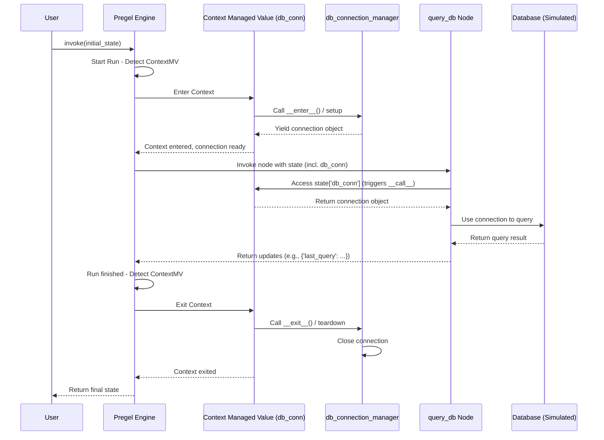

# Chapter 11: Managed Values

Welcome back! In [Chapter 10: Channels](10_channels.md), we learned how LangGraph uses Channels under the hood to manage the flow and combination of data within our graph's shared state. Channels are great for typical state elements like messages, counters, or user input.

But what about values that aren't just simple data? What if a node needs access to something like a database connection, an external API client, or information about the graph's current execution status? How do we manage the setup and cleanup of these resources, and how do we prevent sensitive things like connection objects from being saved in checkpoints?

## What's the Problem?

Imagine one of your graph nodes needs to query a database.

1.  **Setup:** Before the node can query, it needs an active database connection. We need to establish this connection *before* the node runs.
2.  **Usage:** The node uses the connection to perform its query.
3.  **Cleanup:** After the node (or the entire graph run) finishes, we need to properly *close* the database connection to release resources.
4.  **Persistence:** We definitely *don't* want to save the live database connection object itself when we create a checkpoint ([Chapter 6: Checkpointers](06_checkpointers.md)). It wouldn't make sense and might contain sensitive credentials. The connection needs to be recreated when the graph resumes.

Handling this setup, cleanup, and non-persistence logic directly within every node that needs the database connection would be repetitive and error-prone. We need a way to manage the *lifecycle* of such resources automatically within the graph's state.

## What are Managed Values?

**Managed Values** are special components you can include in your graph's state schema. They act like "smart containers" that encapsulate logic tied to the graph's execution lifecycle or context.

Think of them as specialized helpers living inside your state that handle specific jobs automatically:

*   **Resource Management:** Setting up things before a run and cleaning them up afterwards (like our database connection example).
*   **Contextual Information:** Providing information about the current state of the graph's execution (e.g., "is this the last step?").
*   **Scoped Data:** Managing data that should only be shared within a specific context, like a single user session.

They simplify your regular node logic by taking care of these cross-cutting concerns. Instead of writing setup/teardown code in your nodes, you declare a Managed Value in your state schema, and LangGraph takes care of the rest.

Some key examples include:

*   **`Context`**: Manages resources using Python's context managers (like `with open(...)` or `with db_connection(...)`). Handles setup and teardown.
*   **`SharedValue`**: Allows sharing state across different graph runs *within a specific scope* (e.g., a user ID or session ID). Requires a persistent store configured with the graph.
*   **`IsLastStep` / `RemainingSteps`**: Provides boolean/integer values indicating if the current step is the last one or how many steps are remaining.

## How to Use Managed Values (Example: `Context`)

Let's tackle our database connection problem using the `Context` managed value.

**1. Define a Context Manager:**

First, we need a standard Python context manager that knows how to set up and tear down our "resource" (we'll simulate a DB connection).

```python
import sqlite3
from contextlib import contextmanager
from typing import Iterator

# Define a function that yields the resource (DB connection)
@contextmanager
def db_connection_manager(conn_string: str = ":memory:") -> Iterator[sqlite3.Connection]:
    """A context manager for a simple SQLite connection."""
    print("--- Context: Setting up DB connection ---")
    conn = sqlite3.connect(conn_string)
    try:
        # The 'yield' provides the connection object to the 'with' block
        yield conn
        print("--- Context: DB operation finished ---")
    finally:
        # This code runs after the 'with' block finishes
        print("--- Context: Closing DB connection ---")
        conn.close()

# This function now handles setup and teardown!
```

This is standard Python. The code before `yield` is the setup, and the code in the `finally` block is the teardown.

**2. Define the State Schema with `Context`:**

Now, we include this context manager in our state schema using `Annotated` and `Context.of()`.

```python
from typing import Annotated, TypedDict
from langgraph.managed.context import Context # Import Context

# Define the state schema
class DBState(TypedDict):
    # Tell LangGraph to manage 'db_conn' using our context manager
    db_conn: Annotated[sqlite3.Connection, Context.of(db_connection_manager)]
    # We can have other regular state keys too
    last_query: str
```

Here:

*   We import `Context` from `langgraph.managed`.
*   `db_conn: Annotated[sqlite3.Connection, ...]` defines the state key and its type.
*   `Context.of(db_connection_manager)` tells LangGraph: "The value for `db_conn` should be provided by the `db_connection_manager` context manager."

**3. Define a Node Using the Managed Value:**

Our graph node can now access `state['db_conn']` just like any other state value. It doesn't need to worry about setup or teardown.

```python
from langgraph.graph import StateGraph, START, END

# Define a node that uses the connection
def query_database(state: DBState) -> dict:
    """Queries the database using the managed connection."""
    db_connection = state["db_conn"] # Access the connection directly
    query = "SELECT SQLITE_VERSION();"
    print(f"--- Node: Executing query: {query} ---")
    cursor = db_connection.cursor()
    result = cursor.execute(query).fetchone()
    print(f"--- Node: Query result: {result} ---")
    cursor.close()
    return {"last_query": query}

# Create the graph
workflow = StateGraph(DBState)
workflow.add_node("query_db", query_database)
workflow.set_entry_point("query_db")
workflow.set_finish_point("query_db")

# Compile the graph (no checkpointer needed for this example)
app = workflow.compile()
```

**4. Run the Graph:**

When we invoke the graph, LangGraph automatically manages the context.

```python
# Run the graph
initial_state = {"last_query": ""} # db_conn is managed, not initialized here
result = app.invoke(initial_state)

print("\nFinal State:", result)

# Expected Print Output:
# --- Context: Setting up DB connection ---
# --- Node: Executing query: SELECT SQLITE_VERSION(); ---
# --- Node: Query result: ('3.XX.X',) ---  (Actual version depends on your environment)
# --- Context: DB operation finished ---
# --- Context: Closing DB connection ---

# Expected Final State:
# Final State: {'db_conn': <sqlite3.Connection object at ...>, 'last_query': 'SELECT SQLITE_VERSION();'}
# Note: The db_conn object exists in the *final returned state* but IS NOT CHECKPOINTED.
```

Notice the flow:

1.  LangGraph detects the `Context` managed value for `db_conn`.
2.  Before running `query_db`, it enters the `db_connection_manager` context (prints "Setting up").
3.  It makes the yielded `sqlite3.Connection` object available in the state as `state['db_conn']`.
4.  The `query_db` node runs and uses the connection.
5.  After the node finishes (and the graph run completes in this simple case), LangGraph exits the context (prints "Closing").

The node code is clean, focusing only on the query logic. The resource lifecycle is handled automatically by the `Context` managed value.

## Other Managed Value Examples (Briefly)

### `SharedValue`

Use `SharedValue` when you need state that persists across runs but is tied to a specific *scope* (like a user ID or session ID). This requires a persistent store (like Redis) configured with your graph (often handled by the [LangGraph CLI](09_langgraph_cli.md) `langgraph up`).

```python
from typing import Annotated, TypedDict, Dict, Any
from langgraph.managed.shared_value import SharedValue # Import SharedValue

# State for storing user preferences, shared based on user_id
class UserSessionState(TypedDict):
    # 'preferences' will be loaded/saved based on the 'user_id'
    # provided in the config's 'configurable' section.
    preferences: Annotated[Dict[str, Any], SharedValue.on("user_id")]
    # Other non-shared state keys...
    current_request: str
```

When you invoke a graph with this state, you'd provide `{"configurable": {"user_id": "some-user-123"}}`. LangGraph would use the configured store to load/save the `preferences` associated with `some-user-123`.

### `IsLastStep` / `RemainingSteps`

These provide information about the graph's execution progress, useful for nodes that might behave differently near the end of a run.

```python
from typing import Annotated, TypedDict
from langgraph.managed.is_last_step import IsLastStep, RemainingSteps # Import

# State that includes execution context
class ExecutionContextState(TypedDict):
    is_final_step: IsLastStep # Provides True if this is the last step
    steps_left: RemainingSteps # Provides the number of steps remaining
    # Other state keys...
    data: dict
```

A node using this state could access `state['is_final_step']` or `state['steps_left']` to get dynamic information about the current run.

## Under the Hood: How LangGraph Manages Values

Managed Values integrate seamlessly with the [Pregel Execution Engine](04_pregel_execution_engine.md).

1.  **Compilation:** When you `compile()` the graph, LangGraph identifies keys in the schema annotated with managed value types (like `Context`, `SharedValue`, `IsLastStep`).
2.  **Run Start / Resume:** When a graph run begins (via `invoke` or `stream`), Pregel checks for managed values.
    *   For `Context`, it calls the context manager's setup logic (`__enter__` or `__aenter__`).
    *   For `SharedValue`, it interacts with the configured store to load data for the specified scope.
    *   For `IsLastStep`/`RemainingSteps`, it calculates the value based on the current step and total steps planned.
3.  **Value Provision:** The managed value instance makes the resource or context information available. Nodes access this via the state dictionary (e.g., `state['db_conn']`). The managed value's internal `__call__` method provides the current value when read.
4.  **Updates (for Writable Managed Values):** If a node returns an update for a *writable* managed value (like `SharedValue`), Pregel routes the update to the value's `update()` or `aupdate()` method, which handles persisting the change (e.g., writing back to the store).
5.  **Run End:** When the graph run finishes, Pregel triggers the teardown logic for managed values.
    *   For `Context`, it calls the context manager's cleanup logic (`__exit__` or `__aexit__`).
    *   Other managed values might perform cleanup if needed.
6.  **Checkpointing:** Managed values are **not** included in checkpoints. When a graph resumes from a checkpoint, the setup logic (Step 2) is re-run to recreate the necessary resources or context.

**Simplified Sequence Diagram (Context Example):**



**Code Dive:**

*   The base `ManagedValue` class is defined in `langgraph/managed/base.py`. Subclasses implement the `__call__` method to provide the value.
*   `WritableManagedValue` adds `update`/`aupdate` methods.
*   `Context` (`langgraph/managed/context.py`) uses `@contextmanager` and `@asynccontextmanager` internally to wrap the user-provided context manager functions/classes. Its `enter`/`aenter` methods run the setup, store the yielded value, and its `__call__` returns the stored value. The teardown happens automatically when Python exits the `with`/`async with` block used internally by Pregel.
*   `SharedValue` (`langgraph/managed/shared_value.py`) interacts with the `BaseStore` provided during graph compilation (if any) in its `enter`/`aenter` (load) and `update`/`aupdate` (save) methods.
*   `IsLastStep` / `RemainingSteps` (`langgraph/managed/is_last_step.py`) access internal properties of the Pregel loop object (`self.loop.step`, `self.loop.stop`) passed during initialization.

## Conclusion

**Managed Values** (`Context`, `SharedValue`, `IsLastStep`, etc.) are powerful tools in LangGraph for handling concerns beyond simple state data. They allow you to:

*   Manage the **lifecycle** of external resources (like database connections, API clients) automatically using `Context`.
*   Share data across runs within specific **scopes** (like user sessions) using `SharedValue`.
*   Provide **execution context** (like step counts) directly in the state.

By declaring them in your state schema, you keep your node logic cleaner and more focused, while LangGraph handles the underlying management, setup, and teardown. Importantly, managed values are generally *not* saved in checkpoints, ensuring resources are correctly recreated upon resuming.

We've now covered how state flows (Channels) and how special resources are managed (Managed Values). Next, we'll look closer at how LangGraph handles saving and loading data, particularly for checkpoints and graph structures, in [Chapter 12: Serialization (SerDe)](12_serialization__serde_.md).

---

Generated by [AI Codebase Knowledge Builder](https://github.com/The-Pocket/Tutorial-Codebase-Knowledge)