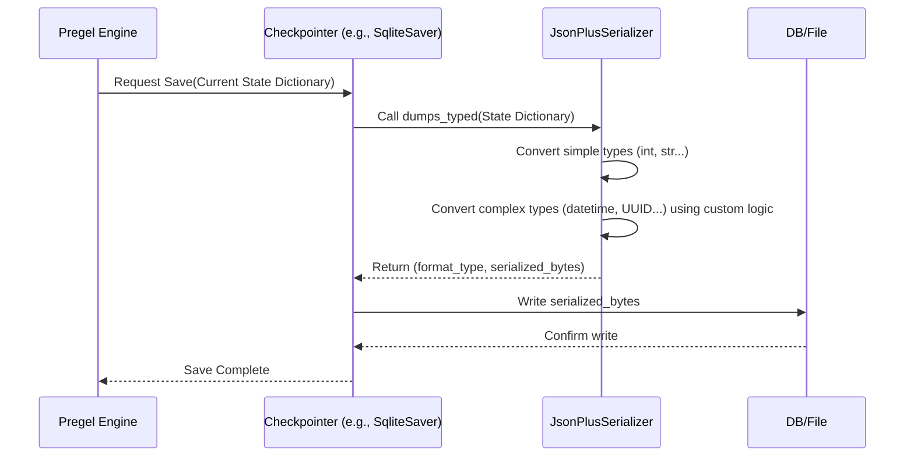

# Chapter 12: Serialization (SerDe)

Welcome to the final chapter of our core concepts tour! In [Chapter 11: Managed Values](11_managed_values.md), we saw how LangGraph can manage special resources like database connections within the graph's state. We know from [Chapter 6: Checkpointers](06_checkpointers.md) that LangGraph can save the *entire state* of our graph, allowing us to pause and resume complex workflows.

But how does that actually work? The state of our graph can contain all sorts of complex Python objects – lists of messages, Pydantic models, custom class instances, maybe even dates and times. How can LangGraph take this potentially complicated collection of information and save it into something simple like a database row or a file, and then load it back perfectly later?

## What's the Problem? Packing Your Bags for Storage

Imagine your graph's state is like the contents of your travel backpack. It contains various items: clothes (lists), your passport (a custom object), your phone (maybe a Pydantic model), a book (a string), and a watch (a datetime object).

Now, imagine you need to put this backpack into long-term storage (like a database used by a [Checkpointer](06_checkpointers.md)). You can't just shove the whole backpack into a small storage box. You need to:

1.  **Pack:** Take each item out and represent it in a simple, standard format that the storage facility understands (like making a list: "3 shirts, 1 passport (ID#...), 1 phone (Model X), 1 book ('Guide to LangGraph'), 1 watch (set to...)"). This process of converting complex items into a storable format is **Serialization**.
2.  **Store:** Put this standardized list into the storage box (database/file).
3.  **Retrieve:** Get the list back from the storage box.
4.  **Unpack:** Use the list to perfectly reconstruct your original items – putting the right time on the watch, recognizing the passport details, etc. This process of converting the stored format back into the original complex items is **Deserialization**.

Without a reliable way to pack (serialize) and unpack (deserialize) the backpack's contents (the graph state), we couldn't save our progress or reliably pause and resume our graphs.

## What is Serialization (SerDe)?

**Serialization / Deserialization (SerDe)** is the process of converting complex Python objects in memory into a format suitable for storage (like JSON or a binary format like MsgPack) and then converting that format back into the original Python objects.

Think of it as a **universal translator** between the rich world of Python objects and the simpler world of data storage.

*   **Serialization (Packing):** Python Object -> Storable Format (e.g., JSON string, bytes)
*   **Deserialization (Unpacking):** Storable Format -> Python Object

## How LangGraph Uses SerDe: The Role of Checkpointers

You generally **don't interact directly** with the serializer in LangGraph. Its primary user is the **Checkpointer** ([Chapter 6: Checkpointers](06_checkpointers.md)).

When a Checkpointer needs to save the graph's state:

1.  It gets the current state (which is a Python dictionary potentially containing complex objects).
2.  It hands this state dictionary to a **Serializer**.
3.  The Serializer converts the dictionary and its contents into a storable format (usually bytes).
4.  The Checkpointer saves these bytes to its backend (memory, database, file).

When a Checkpointer needs to load a saved state:

1.  It retrieves the stored bytes from its backend.
2.  It hands these bytes to the **Serializer**.
3.  The Serializer converts the bytes back into the original Python dictionary and objects.
4.  The Checkpointer provides this loaded state to the [Pregel Execution Engine](04_pregel_execution_engine.md) to resume the graph.

**Analogy:** The Checkpointer is the person managing the storage unit. The Serializer is the expert packer/unpacker they hire to handle the complex items inside the backpack (state).

## LangGraph's Default: `JsonPlusSerializer`

LangGraph uses a powerful default serializer called `JsonPlusSerializer`. Standard JSON is quite limited – it only directly supports strings, numbers, booleans, lists, and dictionaries. It doesn't know how to handle things like:

*   Datetime objects (`datetime.datetime`)
*   UUIDs (`uuid.UUID`)
*   Pydantic models
*   Custom Python classes
*   Sets, Deques, etc.

`JsonPlusSerializer` extends the standard JSON capabilities (and also uses the efficient MsgPack format when possible) to handle many common Python types automatically. It knows how to "pack" a datetime object into a string representation and "unpack" it back into a real datetime object later.

**Conceptual Example:**

Imagine part of your state looks like this in Python:

```python
# Python State (in memory)
state_part = {
    "last_updated": datetime.datetime(2023, 10, 27, 10, 0, 0, tzinfo=timezone.utc),
    "user_id": uuid.UUID('123e4567-e89b-12d3-a456-426614174000'),
    "settings": MyPydanticSettings(theme="dark", notifications=True)
}
```

When the `JsonPlusSerializer` saves this (using its MsgPack backend, conceptually similar to extended JSON):

```text
# Stored Representation (simplified)
Serialized data might look something like:
{
  "last_updated": {"__constructor__": "datetime", "isoformat": "2023-10-27T10:00:00+00:00"},
  "user_id": {"__constructor__": "UUID", "hex": "123e4567e89b12d3a456426614174000"},
  "settings": {"__constructor__": "MyPydanticSettings", "kwargs": {"theme": "dark", "notifications": True}}
}
# (This is stored as efficient MsgPack bytes, not exactly this JSON)
```

The serializer adds special markers (`__constructor__`, etc.) so that when it reads this data back, it knows exactly how to reconstruct the original `datetime`, `UUID`, and `MyPydanticSettings` objects.

## Under the Hood: How Serialization Works

Let's peek behind the curtain when a checkpointer saves the state.

**Non-Code Walkthrough:**

1.  **Checkpoint Triggered:** The [Pregel Execution Engine](04_pregel_execution_engine.md) decides it's time to save a checkpoint.
2.  **State Gathered:** Pregel gets the current complete state dictionary.
3.  **Checkpointer Calls Serializer:** The Checkpointer (e.g., `SqliteSaver`) receives the state dictionary and calls its serializer's `dumps_typed` method. (`dumps_typed` is used because it saves both the data *and* a hint about the format - "msgpack", "json", "bytes", etc.).
4.  **Serializer Converts:** `JsonPlusSerializer` iterates through the state dictionary. For simple types (strings, numbers), it encodes them directly. For complex types (datetime, UUID, Pydantic models), it uses its special logic (like the `_default` method shown below) to convert them into a representation that includes instructions on how to rebuild them later. It produces a stream of bytes (usually using MsgPack).
5.  **Bytes Returned:** The serializer returns the packed bytes (and the format type) to the Checkpointer.
6.  **Checkpointer Stores:** The Checkpointer writes these bytes to its storage (e.g., a database BLOB field).

**Sequence Diagram (Saving State):**



**Code Dive:**

All serializers follow a common interface defined by `SerializerProtocol`. The key methods are `dumps_typed` (serialize) and `loads_typed` (deserialize).

```python
# Simplified from langgraph/checkpoint/serde/base.py
from typing import Any, Protocol

class SerializerProtocol(Protocol):
    # ... (other methods like dumps/loads for simpler cases)

    def dumps_typed(self, obj: Any) -> tuple[str, bytes]:
        """Serialize object to (type_hint, bytes)."""
        ...

    def loads_typed(self, data: tuple[str, bytes]) -> Any:
        """Deserialize object from (type_hint, bytes)."""
        ...
```

`JsonPlusSerializer` implements this. It uses helper functions to handle types beyond basic JSON/MsgPack. When encoding (serializing), if it encounters an object it doesn't know directly, it calls a `_default` method.

```python
# Simplified concept from langgraph/checkpoint/serde/jsonplus.py
import uuid
from datetime import datetime
# ... other imports

class JsonPlusSerializer(SerializerProtocol):
    # ... (dumps_typed, loads_typed implementations) ...

    def _default(self, obj: Any) -> Union[str, dict[str, Any]]:
        """Handles objects unknown to standard JSON/MsgPack."""
        if isinstance(obj, datetime):
            # Represent datetime using its ISO format string
            # and mark it so we know how to rebuild it
            return self._encode_constructor_args(
                datetime, method="fromisoformat", args=(obj.isoformat(),)
            )
        elif isinstance(obj, uuid.UUID):
            # Represent UUID using its hex string
            return self._encode_constructor_args(uuid.UUID, args=(obj.hex,))
        elif hasattr(obj, "model_dump"): # Pydantic v2 models
             # Represent using class and dumped data
            return self._encode_constructor_args(
                obj.__class__, kwargs=obj.model_dump()
            )
        # ... (handlers for sets, decimals, Path, etc.) ...
        elif isinstance(obj, BaseException):
             # Exceptions are often just stored as their string representation
            return repr(obj)
        else:
            # If we still don't know, raise an error
            raise TypeError(f"Object of type {type(obj)} is not serializable")

    def _encode_constructor_args(self, constructor, *, method=None, args=None, kwargs=None) -> dict:
        """Helper to create the dictionary telling 'loads' how to rebuild."""
        # Creates a dict like:
        # {'lc': 2, 'type': 'constructor', 'id': ('datetime', 'datetime'),
        #  'method': 'fromisoformat', 'args': ('...iso string...',) }
        # ... implementation details ...
        out = {
            "lc": 2, # LangChain serialization version marker
            "type": "constructor",
            "id": (*constructor.__module__.split("."), constructor.__name__),
        }
        if method: out["method"] = method
        if args: out["args"] = args
        if kwargs: out["kwargs"] = kwargs
        return out

    # 'loads_typed' uses a corresponding '_reviver' function that looks for
    # these special dictionaries (like the one from _encode_constructor_args)
    # and uses the information ('id', 'method', 'args', 'kwargs') to call
    # the correct Python constructor (e.g., datetime.fromisoformat(...))
    # to rebuild the original object.
```

This clever mechanism allows `JsonPlusSerializer` to transparently handle many common Python types required for saving and loading graph states.

## Customization

While `JsonPlusSerializer` handles most common cases, if you have very exotic custom objects in your state, you *could* create your own serializer class implementing the `SerializerProtocol` and pass it to your Checkpointer when you create it (e.g., `SqliteSaver(serde=MyCustomSerializer())`). However, this is an advanced use case, and the default usually suffices.

## Conclusion

**Serialization (SerDe)** is the crucial process of converting complex Python objects within your graph's state into a simpler format for storage (by [Checkpointers](06_checkpointers.md)) and converting them back again upon loading. It's the magic that enables persistence.

*   LangGraph handles this mostly **automatically** using the `JsonPlusSerializer`.
*   `JsonPlusSerializer` can handle many types beyond standard JSON, like datetimes, UUIDs, and Pydantic models.
*   This allows Checkpointers to reliably save and load the graph's state, enabling features like resuming runs and maintaining conversation history.

You've now explored the fundamental concepts of LangGraph, from defining state and nodes/edges, understanding the execution engine, integrating tools, managing persistence with checkpointers, interacting via SDKs, using different definition styles, leveraging the CLI, and understanding the mechanics of channels, managed values, and serialization! Congratulations! You have a solid foundation to start building powerful, stateful applications with LangGraph.

---

Generated by [AI Codebase Knowledge Builder](https://github.com/The-Pocket/Tutorial-Codebase-Knowledge)