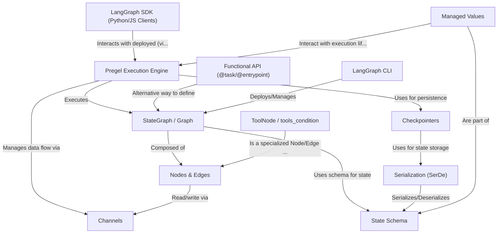

# Tutorial: langgraph

LangGraph is a framework for building **stateful, multi-step applications**, often used for creating *agents*. You design the application's logic as a **Graph** (0), defining *Nodes* (5) for computation and *Edges* (5) for transitions between them. This graph operates on a shared *State* (4), defined by a **State Schema** (4).

The **Pregel Execution Engine** (1) runs the graph, managing the flow of information through **Channels** (2). **Checkpointers** (3) enable saving and loading the graph's state, providing persistence. LangGraph also offers helpful prebuilt components like **ToolNode** (6) for agentic workflows.

You can define graphs using the standard `StateGraph` class or an alternative **Functional API** (7). Interactions with deployed graphs happen via the **LangGraph SDK** (8), while the **LangGraph CLI** (9) helps manage deployment and local execution. **Serialization** (10) handles saving complex state objects, and **Managed Values** (11) offer special state components tied to the execution lifecycle.

**Source Repository:** [https://github.com/langchain-ai/langgraph](https://github.com/langchain-ai/langgraph)

## Chapters

1. [State Schema](01_state_schema.md)
2. [Nodes & Edges](02_nodes___edges.md)
3. [StateGraph / Graph](03_stategraph___graph.md)
4. [Pregel Execution Engine](04_pregel_execution_engine.md)
5. [ToolNode / tools_condition](05_toolnode___tools_condition.md)
6. [Checkpointers](06_checkpointers.md)
7. [LangGraph SDK (Python/JS Clients)](07_langgraph_sdk__python_js_clients_.md)
8. [Functional API (@task/@entrypoint)](08_functional_api___task__entrypoint_.md)
9. [LangGraph CLI](09_langgraph_cli.md)
10. [Channels](10_channels.md)
11. [Managed Values](11_managed_values.md)
12. [Serialization (SerDe)](12_serialization__serde_.md)

---

Generated by [AI Codebase Knowledge Builder](https://github.com/The-Pocket/Tutorial-Codebase-Knowledge)