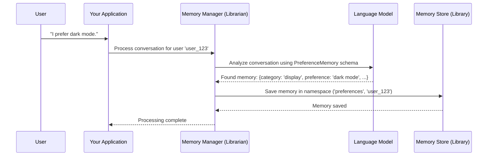

# Chapter 1: Memory Management

Welcome to the `langmem` tutorial! We're excited to guide you through building applications with persistent memory for Large Language Models (LLMs).

## Why Remember? The Forgetful AI Problem

Imagine chatting with an AI assistant. You tell it your favorite color is blue. A few minutes later, you ask it to recommend a blue shirt, and it asks, "What's your favorite color again?" Frustrating, right?

Most standard AI models have a limited memory. They often only remember the very recent parts of a conversation. Once the conversation ends, or even gets too long, they forget everything! This makes it hard to build truly helpful and personalized AI assistants.

`langmem` tackles this problem head-on with its **Memory Management** system.

## Meet the Intelligent Librarian: Core Concept

Think of `langmem`'s memory management like having an incredibly smart librarian working alongside your AI.

1.  **Listening:** The librarian listens carefully to the conversation between you and the AI.
2.  **Understanding:** It automatically figures out the important pieces of information – facts, preferences, key events, etc.
3.  **Indexing:** It writes down this information onto detailed index cards. We call these structured pieces of information **"memories"**. Each memory card is neatly organized following a specific template or structure (we'll cover this in [Memory Schemas](02_memory_schemas.md)).
4.  **Filing:** The librarian files these memory cards into the correct section of a vast library. This "library" is our **"store"** (a database where memories are kept safe). Each "section" helps organize memories, perhaps by user ID or topic, and is called a **"namespace"**.

This whole process ensures that important information isn't lost and can be easily found later. The `create_memory_store_manager` function in `langmem` is like hiring and instructing this librarian.

## Our Goal: Remembering a User's Preference

Let's set a simple goal: we want our AI assistant to remember a user's preference, like preferring dark mode for applications.

## Using the Librarian: `create_memory_store_manager`

The main tool we'll use is `create_memory_store_manager`. It sets up our "librarian" to automatically listen to conversations and save important memories.

Here's how we can use it:

1.  **Define the Memory Structure:** First, we need to tell the librarian *what kind* of information to look for. We define a structure (a "schema") for the memory. Let's create one for preferences.

    ```python
    # We use Pydantic's BaseModel to define the structure
    from pydantic import BaseModel

    class PreferenceMemory(BaseModel):
        """A structure to store user preferences."""
        category: str  # e.g., "display", "food"
        preference: str # e.g., "dark mode", "spicy"
        context: str   # Where did they mention this?
    ```

    *   This tells our librarian: "Look for preferences. When you find one, record its category, the specific preference, and the context where it was mentioned." We'll dive deeper into this in [Memory Schemas](02_memory_schemas.md).

2.  **Hire the Librarian (Create the Manager):** Now, we create the memory manager instance.

    ```python
    # Import the function
    from langmem import create_memory_store_manager
    # Import a simple in-memory store (like a small filing cabinet)
    # We'll discuss stores more in [Store Interaction](09_store_interaction.md)
    from langgraph.store.memory import InMemoryStore

    # Create a simple store
    # (Details aren't crucial now, just know it's where memories live)
    my_memory_store = InMemoryStore()

    # Create the manager
    memory_manager = create_memory_store_manager(
        model="openai:gpt-4o-mini", # Which AI model helps the librarian understand?
        schemas=[PreferenceMemory], # What structures (schemas) should it look for?
        namespace=("preferences", "{langgraph_user_id}"), # Where to file memories?
        store=my_memory_store # Where is the library (store)?
    )
    ```

    *   `model`: Specifies the LLM that will analyze the conversation to extract memories.
    *   `schemas`: A list of the memory structures our librarian should use (like our `PreferenceMemory`).
    *   `namespace`: Defines the filing system. Here, all memories go into a "preferences" section, further divided by a user ID. We'll explore this dynamic naming in [Namespace Templating](03_namespace_templating.md).
    *   `store`: The actual storage system (our `InMemoryStore` for this example).

3.  **Process a Conversation:** Let's give the manager a conversation to process.

    ```python
    # A simple conversation snippet
    conversation = [
        {"role": "user", "content": "I really prefer dark mode in my apps."},
        {"role": "assistant", "content": "Got it, I'll remember you like dark mode."}
    ]

    # Tell the manager to process it for user 'user_123'
    # We use 'ainvoke' for asynchronous processing
    import asyncio

    async def process():
        print("Librarian is processing the conversation...")
        await memory_manager.ainvoke(
            {"messages": conversation},
            # Configuration tells the manager *which* user's section to file under
            config={"configurable": {"langgraph_user_id": "user_123"}}
        )
        print("Processing complete!")

    asyncio.run(process())
    ```

    *   Input: We provide the `conversation` (a list of messages) to the `memory_manager`.
    *   Configuration: We also provide `config` which includes the specific `langgraph_user_id`. This fills in the `{langgraph_user_id}` placeholder in our namespace, ensuring the memory is filed correctly under `("preferences", "user_123")`.
    *   Output/Effect: The manager doesn't directly return the memory here. Instead, it *analyzes* the conversation using the specified LLM and *saves* any identified `PreferenceMemory` instances into `my_memory_store` under the correct namespace.

After running this, a new "memory card" (a `PreferenceMemory` instance) about the user liking dark mode would be stored in our `my_memory_store` within the `("preferences", "user_123")` section. The AI can later retrieve this information!

## Under the Hood: How the Librarian Works

What happens when you call `memory_manager.ainvoke`?

1.  **Receive Request:** The manager gets the conversation messages and the configuration (like the user ID).
2.  **Prepare Analysis:** It combines the conversation, the instructions it was given (implicitly or explicitly), and the defined schemas (`PreferenceMemory` in our case).
3.  **Consult LLM:** It sends this package to the specified LLM (e.g., `openai:gpt-4o-mini`). It asks the LLM: "Based on this conversation and the schemas, what memories should be created or updated?"
4.  **Extract Memories:** The LLM analyzes the text and generates structured data matching the schemas. For our example, it would identify the preference for "dark mode" in the "display" category.
5.  **Store Memories:** The manager takes the structured memories from the LLM and saves them into the provided `store` under the correct `namespace`.

Here's a simplified diagram:



## Deeper Dive into the Code (Optional)

The core logic often resides within components that process conversational state. For instance, in `langmem`'s graph-based systems (which you might encounter later), a function like `enrich` orchestrates this.

```python
# Simplified snippet inspired by src/langmem/graphs/semantic.py

# ... (imports and setup) ...

async def enrich(state: dict, config: dict): # State contains messages, config has user_id etc.
    messages = state.get("messages", [])
    if not messages: return {"updated_memories": []} # Skip if no messages

    # Get configuration details
    configurable = config.get("configurable", {})
    user_id = configurable.get("langgraph_user_id", "unknown_user")
    schemas = state.get("schemas", []) # Schemas might be passed dynamically

    # This is the key part: creating the manager!
    manager = create_memory_store_manager(
        model="openai:gpt-4o-mini",
        schemas=schemas, # Pass the schemas it should use
        # Construct the namespace dynamically using the user_id
        namespace=("some_base_section", user_id),
        # Note: In real graphs, the store is often implicitly managed
        # store=get_current_store() # Pseudo-code for getting the store
    )

    # Use the manager to process messages and automatically store memories
    updated_memories = await manager(messages) # Implicitly calls ainvoke

    # Return information about what memories were updated (optional)
    return {"updated_memories": updated_memories}

# ... (rest of the graph setup) ...
```

This `enrich` function acts as a step within a larger process. It dynamically creates a `memory_store_manager` tailored to the current context (user, schemas) and uses it to analyze the latest messages and update the persistent memory store. The `create_memory_store_manager` function itself (from `src/langmem/knowledge/__init__.py`) sets up the necessary prompts and interactions with the LLM and the store.

## Conclusion

Memory Management is the heart of giving your AI a persistent memory. By using tools like `create_memory_store_manager`, you instruct an "intelligent librarian" to automatically extract structured information (memories) based on predefined templates (schemas) from conversations and file them away neatly (in namespaces) within a persistent store. This allows your AI to remember facts, preferences, and events across multiple interactions.

In the next chapter, we'll look closely at how to define those memory templates using [Memory Schemas](02_memory_schemas.md).

---

Generated by [AI Codebase Knowledge Builder](https://github.com/The-Pocket/Tutorial-Codebase-Knowledge)