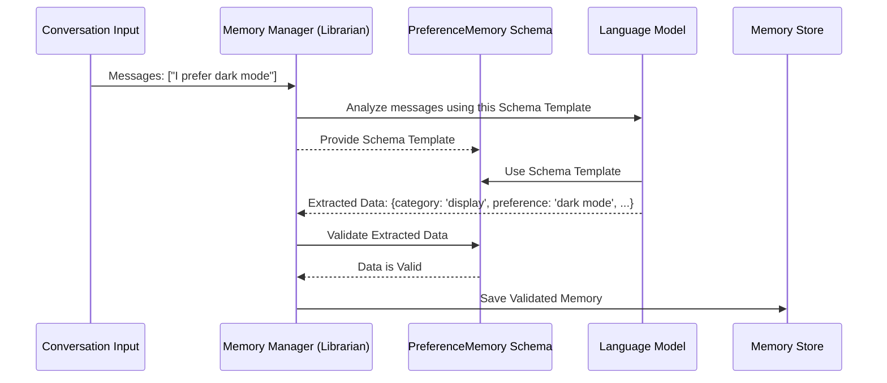

# Chapter 2: Memory Schemas - Designing the Index Cards

Welcome back! In [Chapter 1: Memory Management](01_memory_management.md), we met our "intelligent librarian" – the `langmem` system that helps our AI remember things. We learned that the librarian listens to conversations, identifies important information, and files it away as "memories" on index cards.

But how does the librarian know what information to write on each card? And how does it ensure all cards for the same *type* of information (like user preferences) look consistent? That's where **Memory Schemas** come in!

## What's a Memory Schema? The Blueprint for Memories

Imagine our librarian wants to create index cards specifically for tracking user preferences. Should each card just have a random scribble? Probably not! A good librarian would design a template first.

*   Maybe the template requires a "Category" field (like "Display", "Food", "Music").
*   It needs a "Preference Details" field (like "dark mode", "spicy", "classical").
*   It might also need a "Source" field (like "Chat on June 10th").

A **Memory Schema** is exactly this: **the definition or blueprint for the structure of a specific type of memory.** It tells the system precisely what pieces of information belong in that memory and what to call them.

In `langmem`, we typically define these blueprints using a popular Python library called Pydantic, or sometimes just simple Python dictionaries.

## Why Use Schemas? Consistency is Key!

Using schemas (or templates) offers several big advantages:

1.  **Consistency:** Every memory of the same type will have the same structure. All "User Preference" memories will have a `category`, `preference`, and `context`, making them predictable.
2.  **Reliability:** The system knows exactly what information it's trying to extract. It's not just guessing; it's looking for data that fits the defined schema.
3.  **Easier Searching:** When all your preference memories are structured the same way, it's much easier to search through them later. Imagine asking the librarian: "Find all preferences in the 'Food' category." This is simple if every card has a clearly marked `category` field!

Without schemas, memories might be stored inconsistently, making them hard to understand and unreliable to retrieve. It would be like a library where every index card is formatted differently – a chaotic mess!

## Defining a Schema: Our Preference Blueprint

Let's revisit the `PreferenceMemory` schema we briefly saw in Chapter 1. This is how we define the "index card template" for user preferences using Pydantic.

```python
# Import the necessary tool from Pydantic
from pydantic import BaseModel

# Define our schema by creating a class that inherits from BaseModel
class PreferenceMemory(BaseModel):
    """A structure to store user preferences."""
    # Field 1: What category does the preference belong to?
    # We expect this to be a string (text).
    category: str

    # Field 2: What is the actual preference?
    # Also expected to be a string.
    preference: str

    # Field 3: Where did we learn this preference?
    # A string describing the context.
    context: str
```

Let's break this down:

*   `from pydantic import BaseModel`: We import the basic building block for schemas from the Pydantic library.
*   `class PreferenceMemory(BaseModel):`: We declare a new Python class named `PreferenceMemory`. By making it inherit from `BaseModel`, we turn it into a schema definition.
*   `"""A structure to store user preferences."""`: This is a docstring, a helpful description of what this schema represents.
*   `category: str`: This defines a field named `category`. The `: str` part is a *type hint*, telling Python (and `langmem`) that the value for `category` should be a string (text).
*   `preference: str`: Defines the `preference` field, also a string.
*   `context: str`: Defines the `context` field, also a string.

That's it! We've designed our index card template. Any time the system creates a `PreferenceMemory`, it *must* have these three pieces of information, and they must be strings. Pydantic helps enforce this structure automatically.

## How `langmem` Uses Schemas

Remember the `create_memory_store_manager` function from Chapter 1? One of its key arguments was `schemas`:

```python
# From Chapter 1... (simplified)
memory_manager = create_memory_store_manager(
    model="openai:gpt-4o-mini",
    # Here's where we tell the manager about our schema!
    schemas=[PreferenceMemory],
    # ... other arguments ...
)
```

When we provide `[PreferenceMemory]` to the manager, we're essentially handing our librarian the blueprint. Here's what happens "under the hood" when the manager processes a conversation:

1.  **Analyze Request:** The manager receives the conversation messages.
2.  **Instruct LLM:** It sends the conversation to the underlying Language Model (like `gpt-4o-mini`). Crucially, it also tells the LLM: "Read this conversation and identify any information that fits the structure defined by these schemas: `PreferenceMemory` (which requires `category`, `preference`, `context`)."
3.  **Extract Structured Data:** The LLM analyzes the text and tries to fill in the template. If the user said "I love dark mode for my apps", the LLM might generate data like: `{ "category": "display", "preference": "dark mode", "context": "User mentioned preference in chat." }`.
4.  **Validate & Store:** `langmem` takes the structured data from the LLM. It checks if it perfectly matches the `PreferenceMemory` schema (using Pydantic's validation). If it does, the structured memory is saved to the [Memory Store](09_store_interaction.md).

Here's a simplified flow:



The schema acts as a crucial guide for the LLM and a quality check before storing the memory.

## Conclusion

Memory Schemas are the blueprints that define the structure of our memories. By defining schemas using tools like Pydantic's `BaseModel`, we tell `langmem` *what* kind of information to look for and *how* to structure it. This ensures our memories are consistent, reliable, and easy to search later – just like well-designed index cards in a library.

We've now seen how to design the *content* of our memory cards (Schemas). In the next chapter, we'll learn how to organize *where* these cards are filed using [Namespace Templating](03_namespace_templating.md).

---

Generated by [AI Codebase Knowledge Builder](https://github.com/The-Pocket/Tutorial-Codebase-Knowledge)