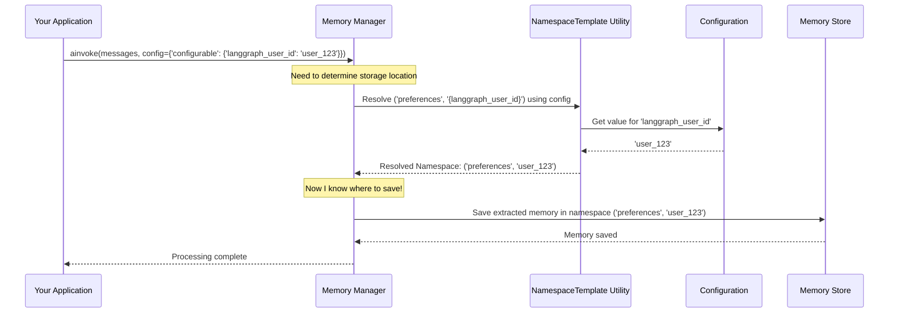

# Chapter 3: Namespace Templating - Organizing Memories

Welcome back! In [Chapter 2: Memory Schemas](02_memory_schemas.md), we learned how to create blueprints (Schemas) for our AI's memories, ensuring they have a consistent structure like well-designed index cards.

Now, imagine our AI assistant is helping many different users, or maybe even working on several different projects for the *same* user. If we just threw all the memory "index cards" into one giant box, it would be chaos! How would the AI find the preferences for `user_123` without mixing them up with `user_456`'s preferences? How could it keep notes for "Project Alpha" separate from "Project Beta"?

We need a way to **organize** these memories into separate sections or folders. This is where **Namespace Templating** comes in!

## The Problem: One Big Memory Box

Without organization, every memory the AI saves goes into the same pool.

*   User A tells the AI: "My favorite color is blue." -> Memory saved.
*   User B tells the AI: "My favorite color is green." -> Memory saved in the *same* place.
*   Later, User A asks: "What's my favorite color?" The AI might retrieve User B's preference by mistake!

This is especially important in applications where the AI interacts with multiple users (multi-tenant apps) or handles distinct tasks or contexts (like different chat sessions or projects).

## The Solution: Labeled Filing Cabinets (Namespaces)

A **namespace** in `langmem` is like a labeled drawer or folder in a filing cabinet. It's a specific scope where related memories are stored.

For example, we could decide:
*   All memories for `user_123` go into a namespace called `('user_data', 'user_123')`.
*   All memories for `user_456` go into `('user_data', 'user_456')`.
*   Memories for `user_123`'s 'Project Alpha' go into `('projects', 'user_123', 'alpha')`.

This keeps everything neat and prevents information from leaking between different contexts.

## Making Labels Dynamic: Namespace Templating

Hardcoding namespaces like `('user_data', 'user_123')` works, but it's not flexible. What happens when a new user, `user_789`, signs up? We'd have to change our code!

We need a way to create these namespace labels *dynamically* based on who is currently interacting with the AI or what project they are working on. This is **Namespace Templating**.

Think of it like creating an address label template:

`To: {user_name}, Department: {dept_id}`

When we need to send mail, we take the template and fill in the specific `user_name` and `dept_id` from the current context.

`langmem` uses a similar idea with the `NamespaceTemplate` utility. We define a namespace structure with placeholders (variables in curly braces `{}`), and `langmem` automatically fills them in at runtime using information from the current session, like the user ID.

## Using `NamespaceTemplate`

Let's see how this works in practice. The `NamespaceTemplate` is usually defined when setting up the memory system, particularly with `create_memory_store_manager` from [Chapter 1: Memory Management](01_memory_management.md).

Remember this snippet?

```python
# From Chapter 1... (simplified)
from langmem import create_memory_store_manager
from langgraph.store.memory import InMemoryStore
from pydantic import BaseModel

# Define a simple schema (from Chapter 2)
class PreferenceMemory(BaseModel):
    category: str
    preference: str
    context: str

my_memory_store = InMemoryStore() # Our simple memory storage

# Create the manager with a NAMESPACE TEMPLATE
memory_manager = create_memory_store_manager(
    model="openai:gpt-4o-mini",
    schemas=[PreferenceMemory],
    # Here's the template!
    namespace=("preferences", "{langgraph_user_id}"), # Defines the structure
    store=my_memory_store
)
```

*   `namespace=("preferences", "{langgraph_user_id}")`: This is the key part! We're not providing a fixed namespace. Instead, we provide a tuple representing the structure.
    *   `"preferences"`: The first part of the namespace is fixed. All memories managed by this instance will be related to preferences.
    *   `"{langgraph_user_id}"`: The second part is a **placeholder**. `langmem` expects to find a value for `langgraph_user_id` in the runtime configuration.

## Filling the Template: The `config` Dictionary

How does `langmem` know what value to put into `{langgraph_user_id}`? It looks inside the `config` dictionary that you pass when you *use* the memory manager, typically when calling `.invoke` or `.ainvoke`.

```python
import asyncio

# A simple conversation
conversation = [
    {"role": "user", "content": "I always prefer dark mode."},
]

# Process for user 'user_123'
async def process_for_user123():
    print("Processing for user_123...")
    await memory_manager.ainvoke(
        {"messages": conversation},
        # This config provides the value for the placeholder!
        config={"configurable": {"langgraph_user_id": "user_123"}}
    )
    print("Memory for user_123 potentially saved.")

# Process the SAME conversation, but for user 'user_456'
async def process_for_user456():
    print("\nProcessing for user_456...")
    await memory_manager.ainvoke(
        {"messages": conversation},
        # Different user ID in the config
        config={"configurable": {"langgraph_user_id": "user_456"}}
    )
    print("Memory for user_456 potentially saved.")

async def run_both():
    await process_for_user123()
    await process_for_user456()

asyncio.run(run_both())
```

**What happens here?**

1.  **`process_for_user123`:**
    *   We call `memory_manager.ainvoke`.
    *   We provide `config={"configurable": {"langgraph_user_id": "user_123"}}`.
    *   The `memory_manager` sees its namespace template `("preferences", "{langgraph_user_id}")`.
    *   It looks up `langgraph_user_id` in the `config`'s `configurable` dictionary and finds `"user_123"`.
    *   It resolves the **final namespace** to `('preferences', 'user_123')`.
    *   Any `PreferenceMemory` extracted from the conversation is saved under *this specific namespace* in the `my_memory_store`.

2.  **`process_for_user456`:**
    *   We call `memory_manager.ainvoke` again.
    *   This time, the `config` provides `langgraph_user_id` as `"user_456"`.
    *   The `memory_manager` resolves the **final namespace** to `('preferences', 'user_456')`.
    *   Any `PreferenceMemory` extracted is saved under *this different namespace*.

Even though we processed the same conversation content, the resulting memories are automatically filed into separate "folders" based on the `langgraph_user_id` provided at runtime! This keeps user data separate and organized.

## Under the Hood: How Templating Works

The magic happens via the `langmem.utils.NamespaceTemplate` class. You don't usually interact with it directly when using `create_memory_store_manager`, but understanding it helps clarify the process.

1.  **Initialization:** When you pass `("preferences", "{langgraph_user_id}")` to `create_memory_store_manager`, it likely creates a `NamespaceTemplate` instance internally. This instance stores the template structure and identifies the placeholders (like `{langgraph_user_id}`).
2.  **Invocation:** When you call `memory_manager.ainvoke(..., config=...)`:
    *   The manager needs to know *where* to save the memory.
    *   It calls its internal `NamespaceTemplate` instance, passing the `config` dictionary.
    *   The `NamespaceTemplate` looks inside `config["configurable"]` for keys matching its stored placeholders.
    *   It substitutes the found values into the template string(s).
    *   It returns the final, resolved namespace tuple (e.g., `('preferences', 'user_123')`).
3.  **Storage:** The memory manager then uses this resolved namespace when interacting with the [Memory Store](09_store_interaction.md) to save or potentially search for memories.

Here’s a simplified diagram of the resolution process during invocation:



## Deeper Dive into the Code (Optional)

The `NamespaceTemplate` utility itself is quite straightforward. It's defined in `src/langmem/utils.py`.

```python
# Simplified from src/langmem/utils.py
import typing
from langgraph.utils.config import get_config # Used to automatically find config if needed
from langmem import errors # Custom error types

class NamespaceTemplate:
    """Utility for templating namespace strings from configuration."""
    __slots__ = ("template", "vars")

    def __init__(
        self, template: typing.Union[tuple[str, ...], str]
    ):
        # Store the template structure (e.g., ('preferences', '{user_id}'))
        self.template = template if isinstance(template, tuple) else (template,)
        # Identify placeholders and their positions
        self.vars = {
            ix: key[1:-1] # Store variable name without braces {}
            for ix, key in enumerate(self.template)
            if isinstance(key, str) and key.startswith("{") and key.endswith("}")
        }

    def __call__(self, config: dict | None = None) -> tuple[str, ...]:
        # Try to get config automatically if not provided (in LangGraph context)
        try:
            config = config or get_config()
        except RuntimeError:
            config = {} # Default to empty config if no context

        if not self.vars: # If no placeholders, just return the template
            return self.template

        # Get the 'configurable' part of the config
        configurable = config.get("configurable", {})

        # Build the final namespace tuple
        resolved_namespace = []
        for ix, part in enumerate(self.template):
            if ix in self.vars: # Is this part a placeholder?
                var_name = self.vars[ix]
                if var_name not in configurable:
                    # Raise an error if a required variable is missing
                    raise errors.ConfigurationError(
                        f"Missing key in 'configurable': {var_name}"
                    )
                resolved_namespace.append(configurable[var_name]) # Substitute value
            else:
                resolved_namespace.append(part) # Keep fixed part as is

        return tuple(resolved_namespace)

# Example Usage (standalone)
ns_template = NamespaceTemplate(("project", "{project_id}", "user", "{user_id}"))

my_config = {"configurable": {"project_id": "alpha", "user_id": "dev_1"}}
resolved = ns_template(my_config)
print(f"Resolved namespace: {resolved}")
# Output: Resolved namespace: ('project', 'alpha', 'user', 'dev_1')

my_other_config = {"configurable": {"project_id": "beta", "user_id": "test_2"}}
resolved_other = ns_template(my_other_config)
print(f"Resolved namespace: {resolved_other}")
# Output: Resolved namespace: ('project', 'beta', 'user', 'test_2')
```

This shows how the `NamespaceTemplate` takes a template structure and a configuration dictionary, and dynamically produces the final namespace tuple used for organizing memories. The `create_memory_store_manager` uses this utility internally to handle the `namespace` parameter effectively.

## Conclusion

Namespace Templating is a powerful feature in `langmem` for organizing memories. By defining namespace structures with placeholders (like `{langgraph_user_id}`), you can dynamically route memories to the correct "folder" based on runtime information passed in the `config` dictionary. This is essential for building robust AI applications that handle multiple users, sessions, or contexts correctly, ensuring memories are stored and retrieved from the right place.

We now know how to define the *structure* of memories ([Memory Schemas](02_memory_schemas.md)) and how to *organize* where they are stored (Namespace Templating). But how can the AI *itself* interact with these memories? In the next chapter, we'll explore [Memory Tools](04_memory_tools.md), which allow the AI to actively manage its own memory.

---

Generated by [AI Codebase Knowledge Builder](https://github.com/The-Pocket/Tutorial-Codebase-Knowledge)