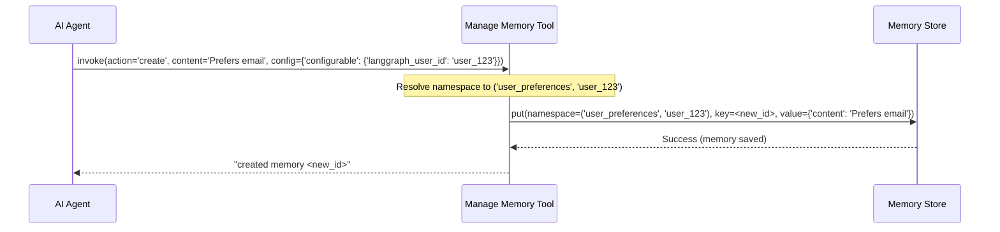

# Chapter 4: Memory Tools - Giving the AI Control Over its Memory

Welcome back! In [Chapter 3: Namespace Templating](03_namespace_templating.md), we learned how to neatly organize our AI's memories into different sections using dynamic labels called namespaces. This keeps everything tidy, like having separate filing drawers for different users or projects.

So far, our "intelligent librarian" (the `create_memory_store_manager` from [Chapter 1: Memory Management](01_memory_management.md)) has been working automatically in the background, listening to conversations and deciding what memories to save based on the [Memory Schemas](02_memory_schemas.md) we gave it.

But what if *we* (or the AI assistant itself!) want to explicitly tell the librarian what to do? What if the user says, "Hey AI, please remember my birthday is December 5th!" or asks, "What did we decide about the project deadline yesterday?"

The automatic system might miss these explicit instructions, or the AI might need to specifically look up past information. We need a way for the AI assistant to directly interact with the memory system. That's where **Memory Tools** come in!

## The Need for Direct Interaction: Request Forms for the Librarian

Think back to our librarian analogy. The librarian has been diligently filing away index cards based on listening to conversations. Memory Tools are like giving the AI assistant (or perhaps an assistant helping the librarian) specific **request forms** it can fill out and hand to the librarian.

There are two main types of forms:

1.  **"Manage Memory" Form (`create_manage_memory_tool`):** This form lets the assistant tell the librarian to:
    *   **Create:** Add a brand new index card (memory).
    *   **Update:** Change the information on an existing index card.
    *   **Delete:** Remove an old index card.
2.  **"Search Memory" Form (`create_search_memory_tool`):** This form lets the assistant ask the librarian:
    *   "Find all index cards related to [topic]."

These tools empower the AI agent using `langmem` to take direct control over the memory store, rather than relying solely on automatic background processing.

## Use Case: Explicitly Remembering & Searching

Let's consider our AI assistant again.

*   **Scenario 1 (Manage):** A user explicitly tells the AI, "Please remember that my favorite programming language is Python." The AI needs a way to take this statement and *ensure* it gets saved as a memory. It can use the "Manage Memory" tool to create a new memory entry.
*   **Scenario 2 (Search):** The user later asks, "What programming language did I say I liked?" The AI needs to look up this specific piece of information. It can use the "Search Memory" tool to query its memory store for preferences related to programming languages.

## Creating the Memory Tools

Just like we hired our librarian using `create_memory_store_manager`, we can create these tools using specific functions from `langmem`. These tools are typically given to an AI agent (like those built with Langchain or LangGraph) so the agent can decide when and how to use them during a conversation.

### 1. Creating the "Manage Memory" Tool

This tool allows the agent to add, change, or remove memories.

```python
# Import the function
from langmem import create_manage_memory_tool
# We also need a store, just like before
from langgraph.store.memory import InMemoryStore

# Assume we have a store set up (perhaps shared with memory management)
my_memory_store = InMemoryStore()

# Create the manage tool
manage_tool = create_manage_memory_tool(
    # Define the namespace template where this tool OPERATES
    # This MUST match the context (e.g., user) the agent is handling
    namespace=("user_preferences", "{langgraph_user_id}"),
    # Optionally, define the structure of memories this tool manages
    # schema=MyPreferenceSchema, # We can use schemas from Chapter 2!
    # Optionally, limit actions (e.g., only allow creating)
    # actions_permitted=("create",),
    # Provide the store (can often be inferred in LangGraph agents)
    store=my_memory_store,
    # Give the tool a name the agent will recognize
    name="manage_user_memory"
)

print(f"Created tool: {manage_tool.name}")
print(f"Description: {manage_tool.description[:100]}...") # Show part of the description
```

*   `namespace=("user_preferences", "{langgraph_user_id}")`: Just like in Chapter 3, this tells the tool *where* to manage memories. It uses the `langgraph_user_id` from the runtime `config` to target the correct user's preference section.
*   `store=my_memory_store`: Specifies the memory library (database) this tool interacts with.
*   `name="manage_user_memory"`: Gives the tool a specific name. The AI agent uses this name to call the tool.
*   The function returns a `StructuredTool` object, which agents know how to use. Its description tells the agent *when* and *how* to use it (e.g., "Proactively call this tool when you identify a new USER preference...").

### 2. Creating the "Search Memory" Tool

This tool allows the agent to look up existing memories.

```python
# Import the function
from langmem import create_search_memory_tool
# Assume we use the same store
# from langgraph.store.memory import InMemoryStore
# my_memory_store = InMemoryStore() # (already created above)

# Create the search tool
search_tool = create_search_memory_tool(
    # Define the namespace template where this tool SEARCHES
    # Again, uses runtime config to target the correct user/context
    namespace=("user_preferences", "{langgraph_user_id}"),
    # Provide the store (can often be inferred)
    store=my_memory_store,
    # Give the tool a name
    name="search_user_memory"
)

print(f"Created tool: {search_tool.name}")
print(f"Description: {search_tool.description[:100]}...") # Show part of the description
```

*   `namespace`: Similar to the manage tool, this defines *where* the tool should perform its search, using the runtime configuration to find the right section (e.g., `('user_preferences', 'user_123')`).
*   `store`: The memory store to search within.
*   `name`: The name the agent uses to invoke this search capability.
*   The description guides the agent on how to use the search (e.g., "Search your long-term memories for information relevant...").

## How an Agent Uses the Tools

You typically provide these created tools (`manage_tool`, `search_tool`) to an AI agent framework (like LangGraph's `create_react_agent`). The agent's underlying LLM then decides, based on the conversation and the tool descriptions, whether to use a tool.

*   **Agent using `manage_user_memory`:**
    *   User says: "Remember I prefer communication via email."
    *   Agent's LLM decides: "This sounds like a preference. I should use the `manage_user_memory` tool to save this."
    *   Agent prepares input for the tool: `{"action": "create", "content": "User prefers communication via email"}`.
    *   Agent calls `manage_tool.invoke(...)` with this input and the `config` containing `langgraph_user_id`.
    *   The tool saves the memory to the store under `('user_preferences', 'the_user_id')`.
    *   The tool might return: `"created memory <some_new_id>"`.
    *   Agent tells the user: "Okay, I'll remember you prefer email."

*   **Agent using `search_user_memory`:**
    *   User asks: "How do I prefer to be contacted?"
    *   Agent's LLM decides: "I need to find the user's preference. I should use the `search_user_memory` tool."
    *   Agent prepares input for the tool: `{"query": "preferred contact method"}`.
    *   Agent calls `search_tool.invoke(...)` with this input and the `config`.
    *   The tool searches the store within `('user_preferences', 'the_user_id')`.
    *   The tool returns a list of relevant memories, e.g., `"[{\"content\": \"User prefers communication via email\", ...}]"`.
    *   Agent uses this information to answer: "You previously mentioned you prefer communication via email."

## Under the Hood: How the Tools Interact with the Store

When an agent invokes one of these tools, what actually happens?

1.  **Tool Invoked:** The agent calls the tool (e.g., `manage_tool.ainvoke`) with specific arguments (like `content`, `action`, `id` or `query`) and the runtime `config`.
2.  **Resolve Namespace:** The tool uses its internal `NamespaceTemplate` (from [Chapter 3: Namespace Templating](03_namespace_templating.md)) and the provided `config` to figure out the exact namespace path (e.g., `('user_preferences', 'user_123')`).
3.  **Get Store:** The tool identifies the correct `BaseStore` instance (either provided directly or found from the agent's context).
4.  **Perform Action:**
    *   **Manage Tool:** Calls the store's `.put(...)` (for create/update) or `.delete(...)` method, passing the resolved namespace, a memory key (ID), and the content.
    *   **Search Tool:** Calls the store's `.search(...)` method, passing the resolved namespace and the search query.
5.  **Return Result:** The tool formats the result from the store (e.g., success message, list of found memories) and returns it to the agent.

Here's a simplified diagram for the "Manage Memory" tool flow:



## Deeper Dive into the Code (Optional)

The functions `create_manage_memory_tool` and `create_search_memory_tool` are defined in `src/langmem/knowledge/tools.py`. Let's peek at `create_manage_memory_tool`:

```python
# Simplified from src/langmem/knowledge/tools.py
import typing
from langchain_core.tools import StructuredTool
from langgraph.store.base import BaseStore
from langmem import utils # Contains NamespaceTemplate

def create_manage_memory_tool(
    namespace: tuple[str, ...] | str, # <-- Takes the namespace template
    *,
    store: typing.Optional[BaseStore] = None, # <-- Takes the store
    schema: typing.Type = str,
    actions_permitted: typing.Optional[tuple[...]] = ("create", "update", "delete"),
    name: str = "manage_memory",
    # ... other args like instructions
):
    # 1. Create the Namespace Templater
    namespacer = utils.NamespaceTemplate(namespace)
    initial_store = store

    # 2. Define the actual function the agent will call (async version shown)
    async def amanage_memory(
        content: typing.Optional[schema] = None,
        action: typing.Literal[actions_permitted] = ..., # type: ignore
        *,
        id: typing.Optional[str] = None, # Changed to str for simplicity
    ):
        # a. Get the store (finds it from context if initial_store is None)
        resolved_store = _get_store(initial_store)
        # b. Resolve the namespace using the config passed during invocation
        resolved_namespace = namespacer() # Looks for config automatically
        # c. Perform the action (create, update, delete) on the store
        if action == "delete":
            await resolved_store.adelete(resolved_namespace, key=id)
            return f"Deleted memory {id}"
        # ... (logic for create/update using store.aput) ...
        new_id = id or "some-new-id" # Generate ID if creating
        await resolved_store.aput(resolved_namespace, key=new_id, value={"content": content})
        return f"{action}d memory {new_id}"

    # 3. Define the sync version (similar logic)
    def manage_memory(...): ...

    # 4. Create the description for the agent
    description = f"""Use this tool to {", ".join(actions_permitted)} memories..."""

    # 5. Package it as a StructuredTool
    return StructuredTool.from_function(
        manage_memory, # Sync function
        amanage_memory, # Async function
        name=name,
        description=description
        # The tool automatically gets args like 'content', 'action', 'id'
        # from the function signatures.
    )

# Helper function to get the store (simplified)
def _get_store(initial_store):
    if initial_store: return initial_store
    # In real code, tries to get store from LangGraph context
    raise ValueError("Store not provided and couldn't be found in context")
```

This shows the core steps:
1.  Set up the namespace handling using `NamespaceTemplate`.
2.  Define the core logic function (`amanage_memory`) that resolves the namespace and interacts with the store (`resolved_store.adelete`, `resolved_store.aput`).
3.  Wrap this logic into a `StructuredTool` that the agent framework understands, providing the name and description.

The `create_search_memory_tool` follows a very similar pattern but defines functions that call `store.search` or `store.asearch`.

## Conclusion

Memory Tools (`create_manage_memory_tool`, `create_search_memory_tool`) bridge the gap between automatic memory processing and direct agent control. They act like specific request forms, allowing an AI agent to explicitly create, update, delete, or search for memories within the correct [namespace](03_namespace_templating.md) in the [memory store](09_store_interaction.md). This gives the agent much finer-grained control over its persistent knowledge base, enabling it to handle explicit user requests to remember information or to actively recall past details when needed.

So far, we've focused on *what* memories are (Schemas), *where* they are stored (Namespaces), and *how* the agent can interact with them (Tools). But how can we make the underlying *prompts* that drive memory extraction and tool usage more effective? In the next chapter, we'll explore [Prompt Optimization](05_prompt_optimization.md).

---

Generated by [AI Codebase Knowledge Builder](https://github.com/The-Pocket/Tutorial-Codebase-Knowledge)