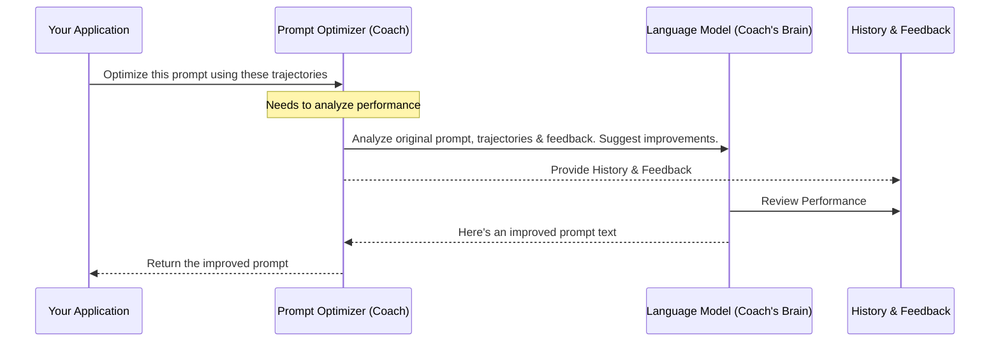

# Chapter 5: Prompt Optimization - Automatically Improving Instructions

Welcome back! In [Chapter 4: Memory Tools](04_memory_tools.md), we saw how to give our AI agent specific tools to actively manage and search its memory. Now, let's shift focus from the AI's *actions* to its *understanding* – specifically, the instructions or "prompts" we give it.

## The Challenge: Writing Perfect Prompts is Hard!

Imagine you're directing an actor (our Large Language Model or LLM). You give them a script (a "prompt") telling them how to play a character – maybe "You are a helpful assistant."

Sometimes, the actor's performance (the LLM's responses) isn't quite right. Maybe the "helpful assistant" gives answers that are too long, too technical, or misses the point. You could manually rewrite the script (the prompt) again and again, trying different phrasing until the actor performs better. But this takes a lot of time and guesswork!

Wouldn't it be great if you had a **writing coach** who could watch the actor's performance, read the director's feedback ("The answer was too complex!"), and *automatically* rewrite the script to guide the actor towards a better performance next time?

That's exactly what **Prompt Optimization** in `langmem` does!

## What is Prompt Optimization? Meet the AI Writing Coach

**Prompt Optimization** is `langmem`'s ability to automatically improve LLM prompts based on examples of past interactions (we call these **trajectories**) and any feedback received on those interactions.

*   **Trajectories:** These are records of past conversations, including what the user said and what the AI assistant said.
*   **Feedback:** This is information about how good or bad the AI's performance was in those past conversations. It could be a simple score, a user comment ("That wasn't helpful"), or developer notes ("The AI should have used the search tool here").

The goal is to make the prompt more effective for the specific task the AI is supposed to perform, leading to better responses in the future.

Think of it like this:

1.  **Actor's Performance:** The LLM generates responses based on the current prompt.
2.  **Director's Notes:** Feedback is collected on the LLM's responses (was it good? bad? why?).
3.  **Writing Coach (Prompt Optimizer):** Analyzes the performance (past conversation trajectories) and the notes (feedback).
4.  **Rewritten Script:** The coach automatically rewrites the original prompt to incorporate the lessons learned, aiming for a better performance next time.

The `create_prompt_optimizer` function in `langmem` is our entry point to hiring this automated writing coach.

## Using the Coach: `create_prompt_optimizer`

Let's see how we can use this coach to improve a simple assistant prompt.

**Our Goal:** We have a basic prompt for an AI assistant. After a conversation where the assistant's response was okay but could be better (e.g., more concise), we want to automatically generate a better prompt.

1.  **Hire the Coach (Create the Optimizer):**
    We start by creating a prompt optimizer instance. We need to tell it which LLM model should act as the coach.

    ```python
    from langmem import create_prompt_optimizer

    # Choose an LLM to power the optimization process
    # (This might be the same or different from your main assistant LLM)
    optimizer = create_prompt_optimizer(model="openai:gpt-4o-mini")

    print("Prompt optimizer (our writing coach) is ready!")
    ```

    *   `model`: Specifies the LLM that will analyze the history and feedback to suggest prompt improvements.
    *   `create_prompt_optimizer` returns a runnable object (our "coach") that we can use.

2.  **Prepare the Performance History (Trajectories and Feedback):**
    We need to give the coach some material to review. This includes a past conversation (trajectory) and feedback on it.

    ```python
    # Define the original prompt we want to improve
    original_prompt = "You are a helpful assistant."

    # A sample conversation (trajectory) using the original prompt
    sample_conversation = [
        {"role": "user", "content": "Can you explain photosynthesis briefly?"},
        {"role": "assistant", "content": "Photosynthesis is the complex process by which green plants, algae, and cyanobacteria use sunlight, water, and carbon dioxide to create their own food (in the form of glucose) and release oxygen as a byproduct. It involves light-dependent reactions and the Calvin cycle..."} # A bit long!
    ]

    # Feedback on the assistant's performance in this conversation
    feedback = "The explanation was accurate but too detailed. Should be more concise."

    # Package the trajectory and feedback together
    # Note: We put it in a list because the optimizer can handle multiple examples
    trajectories = [(sample_conversation, feedback)]

    print("Prepared the performance history and feedback for the coach.")
    ```

    *   We define the `original_prompt` that led to the `sample_conversation`.
    *   We provide `feedback` highlighting the issue (too detailed).
    *   `trajectories` is a list containing tuples of `(conversation, feedback)`.

3.  **Ask the Coach to Rewrite the Script (Invoke the Optimizer):**
    Now, we ask the optimizer to analyze the history and suggest an improved prompt.

    ```python
    import asyncio

    async def optimize_prompt():
        print("\nAsking the coach to improve the prompt...")
        # We provide the trajectories and the original prompt
        improved_prompt = await optimizer.ainvoke({
            "trajectories": trajectories,
            "prompt": original_prompt
        })
        print("\nCoach suggested this improved prompt:")
        print(improved_prompt)

    asyncio.run(optimize_prompt())
    ```

    *   Input: We call the `optimizer` with a dictionary containing:
        *   `"trajectories"`: The list of past interactions and feedback.
        *   `"prompt"`: The original prompt string we want to improve.
    *   Output/Effect: The `optimizer` uses its underlying LLM to analyze the input. It sees that the assistant was too detailed and the feedback asked for conciseness. It then rewrites the `original_prompt` to guide the LLM towards being more concise in the future. The `improved_prompt` (a string) is returned.

    *(Example Output might look like):*
    ```
    Coach suggested this improved prompt:
    You are a helpful assistant. Provide clear and concise explanations.
    ```

Now, if we used this `improved_prompt` for our assistant next time, it would be more likely to give a shorter explanation for photosynthesis!

## Under the Hood: How the Coach Thinks

What happens when you call `optimizer.ainvoke`?

1.  **Receive Request:** The optimizer gets the original prompt, the past conversation trajectories, and the feedback.
2.  **Prepare Analysis:** It combines this information into a new, special prompt for its *own* underlying LLM (the "coach" LLM specified in `create_prompt_optimizer`). This special prompt essentially asks: "Given this original prompt, these past interactions, and this feedback, how should the original prompt be rewritten to perform better next time, addressing the feedback?"
3.  **Consult LLM:** The optimizer sends this analysis request to the coach LLM.
4.  **Generate Improved Prompt:** The coach LLM analyzes everything and generates a revised version of the original prompt.
5.  **Return Result:** The optimizer returns the improved prompt string.

Here's a simplified diagram:



## Deeper Dive into the Code (Optional)

The core logic for creating these optimizers lives in `src/langmem/prompts/optimization.py`.

```python
# Simplified signature from src/langmem/prompts/optimization.py

import typing
from langchain_core.language_models import BaseChatModel
from langchain_core.runnables import Runnable
from langmem.prompts import types as prompt_types # Defines input structures

# This defines the different coaching 'styles' or strategies
KINDS = typing.Literal["gradient", "metaprompt", "prompt_memory"]

def create_prompt_optimizer(
    model: str | BaseChatModel, # The LLM acting as the coach
    /,
    *,
    kind: KINDS = "gradient", # The optimization strategy to use
    config: typing.Optional[dict] = None, # Strategy-specific settings (optional)
) -> Runnable[prompt_types.OptimizerInput, str]: # Returns a runnable object
    """Create a prompt optimizer that improves prompt effectiveness."""
    # ... (internal logic selects the specific strategy based on 'kind') ...

    if kind == "gradient":
        # Uses separate steps for thinking/critiquing and updating
        return create_gradient_prompt_optimizer(model, config)
    elif kind == "metaprompt":
        # Uses a direct "meta-prompt" to ask the LLM how to improve
        return create_metaprompt_optimizer(model, config)
    elif kind == "prompt_memory":
        # A simpler approach often using a single LLM call
        return PromptMemoryMultiple(model)
    else:
        raise NotImplementedError(f"Unsupported optimizer kind: {kind}")

# The returned 'Runnable' takes an OptimizerInput (trajectories + prompt)
# and returns the improved prompt string.
```

*   `model`: As we saw, this is the LLM doing the optimization work.
*   `kind`: This parameter selects the *strategy* the coach uses. `langmem` offers different strategies like `"gradient"`, `"metaprompt"`, and `"prompt_memory"`. They vary in how they analyze the feedback and history, how many LLM calls they make, and their complexity. We used the default (`"gradient"`) in our example. We'll explore these strategies more in [Chapter 7: Prompt Optimization Strategies](07_prompt_optimization_strategies.md).
*   `config`: Allows passing specific settings for the chosen strategy (e.g., how many refinement steps to take).
*   The function returns a `Runnable` object. This object takes a dictionary matching the `OptimizerInput` structure (which contains `trajectories` and `prompt`, as seen in our example) and outputs the improved prompt string.

Internally, the selected strategy (like `create_metaprompt_optimizer`) will construct a detailed prompt containing the original prompt, the trajectories, the feedback, and instructions like "Rewrite the original prompt to address the feedback based on these examples." It then sends this to the `model` and returns the result.

## Conclusion

Prompt Optimization is like having an automatic writing coach for your AI. By analyzing past conversations (`trajectories`) and performance notes (`feedback`), it can automatically rewrite your initial prompts to make the AI perform better over time. The main tool for this is `create_prompt_optimizer`, which sets up this coaching process. This helps you iteratively refine your AI's instructions without constant manual tweaking.

We've seen the basic idea of optimizing a single prompt string. But prompts can be more structured, and trajectories can hold different kinds of information. In the next chapter, we'll delve into the different [Prompt & Trajectory Types](06_prompt___trajectory_types.md) that `langmem` understands, setting the stage for more advanced optimization techniques.

---

Generated by [AI Codebase Knowledge Builder](https://github.com/The-Pocket/Tutorial-Codebase-Knowledge)