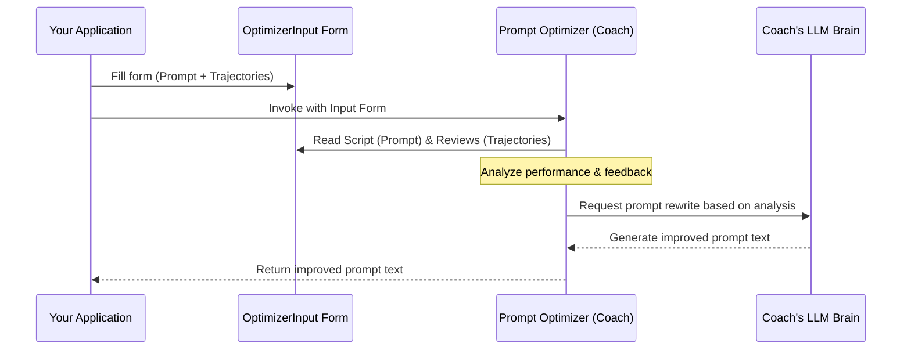

# Chapter 6: Prompt & Trajectory Types - Standard Forms for the Coach

Welcome back! In [Chapter 5: Prompt Optimization](05_prompt_optimization.md), we met the "AI writing coach" – the prompt optimizer that automatically improves our AI's instructions (prompts) based on past performance and feedback.

But how do we actually *give* the coach the information it needs? We can't just throw a messy pile of conversation logs and sticky notes at it! The coach needs information presented in a clear, standardized way. Think of it like applying for a job or submitting a form – you need to fill out specific fields so the person reading it knows exactly what they're looking at.

This chapter introduces the **standardized data structures** `langmem` uses to package information for the prompt optimization coach. These structures act like official submission forms, ensuring the coach gets the prompt, the performance history, and the feedback in a consistent format every time.

## The Problem: Jumbled Information for the Coach

Imagine you're the writing coach from Chapter 5. Someone wants you to improve their actor's script. They hand you:
*   A crumpled napkin with the script scribbled on it.
*   A random audio recording of the actor's performance.
*   A text message saying, "It wasn't quite right."

It would be hard to figure out what script was used, what exactly happened during the performance, and what specific feedback applies. The coach needs organized information!

## The Solution: Standardized Submission Forms

`langmem` solves this by defining specific Python structures (using `TypedDict` and `NamedTuple`) to act as these forms:

1.  **`Prompt`**: The "Script Submission Form". Details the specific prompt (script) we want the coach to potentially rewrite.
2.  **`AnnotatedTrajectory`**: The "Performance Review Form". Contains the recording of the performance (conversation history) and the director's notes (feedback).
3.  **`OptimizerInput`**: The "Single-Script Coaching Request". Bundles *one* `Prompt` form and *one or more* `AnnotatedTrajectory` forms together for the coach.
4.  **`MultiPromptOptimizerInput`**: The "Multiple-Script Coaching Request". Bundles *multiple* `Prompt` forms and *one or more* `AnnotatedTrajectory` forms, used when optimizing several related prompts at once.

Let's look at each "form" in detail.

### 1. The `Prompt` Form: Describing the Script

This structure holds information about the specific prompt we want to optimize. Think of it like the cover page for the script you're submitting.

```python
# We use TypedDict for this structure
from typing_extensions import TypedDict, Required

class Prompt(TypedDict, total=False):
    """Holds details about a prompt being optimized."""
    # REQUIRED: A unique name for this prompt (like a script title)
    name: Required[str]
    # REQUIRED: The actual text of the prompt (the script itself)
    prompt: Required[str]
    # OPTIONAL: Specific instructions for the coach on HOW to change it
    update_instructions: str | None
    # OPTIONAL: Notes on WHEN this prompt should be updated (e.g., dependencies)
    when_to_update: str | None

# Example of creating a Prompt form:
assistant_script = Prompt(
    name="helpful_assistant_v1",
    prompt="You are a helpful assistant.",
    update_instructions="Focus on making the assistant more concise.",
    when_to_update="If the assistant gives overly long answers."
)

print(f"Prompt Name: {assistant_script['name']}")
print(f"Prompt Text: {assistant_script['prompt']}")
```

*   **`name` (Required):** A unique identifier for this prompt. Useful when optimizing multiple prompts together.
*   **`prompt` (Required):** The actual instruction text given to the LLM.
*   **`update_instructions` (Optional):** Specific guidance for the optimizer (our coach). Tells it *how* to approach rewriting the script (e.g., "Make minimal changes", "Add examples").
*   **`when_to_update` (Optional):** Hints for the optimizer about *when* this script might need changes, sometimes used to coordinate updates between multiple related scripts.

### 2. The `AnnotatedTrajectory` Form: Performance & Feedback

This structure captures a single instance of the AI performing its task (like one scene recording) and any feedback associated with it.

```python
import typing
from langchain_core.messages import AnyMessage # Base type for messages

class AnnotatedTrajectory(typing.NamedTuple):
    """Holds a conversation history and optional feedback."""
    # The sequence of messages (the performance recording)
    messages: typing.Sequence[AnyMessage]
    # Optional feedback (the director's notes)
    feedback: dict[str, str | int | bool] | str | None = None

# Example conversation snippet
conversation = [
    {"role": "user", "content": "Explain photosynthesis briefly."},
    {"role": "assistant", "content": "Photosynthesis is the complex process..."} # Too long
]

# Example feedback
performance_notes = "The explanation was too detailed for a brief request."

# Create the form
review_form = AnnotatedTrajectory(
    messages=conversation,
    feedback=performance_notes
)

print(f"Number of messages: {len(review_form.messages)}")
print(f"Feedback provided: {review_form.feedback}")
```

*   **`messages`:** A list of messages representing the interaction (e.g., user questions, assistant answers). This is the raw performance data.
*   **`feedback`:** Notes about the performance. This can be a simple string (like our example), or a dictionary with more structured feedback (e.g., `{"conciseness_score": 2, "notes": "Too verbose"}`). This tells the coach what went wrong (or right!).

### 3. The `OptimizerInput` Form: Submitting One Script for Review

This structure bundles everything needed to ask the coach to review and potentially rewrite *one specific script* (`Prompt`) based on one or more performance reviews (`AnnotatedTrajectory`).

```python
# From the previous examples:
# assistant_script = Prompt(...)
# review_form = AnnotatedTrajectory(...)

# Define the input structure
class OptimizerInput(TypedDict):
    """Input for optimizing a single prompt."""
    trajectories: typing.Sequence[AnnotatedTrajectory] | str
    prompt: str | Prompt

# Package the script and the review form together
coaching_request = OptimizerInput(
    # Provide a list of one or more performance reviews
    trajectories=[review_form],
    # Provide the script form to be reviewed
    prompt=assistant_script
)

print(f"Request contains {len(coaching_request['trajectories'])} review(s).")
print(f"Script to review: {coaching_request['prompt']['name']}")
```

*   **`trajectories`:** A list containing one or more `AnnotatedTrajectory` forms. The coach analyzes these performances.
*   **`prompt`:** The `Prompt` form representing the script that was used during those performances and which needs potential rewriting. (It can also sometimes just be the prompt string itself for simpler cases).

This `OptimizerInput` structure is exactly what the `create_prompt_optimizer` function (from [Chapter 5: Prompt Optimization](05_prompt_optimization.md)) expects as input when you call `.invoke` or `.ainvoke`.

### 4. The `MultiPromptOptimizerInput` Form: Submitting Multiple Scripts

Sometimes, an AI's behavior depends on *multiple* prompts working together (like one prompt for planning and another for generating the final answer). This structure allows you to submit multiple related `Prompt` forms along with performance reviews, asking the coach to figure out which script(s) need tuning.

```python
# Assume we have another script:
planning_script = Prompt(name="planner_v1", prompt="Plan the steps.")

# And the same review form as before:
# review_form = AnnotatedTrajectory(...)

# Define the multi-prompt input structure
class MultiPromptOptimizerInput(TypedDict):
    """Input for optimizing multiple prompts together."""
    trajectories: typing.Sequence[AnnotatedTrajectory] | str
    prompts: list[Prompt]

# Package multiple scripts and the review form
multi_coaching_request = MultiPromptOptimizerInput(
    trajectories=[review_form],
    # Provide a list of script forms
    prompts=[assistant_script, planning_script]
)

print(f"Multi-request for {len(multi_coaching_request['prompts'])} scripts.")
```

*   **`trajectories`:** Same as `OptimizerInput`, the performance reviews.
*   **`prompts`:** A list containing multiple `Prompt` forms. The coach analyzes the trajectories and decides which of these scripts might need updating based on the performance and feedback.

This `MultiPromptOptimizerInput` structure is used with the `create_multi_prompt_optimizer` function.

## How the Coach Uses These Forms

When you call an optimizer (like the one created by `create_prompt_optimizer` or `create_multi_prompt_optimizer`) with these structured inputs:

1.  **Receive Request:** The optimizer receives the `OptimizerInput` or `MultiPromptOptimizerInput` dictionary.
2.  **Unpack Information:** It unpacks the `Prompt`(s) and `AnnotatedTrajectory`(s).
3.  **Analyze Performance:** It reads the `messages` from the trajectories to see what happened.
4.  **Consider Feedback:** It reads the `feedback` to understand what needs improvement.
5.  **Consult Instructions:** It checks the `update_instructions` and `when_to_update` fields in the `Prompt`(s) for guidance on how (and which) prompts to change.
6.  **Generate Improvement:** Using its underlying LLM, it generates an improved version of the relevant `prompt` text(s).
7.  **Return Result:** It returns the improved prompt string(s).

Here’s a simplified diagram showing how `OptimizerInput` feeds the coach:



Using these standardized forms ensures the optimizer gets all the necessary pieces (`prompt` text, `update_instructions`, `messages`, `feedback`) in a predictable way, allowing it to perform its coaching job effectively.

## Under the Hood: Defining the Forms in Code

These structures are defined primarily in `src/langmem/prompts/types.py` using Python's typing features. Let's look at the simplified definitions:

```python
# Simplified from src/langmem/prompts/types.py
import typing
from langchain_core.messages import AnyMessage # Represents any message type
from typing_extensions import Required, TypedDict # Tools for defining structure

# --- The Prompt Form ---
class Prompt(TypedDict, total=False):
    """TypedDict for structured prompt management."""
    name: Required[str] # MUST provide 'name'
    prompt: Required[str] # MUST provide 'prompt' text
    update_instructions: str | None # Optional string or None
    when_to_update: str | None # Optional string or None

# --- The Performance Review Form ---
class AnnotatedTrajectory(typing.NamedTuple):
    """Conversation history with optional feedback."""
    messages: typing.Sequence[AnyMessage] # List/tuple of messages
    # Feedback can be a dict, string, or None
    feedback: dict[str, str | int | bool] | str | None = None

# --- Single-Script Submission Form ---
class OptimizerInput(TypedDict):
    """Input for single-prompt optimization."""
    # Can be a list/tuple of trajectories, or just raw text describing sessions
    trajectories: typing.Sequence[AnnotatedTrajectory] | str
    # Can be a Prompt dict or just the prompt string
    prompt: str | Prompt

# --- Multi-Script Submission Form ---
class MultiPromptOptimizerInput(TypedDict):
    """Input for optimizing multiple prompts together."""
    trajectories: typing.Sequence[AnnotatedTrajectory] | str
    prompts: list[Prompt] # List of Prompt dicts
```

*   **`TypedDict`**: Used for `Prompt`, `OptimizerInput`, and `MultiPromptOptimizerInput`. This creates dictionary-like objects where specific keys (`name`, `prompt`, etc.) are expected, and their value types (e.g., `str`, `list[Prompt]`) are defined. `total=False` means optional fields don't need to be present. `Required` marks fields that *must* be present.
*   **`typing.NamedTuple`**: Used for `AnnotatedTrajectory`. This creates tuple-like objects where elements have names (`messages`, `feedback`) and defined types.

These definitions provide structure and allow type checking, making the interaction with the prompt optimizers more robust and predictable.

## Conclusion

Prompt and Trajectory Types (`Prompt`, `AnnotatedTrajectory`, `OptimizerInput`, `MultiPromptOptimizerInput`) are the standardized "forms" `langmem` uses to pass information to the prompt optimization system. They ensure that the prompt itself, the conversation history, and any feedback are clearly organized. This structured approach allows the "AI writing coach" ([Chapter 5: Prompt Optimization](05_prompt_optimization.md)) to reliably understand the context and make effective improvements to the AI's instructions.

Now that we understand *how* information is packaged for the coach, we can explore the different *techniques* the coach uses to actually come up with better prompts. In the next chapter, we'll dive into the various [Prompt Optimization Strategies](07_prompt_optimization_strategies.md).

---

Generated by [AI Codebase Knowledge Builder](https://github.com/The-Pocket/Tutorial-Codebase-Knowledge)