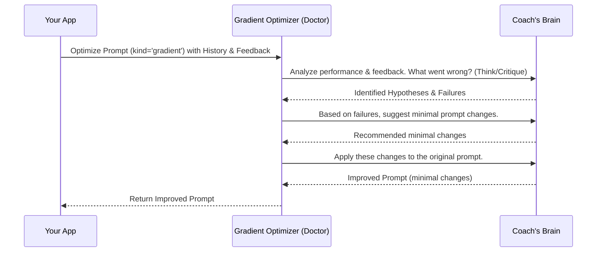
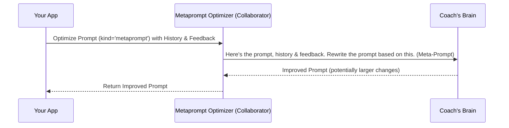
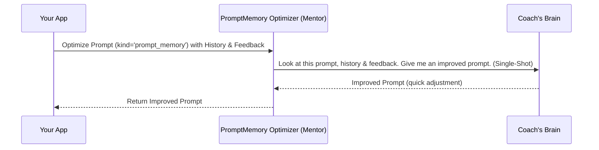

# Chapter 7: Prompt Optimization Strategies

Welcome back! In [Chapter 6: Prompt & Trajectory Types](06_prompt___trajectory_types.md), we learned about the standardized "forms" (`Prompt`, `AnnotatedTrajectory`, `OptimizerInput`) used to package information for our AI writing coach, the Prompt Optimizer. We know *how* to give the coach the script, performance history, and feedback in an organized way.

But just like different athletes might need different coaching styles, sometimes our AI prompts need different approaches to improvement. A prompt that just needs a small tweak is different from one that needs a major rewrite.

That's where **Prompt Optimization Strategies** come in! They are the different *techniques* or *styles* our AI writing coach can use to analyze the feedback and generate better prompts.

## Why Different Coaching Styles?

Imagine you have three different writing coaches for your actor (the LLM):

1.  **The Detailed Script Doctor:** This coach meticulously reads the script, watches the performance frame-by-frame, identifies tiny flaws in logic or delivery, and suggests very specific, small word changes.
2.  **The Collaborative Writer:** This coach looks at examples of good and bad scenes, discusses the feedback with you, and then helps rewrite larger chunks of the script, maybe adding new lines or examples.
3.  **The Experience-Based Mentor:** This coach draws on years of experience, quickly looks at the feedback and the performance, remembers similar situations from past successful plays, and suggests adjustments based on what worked before.

Each coach has a different method. The detailed doctor is thorough but might take longer. The collaborator is great for bigger changes based on examples. The mentor is fast and uses past successes but might miss subtle details.

Similarly, `langmem`'s Prompt Optimizer offers different strategies (`gradient`, `metaprompt`, `prompt_memory`) for improving prompts. Choosing the right strategy depends on the problem you're trying to fix, how much change you need, and how much "coaching time" (which translates to LLM usage and cost) you want to spend.

## Meet the Strategies: `gradient`, `metaprompt`, `prompt_memory`

When you hire the coach using `create_prompt_optimizer` (from [Chapter 5: Prompt Optimization](05_prompt_optimization.md)), you can tell it which coaching style (strategy) to use with the `kind` parameter.

Let's explore the main styles:

### 1. `gradient`: The Detailed Script Doctor

*   **Analogy:** The meticulous coach who analyzes deeply before suggesting small, precise script tweaks.
*   **How it works:** This strategy is like a multi-step review process. First, the coach carefully analyzes the past performance (`trajectories`) and feedback, thinking about *why* the AI failed (`hypotheses`). It might go back and forth, critiquing its own analysis (`think`, `critique` steps). Only after this deep analysis does it recommend the smallest possible changes to the prompt to fix the specific identified problems.
*   **When to use:** Great for fine-tuning prompts with complex logic, fixing subtle errors, or when you want minimal, targeted changes based on specific failure modes.
*   **Trade-offs:**
    *   **Pros:** Can be very precise, good for complex issues, aims for minimal necessary changes.
    *   **Cons:** Often involves more steps and more interaction with the underlying "coach" LLM, making it potentially slower and more expensive. More complex internal process.


*(Note: This shows multiple interactions with the Coach LLM, representing the thinking, critiquing, and updating phases).*

### 2. `metaprompt`: The Collaborative Writer

*   **Analogy:** The coach who looks at good/bad examples and helps rewrite larger sections collaboratively.
*   **How it works:** This strategy often uses a single, powerful instruction (a "meta-prompt") given to the coach LLM. This instruction basically says: "Here's the original prompt, here are examples of how it performed (good or bad), and here's the feedback. Rewrite the original prompt to do better based on these examples." It might still involve some internal reflection steps, but the focus is more on rewriting based on the overall picture presented by the examples.
*   **When to use:** Good for incorporating examples (few-shot learning), making stylistic changes, adjusting instructions based on clear patterns in the trajectories, or when you need more significant rewrites than just tiny tweaks.
*   **Trade-offs:**
    *   **Pros:** Often faster and simpler than `gradient`, good balance between cost and refinement capability. Effective for learning from examples.
    *   **Cons:** Might sometimes make larger changes than strictly necessary if not guided well.


*(Note: Often fewer interactions with the Coach LLM compared to `gradient`)*.

### 3. `prompt_memory`: The Experience-Based Mentor

*   **Analogy:** The coach who looks at past successful scripts for quick inspiration.
*   **How it works:** This is generally the simplest and fastest strategy. It takes a quick look at the prompt, the performance history, and the feedback, and makes a direct attempt to update the prompt in a single step. It's like the mentor quickly saying, "Ah, I've seen this before. Try phrasing it like *this*." It relies less on deep analysis or complex reflection and more on a direct pattern-matching or instruction-following approach.
*   **When to use:** Best for simple adjustments, quick fixes based on direct feedback, or when minimizing LLM calls (cost and speed) is the top priority.
*   **Trade-offs:**
    *   **Pros:** Simplest, fastest, lowest cost (often just one LLM call to the coach).
    *   **Cons:** May not handle complex issues or subtle refinements as well as the other strategies. Less sophisticated analysis.


*(Note: Typically only one interaction with the Coach LLM)*.

## Choosing Your Coaching Style: The `kind` Parameter

You select the strategy when you create the optimizer using the `kind` argument.

```python
from langmem import create_prompt_optimizer
from langmem.prompts.types import Prompt, AnnotatedTrajectory, OptimizerInput # Import the forms from Ch 6

# --- Assume we have these defined (from Chapter 6 examples) ---
original_prompt_details = Prompt(
    name="assistant_v1",
    prompt="You are a helpful assistant.",
    update_instructions="Make the assistant more concise."
)

review_form = AnnotatedTrajectory(
    messages=[
        {"role": "user", "content": "Explain photosynthesis briefly."},
        {"role": "assistant", "content": "Photosynthesis is the complex process..."} # Too long
    ],
    feedback="The explanation was too detailed."
)

coaching_request = OptimizerInput(
    trajectories=[review_form],
    prompt=original_prompt_details
)
# -------------------------------------------------------------

# 1. Hire the 'Detailed Script Doctor' coach
gradient_optimizer = create_prompt_optimizer(
    model="openai:gpt-4o-mini",
    kind="gradient" # Explicitly select the gradient strategy
)

# 2. Hire the 'Collaborative Writer' coach
metaprompt_optimizer = create_prompt_optimizer(
    model="openai:gpt-4o-mini",
    kind="metaprompt" # Select the metaprompt strategy
)

# 3. Hire the 'Experienced Mentor' coach
prompt_memory_optimizer = create_prompt_optimizer(
    model="openai:gpt-4o-mini",
    kind="prompt_memory" # Select the prompt_memory strategy
)

# You would then use one of these optimizers:
# improved_prompt = await gradient_optimizer.ainvoke(coaching_request)
# print(f"Gradient suggestion: {improved_prompt}")

# improved_prompt_meta = await metaprompt_optimizer.ainvoke(coaching_request)
# print(f"Metaprompt suggestion: {improved_prompt_meta}")

# improved_prompt_mem = await prompt_memory_optimizer.ainvoke(coaching_request)
# print(f"PromptMemory suggestion: {improved_prompt_mem}")

print("Optimizers created with different strategies!")
# You would typically run only one optimizer at a time based on your needs.
# The improved prompts might differ slightly depending on the strategy used.
# For example, 'gradient' might add 'Be concise.', while 'metaprompt' might rewrite
# the sentence slightly more, like 'You are a helpful and concise assistant.'
```

This code shows how easy it is to switch between strategies by changing the `kind` parameter. The best choice depends on your specific needs:

*   Need **precise fixes** for complex logic? Try `gradient`.
*   Need to incorporate **examples** or make **stylistic** changes? Try `metaprompt`.
*   Need a **quick, cheap** adjustment based on simple feedback? Try `prompt_memory`.

You might need to experiment a bit to see which strategy works best for your particular prompts and feedback patterns.

## Under the Hood: Different Paths to Improvement

As hinted by the diagrams, each `kind` uses different internal logic and prompts when talking to the "coach" LLM.

*   **`gradient`** (see `src/langmem/prompts/gradient.py`): Uses a multi-step process often involving separate LLM calls for thinking/critiquing and then applying the recommended changes using a different meta-prompt. This separation allows for more detailed reasoning but increases the number of LLM calls.
*   **`metaprompt`** (see `src/langmem/prompts/metaprompt.py`): Primarily uses a main "meta-prompt" that packages the original prompt, trajectories, and feedback, asking the LLM to produce an improved version directly. It can optionally include reflection steps, but often aims for fewer LLM calls than `gradient`.
*   **`prompt_memory`** (see `src/langmem/prompts/stateless.py`): Uses the simplest internal prompt, often asking the LLM to reflect on the provided data and output an improved prompt in a single pass. This minimizes LLM calls.

The `create_prompt_optimizer` function (in `src/langmem/prompts/optimization.py`) acts as a factory, creating the appropriate optimizer object (`GradientPromptOptimizer`, `MetaPromptOptimizer`, or `PromptMemoryMultiple`) based on the `kind` you specify. Each of these objects then implements its specific strategy for interacting with the LLM to generate the improved prompt.

## Conclusion

Prompt Optimization Strategies (`gradient`, `metaprompt`, `prompt_memory`) offer different "coaching styles" for automatically improving your AI's prompts. They provide trade-offs between the depth of analysis, the cost/speed (number of LLM calls), and the type of refinements they are best suited for. By choosing the appropriate `kind` when creating your optimizer, you can tailor the coaching process to your specific needs, whether you require meticulous fine-tuning, collaborative rewriting based on examples, or quick adjustments inspired by past performance.

Understanding these strategies helps you leverage the full power of `langmem`'s automated prompt improvement capabilities. Now that we know how to optimize prompts, how does this fit into a larger loop of AI self-improvement? In the next chapter, we'll look at the [Reflection Executor](08_reflection_executor.md), which orchestrates these optimization steps within a larger agent workflow.

---

Generated by [AI Codebase Knowledge Builder](https://github.com/The-Pocket/Tutorial-Codebase-Knowledge)