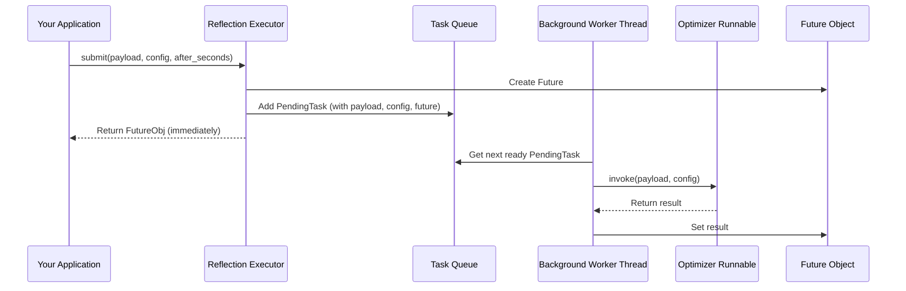

# Chapter 8: Reflection Executor - Your Background Task Assistant

Welcome back! In [Chapter 7: Prompt Optimization Strategies](07_prompt_optimization_strategies.md), we explored different coaching styles (`gradient`, `metaprompt`, `prompt_memory`) that the Prompt Optimizer can use to automatically improve our AI's instructions. We saw how these optimizers analyze past performance (`AnnotatedTrajectory`) and feedback to suggest better prompts.

But think about that optimization process. Analyzing conversation history and feedback, then asking a powerful "coach" LLM to rewrite a prompt – that sounds like it might take a little while! If our main AI assistant tried to do this *during* a conversation, the user might be left waiting awkwardly. We need a way to handle these potentially slow or complex background tasks without disrupting the main flow of interaction.

This is where the **Reflection Executor** comes in!

## The Problem: Waiting for Slow Background Work

Imagine you're chatting with your AI assistant. You give it some feedback: "Your previous answer was a bit too technical." The assistant *could* immediately pause the conversation, run the entire prompt optimization process (which might take several seconds or even longer), update its internal instructions, and *then* continue the chat. That wouldn't be a very smooth experience!

Similarly, tasks like analyzing a long conversation to extract all relevant memories ([Memory Management](01_memory_management.md)) can also take time. We don't want our assistant to freeze while its "librarian" is busy filing memories.

## The Solution: A Dedicated Personal Assistant (The Reflection Executor)

Think of the **Reflection Executor** as a dedicated personal assistant working alongside your main AI. When the AI has a complex or time-consuming task – like analyzing feedback to optimize a prompt, or thoroughly processing a conversation for memories – it doesn't do it itself right away. Instead, it hands the task off to its Reflection Executor assistant.

This assistant takes the task and works on it **in the background**. It might do it immediately (but separately) or even wait for a quiet moment (after a delay). This allows the main AI to continue interacting with the user without interruption.

Key features of this "assistant":

1.  **Asynchronous Execution:** It runs tasks separately, not blocking the main application.
2.  **Delayed Execution:** You can tell it to wait a certain amount of time before starting a task.
3.  **Task Management:** It keeps track of submitted tasks.
4.  **Local or Remote:** The assistant can be running on the same machine (local, using Python code like Runnables) or be a separate service in the cloud (remote, using LangGraph Cloud).

## Using the Reflection Executor: Handing Off Tasks

Let's see how we can hire and use this assistant, focusing on the local execution mode first. We'll use the prompt optimization task from previous chapters as our example.

1.  **Get the Task Ready (Our Prompt Optimizer):**
    First, we need the actual task we want to run in the background. Let's reuse the `create_prompt_optimizer` from [Chapter 5: Prompt Optimization](05_prompt_optimization.md).

    ```python
    from langmem import create_prompt_optimizer
    from langmem.prompts.types import Prompt, AnnotatedTrajectory, OptimizerInput

    # Create our "coach" - the prompt optimizer Runnable
    optimizer_runnable = create_prompt_optimizer(
        model="openai:gpt-4o-mini",
        kind="metaprompt" # Use the 'metaprompt' strategy
    )

    # Prepare the input data for the optimizer (from Chapter 6)
    # (Assuming 'assistant_script' and 'review_form' are defined as before)
    # assistant_script = Prompt(...)
    # review_form = AnnotatedTrajectory(...)
    # coaching_request = OptimizerInput(
    #    trajectories=[review_form],
    #    prompt=assistant_script
    # )
    print("Prompt optimizer (our background task) is ready.")
    ```
    *   `optimizer_runnable`: This is the actual piece of code (a `Runnable` object) that performs the prompt optimization. This is the "job description" we'll give to our assistant.

2.  **Hire the Assistant (Create the Executor):**
    Now, we use the `ReflectionExecutor` factory function to create our local assistant. We tell it which `Runnable` task it will be responsible for.

    ```python
    from langmem import ReflectionExecutor
    # Note: For local execution, the executor often needs access to a memory store
    # if the background task interacts with memory. We might pass it here,
    # or it might be picked up from the context later.
    # from langgraph.store.memory import InMemoryStore
    # my_store = InMemoryStore()

    # Create a local executor for our optimizer runnable
    reflection_executor = ReflectionExecutor(
        optimizer_runnable # Pass the Runnable task
        # store=my_store # Optionally pass the store if needed by the runnable
    )

    print("Hired a local Reflection Executor assistant!")
    ```
    *   We pass the `optimizer_runnable` directly to `ReflectionExecutor`. Because we passed a `Runnable` object (code) instead of a name (string), `langmem` knows to create a `LocalReflectionExecutor`.
    *   The `store` argument might be needed if the `Runnable` itself (like a memory enrichment task) needs to read/write from the memory store. Often, this can be automatically inferred from the context when used within a LangGraph agent.

3.  **Give the Assistant a Job (Submit a Task):**
    Let's say our main AI has just received feedback. Instead of running the optimizer itself, it submits the job to the executor.

    ```python
    # Assuming 'coaching_request' holds the OptimizerInput dictionary
    # coaching_request = { ... } # Defined in Step 1 comments

    # We need a config, especially if the Runnable uses namespace templating
    # or needs context. Let's assume we are in a context for 'user_abc'.
    example_config = {"configurable": {"langgraph_user_id": "user_abc"}}

    print("Submitting prompt optimization job to the executor...")

    # Submit the task to run in the background (immediately)
    future = reflection_executor.submit(
        payload=coaching_request, # The input data for the optimizer
        config=example_config,    # The context for the task
        after_seconds=0           # Run as soon as possible (but async)
    )

    print("Job submitted! The main AI can continue its work.")
    print(f"The result will be available later via the 'future' object: {type(future)}")

    # The main AI continues here immediately...
    # ... while the optimizer runs in the background ...

    # Optionally, later, you could check the result (this might block):
    # try:
    #    improved_prompt = future.result(timeout=30) # Wait up to 30s
    #    print(f"\nBackground task finished! Improved prompt: {improved_prompt}")
    # except TimeoutError:
    #    print("\nBackground task is still running...")
    # except Exception as e:
    #    print(f"\nBackground task failed: {e}")
    ```
    *   `payload`: This dictionary contains the input data required by our `optimizer_runnable` (the `OptimizerInput`).
    *   `config`: Provides context, like the user ID, which might be needed by the runnable or underlying components (like namespace templates).
    *   `after_seconds=0`: Tells the assistant to start the job as soon as possible, but still in the background. We could set this to `60` to delay the start by one minute.
    *   `reflection_executor.submit` returns *immediately* with a `Future` object. It doesn't wait for the optimization to finish. This is the key – the main application is not blocked.
    *   The `Future` object acts like a placeholder for the result. We can use it later to check if the task is done or to get the final result (like the `improved_prompt`).

### What About Remote Execution?

The `ReflectionExecutor` factory is smart. If, instead of a `Runnable`, you give it a string (which is the name of a deployed LangGraph assistant/graph in LangGraph Cloud), it automatically creates a `RemoteReflectionExecutor`.

```python
# Hypothetical example for remote execution
# remote_executor = ReflectionExecutor(
#     "my-deployed-prompt-optimizer-assistant-id", # Name of remote assistant
#     namespace=("optimization", "{langgraph_user_id}"), # Namespace needed for remote
#     url="https://my-langgraph-cloud-url.com" # Optional URL
# )

# future = remote_executor.submit(payload=coaching_request, config=example_config)
# print("Submitted job to the REMOTE executor!")
```
*   The usage (`submit`) is very similar, but the work happens on a remote server instead of locally. This requires setting up LangGraph Cloud, which is beyond this chapter's scope. For now, we'll focus on the local mode.

## Under the Hood: How the Local Assistant Works

What happens inside the `LocalReflectionExecutor` when you call `submit`?

1.  **Task Received:** The `submit` method gets the `payload`, `config`, and `after_seconds`.
2.  **Task Bundled:** It bundles this information, along with a `Future` object (to hold the eventual result) and a cancellation flag, into a `PendingTask` structure.
3.  **Task Queued:** This `PendingTask` is placed into a priority queue. The priority is based on *when* the task should run (current time + `after_seconds`).
4.  **Worker Awakens:** A separate background thread (the "worker," started when the executor was created) is constantly watching this queue.
5.  **Task Dequeued:** When a task's scheduled time arrives, the worker thread takes it from the queue.
6.  **Task Executed:** The worker thread invokes the original `Runnable` (our `optimizer_runnable`) with the `payload` and `config`.
7.  **Result Stored:** When the `Runnable` finishes, the worker thread takes the result (or any error) and puts it into the `Future` object associated with that task.
8.  **Notification (Implicit):** Anyone holding a reference to that `Future` object can now retrieve the result (or see the error).

Here's a simplified diagram of the local submission flow:



This clearly shows how the `App` submits the task and immediately gets back the `FutureObj`, while the `Worker` handles the actual execution of the `RunnableTask` later.

## Deeper Dive into the Code (Optional)

Let's peek at simplified snippets from `src/langmem/reflection.py` that implement this local logic.

**1. Initialization (`LocalReflectionExecutor.__init__`)**

```python
# Simplified from src/langmem/reflection.py
import queue
import threading
from concurrent.futures import Future

class LocalReflectionExecutor:
    def __init__(self, reflector: Runnable, store: BaseStore | None):
        # ... (store handling and namespace setup omitted) ...
        self._reflector = reflector # The Runnable task to execute
        self._task_queue = queue.PriorityQueue() # Queue for pending tasks
        self._pending_tasks = {} # Track tasks, e.g., for cancellation
        self._worker_running = True
        # Create and start the background worker thread
        self._worker = threading.Thread(
            target=functools.partial(_process_queue, self), # Worker function
            daemon=True # Allows program to exit even if worker is waiting
        )
        self._worker.start()
        # ...
```
*   This sets up the essential components: the `Runnable` (`_reflector`), the `_task_queue`, and starts the `_worker` thread which runs the `_process_queue` function.

**2. Submitting a Task (`LocalReflectionExecutor.submit`)**

```python
# Simplified from src/langmem/reflection.py
import time
from langgraph.config import get_config # Utility to get context

class PendingTask(NamedTuple): # Structure to hold task details
    # ... fields like payload, after_seconds, future, config ...

class LocalReflectionExecutor:
    # ... (__init__ from above) ...

    def submit(
        self, payload: dict, /, config: RunnableConfig | None = None, *, after_seconds: int = 0, # ...
    ) -> Future:
        # ... (config and thread_id resolution omitted) ...

        future = Future() # Create the placeholder for the result
        # ... (cancellation logic omitted) ...

        # Bundle everything into a PendingTask
        task = PendingTask(
            # ... payload, after_seconds, submit_time, future, config ...
        )

        # Add to the priority queue. Priority is execution time.
        self._task_queue.put((time.time() + after_seconds, task))
        return future # Return the future immediately
    # ...
```
*   This method creates the `Future`, bundles the work into a `PendingTask`, and puts it onto the `_task_queue` based on its scheduled execution time. It returns the `Future` right away.

**3. Processing the Queue (`_process_queue`)**

```python
# Simplified from src/langmem/reflection.py

def _process_queue(self: "LocalReflectionExecutor"):
    while self._worker_running:
        try:
            # Wait for a task from the queue
            execute_at, task = self._task_queue.get(timeout=1)

            # Check if it's time to run, requeue if not yet
            now = time.time()
            if execute_at > now:
                time.sleep(min(execute_at - now, 1)) # Sleep briefly
                if execute_at > time.time(): # Re-check after sleep
                    self._task_queue.put((execute_at, task))
                    continue # Go back to waiting

            # Check if cancelled before running
            # ... (cancellation check omitted) ...

            try:
                # THE CORE: Invoke the stored Runnable with its payload/config
                result = self._reflector.invoke(task.payload, task.config)
                # Store the result in the task's Future object
                task.future.set_result(result)
            except Exception as e:
                # Store any error in the task's Future object
                task.future.set_exception(e)
            # ... (cleanup omitted) ...

        except queue.Empty:
            continue # Queue is empty, loop and wait again
        except Exception as e:
            # Log errors in the worker itself
            # ... (logging omitted) ...
```
*   This function runs in the background thread. It waits for tasks, checks if it's time to run them, executes the `Runnable` (`self._reflector.invoke(...)`), and sets the result or exception on the corresponding `Future`.

## Conclusion

The **Reflection Executor** is your crucial assistant for managing background tasks in `langmem`. It allows potentially long-running operations, like memory enrichment or prompt optimization, to happen asynchronously or after a delay without blocking your main AI application. By using the `ReflectionExecutor` factory, you can easily set up either a local executor (running Python `Runnable` code in a background thread) or a remote executor (interacting with LangGraph Cloud). The `submit` method lets you hand off tasks effortlessly, receiving a `Future` object to track the progress later. This ensures your AI remains responsive and provides a smooth user experience, even when complex background "reflections" are happening.

Now that we understand how background tasks are managed, let's turn our attention back to the core of memory itself. How do we directly interact with the underlying storage system where memories are kept? In the next chapter, we'll explore [Store Interaction](09_store_interaction.md).

---

Generated by [AI Codebase Knowledge Builder](https://github.com/The-Pocket/Tutorial-Codebase-Knowledge)