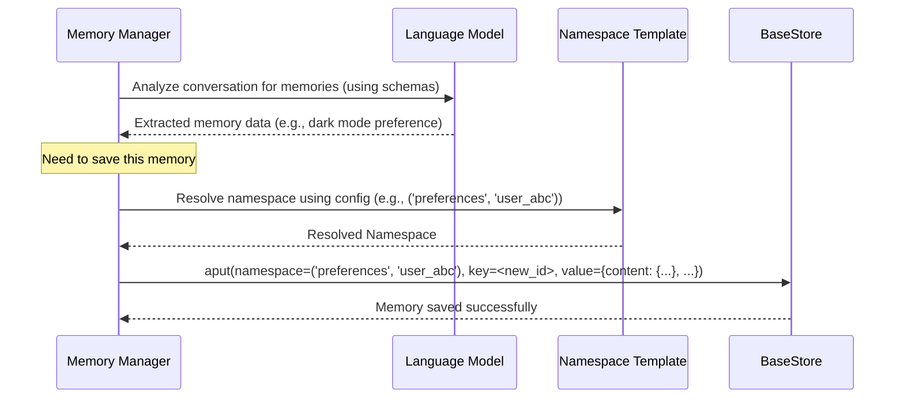

# Chapter 9: Store Interaction - The Library's Shelves and Catalog

Welcome back! In [Chapter 8: Reflection Executor](08_reflection_executor.md), we learned how `langmem` uses a dedicated assistant to handle background tasks like prompt optimization, ensuring our main AI stays responsive. Now, let's zoom in on the foundation where all the memories actually *live*: the **Store**.

## The Foundation: Where Memories Reside

Imagine our "intelligent librarian" from [Chapter 1: Memory Management](01_memory_management.md) carefully creating memory index cards ([Memory Schemas](02_memory_schemas.md)), filing them into specific drawers ([Namespace Templating](03_namespace_templating.md)), and allowing tools ([Memory Tools](04_memory_tools.md)) to interact with them.

But *where* are those drawers and index cards physically kept? They reside in the library's underlying **storage system**. In the world of `langmem` and its foundation, LangGraph, this storage system is defined by an interface called `BaseStore`.

Think of `BaseStore` as the blueprint or set of rules for how the library's shelves and catalog system must work. It specifies *how* to:
*   Put an item (like an index card or memory) onto a specific shelf (namespace and key).
*   Get an item if you know its exact location (key).
*   Search the catalog for items related to a topic (vector similarity search).
*   Remove an item from the shelves.

`langmem` doesn't build its own shelving system from scratch. Instead, it relies entirely on systems that follow the `BaseStore` rules. This could be a simple in-memory dictionary (`InMemoryStore`), a robust database like PostgreSQL (`PostgresStore`), or other compatible storage solutions.

**Why understand the Store?** While `langmem`'s managers and tools abstract away direct interaction most of the time, knowing how the underlying store works helps you:
*   Understand *where* your AI's memories are physically stored.
*   Debug issues by looking directly at the stored data.
*   Potentially perform advanced operations or integrations that go beyond the standard tools.
*   Appreciate how features like semantic search are powered by the store's capabilities.

**Our Goal:** Let's manually interact with a simple store to see how memories are put, retrieved, and searched – mimicking what `langmem` components do under the hood.

## Key Concepts: How the Store Works

### 1. The `BaseStore` Interface: The Library Rulebook

`BaseStore` is a standard defined by LangGraph. Any storage system wanting to work with LangGraph (and thus `langmem`) must provide specific functions, including:

*   `put(namespace, key, value)` / `aput(...)` (async): Place an item (`value`) with a specific ID (`key`) into a specific section (`namespace`). Like putting a book with call number `key` in the 'Fiction' section.
*   `get(namespace, key)` / `aget(...)` (async): Retrieve an item by its exact `key` from a `namespace`. Like fetching the book with call number `key` from 'Fiction'.
*   `search(namespace, query, filter, limit, offset)` / `asearch(...)` (async): Find items within a `namespace`. This can be based on a text `query` (often using vector similarity) or specific `filter` criteria. Like asking the catalog for books similar to "space travel" or books "published after 2020".
*   `delete(namespace, key)` / `adelete(...)` (async): Remove an item by its `key` from a `namespace`.

`langmem` components call these standardized functions.

### 2. Key-Value Storage: Finding by Exact ID

The simplest way to use the store is like a dictionary or a filing cabinet where each item has a unique ID (key). If you know the `namespace` (the drawer) and the `key` (the file's label), you can directly `get` the item or `put` a new version. `langmem` uses this for storing and updating specific memories when their ID is known.

### 3. Vector Search: Finding by Meaning

This is where the magic of semantic memory happens! When you save a memory, compatible `BaseStore` implementations (like `InMemoryStore` configured with embeddings, or `PostgresStore` with `pgvector`) can automatically convert the memory's content into a "vector" – a list of numbers representing its meaning.

When you later `search` with a query (e.g., "user's food preferences"), the store converts the query into a vector too. It then finds stored memories whose vectors are mathematically "closest" to the query vector. This allows finding relevant memories even if they don't use the exact same words.

`langmem` relies heavily on the store's `search` capability (powered by vectors) when using the [Memory Tools](04_memory_tools.md) (`search_memory`) or retrieving relevant context automatically.

### 4. Namespaces: Organizing the Shelves

As covered in [Chapter 3: Namespace Templating](03_namespace_templating.md), namespaces are crucial for organizing memories. All `BaseStore` operations (`put`, `get`, `search`, `delete`) require a `namespace` to specify which section of the store to operate on.

## Using the Store Directly: A Hands-On Example

Let's manually use a simple `InMemoryStore` to see these operations in action.

1.  **Create a Store Instance:**
    We'll create an `InMemoryStore`. To enable vector search, we need to tell it how to create embeddings (vectors) and the size of those vectors.

    ```python
    from langgraph.store.memory import InMemoryStore
    from pydantic import BaseModel
    import asyncio

    # Define a simple memory structure (from Chapter 2)
    class PreferenceMemory(BaseModel):
        category: str
        preference: str
        context: str

    # Create an InMemoryStore configured for vector search
    # We tell it the size of vectors (1536 for OpenAI's text-embedding-3-small)
    # and which embedding model to use.
    my_store = InMemoryStore(
        index={
            "dims": 1536,
            "embed": "openai:text-embedding-3-small",
        }
    )

    print("InMemoryStore created and configured for embeddings.")
    ```
    *   This sets up a temporary, in-memory storage system ready to hold our memories and perform vector searches using OpenAI's embedding model.

2.  **Putting an Item (`aput`):**
    Let's add a user preference memory for `user_abc` in the `preferences` namespace.

    ```python
    # Define the memory content using our schema
    dark_mode_pref = PreferenceMemory(
        category="display",
        preference="dark mode",
        context="User mentioned during onboarding"
    )

    # Define the namespace and a unique key (ID) for this memory
    namespace = ("preferences", "user_abc")
    memory_key = "pref_001"

    # The value stored needs structure: 'content' holds our data, 'kind' tells langmem its type
    memory_value = {
        "content": dark_mode_pref.model_dump(), # Convert Pydantic model to dict
        "kind": "PreferenceMemory" # Optional: Helps identify the schema later
    }

    async def add_memory():
        print(f"\nPutting memory '{memory_key}' into namespace {namespace}...")
        await my_store.aput(
            namespace,
            key=memory_key,
            value=memory_value
        )
        print("Memory added!")

    asyncio.run(add_memory())
    ```
    *   We prepare the `namespace`, `key`, and `value`. The `value` includes the actual preference data (`content`) structured according to our `PreferenceMemory` schema.
    *   `my_store.aput` saves this information into our in-memory store.

3.  **Getting an Item (`aget`):**
    Now, let's retrieve the memory we just added using its exact key.

    ```python
    async def retrieve_memory():
        print(f"\nGetting memory '{memory_key}' from namespace {namespace}...")
        retrieved_item = await my_store.aget(namespace, key=memory_key)
        if retrieved_item:
            print("Memory retrieved successfully:")
            print(f"  Key: {retrieved_item.key}")
            print(f"  Value: {retrieved_item.value}")
            # We could load it back into our Pydantic model:
            # loaded_pref = PreferenceMemory(**retrieved_item.value['content'])
            # print(f"  Loaded Preference: {loaded_pref.preference}")
        else:
            print("Memory not found.")

    asyncio.run(retrieve_memory())
    ```
    *   `my_store.aget` fetches the specific item using the known `namespace` and `key`.
    *   The result (`retrieved_item`) contains the key and the original value we stored.

4.  **Searching for Items (`asearch`):**
    Let's add another preference and then search for memories related to "visual settings".

    ```python
    # Add another preference
    font_pref = PreferenceMemory(
        category="display",
        preference="large fonts",
        context="Accessibility request"
    )
    memory_key_2 = "pref_002"
    memory_value_2 = {"content": font_pref.model_dump(), "kind": "PreferenceMemory"}

    async def add_and_search():
        await my_store.aput(namespace, key=memory_key_2, value=memory_value_2)
        print(f"Added second memory '{memory_key_2}'.")

        search_query = "visual settings preferences"
        print(f"\nSearching namespace {namespace} for: '{search_query}'...")
        search_results = await my_store.asearch(
            namespace,
            query=search_query,
            limit=5 # Ask for up to 5 results
        )

        print(f"\nFound {len(search_results)} result(s):")
        for item in search_results:
            print(f"  - Key: {item.key}, Score: {item.score:.4f}, Content: {item.value['content']['preference']}")

    asyncio.run(add_and_search())
    ```
    *   We add a second memory about large fonts.
    *   `my_store.asearch` uses the `search_query`. Because our store is configured with embeddings, it performs a *vector similarity search*.
    *   It finds memories ("dark mode", "large fonts") that are semantically related to "visual settings preferences", even though the words don't match exactly. The `score` indicates how relevant the store thinks each result is.

These examples show the fundamental `put`, `get`, and `search` operations that `langmem` uses constantly behind the scenes.

## How `langmem` Components Use the Store

When you use `langmem` features, they translate your requests into these basic store operations:

1.  **`create_memory_store_manager`:**
    *   Receives conversation messages and configuration (`config`).
    *   Uses the LLM to extract structured memories (like `PreferenceMemory`).
    *   Resolves the target `namespace` using [Namespace Templating](03_namespace_templating.md) and the `config`.
    *   Generates a unique `key` for each new memory.
    *   Calls `store.aput(resolved_namespace, key, memory_value)` to save each extracted memory.

2.  **`create_manage_memory_tool`:**
    *   Receives `action` (`create`, `update`, `delete`), `content`, `id`, and `config`.
    *   Resolves the target `namespace`.
    *   If `action` is `create`: Generates a new `key`, calls `store.aput(resolved_namespace, key, {"content": content, ...})`.
    *   If `action` is `update`: Uses the provided `id` as the `key`, calls `store.aput(resolved_namespace, key, {"content": content, ...})`.
    *   If `action` is `delete`: Uses the provided `id` as the `key`, calls `store.adelete(resolved_namespace, key)`.

3.  **`create_search_memory_tool`:**
    *   Receives `query`, `limit`, `filter`, and `config`.
    *   Resolves the target `namespace`.
    *   Calls `store.asearch(resolved_namespace, query=query, limit=limit, filter=filter)`.
    *   Formats and returns the results.

Here’s a simplified diagram showing the `create_memory_store_manager` interacting with the store:



## Under the Hood: Code References

*   The `BaseStore` interface itself is defined in LangGraph: `langgraph.store.base.BaseStore`.
*   Implementations like `InMemoryStore` are in `langgraph.store.memory`.
*   The `langmem` tools (`create_manage_memory_tool`, `create_search_memory_tool`) in `src/langmem/knowledge/tools.py` contain the logic that calls `store.aput`, `store.adelete`, and `store.asearch` after resolving the namespace via `utils.NamespaceTemplate`.
*   The `create_memory_store_manager` in `src/langmem/knowledge/__init__.py` orchestrates the LLM call and the subsequent saving of memories using `store.aput`.

The crucial point is that `langmem` components are designed to work with *any* storage system that correctly implements the `BaseStore` interface, providing flexibility in choosing your backend.

## Conclusion

The `BaseStore` interface from LangGraph is the fundamental layer where all memories managed by `langmem` are stored and retrieved. It defines standard operations like `put`, `get`, `search`, and `delete`, operating within specific `namespaces`. While `langmem` provides higher-level abstractions like memory managers and tools, these components ultimately rely on calling these `BaseStore` methods. Understanding this interaction clarifies how memories are persisted and how features like semantic search work, empowering you to better debug and potentially extend `langmem`'s capabilities.

So far, we've focused mainly on long-term, persistent memories. But what about summarizing recent interactions to keep the immediate context manageable? In the next chapter, we'll explore [Short-Term Memory Summarization](10_short_term_memory_summarization.md).

---

Generated by [AI Codebase Knowledge Builder](https://github.com/The-Pocket/Tutorial-Codebase-Knowledge)