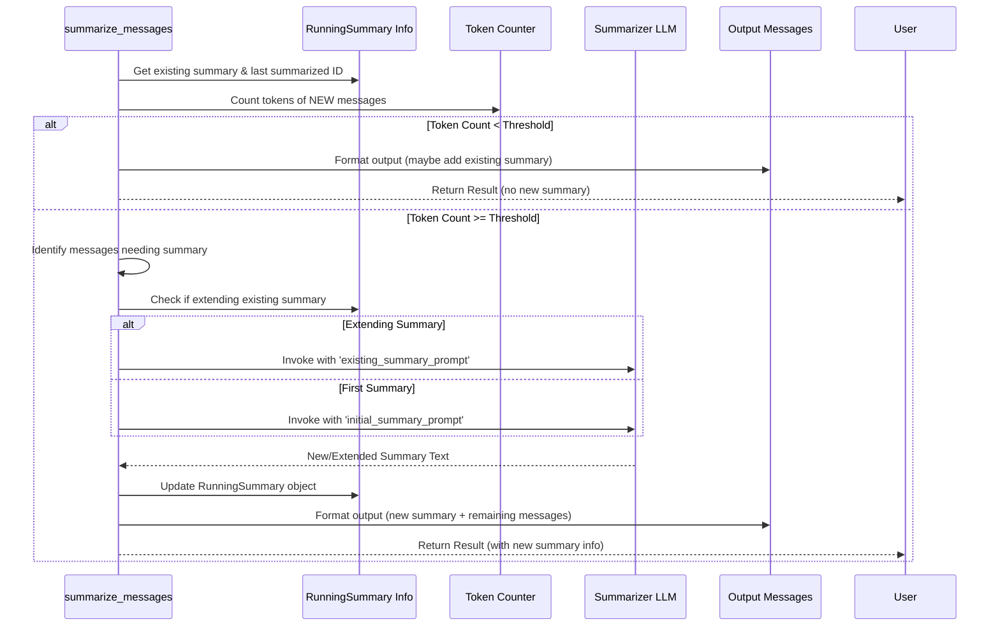

# Chapter 10: Short-Term Memory Summarization

Welcome back! In the previous chapter, [Store Interaction](09_store_interaction.md), we explored the `BaseStore` interface, the foundation where our AI's memories are physically stored and retrieved. We saw how memories are put onto shelves, retrieved by ID, and searched using their meaning.

Now, let's shift our focus from long-term storage to a more immediate challenge: managing the conversation itself.

## The Problem: The Ever-Growing Conversation

Imagine chatting with an AI assistant for a while. You discuss your travel plans, ask about the weather, share your favorite books, and then circle back to refining your itinerary. Large Language Models (LLMs), the brains behind these assistants, have a limit to how much information they can process at once – this is often called the "context window."

If the conversation history becomes too long (exceeds the context window's token limit – think of tokens like words or parts of words), the LLM might:

1.  **Forget the beginning:** It might lose track of early details, like your destination or initial preferences.
2.  **Hit an error:** The input might simply be too large for the model to handle.

This forces developers to manually trim the conversation history, often by just deleting the oldest messages. But blindly deleting messages means losing potentially valuable context!

## The Solution: An AI Meeting Secretary

Wouldn't it be better if, instead of just throwing away old notes, we had a diligent secretary summarize them?

That's precisely what **Short-Term Memory Summarization** in `langmem` does. It acts like that secretary:

1.  **Monitors:** It keeps an eye on the length of the conversation history (specifically, the token count).
2.  **Summarizes:** When the history gets close to the limit, it automatically reads the older messages.
3.  **Condenses:** It uses an LLM to write a brief summary of those older messages.
4.  **Replaces:** It replaces the detailed older messages with this concise summary.
5.  **Keeps Recent:** It keeps the most recent messages untouched.

This process ensures the *total* conversation length stays manageable for the LLM, while still preserving the key information from the earlier parts of the discussion in the summary.

## Key Concepts

*   **Token Limits:** LLMs process text broken down into tokens. They have a maximum number of tokens they can handle in a single input (e.g., 4096, 8192, or more).
*   **Summarization Trigger (`max_tokens_before_summary`):** This is the token threshold that tells the "secretary" when to start summarizing. Once the conversation history (excluding any previous summary) reaches this many tokens, the summarization process kicks in.
*   **Running Summary (`RunningSummary`):** How does the system avoid re-summarizing things? It uses a special object called `RunningSummary`. This object stores:
    *   The latest summary text.
    *   The IDs of all messages that have already been included in a summary.
    *   The ID of the *last* message that was summarized.
    This allows the system to only summarize *new* messages and progressively *extend* the existing summary.
*   **The Final Output:** After summarization, the list of messages sent to the main LLM typically looks like: `[Optional System Message, Summary Message, Recent Untouched Messages]`.

## How to Use: `summarize_messages` Function

The core logic lives in the `summarize_messages` function. You typically wouldn't call this manually in every turn of a chat, but understanding it helps clarify the process. Let's see how it works conceptually.

**Scenario:** Our conversation is getting long. We want to summarize the older parts.

1.  **Gather Inputs:** We need the current message list, any previous summary info, the LLM to *do* the summarizing, and token limits.

    ```python
    from langchain_core.messages import SystemMessage, HumanMessage, AIMessage
    from langchain_openai import ChatOpenAI
    from langmem.short_term import RunningSummary, summarize_messages

    # 1. Model to perform the summarization
    summarization_model = ChatOpenAI(model="openai:gpt-4o-mini", temperature=0)

    # 2. The conversation history (getting long!)
    messages = [
        SystemMessage(content="You are a helpful travel agent.", id="sys_0"),
        HumanMessage(content="Hi, I want to plan a trip to Paris.", id="msg_1"),
        AIMessage(content="Great! When are you thinking of going?", id="msg_2"),
        HumanMessage(content="Maybe in October? For about a week.", id="msg_3"),
        AIMessage(content="Okay, October is lovely in Paris. Budget?", id="msg_4"),
        # ... imagine many more messages here ...
        HumanMessage(content="What about flights from London?", id="msg_50"),
        AIMessage(content="Flights from London are frequent...", id="msg_51"), # <-- Let's say this exceeds the limit
    ]

    # 3. Previous summary info (None if this is the first time)
    previous_summary: RunningSummary | None = None

    # 4. Token limits
    MAX_TOKENS_FOR_LLM = 1000 # Max tokens the *main* LLM can handle
    MAX_TOKENS_BEFORE_SUMMARIZE = 800 # Trigger summarization earlier
    MAX_TOKENS_FOR_SUMMARY_ITSELF = 150 # Budget for the summary text

    print("Inputs ready for summarization.")
    ```
    *   We define the models, messages, and crucially, the token limits. `max_tokens_before_summary` determines *when* we summarize, and `max_tokens` sets the target length for the *final* message list sent to the main LLM.

2.  **Call the Function:** Pass these inputs to `summarize_messages`.

    ```python
    # (Assuming 'messages', 'summarization_model', etc. are defined above)

    # This function calculates tokens, decides if/what to summarize,
    # calls the LLM for the summary, and structures the output.
    summarization_result = summarize_messages(
        messages=messages,
        running_summary=previous_summary,
        model=summarization_model,
        max_tokens=MAX_TOKENS_FOR_LLM,
        max_tokens_before_summary=MAX_TOKENS_BEFORE_SUMMARIZE,
        max_summary_tokens=MAX_TOKENS_FOR_SUMMARY_ITSELF,
        # We can use a specific token counter, but default is usually fine
        # token_counter=my_token_counter
    )

    print("Summarization process complete!")
    print(f"Number of messages BEFORE: {len(messages)}")
    print(f"Number of messages AFTER: {len(summarization_result.messages)}")
    ```
    *   `summarize_messages` handles the complexity of counting tokens, figuring out which messages are old enough to summarize (based on `max_tokens_before_summary` and `previous_summary`), calling the `summarization_model`, and constructing the new list.

3.  **Examine the Output (`SummarizationResult`):** The function returns a `SummarizationResult` object.

    ```python
    # Access the results
    final_messages_for_llm = summarization_result.messages
    updated_running_summary = summarization_result.running_summary

    print("\nFinal messages to send to the main LLM:")
    for msg in final_messages_for_llm:
        print(f"- {msg.type}: {msg.content[:50]}...") # Print start of content

    if updated_running_summary:
        print("\nUpdated Running Summary Info:")
        print(f"- Summary Text: {updated_running_summary.summary[:60]}...")
        print(f"- Last Summarized ID: {updated_running_summary.last_summarized_message_id}")
    else:
        print("\nNo summarization was needed this time.")
    ```
    *   `messages`: This is the new, condensed list of messages ready to be sent to your main AI assistant. It will likely contain the original `SystemMessage`, a new `SystemMessage` holding the summary, and the most recent messages that *weren't* summarized.
    *   `running_summary`: This contains the updated summary information. You **must save this** (e.g., in your application's state) and pass it back into `summarize_messages` on the *next* turn to ensure summaries are built progressively.

    *(Example Output Might Look Like):*
    ```
    Final messages to send to the main LLM:
    - system: You are a helpful travel agent....
    - system: Summary of the conversation so far: User wants to plan a week-long trip to Paris in October....
    - human: What about flights from London?...
    - ai: Flights from London are frequent......

    Updated Running Summary Info:
    - Summary Text: User wants to plan a week-long trip to Paris in October....
    - Last Summarized ID: msg_4 # (ID of the last message included in the summary)
    ```

## Integration with LangGraph: The `SummarizationNode`

Calling `summarize_messages` manually and managing the `RunningSummary` state can be tedious. If you're using LangGraph to build your AI agent, `langmem` provides a convenient `SummarizationNode`.

This node wraps the `summarize_messages` logic and integrates smoothly with LangGraph's state management.

1.  **Define Your State:** Ensure your graph's state can hold the `messages` and the `RunningSummary` (often stored within a `context` dictionary).

    ```python
    from typing import TypedDict, List, Any
    from langchain_core.messages import AnyMessage
    from langmem.short_term import RunningSummary

    class MyGraphState(TypedDict):
        messages: List[AnyMessage]
        # Use 'context' to store auxiliary info like the summary
        context: dict[str, Any]
    ```

2.  **Create the Node:** Instantiate `SummarizationNode`, providing the model and token limits.

    ```python
    from langmem.short_term import SummarizationNode
    from langchain_openai import ChatOpenAI

    # Model for summarizing
    summarization_model = ChatOpenAI(model="openai:gpt-4o-mini")

    # Create the node instance
    summary_node = SummarizationNode(
        model=summarization_model,
        max_tokens=1000,                 # Target for final message list
        max_tokens_before_summary=800, # When to trigger summarization
        max_summary_tokens=150,        # Budget for summary message
        # --- Key Configuration ---
        # Where to read messages FROM in the state:
        input_messages_key="messages",
        # Where to write the summarized messages TO in the state update:
        output_messages_key="summarized_messages",
        # Name of the node in the graph:
        name="summarize_history"
    )
    print("SummarizationNode created.")
    ```
    *   Notice `input_messages_key` and `output_messages_key`. By default, the node reads from `messages` but writes the result to `summarized_messages`. This is often useful to keep the original history separate from the version sent to the LLM. The updated `RunningSummary` is automatically placed in the `context` field of the output state update.

3.  **Add to Your Graph:** Place the `summary_node` in your LangGraph workflow, typically right before you call your main LLM.

    ```python
    from langgraph.graph import StateGraph, START, END
    # Assume 'main_llm_node' is another node that calls your primary AI assistant

    # Define graph
    workflow = StateGraph(MyGraphState)

    # Add the summarization node
    workflow.add_node("summarize", summary_node)

    # Add your main LLM call node (simplified)
    # This node would read from 'summarized_messages' now
    # def main_llm_node(state: MyGraphState):
    #     llm_input = state["summarized_messages"]
    #     # ... call main LLM ...
    #     return {"messages": [llm_response]}
    # workflow.add_node("call_llm", main_llm_node)

    # Define flow: Start -> Summarize -> Call LLM ...
    workflow.add_edge(START, "summarize")
    # workflow.add_edge("summarize", "call_llm")
    # ... other edges ...

    # graph = workflow.compile(...)
    print("Graph workflow defined with summarization node.")
    ```
    *   When the graph runs, it hits the "summarize" node. The node reads `state['messages']`, uses `state['context']['running_summary']` (if it exists), performs summarization if needed, and returns an update like `{"summarized_messages": [...], "context": {"running_summary": <new_summary_info>}}`. The next node (`call_llm`) can then use the `summarized_messages`. The `RunningSummary` is automatically persisted in the state for the next run thanks to LangGraph's checkpointer.

## Under the Hood: The Secretary's Workflow

When `summarize_messages` (or the `SummarizationNode`) runs, it follows these steps:

1.  **Check Existing Summary:** Does a `RunningSummary` exist from a previous turn? If so, identify which messages are new since the last summary.
2.  **Count Tokens:** Calculate the token count of the *new* messages.
3.  **Check Trigger:** Is the token count of new messages (plus potentially some context carry-over) greater than or equal to `max_tokens_before_summary`?
4.  **No Summarization Needed:** If the trigger threshold isn't met, and there's no *existing* summary to add, return the original messages. If there *is* an existing summary, format the output using `final_prompt` to include it before the new messages.
5.  **Summarization Needed:**
    a.  **Identify Messages:** Select the block of new messages that triggered the summarization. Handle edge cases like ensuring Tool calls/results stay together.
    b.  **Select Prompt:** If there's an `existing_summary`, use `existing_summary_prompt` (which asks the LLM to *extend* the summary). Otherwise, use `initial_summary_prompt`.
    c.  **Adjust for LLM Limit:** If the messages identified for summarization exceed the *summarization model's* own context limit (`max_tokens_to_summarize`), trim the oldest ones among them.
    d.  **Call Summarizer LLM:** Invoke the `model` with the chosen prompt and the messages to be summarized.
    e.  **Create/Update `RunningSummary`:** Store the new summary text, update the set of summarized message IDs, and record the ID of the last message included in this batch.
    f.  **Format Final Output:** Use `final_prompt` to construct the list of messages containing the [Optional System Message, New Summary Message, Remaining Untouched Messages].
6.  **Return Result:** Package the final message list and the updated `RunningSummary` into a `SummarizationResult`.

Here’s a simplified diagram of the decision process:



The core logic resides in `src/langmem/short_term/summarization.py`, implementing these steps within the `summarize_messages` function. The `SummarizationNode` class in the same file wraps this function for easy LangGraph integration.

## Conclusion

Short-Term Memory Summarization is a vital technique for managing the context window of LLMs in long-running conversations. By automatically summarizing older messages when the history grows too long, `langmem` (via `summarize_messages` and `SummarizationNode`) helps prevent context loss and errors, acting like a diligent secretary keeping meeting notes concise. It preserves essential information from the past while ensuring the input to the main LLM remains within its operational limits. This allows for more robust and coherent interactions over extended periods.

This concludes our core exploration of `langmem`'s features! In the final chapter, we'll briefly look at some utility scripts that help maintain the project itself: [Documentation Generation Scripts](11_documentation_generation_scripts.md).

---

Generated by [AI Codebase Knowledge Builder](https://github.com/The-Pocket/Tutorial-Codebase-Knowledge)