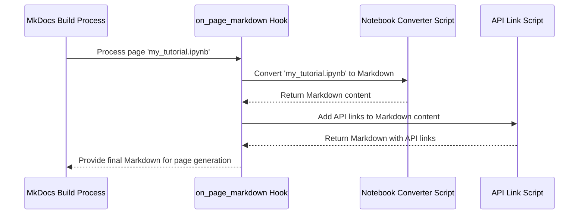

# Chapter 11: Documentation Generation Scripts

Welcome to the final chapter! In [Chapter 10: Short-Term Memory Summarization](10_short_term_memory_summarization.md), we saw how `langmem` can cleverly summarize long conversations to keep them manageable for the AI. Now, we'll take a peek behind the curtain at some tools the `langmem` *developers* use, not for AI memory, but for building and maintaining the very documentation you're reading!

## The Challenge: Keeping the User Manual Accurate

Imagine building a complex piece of machinery, like a robot. As you build it, you also write the user manual. But what happens when you update a part of the robot? You have to remember to update the manual too! If you add a new button, does the manual show it? If you change how a command works, does the manual explain the new way?

Keeping documentation accurate and up-to-date, especially for a software project like `langmem` that evolves over time, is a big challenge:
*   **Broken Links:** Links to specific parts of the code documentation (the API reference) might break if the code is reorganized.
*   **Outdated Examples:** Code examples in the manual might stop working if the underlying library changes.
*   **Manual Formatting:** Converting examples written in interactive formats (like Jupyter Notebooks) into website pages takes time and effort.

Manually checking every link and example across the entire documentation set after every change is tedious and error-prone.

## The Solution: Automated Documentation Helpers

To tackle this, the `langmem` project uses a set of internal **Documentation Generation Scripts**. Think of these like specialized tools the robot builders use *only* when assembling the user manual and blueprints, not when operating the robot itself.

These scripts automate common documentation tasks, ensuring consistency and accuracy. They are *not* part of the core `langmem` library that you install and use for AI memory management. They are helper utilities for the project maintainers.

Let's look at two main types of tasks these scripts handle for `langmem`.

## Concept 1: Automatically Linking to the API Reference

When you read documentation, you often see code examples like this:

```python
from langmem import create_memory_store_manager # Some langmem function

# ... setup code ...

manager = create_memory_store_manager(...)
```

Wouldn't it be great if you could click on `create_memory_store_manager` and jump directly to its official definition and detailed explanation in the API reference? Manually adding these links everywhere is a lot of work and easy to forget.

**The Script:** `docs_scripts/generate_api_reference_links.py`

**What it does:** This script scans the documentation files (like the Markdown files for these chapters) for Python code blocks.

1.  **Find Imports:** It looks for lines where `langmem` components (or related libraries like `langchain` and `langgraph`) are imported.
2.  **Check Known List:** It compares the imported items against a predefined list of known, documented functions and classes (`WELL_KNOWN_LANGMEM_OBJECTS`, etc.). This list maps the item (like `create_memory_store_manager`) to its specific documentation URL.
3.  **Add Links:** If it finds a match, it automatically adds a small clickable link above the code block, pointing directly to the relevant API documentation page.

**Simplified Look at the "Known List":**
The script uses mappings like this (simplified from the actual code):

```python
# Simplified Concept from docs_scripts/generate_api_reference_links.py

# Maps (module_path, class_name) to its docs page section
WELL_KNOWN_LANGMEM_OBJECTS = {
    ("langmem", "create_memory_store_manager"): "memory", # Belongs to 'memory' docs page
    ("langmem", "create_search_memory_tool"): "tools",   # Belongs to 'tools' docs page
    ("langmem.utils", "NamespaceTemplate"): "utils",     # Belongs to 'utils' docs page
    # ... many more entries ...
}

# Base URL for langmem docs
_LANGMEM_API_REFERENCE = "https://langchain-ai.github.io/langmem/reference/"

# Example: For ('langmem', 'create_memory_store_manager'), the script constructs
# the URL: _LANGMEM_API_REFERENCE + 'memory' + '/#' + 'langmem' + '.' + 'create_memory_store_manager'
# Resulting URL -> https://langchain-ai.github.io/langmem/reference/memory/#langmem.create_memory_store_manager
```
*   This predefined dictionary tells the script where the documentation for each important `langmem` piece lives.

**The Result:** You might see something like this added *above* the code block in the final documentation website:

<sup><i>API: <a href="https://langchain-ai.github.io/langmem/reference/memory/#langmem.create_memory_store_manager">create_memory_store_manager</a></i></sup>

```python
from langmem import create_memory_store_manager

# ... code ...
```
*   This link was added automatically by the script!

**Analogy:** It's like having an automated assistant read through the user manual and automatically add footnotes defining every technical term, linking to a glossary.

## Concept 2: Converting Notebooks to Documentation Pages

Sometimes, the best way to explain a concept is with an interactive Jupyter Notebook (`.ipynb` file). These notebooks mix explanatory text, runnable code, and the code's output all in one place. They are great for tutorials!

However, a raw `.ipynb` file doesn't look great on a documentation website. We need to convert it into a standard web page format, like Markdown (`.md`).

**The Script:** `docs_scripts/notebook_convert.py`

**What it does:** This script takes a Jupyter Notebook file as input and converts it into a clean Markdown file suitable for the documentation website.

1.  **Read Notebook:** It uses Python libraries (`nbformat`, `nbconvert`) designed to work with notebooks.
2.  **Process Cells:** It goes through the notebook cell by cell:
    *   **Markdown Cells:** Copies the text, potentially fixing links or image paths to work correctly on the website.
    *   **Code Cells:** Takes the code, potentially escaping special characters that might interfere with Markdown formatting.
    *   **Output Cells:** Takes the results shown in the notebook (like text output or images) and formats them nicely. It might remove empty outputs or apply other cleanup rules using helper classes like `EscapePreprocessor`.
3.  **Apply Template:** It uses a template (like `mdoutput`) to structure the converted content into a standard Markdown document format.

**Simplified Look at the Converter:**

```python
# Simplified Concept from docs_scripts/notebook_convert.py
import os
from pathlib import Path
import nbformat
from nbconvert.exporters import MarkdownExporter
# (Import Preprocessors like EscapePreprocessor)

# Setup the converter with rules and templates
exporter = MarkdownExporter(
    # preprocessors=[EscapePreprocessor, ...], # Rules for cleaning up cells
    template_name="mdoutput", # How to structure the final Markdown
    # ... other configurations ...
)

def convert_notebook(notebook_path: Path) -> str:
    """Reads a notebook and converts it to a Markdown string."""
    with open(notebook_path) as f:
        # Read the notebook file content
        nb = nbformat.read(f, as_version=4)

    # Use the exporter to convert the notebook node to Markdown
    markdown_body, _ = exporter.from_notebook_node(nb)
    return markdown_body

# Usage:
# markdown_content = convert_notebook(Path("path/to/my_tutorial.ipynb"))
# Now 'markdown_content' holds the tutorial formatted for the website.
```
*   This code snippet shows the core idea: load the notebook (`nbformat.read`) and use the configured `MarkdownExporter` to turn it into a Markdown string (`exporter.from_notebook_node`).

**Analogy:** It's like taking a messy draft written on napkins (the notebook) and typing it up neatly according to a publisher's style guide (the Markdown conversion) to create a chapter for a book.

## How They Work Together: The Documentation Build Process

Okay, we have a script for adding API links and another for converting notebooks. How are they actually used?

`langmem` uses a popular documentation site generator called `MkDocs`. `MkDocs` allows running custom Python scripts (called "hooks") during the website build process.

**The Integration Script:** `docs_scripts/notebook_hooks.py`

**What it does:** This script defines hooks that `MkDocs` calls automatically when building the `langmem` documentation site.

1.  **`on_files` Hook:** Tells `MkDocs` to treat `.ipynb` notebook files as if they are source files for documentation pages.
2.  **`on_page_markdown` Hook:** This hook runs for *every* page being built:
    *   **Check Type:** Is the source file a notebook (`.ipynb`)?
    *   **Convert (if needed):** If yes, it calls the `convert_notebook` function (from `notebook_convert.py`) to turn the notebook content into Markdown format first.
    *   **Add API Links:** It then takes the Markdown content (either original or just converted) and calls the `update_markdown_with_imports` function (from `generate_api_reference_links.py`) to scan for code blocks and add the API reference links.
    *   **Other Formatting (Optional):** It might also run other small helpers, like `_highlight_code_blocks`, to automatically format code examples for better readability.
    *   **Return Final Markdown:** It passes the final, processed Markdown back to `MkDocs` to be turned into an HTML page.

**Simplified Build Flow Diagram:**



This automated pipeline ensures that documentation pages derived from notebooks are correctly formatted and that all relevant code examples have helpful links to the API reference, without the developers needing to do it manually each time.

## Why Aren't These Part of the Library?

It's important to remember that these scripts are **build tools**. They help create the final documentation website and user manual. They are *not* needed to actually *use* the `langmem` library for memory management or prompt optimization.

*   They live in a separate `docs_scripts` folder within the project's source code.
*   When you install `langmem` (e.g., using `pip install langmem`), these scripts are *not* included.
*   Only someone actively working on maintaining or updating the `langmem` documentation itself would need to run or modify these scripts.

## Conclusion

The Documentation Generation Scripts (`generate_api_reference_links.py`, `notebook_convert.py`, `notebook_hooks.py`) are internal helper tools used by the `langmem` maintainers. They automate the process of converting educational Jupyter Notebooks into documentation pages and adding helpful, accurate links from code examples to the API reference. While you won't use these scripts directly as a user of the `langmem` library, understanding their role helps appreciate the effort that goes into maintaining high-quality, accessible documentation and shows how automation can support project maintainability behind the scenes.

This concludes our journey through the core concepts and components of `langmem`! We hope this tutorial has given you a solid foundation for understanding how `langmem` helps build AI applications with persistent memory. Happy coding!

---

Generated by [AI Codebase Knowledge Builder](https://github.com/The-Pocket/Tutorial-Codebase-Knowledge)