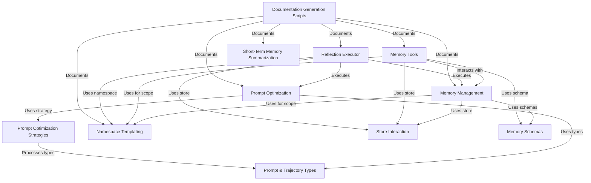

# Tutorial: langmem

`langmem` is a library designed to give large language models (LLMs) **persistent memory**.
It allows AI agents to *remember* structured information like facts and preferences across conversations using **Memory Management**.
Agents can actively use **Memory Tools** to save or search this memory.
The library also features **Prompt Optimization** capabilities to automatically improve the agent's instructions based on past performance.
Utilities like **Namespace Templating** help organize memories for different users or contexts, while **Short-Term Memory Summarization** helps manage the LLM's context window.

**Source Repository:** [https://github.com/langchain-ai/langmem.git](https://github.com/langchain-ai/langmem.git)

## Chapters

1. [Memory Management](01_memory_management.md)
2. [Memory Schemas](02_memory_schemas.md)
3. [Namespace Templating](03_namespace_templating.md)
4. [Memory Tools](04_memory_tools.md)
5. [Prompt Optimization](05_prompt_optimization.md)
6. [Prompt & Trajectory Types](06_prompt___trajectory_types.md)
7. [Prompt Optimization Strategies](07_prompt_optimization_strategies.md)
8. [Reflection Executor](08_reflection_executor.md)
9. [Store Interaction](09_store_interaction.md)
10. [Short-Term Memory Summarization](10_short_term_memory_summarization.md)
11. [Documentation Generation Scripts](11_documentation_generation_scripts.md)

---

Generated by [AI Codebase Knowledge Builder](https://github.com/The-Pocket/Tutorial-Codebase-Knowledge)