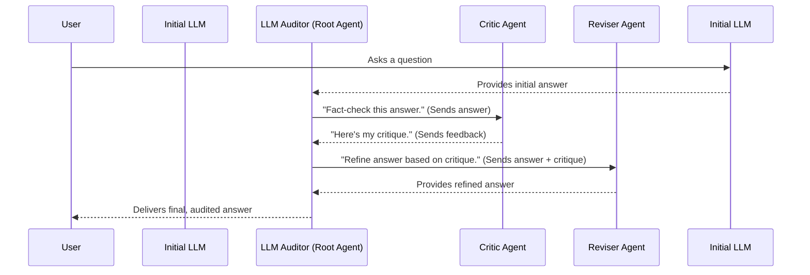

# Chapter 1: LLM Auditor (Root Agent)

Welcome to the `llm-auditor` tutorial! We're excited to help you get started. In this journey, we'll explore how to build systems that can check, verify, and improve the answers generated by Large Language Models (LLMs).

## Why Do We Need an "LLM Auditor"?

Imagine you're building a helpful chatbot for your customers. You want it to answer questions about your latest product. You could use a powerful LLM to generate these answers. LLMs are amazing, but sometimes they can:
*   **"Hallucinate":** Make up facts or details that aren't true.
*   **Provide outdated information:** If the LLM's knowledge cutoff is in the past, it won't know about very recent events.
*   **Misinterpret a question:** Leading to an answer that's technically correct but not what the user was looking for.

For our customer-facing chatbot, providing inaccurate or misleading information is a big no-no! We need a way to *audit* the LLM's answers before they reach the customer. This is where the `llm-auditor` project, and specifically our "LLM Auditor (Root Agent)," comes into play.

**Our Central Use Case:** Let's say a customer asks our chatbot: "What are the new features in version 2.0 of SuperSoftware, and when was it released?"
An LLM might generate an answer. But how do we ensure this answer is accurate, up-to-date, and truly helpful? We need a system – an auditor!

## The LLM Auditor (Root Agent): The Editor-in-Chief

The **LLM Auditor (Root Agent)** is the main orchestrator of the entire auditing process. Think of it as the **editor-in-chief** of a newspaper.

Here's how an editor-in-chief manages a newspaper:
1.  A reporter writes an article (this is like our LLM generating an initial answer).
2.  The editor-in-chief doesn't just publish it. They first send it to a **fact-checker**.
3.  The fact-checker reviews the article for accuracy.
4.  Based on the fact-checker's report, the article might then go to a **copy editor** to improve its clarity, grammar, and style, incorporating any necessary corrections.
5.  Only after these steps is the article published.

The LLM Auditor (Root Agent) works similarly. It defines the high-level workflow by coordinating specialized **sub-agents**:
*   An initial answer from an LLM (the "article") is received.
*   The Root Agent first sends it to a **[Critic Agent](02_critic_agent.md)** (our "fact-checker"). This agent's job is to evaluate the answer, perhaps by checking facts against a knowledge base or the web.
*   Based on the Critic Agent's findings, the Root Agent might then send the original answer and the critique to a **[Reviser Agent](03_reviser_agent.md)** (our "copy editor"). This agent's job is to refine the answer, correcting inaccuracies or improving its quality based on the critique.
*   The final, audited answer is then ready.

This structured approach ensures a methodical way to verify and improve LLM-generated content.

## How It Works: The Big Picture

Let's visualize the flow with our editor-in-chief analogy:



In this diagram:
1.  The User asks a question.
2.  An Initial LLM (this could be any LLM you choose) generates a first draft of the answer.
3.  The `LLM Auditor (Root Agent)` receives this initial answer.
4.  It delegates the task of fact-checking to the `Critic Agent`.
5.  The `Critic Agent` returns its findings (the critique).
6.  The `Root Agent` then asks the `Reviser Agent` to improve the answer, using both the original answer and the critique.
7.  The `Reviser Agent` provides a polished, refined answer.
8.  The `Root Agent` delivers this final, audited answer back.

This workflow ensures that the answer has been scrutinized and improved before the user sees it.

## Under the Hood: A Peek at the `agent.py` Code

The LLM Auditor (Root Agent) in our project is built using a concept called a `SequentialAgent`. We'll explore this in more detail in [Sequential Agent Workflow](04_sequential_agent_workflow.md), but for now, just know that it means the sub-agents (like the Critic and Reviser) run one after the other, in a defined sequence.

Let's look at how the `root_agent` (our LLM Auditor) is defined in `llm_auditor/agent.py`:

```python
# File: llm_auditor/agent.py

# We import SequentialAgent from the ADK (Agent Development Kit)
from google.adk.agents import SequentialAgent

# We also import our specialized sub-agents
from .sub_agents.critic import critic_agent
from .sub_agents.reviser import reviser_agent

# This is where our main LLM Auditor is defined!
llm_auditor = SequentialAgent(
    name='llm_auditor',
    description=(
        'Evaluates LLM-generated answers, verifies actual accuracy using the'
        ' web, and refines the response to ensure alignment with real-world'
        ' knowledge.'
    ),
    sub_agents=[critic_agent, reviser_agent],
)

# For convenience, we also call it root_agent
root_agent = llm_auditor
```

Let's break this down:
*   `from google.adk.agents import SequentialAgent`: This line imports the `SequentialAgent` class. This class is a blueprint for creating agents that execute a series of sub-tasks (or sub-agents) in order.
*   `from .sub_agents.critic import critic_agent`: This imports the `critic_agent` we'll learn about in [Chapter 2: Critic Agent](02_critic_agent.md).
*   `from .sub_agents.reviser import reviser_agent`: This imports the `reviser_agent` we'll learn about in [Chapter 3: Reviser Agent](03_reviser_agent.md).
*   `llm_auditor = SequentialAgent(...)`: This is the core definition!
    *   `name='llm_auditor'`: A simple, descriptive name for our agent.
    *   `description='...'`: Explains what this agent does.
    *   `sub_agents=[critic_agent, reviser_agent]`: This is the most important part for understanding the workflow! It's a list that defines:
        1.  First, run the `critic_agent`.
        2.  Then, take the output of the `critic_agent` (along with the original input) and pass it to the `reviser_agent`.
*   `root_agent = llm_auditor`: We assign `llm_auditor` to `root_agent`. This `root_agent` is what other parts of the system, like the deployment scripts, will use.

So, the `root_agent` is essentially a manager that knows the order in which to call its team members (`critic_agent` and `reviser_agent`).

## Using the LLM Auditor (Conceptual Example)

Let's go back to our chatbot use case: "What are the new features in version 2.0 of SuperSoftware, and when was it released?"

1.  **Input to the system:** The user's question.
2.  **Initial LLM Answer (potentially flawed):** Let's imagine an LLM, without auditing, says:
    > "SuperSoftware 2.0 was released in January 2023 and includes a new dashboard and faster processing."
    (But what if it's now late 2024, and version 2.0 was actually released in July 2024, and also included a key integration feature the LLM missed?)

3.  **The LLM Auditor (Root Agent) Process:**
    *   The `root_agent` receives this initial answer.
    *   It first passes the answer to the `critic_agent`. The `critic_agent` might check a reliable source (like your company's internal release notes or website) and find: "Release date is incorrect; actual is July 2024. Missing 'SuperConnect API integration' feature."
    *   The `root_agent` then passes the original answer *and* the critic's feedback to the `reviser_agent`.
    *   The `reviser_agent` takes all this information and crafts an improved answer.

4.  **Output (Audited Answer from `root_agent`):**
    > "SuperSoftware 2.0 was released in July 2024. Key new features include a revamped dashboard, significantly faster processing, and the new SuperConnect API for easier integrations."

Much better and more reliable!

When you deploy the `llm-auditor`, it's this `root_agent` that gets packaged and made available. You can see it referenced in the deployment script:

```python
# File: deployment/deploy.py (simplified snippet)

from llm_auditor.agent import root_agent # Our Root Agent is imported!
from vertexai.preview.reasoning_engines import AdkApp
# ... other imports and setup ...

def create() -> None:
    """Creates an agent engine for LLM Auditor."""
    # The root_agent is wrapped by AdkApp for deployment
    adk_app = AdkApp(agent=root_agent, enable_tracing=True)
    
    # ... rest of the deployment code ...
    print(f"Deployed an agent engine based on: {root_agent.name}")

# ...
```
This code snippet shows that `root_agent` is the core component packaged by `AdkApp` for deployment. We'll learn much more about `AdkApp` in [Chapter 9: AdkApp (Deployment Wrapper)](09_adkapp__deployment_wrapper_.md) and the actual deployment process in [Chapter 10: Vertex AI Agent Engine Deployment](10_vertex_ai_agent_engine_deployment.md). For now, the key takeaway is that the `root_agent` *is* the `llm-auditor`.

## Key Takeaways

*   The **LLM Auditor (Root Agent)** is the top-level orchestrator in the `llm-auditor` project.
*   It acts like an "editor-in-chief," managing a workflow of specialized sub-agents.
*   It ensures a structured process (e.g., Critic then Reviser) to verify and improve answers from LLMs.
*   This approach helps make LLM-generated content more reliable, accurate, and trustworthy.

## Conclusion

You've now met the "big boss" – the LLM Auditor (Root Agent)! You understand its crucial role in managing the auditing pipeline and why such a system is important for building robust applications with LLMs. It sets the stage by defining *what* needs to happen and in *what order*.

In the next chapter, we'll dive into the first specialist on its team. Get ready to meet the fact-checker: [Chapter 2: Critic Agent](02_critic_agent.md).

---

Generated by [AI Codebase Knowledge Builder](https://github.com/The-Pocket/Tutorial-Codebase-Knowledge)