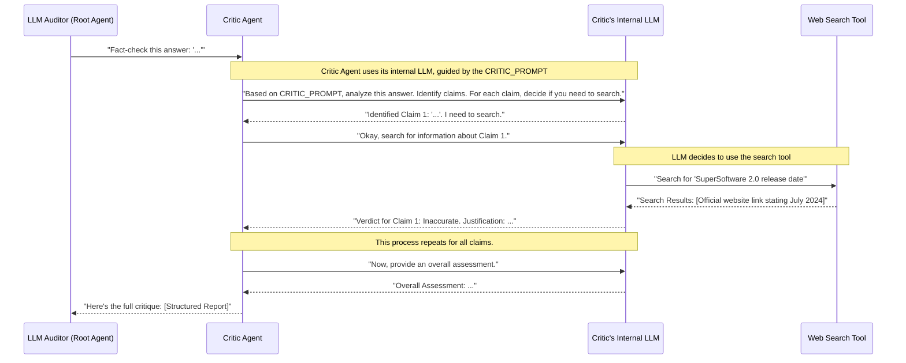

# Chapter 2: Critic Agent

Welcome to Chapter 2! In [Chapter 1: LLM Auditor (Root Agent)](01_llm_auditor__root_agent_.md), we met the "editor-in-chief" – the `LLM Auditor (Root Agent)` – which orchestrates the process of checking and refining answers from Large Language Models (LLMs). Now, let's meet the first specialist on its team: the **Critic Agent**.

## Why Do We Need a "Critic"? The Fact-Checking Specialist

Imagine our LLM-powered chatbot for "SuperSoftware" (from Chapter 1) gives this answer to the question "What are the new features in version 2.0 of SuperSoftware, and when was it released?":

> "SuperSoftware 2.0 was released in January 2023 and includes a new dashboard and faster processing."

This answer sounds plausible. But what if:
*   The actual release date was July 2024?
*   A crucial new feature, like "SuperConnect API integration," was completely missed?

If our chatbot gives out this incorrect or incomplete information, customers might be misled. We need a meticulous investigator to check the facts before the answer goes out. This is precisely the job of the **Critic Agent**.

## The Critic Agent: Our Digital Detective

Think of the **Critic Agent** as an **investigative journalist** or a **diligent fact-checker**. Its main job is to:

1.  **Deconstruct the Answer:** Take the LLM's generated answer and break it down into individual statements or "claims."
    *   For example, in the answer above, the claims are:
        1.  "SuperSoftware 2.0 was released in January 2023."
        2.  "SuperSoftware 2.0 includes a new dashboard."
        3.  "SuperSoftware 2.0 includes faster processing."

2.  **Verify Each Claim:** For every claim, the Critic Agent tries to determine if it's true. To do this, it can be given access to **tools**, like a web search engine.
    *   It would search for "SuperSoftware 2.0 release date" or "SuperSoftware 2.0 features."

3.  **Provide a Verdict:** Based on the evidence it finds (or doesn't find), it gives a verdict for each claim (e.g., "Accurate," "Inaccurate," "Unsupported"). It also explains *why* it reached that verdict (the justification).

Essentially, the Critic Agent doesn't take the LLM's word for anything. It wants proof!

## How the Critic Works: An Example with SuperSoftware

Let's see the Critic Agent in action with our SuperSoftware example.

1.  **Input to Critic Agent:** The `LLM Auditor (Root Agent)` sends the initial LLM answer to the `Critic Agent`:
    > "SuperSoftware 2.0 was released in January 2023 and includes a new dashboard and faster processing."

2.  **Critic Agent's Process (Simplified):**
    *   **Identifies Claim 1:** "SuperSoftware 2.0 was released in January 2023."
        *   *Action:* Uses its web search tool to find the official release date.
        *   *Evidence Found:* Official website says "July 2024."
        *   *Verdict for Claim 1:* Inaccurate. Justification: "Release date is July 2024, not January 2023, per official website."
    *   **Identifies Claim 2:** "SuperSoftware 2.0 includes a new dashboard."
        *   *Action:* Uses web search for features.
        *   *Evidence Found:* Release notes confirm "revamped dashboard."
        *   *Verdict for Claim 2:* Accurate. Justification: "Confirmed by release notes."
    *   **Identifies Claim 3:** "SuperSoftware 2.0 includes faster processing."
        *   *Action:* Uses web search for features.
        *   *Evidence Found:* Release notes confirm "significantly faster processing."
        *   *Verdict for Claim 3:* Accurate. Justification: "Confirmed by release notes."
    *   **Checks for Omissions:** The Critic might also be prompted to look for *missing* information if the original question implied a complete list. It might search for all features of SuperSoftware 2.0.
        *   *Evidence Found:* Release notes also mention "SuperConnect API integration."
        *   *Finding:* An important feature was omitted from the original answer.

3.  **Output from Critic Agent (The "Critique"):** The Critic Agent then provides a structured report back to the `LLM Auditor (Root Agent)`. This report would look something like this (in a simplified form):

    ```
    Overall Assessment: The answer is partially accurate but contains a significant error regarding the release date and omits a key feature.

    Claim-by-Claim Breakdown:
    - Claim: "SuperSoftware 2.0 was released in January 2023."
      - Text in Answer: "SuperSoftware 2.0 was released in January 2023"
      - Verdict: Inaccurate
      - Justification: Official sources state the release date as July 2024. (Source: SuperSoftware Official Website)
    - Claim: "SuperSoftware 2.0 includes a new dashboard."
      - Text in Answer: "includes a new dashboard"
      - Verdict: Accurate
      - Justification: Confirmed by official release notes. (Source: SuperSoftware Release Notes)
    - Claim: "SuperSoftware 2.0 includes faster processing."
      - Text in Answer: "and faster processing"
      - Verdict: Accurate
      - Justification: Confirmed by official release notes. (Source: SuperSoftware Release Notes)
    - Omission:
      - Missing Information: The "SuperConnect API integration" feature was not mentioned.
      - Justification: This is a key feature listed in the official release notes. (Source: SuperSoftware Release Notes)
    ```
    This detailed critique is then used by the `LLM Auditor (Root Agent)` to decide the next steps, which usually involve sending this information to the [Reviser Agent](03_reviser_agent.md).

## Under the Hood: A Closer Look at the Critic

The Critic Agent, like other agents in `llm-auditor`, is essentially a specialized LLM instance that has been given:
*   A specific **role** and set of **instructions** (via a prompt).
*   Access to **tools** (like web search).

Here's a simplified flow of what happens internally when the Critic Agent is called:



This diagram shows that the `Critic Agent` isn't just a simple program; it leverages another LLM (its `CriticLLM`) that is heavily guided by a specific set of instructions (the prompt) and can use tools.

### Diving into the Code

Let's look at how the `critic_agent` is defined in `llm_auditor/sub_agents/critic/agent.py`.

```python
# File: llm_auditor/sub_agents/critic/agent.py (simplified)

from google.adk import Agent
from google.adk.tools import google_search # Tool for web searching
from . import prompt # This imports the CRITIC_PROMPT

# ... (callback function _render_reference is defined here) ...

critic_agent = Agent(
    model='gemini-2.0-flash', # Specifies which LLM to use
    name='critic_agent',
    instruction=prompt.CRITIC_PROMPT, # The crucial instructions!
    tools=[google_search], # Gives the agent access to Google Search
    after_model_callback=_render_reference, # Formats the output
)
```

Let's break this down:
*   `from google.adk import Agent`: We use the `Agent` class from the Agent Development Kit (ADK) to build our Critic. We'll learn more about the general `Agent` class in [Chapter 5: ADK Agent](05_adk_agent.md).
*   `from google.adk.tools import google_search`: This imports the `google_search` tool, allowing the agent to perform web searches. Tool integration is covered more in [Chapter 7: Agent Tool Integration](07_agent_tool_integration.md).
*   `from . import prompt`: This line imports the `CRITIC_PROMPT` string from a local `prompt.py` file.
*   `critic_agent = Agent(...)`: This creates our `Critic Agent`.
    *   `model='gemini-2.0-flash'`: Tells the agent to use the `gemini-2.0-flash` LLM model for its "thinking" process.
    *   `name='critic_agent'`: A unique identifier for this agent.
    *   `instruction=prompt.CRITIC_PROMPT`: This is the **heart of the Critic Agent**. The `CRITIC_PROMPT` contains detailed instructions that tell the underlying LLM *how to behave* like a critic. We'll look at this next.
    *   `tools=[google_search]`: This list makes the `google_search` tool available to the LLM when it's processing the instructions.
    *   `after_model_callback=_render_reference`: This specifies a function (`_render_reference`) that runs after the LLM generates its response. It helps format the output, for example, by adding references to search results. We'll explore callbacks in [Chapter 8: Response Post-processing (Callbacks)](08_response_post_processing__callbacks_.md).

### The Power of the Prompt

The `CRITIC_PROMPT` (located in `llm_auditor/sub_agents/critic/prompt.py`) is a carefully crafted set of instructions that turns a general-purpose LLM into our specialized Critic. Here's a very small peek at its structure to give you an idea:

```python
# File: llm_auditor/sub_agents/critic/prompt.py (highly simplified snippet)

CRITIC_PROMPT = """
You are a professional investigative journalist...

# Your task
Your task involves three key steps: First, identifying all CLAIMS presented in the answer. Second, determining the reliability of each CLAIM. And lastly, provide an overall assessment.

## Step 1: Identify the CLAIMS
Carefully read the provided answer text. Extract every distinct CLAIM...

## Step 2: Verify each CLAIM
For each CLAIM... consult External Sources: Use your general knowledge and/or search the web...
Determine the VERDICT: ... Accurate, Inaccurate, Disputed, Unsupported, Not Applicable...
Provide a JUSTIFICATION...

## Step 3: Provide an overall assessment
...

# Output format
The last block of your output should be a Markdown-formatted list, summarizing your verification result...
"""
```
This prompt clearly defines:
*   **The Persona:** "You are a professional investigative journalist..."
*   **The Task:** Identify claims, verify them, and assess.
*   **The Process:** Detailed steps for how to verify, what verdicts to use, and the need for justifications.
*   **The Tools:** Implicitly, by mentioning "search the web," it guides the LLM to use the `google_search` tool when needed.
*   **The Output Format:** How the critique should be structured.

By providing such a detailed prompt, we guide the LLM to perform the complex task of critical analysis and fact-checking. We'll delve deeper into prompting strategies in [Chapter 6: Agent Prompting Strategy](06_agent_prompting_strategy.md).

## Key Takeaways

*   The **Critic Agent** acts as a specialized fact-checker or investigative journalist within the `llm-auditor` system.
*   Its primary role is to deconstruct an LLM's answer into claims, verify each claim (often using tools like web search), and provide a verdict and justification.
*   The Critic Agent's behavior is largely defined by its **instruction prompt** (`CRITIC_PROMPT`) and the **tools** it has access to.
*   It produces a structured "critique" that helps the overall system understand the accuracy and completeness of an LLM's answer.

## Conclusion

You've now learned about the `Critic Agent`, the meticulous detective of our `llm-auditor` team. It plays a vital role in ensuring the information provided by an LLM is scrutinized for accuracy before it's finalized. The critique it generates is invaluable for the next step in our auditing process.

In the next chapter, we'll see what happens with this critique as we meet another specialist: [Chapter 3: Reviser Agent](03_reviser_agent.md), the agent responsible for fixing and improving the answer based on the Critic's findings.

---

Generated by [AI Codebase Knowledge Builder](https://github.com/The-Pocket/Tutorial-Codebase-Knowledge)