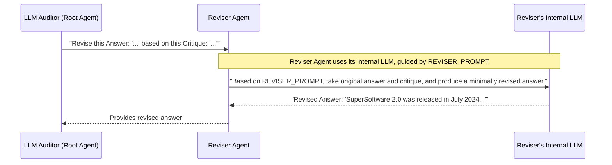

# Chapter 3: Reviser Agent

Welcome to Chapter 3! In [Chapter 2: Critic Agent](02_critic_agent.md), we met our diligent fact-checker, the `Critic Agent`. It scrutinizes an LLM's answer and provides a detailed "critique," pointing out inaccuracies, unsupported claims, or missing information. But what happens next? Simply knowing an answer is flawed isn't enough; we need to fix it!

This is where our next specialist, the **Reviser Agent**, steps in.

## Why Do We Need a "Reviser"? The Polishing Expert

Let's revisit our "SuperSoftware" chatbot example.
The initial LLM answer was:
> "SuperSoftware 2.0 was released in January 2023 and includes a new dashboard and faster processing."

The `Critic Agent` then produced a critique (simplified):
> - Claim: "SuperSoftware 2.0 was released in January 2023." -> **Inaccurate** (Actual: July 2024)
> - Omission: Missed "SuperConnect API integration" feature.

Now we have the original answer and a list of its problems. We need an agent that can take this feedback and carefully edit the original answer to make it accurate and complete. This is the role of the **Reviser Agent**.

## The Reviser Agent: Our Skilled Editor

Think of the **Reviser Agent** as a **skilled copy editor**. Its main job is to:

1.  **Understand the Critique:** Take the original LLM's answer and the detailed feedback from the `Critic Agent`.
2.  **Make Necessary Corrections:** Carefully refine the original answer to:
    *   Correct factual inaccuracies (e.g., change "January 2023" to "July 2024").
    *   Address disputed points (e.g., present multiple perspectives if the critic found conflicting information).
    *   Clarify unsupported statements (e.g., rephrase to be less assertive or note that it's an unverified claim).
    *   Incorporate missing information highlighted by the critic.
3.  **Preserve the Original Intent:** Crucially, the Reviser aims to do this while making **minimal changes**. It tries to preserve the original answer's style, structure, and overall intent as much as possible. It's not rewriting from scratch; it's polishing.

The goal is an answer that is accurate, coherent, and true to the verified findings, all while feeling like a natural evolution of the original response.

## How the Reviser Works: Fixing the SuperSoftware Answer

Let's see the Reviser Agent in action with our SuperSoftware example.

1.  **Input to Reviser Agent:** The `LLM Auditor (Root Agent)` sends both the initial LLM answer and the `Critic Agent`'s critique to the `Reviser Agent`.

    *   **Original Answer:**
        > "SuperSoftware 2.0 was released in January 2023 and includes a new dashboard and faster processing."
    *   **Critique (Simplified Snippet):**
        > - Claim: "SuperSoftware 2.0 was released in January 2023." -> **Inaccurate** (Justification: Official sources state July 2024.)
        > - Omission: Missing "SuperConnect API integration" feature.

2.  **Reviser Agent's Process (Simplified):**
    *   The Reviser Agent (which is itself a specialized LLM call) reads the original answer and the critique.
    *   It sees the release date "January 2023" is marked "Inaccurate" and should be "July 2024." It updates this part of the sentence.
    *   It sees that "SuperConnect API integration" was an "Omission." It finds a natural way to incorporate this new feature into the existing list of features.
    *   It ensures the sentence still flows well and maintains the original tone.

3.  **Output from Reviser Agent (The "Revised Answer"):** The Reviser Agent then provides the polished answer back to the `LLM Auditor (Root Agent)`.

    *   **Revised Answer:**
        > "SuperSoftware 2.0 was released in July 2024. Key new features include a new dashboard, faster processing, and the SuperConnect API integration."

Notice how the revised answer is now accurate and more complete, but it still sounds very similar to the original. The changes were minimal and targeted.

## Under the Hood: The Reviser's Method

Just like the `Critic Agent`, the `Reviser Agent` is essentially a specialized LLM that is guided by a specific set of instructions (its prompt) to perform its editing task.

Here's a simplified flow of what happens:



The `RootAgent` passes the original problematic answer and the critic's findings. The `ReviserAgent` then uses its own LLM, armed with the `REVISER_PROMPT`, to carefully edit the text.

### Diving into the Code

Let's look at the definition of the `reviser_agent` in `llm_auditor/sub_agents/reviser/agent.py`:

```python
# File: llm_auditor/sub_agents/reviser/agent.py (simplified)

from google.adk import Agent
# ... (other imports for callback) ...
from . import prompt # This imports the REVISER_PROMPT

# ... (_remove_end_of_edit_mark callback function is defined here) ...

reviser_agent = Agent(
    model='gemini-2.0-flash',      # Specifies the LLM to use
    name='reviser_agent',
    instruction=prompt.REVISER_PROMPT, # The crucial editing instructions!
    after_model_callback=_remove_end_of_edit_mark, # Cleans up output
)
```

Let's break this down:
*   `from google.adk import Agent`: We use the base `Agent` class from the Agent Development Kit (ADK), which we'll explore more in [Chapter 5: ADK Agent](05_adk_agent.md).
*   `from . import prompt`: This imports the `REVISER_PROMPT` from the local `prompt.py` file.
*   `reviser_agent = Agent(...)`: This creates our `Reviser Agent`.
    *   `model='gemini-2.0-flash'`: Tells the agent to use the `gemini-2.0-flash` LLM for its "thinking" and editing process.
    *   `name='reviser_agent'`: A unique identifier for this agent.
    *   `instruction=prompt.REVISER_PROMPT`: This is the **core of the Reviser Agent**. The `REVISER_PROMPT` contains detailed instructions that tell the underlying LLM *how to behave* like a precise editor.
    *   `after_model_callback=_remove_end_of_edit_mark`: This specifies a function (`_remove_end_of_edit_mark`) that runs *after* the LLM generates its revised text. In this case, it removes a special marker (`---END-OF-EDIT---`) that the prompt asks the LLM to include. This is an example of post-processing, which we'll cover in [Chapter 8: Response Post-processing (Callbacks)](08_response_post_processing__callbacks_.md).

### The Power of the Prompt: `REVISER_PROMPT`

The `REVISER_PROMPT` (found in `llm_auditor/sub_agents/reviser/prompt.py`) is a carefully crafted set of instructions that transforms a general-purpose LLM into our specialized Reviser. It's quite detailed, but here's the essence of what it tells the LLM:

```python
# File: llm_auditor/sub_agents/reviser/prompt.py (conceptual snippet)

REVISER_PROMPT = """
You are a professional editor... Your task is to minimally revise the answer text to make it accurate, while maintaining the overall structure, style, and length...

The reviewer has identified CLAIMs... with VERDICTs:
    * Accurate: ...no need to edit.
    * Inaccurate: ...fix them following reviewer's justification.
    * Disputed: ...present two (or more) sides...
    * Unsupported: ...omit... or soften the claims...
    * Not Applicable: ...no need to edit.

...You should not introduce any new claims... Your edit should be minimal...

Output format:
  * ...output your revised answer text.
  * After the answer, output a line of "---END-OF-EDIT---" and stop.

Here are some examples...
=== Example 1 ===
Question: Who was the first president of the US?
Answer: George Washington was the first president of the United States.
Findings: ... Accurate ...
Your expected response:
George Washington was the first president of the United States.
---END-OF-EDIT---

=== Example 2 ===
Question: What is the shape of the sun?
Answer: The sun is cube-shaped and very hot.
Findings: ... Claim 1: The sun is cube-shaped. Verdict: Inaccurate ...
Your expected response:
The sun is sphere-shaped and very hot.
---END-OF-EDIT---

Here are the question-answer pair and the reviewer-provided findings:
"""
```

This prompt clearly defines:
*   **The Persona:** "You are a professional editor..."
*   **The Task:** Minimally revise for accuracy, preserving style and structure.
*   **Editing Guidelines:** Specific instructions on how to handle claims based on the `Critic Agent`'s verdicts (Accurate, Inaccurate, Disputed, Unsupported). This is key to ensuring the revisions are targeted and appropriate.
*   **Constraints:** "Do not introduce any new claims," "edit should be minimal."
*   **Output Format:** How the revised answer should be structured, including the `---END-OF-EDIT---` marker (which the callback later removes).
*   **Examples:** The prompt includes examples of how to perform the task, which greatly helps the LLM understand the expected behavior.

By providing such detailed instructions and examples, we guide the LLM to act as a careful and precise editor, making only the necessary changes based on the critic's verified findings. We'll explore prompting strategies in more detail in [Chapter 6: Agent Prompting Strategy](06_agent_prompting_strategy.md).

The `_remove_end_of_edit_mark` function mentioned in `reviser_agent` definition is a small utility:
```python
# File: llm_auditor/sub_agents/reviser/agent.py

# ... (imports) ...
_END_OF_EDIT_MARK = '---END-OF-EDIT---'

def _remove_end_of_edit_mark(
    # ... (arguments) ...
) -> LlmResponse:
    # ... (logic to find and remove the _END_OF_EDIT_MARK from response) ...
    # For example, if response is "Revised text.\n---END-OF-EDIT---",
    # it becomes "Revised text."
    return llm_response
```
This function simply cleans up the output from the Reviser LLM, removing the marker that the prompt instructed it to add. This ensures the final revised text passed on is clean.

## Key Takeaways

*   The **Reviser Agent** acts as a skilled editor, refining an LLM's answer based on the `Critic Agent`'s feedback.
*   Its goal is to correct inaccuracies, address disputed points, or clarify unsupported statements while **preserving the original answer's style, structure, and intent** with minimal changes.
*   Like the Critic, the Reviser's behavior is primarily defined by its detailed **instruction prompt** (`REVISER_PROMPT`).
*   It takes the original answer and the critique as input and produces a polished, more reliable version of the answer.

## Conclusion

You've now met the `Reviser Agent`, the meticulous editor on our `llm-auditor` team! It takes the valuable insights from the `Critic Agent` and uses them to carefully polish the original LLM answer, ensuring it's accurate and trustworthy before it reaches the end-user.

So far, we've seen the `LLM Auditor (Root Agent)` call the `Critic Agent` and then the `Reviser Agent`. This step-by-step process is a key part of how `llm-auditor` works. In the next chapter, we'll take a closer look at this ordered execution: [Chapter 4: Sequential Agent Workflow](04_sequential_agent_workflow.md).

---

Generated by [AI Codebase Knowledge Builder](https://github.com/The-Pocket/Tutorial-Codebase-Knowledge)