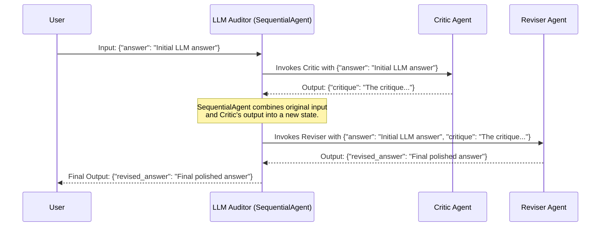

# Chapter 4: Sequential Agent Workflow

In the previous chapters, we met the [LLM Auditor (Root Agent)](01_llm_auditor__root_agent_.md), the [Critic Agent](02_critic_agent.md), and the [Reviser Agent](03_reviser_agent.md). We saw that the Root Agent first calls the Critic to get feedback, and then calls the Reviser to fix the answer based on that feedback. This step-by-step process, where one agent's work leads to the next, is a very common and powerful pattern.

But how do we manage this "one after the other" process in code? How do we ensure the Critic runs before the Reviser, and that the Reviser gets the information it needs from both the original answer and the Critic's findings? That's where the **Sequential Agent Workflow** comes in!

## The Problem: Managing Multi-Step Tasks

Imagine you're not building software, but baking a cake. You can't just throw all the ingredients into the oven at once! You need to follow a sequence:
1.  Mix the dry ingredients.
2.  Mix the wet ingredients separately.
3.  Combine the wet and dry ingredients.
4.  Pour into a pan.
5.  Bake in the oven.

Each step depends on the one before it. Our `llm-auditor` is similar:
1.  The **Critic Agent** needs to "fact-check" the initial answer.
2.  *Then*, the **Reviser Agent** needs to "edit" the answer using the Critic's fact-checking report.

We need a way to define and execute this specific order.

## What is a Sequential Agent Workflow?

A **Sequential Agent Workflow** is a design pattern where multiple, smaller, specialized agents (we call them **sub-agents**) are chained together to perform a complex task. They work one after another, in a specific, predefined order.

Think of it like an **assembly line** in a factory:
*   **Station 1 (Critic Agent):** Receives an initial product (the LLM's raw answer). It inspects it for flaws (fact-checks it) and attaches a report (the critique).
*   **Station 2 (Reviser Agent):** Receives the product *and* the inspection report. It then repairs or polishes the product based on the report (revises the answer).

The key ideas are:
1.  **Order:** The sequence is fixed. Station 1 always comes before Station 2.
2.  **Hand-off:** Each station passes its output (or the evolving product) to the next station in line.

The `llm-auditor` project uses this pattern. In fact, the `LLM Auditor (Root Agent)` we discussed in [Chapter 1](01_llm_auditor__root_agent_.md) *is* a `SequentialAgent` that orchestrates the Critic and Reviser agents.

## The `llm_auditor` as a Sequential Agent

Let's look again at how our `llm_auditor` (also known as `root_agent`) is defined in the `llm_auditor/agent.py` file. This will make the concept much clearer.

```python
# File: llm_auditor/agent.py (Focus on SequentialAgent)

from google.adk.agents import SequentialAgent # The star of this chapter!
from .sub_agents.critic import critic_agent   # Our fact-checker
from .sub_agents.reviser import reviser_agent # Our editor

llm_auditor = SequentialAgent(
    name='llm_auditor',
    description='Evaluates, verifies, and refines LLM answers.',
    sub_agents=[critic_agent, reviser_agent], # The magic sequence!
)

root_agent = llm_auditor
```
Let's break this down:
*   `from google.adk.agents import SequentialAgent`: We're using a ready-made blueprint called `SequentialAgent` from the Google Agent Development Kit (ADK). This blueprint knows how to run sub-agents in order.
*   `sub_agents=[critic_agent, reviser_agent]`: This is the most important part for understanding the workflow! It's a list that tells the `SequentialAgent`:
    1.  **First**, run the `critic_agent`.
    2.  **Then**, take the output from the `critic_agent` (along with the original input) and pass it to the `reviser_agent`.

The order in this `sub_agents` list is exactly the order in which they will run. If we had listed `reviser_agent` first, it would try to revise before any critique was made – which wouldn't make sense!

## How Data Flows in the Sequence

This "passing output to the next agent" is crucial. Let's trace how information (data) flows when you use the `llm_auditor`:

Imagine you give the `llm_auditor` an initial answer from an LLM that needs checking:
*   **Initial Input to `llm_auditor`:**
    ```
    {
        "answer": "SuperSoftware 2.0 was released in January 2023."
    }
    ```
    (Note: The actual input structure might be just the string, or a dictionary like this. For now, let's assume it's a dictionary key `answer` which the `critic_agent` expects).

1.  **`llm_auditor` (SequentialAgent) starts:**
    *   It looks at its `sub_agents` list and sees `critic_agent` is first.

2.  **Call `critic_agent`:**
    *   The `SequentialAgent` calls `critic_agent` with the current state, which is the initial input.
    *   Input to `critic_agent`: `{"answer": "SuperSoftware 2.0 was released in January 2023."}`
    *   `critic_agent` does its work (fact-checking, as we saw in [Chapter 2](02_critic_agent.md)) and produces an output, let's say:
    *   Output from `critic_agent`: `{"critique": "Release date is inaccurate. Actual: July 2024."}`

3.  **`llm_auditor` (SequentialAgent) prepares for the next step:**
    *   It takes the output from `critic_agent` and *adds it to the current information*.
    *   The "current information" or "state" now becomes:
        ```
        {
            "answer": "SuperSoftware 2.0 was released in January 2023.",
            "critique": "Release date is inaccurate. Actual: July 2024."
        }
        ```
    *   It looks at its `sub_agents` list and sees `reviser_agent` is next.

4.  **Call `reviser_agent`:**
    *   The `SequentialAgent` calls `reviser_agent` with this combined information.
    *   Input to `reviser_agent`:
        ```
        {
            "answer": "SuperSoftware 2.0 was released in January 2023.",
            "critique": "Release date is inaccurate. Actual: July 2024."
        }
        ```
    *   `reviser_agent` does its work (editing, as we saw in [Chapter 3](03_reviser_agent.md)) using both the original `answer` and the `critique`. It produces an output:
    *   Output from `reviser_agent`: `{"revised_answer": "SuperSoftware 2.0 was released in July 2024."}` (Or it might just return the string directly).

5.  **`llm_auditor` (SequentialAgent) finishes:**
    *   Since `reviser_agent` is the last agent in the sequence, its output is typically considered the final output of the entire `llm_auditor`.
    *   **Final Output from `llm_auditor`:** `{"revised_answer": "SuperSoftware 2.0 was released in July 2024."}`

This way, each agent gets exactly the information it needs, building upon the work of the previous agents.

Here's a diagram showing this flow:



## Under the Hood: How `SequentialAgent` Works (Conceptually)

The `SequentialAgent` class (from the ADK) is designed to handle this orchestration automatically. You don't need to write the logic for calling agents one by one and passing data around manually; `SequentialAgent` does it for you.

Here's a very simplified idea of what `SequentialAgent` might be doing inside when you call it:

```python
# This is conceptual pseudo-code, not the actual ADK implementation.
# It's to help you understand the idea.

class ConceptualSequentialAgent:
    def __init__(self, sub_agents_list):
        self.sub_agents = sub_agents_list

    def process(self, initial_input_data: dict) -> dict:
        # Start with the initial data you provided
        current_data_state = initial_input_data.copy()

        # Loop through each sub-agent in the defined order
        for sub_agent in self.sub_agents:
            # Give the current data state to the sub-agent
            # The sub-agent uses what it needs and produces new output
            output_from_sub_agent = sub_agent.process(current_data_state)
            
            # Add the sub-agent's new output to our data state
            # This way, the next agent in line can see it
            current_data_state.update(output_from_sub_agent)
            
        # After all sub-agents have run, return the final data state
        # (Often, we're most interested in the output of the *last* agent)
        return current_data_state
```
In this conceptual code:
1.  It takes your initial input.
2.  It loops through the `sub_agents` you provided in the list.
3.  For each `sub_agent`, it calls that agent, passing along *all the information gathered so far* (the `current_data_state`).
4.  It takes whatever new information the `sub_agent` produces and adds it to the `current_data_state`.
5.  Finally, it returns the accumulated state. The `llm-auditor` is set up so that the `SequentialAgent` ultimately returns the output of the last sub-agent (the `reviser_agent`'s output).

The actual `SequentialAgent` in the Google Agent Development Kit (ADK) is more robust and has more features, but this gives you the basic idea. It's a powerful tool for building complex behaviors by combining simpler, focused agents.

## Why is this Useful?

The Sequential Agent Workflow offers several benefits:
*   **Modularity:** Each sub-agent (like Critic or Reviser) has a single, clear job. This makes them easier to build, test, and understand.
*   **Reusability:** You could potentially reuse the `Critic Agent` in a different sequence or a different project.
*   **Clarity:** The sequence clearly defines the overall process. It's easy to see the steps involved.
*   **Manageability:** Instead of one giant, complex agent, you have smaller, manageable pieces.

For our `llm-auditor`, this means we have a clear, two-step process: first critique, then revise. The `SequentialAgent` makes sure this happens smoothly.

## Key Takeaways

*   A **Sequential Agent Workflow** is a pattern where multiple sub-agents run one after another in a fixed order.
*   Each sub-agent performs its specific task and passes its results (or contributes to an evolving state) that the next sub-agent can use.
*   It's like an **assembly line**, with each agent being a station.
*   The `llm_auditor` (Root Agent) in our project is an example of a `SequentialAgent`, orchestrating the `critic_agent` and then the `reviser_agent`.
*   The `sub_agents` list in the `SequentialAgent` definition determines the order of execution.
*   This pattern helps build complex systems from simpler, modular parts.

## Conclusion

You now understand the "Sequential Agent Workflow," the mechanism that allows our `llm-auditor` to perform its multi-step auditing process in a clean and organized way! It's the conductor making sure each part of the orchestra plays at the right time. This pattern is a fundamental concept from the Google Agent Development Kit (ADK).

The `SequentialAgent`, `CriticAgent`, and `ReviserAgent` are all built using a common base class and concepts from the ADK. In the next chapter, we'll take a closer look at this foundation: [Chapter 5: ADK Agent](05_adk_agent.md), to understand the building blocks of these agents.

---

Generated by [AI Codebase Knowledge Builder](https://github.com/The-Pocket/Tutorial-Codebase-Knowledge)