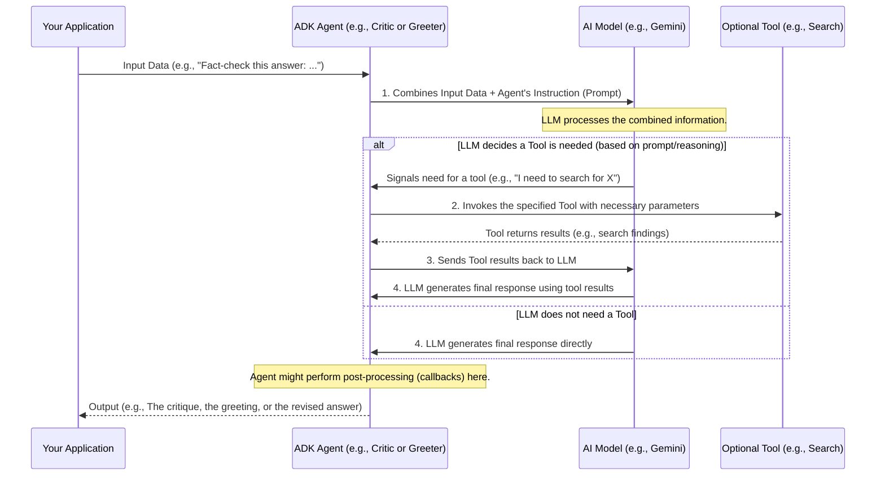

# Chapter 5: ADK Agent - The Basic Building Block

In [Chapter 4: Sequential Agent Workflow](04_sequential_agent_workflow.md), we saw how the `LLM Auditor (Root Agent)` uses a `SequentialAgent` to run the `Critic Agent` and then the `Reviser Agent` in a specific order. You might have noticed that both the `Critic Agent` and the `Reviser Agent` are, well, "agents." But what exactly makes them an agent? What's the common blueprint they follow?

That's where the **ADK Agent** concept comes in. It's the fundamental building block provided by the Google Agent Development Kit (ADK) for creating these specialized, intelligent workers.

## The Blueprint for an Intelligent Worker

Imagine you want to build a team of specialized robots. You wouldn't start from scratch for each robot. Instead, you'd likely have a basic robot chassis (the body), a slot for a brain (the processor), a way to give it instructions, and ports to attach various tools (like a gripper or a scanner).

The **ADK Agent** is like this basic robot blueprint. It's a general-purpose design for creating an "intelligent entity" that can perform tasks. Each specific agent you build, like our `Critic Agent` or `Reviser Agent`, is an instance of this blueprint, customized for a particular job.

Think of it this way:
*   **ADK Agent:** The standard design for a "worker robot."
*   **Critic Agent:** A worker robot built from this design, specifically programmed and equipped to be a fact-checker.
*   **Reviser Agent:** Another worker robot from the same design, but programmed and equipped to be an editor.

## What Defines an ADK Agent?

So, what are the key parts of this "ADK Agent" blueprint? Typically, each ADK Agent is defined by three main things:

1.  **Instruction (Prompt):** This is the "job description" or the specific set of instructions given to the agent. It tells the agent what its role is, what task it needs to perform, how to behave, and often what format its output should take. For example, the `Critic Agent` has a prompt telling it to act like an investigative journalist. We'll dive deeper into this in [Chapter 6: Agent Prompting Strategy](06_agent_prompting_strategy.md).

2.  **AI Model:** This is the "brain" of the agent. It's the Large Language Model (LLM), like Gemini, that powers the agent's reasoning, understanding, and decision-making. The model processes the instructions (prompt) and any input to generate a response.

3.  **Tools (Optional):** These are the "hands and senses" of the agent. Tools allow an agent to interact with the external world, gather information, or perform actions beyond just generating text. For example, our `Critic Agent` uses a `google_search` tool to look up facts on the internet. We'll explore tools more in [Chapter 7: Agent Tool Integration](07_agent_tool_integration.md).

## ADK Agent in `llm-auditor`: Critic and Reviser

Let's look at how our `Critic Agent` and `Reviser Agent` from the `llm-auditor` project fit this ADK Agent blueprint.

Remember their definitions?

**Critic Agent:**
This code is from `llm_auditor/sub_agents/critic/agent.py` (simplified):
```python
# We import the base Agent class from ADK
from google.adk import Agent
from google.adk.tools import google_search # A tool
from . import prompt # Contains CRITIC_PROMPT

critic_agent = Agent(
    model='gemini-2.0-flash',      # 1. The AI Model
    name='critic_agent',
    instruction=prompt.CRITIC_PROMPT, # 2. The Instruction (Prompt)
    tools=[google_search],         # 3. The Tools
    # ... (other parameters like callbacks)
)
```
*   **`Agent(...)`**: We are creating an instance of the `ADK Agent`.
*   **`model='gemini-2.0-flash'`**: Specifies the LLM (the brain) for the Critic.
*   **`instruction=prompt.CRITIC_PROMPT`**: Provides the detailed job instructions for the Critic.
*   **`tools=[google_search]`**: Equips the Critic with the Google Search tool.

**Reviser Agent:**
This code is from `llm_auditor/sub_agents/reviser/agent.py` (simplified):
```python
from google.adk import Agent
from . import prompt # Contains REVISER_PROMPT

reviser_agent = Agent(
    model='gemini-2.0-flash',        # 1. The AI Model
    name='reviser_agent',
    instruction=prompt.REVISER_PROMPT, # 2. The Instruction (Prompt)
    # No specific tools listed here for the Reviser in this setup
    # ... (other parameters like callbacks)
)
```
*   **`Agent(...)`**: Again, creating an instance of the `ADK Agent`.
*   **`model='gemini-2.0-flash'`**: The Reviser also uses Gemini as its brain.
*   **`instruction=prompt.REVISER_PROMPT`**: Provides the detailed editing instructions for the Reviser.
*   **Tools**: The Reviser, in this configuration, doesn't have explicit tools listed. Its job is to work with the text provided to it based on its instructions.

As you can see, both the `Critic Agent` and the `Reviser Agent` are built using the same `Agent` class from the ADK. They become specialized workers because we give them different `instruction`s, and sometimes different `tools`.

## Creating a Simple ADK Agent: The "Greeter"

To make this even clearer, let's imagine we want to create a very simple agent – a "Greeter Agent" – whose only job is to say hello politely.

Here's how you might define it conceptually using the `Agent` class:

```python
from google.adk import Agent

# 1. Define the Instruction (Prompt)
greeter_agent_prompt = "You are a very friendly and polite greeter. Your task is to welcome the user and wish them a wonderful day."

# 2. Create the ADK Agent instance
friendly_greeter_agent = Agent(
    name="friendly_greeter",
    model="gemini-2.0-flash",    # Or any other suitable model
    instruction=greeter_agent_prompt
    # No tools needed for this simple greeter
)

# How you might "use" this agent (conceptual)
# input_to_agent = {"user_query": "A new person just arrived."}
# response = friendly_greeter_agent.process(input_to_agent)
# print(response.text) # Expected: "Hello! Welcome! I hope you have a wonderful day!"
```
In this example:
*   We defined a simple `greeter_agent_prompt`.
*   We created an `Agent` instance named `friendly_greeter_agent`.
*   We told it to use the `gemini-2.0-flash` model.
*   We gave it our `greeter_agent_prompt` as its instruction.
*   It doesn't need any special tools for this task.

If we were to run this `friendly_greeter_agent` and give it some input (or even no specific input, as the prompt is quite general), it would use its LLM brain, guided by the prompt, to generate a friendly greeting.

This shows the power and simplicity of the `ADK Agent` blueprint: define the instructions, pick a model, add tools if needed, and you have a specialized intelligent worker!

## Under the Hood: How an ADK Agent Works

When you "run" an ADK Agent (e.g., by calling its `process` method with some input), here's a simplified sequence of what happens:



Let's break down these steps:
1.  **Input and Prompt Combination:** The ADK Agent takes any input you provide (like the answer to be critiqued) and combines it with its pre-defined `instruction` (the prompt). This forms the complete context for the AI model.
2.  **Tool Invocation (If Needed):** If the agent's instructions or the AI model's reasoning determines that a tool is necessary (e.g., the Critic needs to search the web), the ADK Agent framework handles calling that tool and getting its output.
3.  **Information to Model:** The AI model receives all this information – the initial input, the agent's instructions, and any results from tools.
4.  **Response Generation:** The AI model processes everything and generates a response.
5.  **Output:** The ADK Agent then returns this response. Sometimes, a special function called a "callback" might run to clean up or format this response before it's finally returned (we'll see this in [Chapter 8: Response Post-processing (Callbacks)](08_response_post_processing__callbacks_.md)).

The ADK Agent abstraction handles a lot of this internal complexity for you, so you can focus on defining *what* the agent should do (the prompt), *what brain* it should use (the model), and *what tools* it needs.

## Key Takeaways

*   The **ADK Agent** (represented by the `google.adk.Agent` class) is the fundamental blueprint in the Google Agent Development Kit for creating intelligent, autonomous entities.
*   It's like a chassis for a specialized worker.
*   Each ADK Agent is primarily defined by its:
    *   **Instruction (Prompt):** Its job description and rules.
    *   **AI Model:** Its "brain" (e.g., Gemini).
    *   **Tools (Optional):** Its "hands and senses" for interacting or gathering info.
*   The `Critic Agent` and `Reviser Agent` in `llm-auditor` are examples of ADK Agents, customized for their specific tasks.
*   By changing these three components, you can create a wide variety of specialized agents.

## Conclusion

You now understand the core concept of an **ADK Agent** – the basic building block that powers our `Critic` and `Reviser` and many other potential intelligent workers you might build with the Agent Development Kit! It provides a structured way to harness the power of LLMs and equip them with instructions and tools to perform specific tasks.

One of the most critical parts of defining an effective ADK Agent is crafting good instructions. In the next chapter, we'll explore this crucial aspect: [Chapter 6: Agent Prompting Strategy](06_agent_prompting_strategy.md).

---

Generated by [AI Codebase Knowledge Builder](https://github.com/The-Pocket/Tutorial-Codebase-Knowledge)