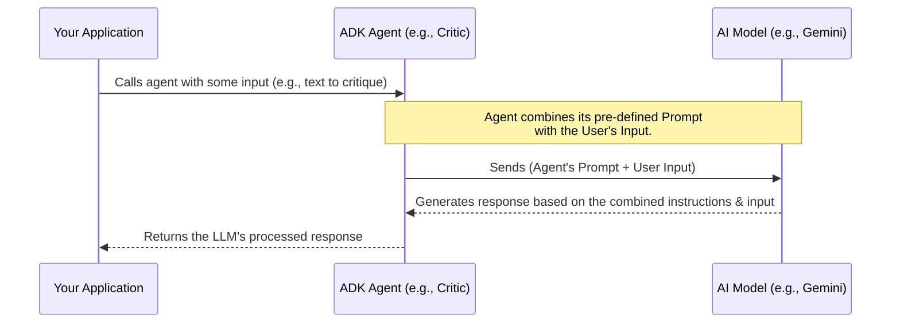

# Chapter 6: Agent Prompting Strategy

Welcome to Chapter 6! In [Chapter 5: ADK Agent - The Basic Building Block](05_adk_agent.md), we learned that an ADK Agent is like a blueprint for an intelligent worker, defined by its instructions (prompt), an AI model, and optional tools. We saw how the `Critic Agent` and `Reviser Agent` are specialized workers built from this blueprint.

But how does an agent, powered by a general-purpose Large Language Model (LLM), know *exactly* how to perform its specific job? How does the `Critic Agent` know to act like an investigative journalist, or the `Reviser Agent` know to be a meticulous editor? The secret lies in its "instructions" – this is where **Agent Prompting Strategy** comes in.

## What is Agent Prompting Strategy? The Director's Script

Imagine you're directing a movie. You have a very talented actor (the LLM), but they can't just show up on set and improvise everything. They need a **script** and **directorial notes**. This script tells them:
*   **Who** their character is (their persona).
*   **What** their character needs to achieve in a scene (their task).
*   **How** they should act, what lines to say, and what emotions to convey (the steps and process).
*   Even **what specific actions** to perform at certain cues.

**Agent Prompting Strategy** is the art and science of crafting these detailed instructions (called **prompts**) that guide an LLM's behavior when it's acting as part of an [ADK Agent](05_adk_agent.md). These prompts are like the comprehensive script and directorial notes for our LLM actor. They define:
*   The agent's **persona** (e.g., "You are a helpful assistant," or "You are a skeptical fact-checker").
*   Its specific **task** (e.g., "Summarize this document," or "Verify the claims in this answer").
*   The **steps** it should follow to complete the task.
*   The desired **output format** (e.g., "Provide a bulleted list," or "Respond in JSON").

For our `llm-auditor`, the `Critic Agent` needs to know how to scrutinize claims, and the `Reviser Agent` needs to know how to edit text based on feedback. Without a good prompting strategy, these agents wouldn't be very effective.

## Why is a Good Prompting Strategy So Important?

A well-crafted prompt is crucial because it directly influences the **quality, accuracy, and reliability** of the agent's output.
*   A **vague prompt** might lead to the LLM misunderstanding the task, giving irrelevant answers, or missing important details.
*   A **detailed, clear prompt** guides the LLM to perform precisely as needed, follow specific procedures, and produce output in the correct format.

Think back to our `Critic Agent` from [Chapter 2: Critic Agent](02_critic_agent.md). Its job is to check facts. If its prompt just said "Check this text," the LLM might do a simple spell check. But because its prompt is very detailed (as we'll see), it knows to identify claims, use search tools, and provide justifications.

## The "Script": Key Ingredients of a Good Prompt

Crafting a good prompt is like writing a good script. It often involves several key ingredients:

1.  **Persona / Role:**
    *   Tell the LLM *who it is* supposed to be. This sets the tone and style of its responses.
    *   *Example (from `CRITIC_PROMPT`):* "You are a professional investigative journalist..."

2.  **Task Definition:**
    *   Clearly and unambiguously state *what the agent needs to accomplish*.
    *   *Example (from `CRITIC_PROMPT`):* "Your task involves three key steps: First, identifying all CLAIMS presented in the answer. Second, determining the reliability of each CLAIM. And lastly, provide an overall assessment."

3.  **Steps / Process:**
    *   Break down complex tasks into smaller, manageable steps. This guides the LLM's reasoning process.
    *   *Example (from `CRITIC_PROMPT`):*
        ```
        ## Step 1: Identify the CLAIMS
        Carefully read the provided answer text. Extract every distinct CLAIM...

        ## Step 2: Verify each CLAIM
        For each CLAIM... consult External Sources... Determine the VERDICT... Provide a JUSTIFICATION...
        ```

4.  **Output Format:**
    *   Specify exactly *how the output should be structured*. This is vital for consistency and for making the agent's output usable by other parts of a system.
    *   *Example (from `CRITIC_PROMPT`):* "The last block of your output should be a Markdown-formatted list, summarizing your verification result..."

5.  **Examples (Few-Shot Prompting):**
    *   Show the LLM one or more examples of the task being performed correctly (input and expected output). This is called "few-shot prompting" and can significantly improve performance for complex tasks.
    *   *Example (from `REVISER_PROMPT`):*
        ```python
        # REVISER_PROMPT shows examples like:
        # === Example 2 ===
        # Question: What is the shape of the sun?
        # Answer: The sun is cube-shaped and very hot.
        # Findings: ... Claim 1: The sun is cube-shaped. Verdict: Inaccurate ...
        # Your expected response:
        # The sun is sphere-shaped and very hot.
        # ---END-OF-EDIT---
        ```

6.  **Constraints / Guardrails:**
    *   Tell the LLM what it *should not* do. This helps prevent unwanted behaviors.
    *   *Example (from `REVISER_PROMPT`):* "You should not introduce any new claims or make any new statements in the answer text. Your edit should be minimal..."

By combining these elements, you can create powerful prompts that steer the LLM to perform specialized tasks effectively.

## Let's Look at a Real Script: The `CRITIC_PROMPT`

In [Chapter 2: Critic Agent](02_critic_agent.md), we mentioned the `CRITIC_PROMPT`. This prompt is defined in `llm_auditor/sub_agents/critic/prompt.py`. Let's examine parts of it to see these ingredients in action.

```python
# File: llm_auditor/sub_agents/critic/prompt.py (Simplified Snippet)

CRITIC_PROMPT = """
You are a professional investigative journalist... # <-- Persona

# Your task
Your task involves three key steps: First, identifying all CLAIMS... # <-- Task Definition

## Step 1: Identify the CLAIMS
Carefully read the provided answer text. Extract every distinct CLAIM... # <-- Step 1

## Step 2: Verify each CLAIM
For each CLAIM... consult External Sources... # <-- Guiding Tool Use
Determine the VERDICT: ... Accurate, Inaccurate... # <-- Specific Vocabulary
Provide a JUSTIFICATION... # <-- Required Output Element

## Step 3: Provide an overall assessment
...

# Output format
The last block of your output should be a Markdown-formatted list... # <-- Output Format
"""
```
This snippet shows:
*   **Persona:** "professional investigative journalist."
*   **Task Definition:** Clearly states the three main goals.
*   **Steps:** Breaks down the process (`Step 1`, `Step 2`, `Step 3`).
*   **Guidance for Tools:** "consult External Sources" hints at using the search tool.
*   **Specific Vocabulary:** Defines terms like "Accurate," "Inaccurate" for verdicts.
*   **Output Format:** Specifies a Markdown list.

This detailed "script" ensures the `Critic Agent` knows exactly how to approach its fact-checking role.

## Another Script: The `REVISER_PROMPT`

Similarly, the `Reviser Agent` (from [Chapter 3: Reviser Agent](03_reviser_agent.md)) has its own detailed script in `llm_auditor/sub_agents/reviser/prompt.py`.

```python
# File: llm_auditor/sub_agents/reviser/prompt.py (Simplified Snippet)

REVISER_PROMPT = """
You are a professional editor... # <-- Persona
Your task is to minimally revise the answer text... # <-- Task Definition & Constraint

Editing guidelines for each type of claim: # <-- Detailed Process/Rules
  * Accurate claims: There is no need to edit them.
  * Inaccurate claims: You should fix them...
  # ... (other claim types) ...

Your edit should be minimal... # <-- Constraint

Output format:
  * ...output your revised answer text.
  * After the answer, output a line of "---END-OF-EDIT---" and stop. # <-- Output Format

Here are some examples... # <-- Examples (Few-shot)
=== Example 1 ===
...
Your expected response:
George Washington was the first president of the United States.
---END-OF-EDIT---
"""
```
Here, we see:
*   **Persona:** "professional editor."
*   **Task Definition with Constraint:** "minimally revise."
*   **Detailed Process/Rules:** Specific instructions for handling different types of claims from the critic's feedback.
*   **Constraints:** "edit should be minimal."
*   **Output Format:** Including a special `---END-OF-EDIT---` marker (which is later removed by a callback, as seen in [Chapter 8: Response Post-processing (Callbacks)](08_response_post_processing__callbacks_.md)).
*   **Examples:** Provides clear examples of inputs and expected outputs to guide the LLM.

This careful prompting makes the `Reviser Agent` a precise editor, not just a random rewriter.

## How Prompts Work with the Agent and LLM

When an [ADK Agent](05_adk_agent.md) is called (e.g., `critic_agent.process(some_input)`), the ADK framework takes the agent's pre-defined `instruction` (its prompt) and combines it with any dynamic input provided for that specific call. This combined text is then sent to the AI Model (LLM).


The LLM "reads" this whole package – the detailed instructions from the prompt and the specific data for the current task – and generates its response based on that complete context.

## Tips for Writing Your Own Effective Prompts

Crafting good prompts is often an iterative process of writing, testing, and refining. Here are some tips for beginners:

1.  **Be Specific and Clear:** Avoid ambiguity. The more precise your instructions, the better the LLM will understand.
2.  **Define the Role (Persona):** Tell the LLM who it should be. This helps set the context.
3.  **Break Down Complex Tasks:** If the task is complicated, divide it into smaller, simpler steps in your prompt.
4.  **Use Strong Action Verbs:** Start instructions with clear verbs (e.g., "Identify...", "Summarize...", "List...").
5.  **Provide Examples (Few-Shot):** For many tasks, showing 1-3 examples of desired input/output can drastically improve results.
6.  **Specify the Output Format:** If you need the output in a particular structure (e.g., JSON, Markdown, a list), explicitly state it and even provide a template if necessary.
7.  **Instruct on What *Not* To Do:** Use negative constraints if there are common pitfalls or undesired behaviors (e.g., "Do not include any personal opinions.").
8.  **Iterate and Test:** Write a first version of your prompt, test it with various inputs, see what the LLM produces, and then refine your prompt based on the results. Prompt engineering is experimental!

## Key Takeaways

*   **Agent Prompting Strategy** is about crafting detailed instructions (prompts) that define an [ADK Agent's](05_adk_agent.md) persona, task, process, and output format.
*   It's like writing a script for an LLM actor, ensuring it performs its role accurately.
*   Key ingredients of a good prompt include: Persona, Task Definition, Steps, Output Format, Examples, and Constraints.
*   The `CRITIC_PROMPT` and `REVISER_PROMPT` in `llm-auditor` are excellent examples of detailed, effective prompts.
*   Well-crafted prompts are essential for the reliability and effectiveness of LLM-powered agents.

## Conclusion

You've now delved into the "art and science" of Agent Prompting Strategy! You understand that the detailed prompts given to agents like the `Critic` and `Reviser` are the reason they can perform their specialized roles so effectively within the `llm-auditor` system. A good prompt turns a general LLM into a focused expert.

Prompts can also guide an agent on *how* and *when* to use external capabilities. In the next chapter, we'll explore how these agents can be given "hands and senses" to interact with the world: [Chapter 7: Agent Tool Integration](07_agent_tool_integration.md).

---

Generated by [AI Codebase Knowledge Builder](https://github.com/The-Pocket/Tutorial-Codebase-Knowledge)