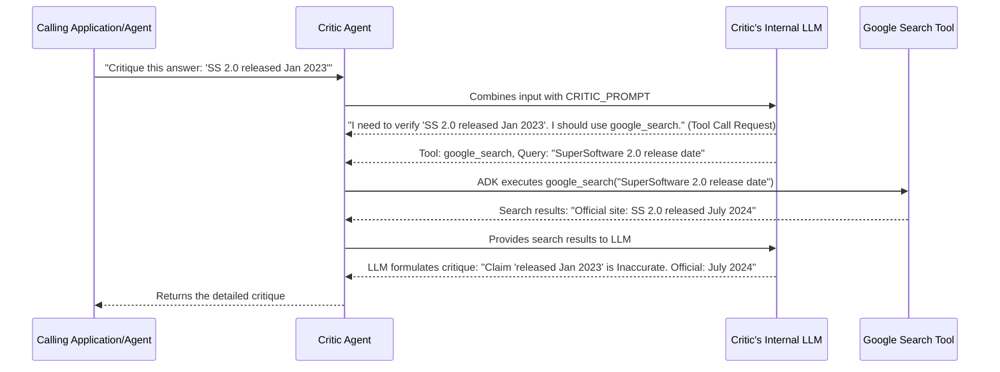

# Chapter 7: Agent Tool Integration

Welcome to Chapter 7! In [Chapter 6: Agent Prompting Strategy](06_agent_prompting_strategy.md), we learned how carefully crafted prompts act like a script, guiding our [ADK Agents](05_adk_agent.md) to perform their specific roles. We saw that prompts can tell an agent *what* to do and *how* to do it. But what if an agent needs information that's not in its pre-trained knowledge? What if it needs to interact with the outside world?

This is where **Agent Tool Integration** comes into play, giving our agents superpowers to reach beyond their own minds!

## The "Why": Giving Agents Superpowers Beyond Their Brains

Large Language Models (LLMs), the brains of our agents, are incredibly knowledgeable. However, their knowledge has limits:
*   **Knowledge Cutoff:** An LLM only "knows" information up to the point its training data was collected. It wouldn't know about events that happened yesterday or a product released last month if it was trained last year.
*   **No Real-time Access:** By default, LLMs can't browse the internet, check a database, or use a calculator.
*   **Potential for Hallucination:** Sometimes, if an LLM doesn't know an answer, it might try to "invent" one that sounds plausible but is incorrect.

Let's go back to our trusty **`Critic Agent`** from [Chapter 2: Critic Agent](02_critic_agent.md). Imagine a user asks our "SuperSoftware" chatbot: "When was SuperSoftware v2.0 released?"
If SuperSoftware v2.0 was just released last week, an LLM trained a year ago wouldn't know the answer. It might say "I don't know," or worse, make up a date!

To be a truly effective fact-checker, the `Critic Agent` needs to find up-to-date, real-world information. It needs **tools**.

**The Detective Analogy:**
Think of an ADK Agent as a brilliant detective. The LLM is their sharp mind and deductive skills. But even the smartest detective needs tools:
*   A **magnifying glass** to examine clues (like using a search engine to scrutinize a claim).
*   A **fingerprint kit** to identify suspects (like querying a database for user information).
*   Access to **police databases** (like calling an external API for specific data).

**Agent Tool Integration** is the mechanism that equips our ADK Agents with these kinds_of tools, allowing them to interact with external systems and data sources.

## What is Agent Tool Integration?

**Agent Tool Integration** is the feature within the Agent Development Kit (ADK) that allows your agents to:
1.  **Call external functions or services:** This could be anything from performing a web search, looking up data in a database, calling a third-party API (like a weather API or a stock market API), or even just running a complex calculation.
2.  **Receive data back from these tools:** The agent can then use this data to inform its reasoning and generate more accurate or helpful responses.

In our `llm-auditor` project, the `Critic Agent` is a prime example. It uses a **Google Search tool** to find real-time information to verify claims made in an LLM's answer.

## How Do Agents Use Tools? The Critic's Magnifying Glass

So, how does an agent, like our `Critic Agent`, actually use a tool like Google Search? It's a combination of being *equipped* with the tool and being *guided* to use it by its prompt.

### Step 1: Equipping the Agent with a Tool

First, when we define an [ADK Agent](05_adk_agent.md), we need to tell it which tools it has access to. This is done by providing a list of available tools during the agent's creation.

Let's look at the definition of our `critic_agent` from `llm_auditor/sub_agents/critic/agent.py`:

```python
# File: llm_auditor/sub_agents/critic/agent.py (Simplified)

from google.adk import Agent
from google.adk.tools import google_search # Importing the tool
from . import prompt # Our CRITIC_PROMPT

critic_agent = Agent(
    model='gemini-2.0-flash',
    name='critic_agent',
    instruction=prompt.CRITIC_PROMPT,
    tools=[google_search], # <-- HERE IT IS! The agent is given the tool.
    # ... (other parameters like callbacks)
)
```
*   `from google.adk.tools import google_search`: This line imports a pre-built `google_search` tool provided by the ADK.
*   `tools=[google_search]`: This is the key part! We're telling the `critic_agent` that it has the `google_search` tool in its "toolkit." Now, the agent *can* use it.

### Step 2: Guiding the Agent to Use the Tool (The Role of the Prompt)

Just because an agent *has* a tool doesn't mean it will automatically use it for every task. The agent's "brain" (the LLM) needs to understand *when* and *why* to use a specific tool. This guidance often comes from the agent's instruction prompt, which we explored in [Chapter 6: Agent Prompting Strategy](06_agent_prompting_strategy.md).

The `CRITIC_PROMPT` for our `Critic Agent` is designed to encourage the LLM to think about seeking external information. For example, it contains phrases like:

```python
# Snippet from CRITIC_PROMPT (conceptual)
"""
...
## Step 2: Verify each CLAIM
For each CLAIM... consult External Sources: Use your general knowledge and/or search the web...
...
"""
```
This instruction "search the web" (along with the LLM's general understanding of how to verify facts) nudges the LLM powering the `Critic Agent` to consider using the `google_search` tool when it encounters a claim it can't verify from its own knowledge.

### Step 3: The Agent in Action (Conceptual)

Let's imagine the `Critic Agent` receives an initial answer to critique:
> "SuperSoftware 2.0 was released in January 2023 and includes a new dashboard."

1.  The `Critic Agent`'s LLM processes this answer based on `CRITIC_PROMPT`.
2.  It identifies the claim: "SuperSoftware 2.0 was released in January 2023."
3.  The LLM thinks (guided by the prompt): "Is this release date true? I should verify this using external sources. I have a search tool available."
4.  The LLM then decides to use the `google_search` tool. It might formulate a query like: "SuperSoftware 2.0 release date".
5.  The ADK framework handles actually running the search tool with this query.
6.  The search results come back (e.g., "Official website: SuperSoftware 2.0 released July 2024").
7.  The LLM receives these search results and uses them to determine its verdict for the claim (e.g., "Inaccurate. Justification: Official sources state July 2024.").

This seamless process allows the agent to go beyond its internal knowledge and bring in fresh, external evidence.

## Under the Hood: How the Magic Happens

It might seem like magic that an agent can decide to use a tool and get results. The ADK framework handles a lot of the complex parts of this "tool-calling" process. Here's a simplified step-by-step look at what happens:

**The Conversation Flow:**

1.  **Task Input:** Your application (or another agent, like the [LLM Auditor (Root Agent)](01_llm_auditor__root_agent_.md)) gives a task to the tool-equipped agent (e.g., the `Critic Agent`).
2.  **LLM Processing:** The agent's LLM combines the input with its main instruction prompt. It "thinks" about how to best accomplish the task.
3.  **Tool Decision:** Based on its instructions and the current task, the LLM might decide it needs to use one of its available tools. It will also determine *what information to send to the tool* (e.g., the search query for Google Search).
4.  **Tool Invocation by ADK:** The LLM signals its intent to use a tool. The ADK framework intercepts this, identifies the specific tool function (e.g., the actual code that performs a Google search), and calls that function with the parameters provided by the LLM.
5.  **Tool Execution & Return:** The tool (e.g., `google_search`) executes its logic (makes the actual web search request) and gets a result (the search snippets).
6.  **Results to LLM via ADK:** The ADK framework takes the output from the tool and passes it back to the LLM.
7.  **Final Response Generation:** The LLM now has additional information from the tool. It incorporates this new information into its reasoning and generates its final response to the original task.

Let's visualize this with our `Critic Agent` using `google_search`:



**A Glimpse at the Code Side:**

When you define an agent with a tool like `google_search`:
```python
# File: llm_auditor/sub_agents/critic/agent.py (Relevant parts)

from google.adk.tools import google_search # Tool is imported

critic_agent = Agent(
    # ... other params ...
    tools=[google_search], # Tool is made available
    # ...
)
```
The `google_search` object imported from `google.adk.tools` isn't just a name; it contains the necessary information for the ADK to know:
*   What the tool is called (so the LLM can refer to it).
*   A description of what the tool does and what parameters it expects (this helps the LLM decide when and how to use it).
*   The actual Python function to call when the tool is invoked.

The ADK uses this information to manage the "tool call" lifecycle. If you were to create your *own* custom tools (which is possible with ADK but not something we do for `google_search` in `llm-auditor`), you would provide similar information for your custom functions.

The result of a tool like `google_search` often includes structured data, like website links and snippets of text. This information can be further processed. In our `critic_agent.py`, there's a function `_render_reference` (used as an `after_model_callback`) that formats these search results nicely into the final critique. We'll learn more about such callbacks in [Chapter 8: Response Post-processing (Callbacks)](08_response_post_processing__callbacks_.md).

## Benefits of Tool Integration

Equipping agents with tools provides significant advantages:
*   **Access to Real-time Information:** Agents can get the latest data from the web or other dynamic sources.
*   **Interaction with External Systems:** Agents can query databases, call APIs, or control other software.
*   **Overcoming Knowledge Limitations:** They can find information not present in their training data.
*   **Performing Specialized Tasks:** Tools can handle tasks LLMs aren't good at, like precise mathematical calculations or structured data manipulation.
*   **Factuality and Grounding:** Using tools like search can help "ground" an LLM's responses in real-world facts, reducing hallucinations.

## Key Takeaways

*   **Agent Tool Integration** empowers [ADK Agents](05_adk_agent.md) to interact with external systems and data sources.
*   It's like giving a detective tools (magnifying glass, databases) to enhance their abilities.
*   Agents are **equipped** with tools in their definition (e.g., `tools=[google_search]`).
*   Agents are **guided** to use tools by their instruction prompts (e.g., `CRITIC_PROMPT` suggesting web search).
*   The ADK framework handles the complex mechanics of tool calling, allowing the LLM to request tool use and receive results.
*   The `Critic Agent` in `llm-auditor` uses `google_search` to verify claims against up-to-date web information.

## Conclusion

You now understand how Agent Tool Integration gives our `llm-auditor` agents, particularly the `Critic Agent`, the power to reach outside their own knowledge and interact with the real world! This ability to use tools like Google Search is crucial for tasks like fact-checking and ensuring information is current and accurate.

After an agent (and its LLM) has processed information, possibly with the help of tools, it generates a response. Sometimes, this raw response needs a bit of cleaning up or reformatting before it's ready. In the next chapter, we'll explore how this is done: [Chapter 8: Response Post-processing (Callbacks)](08_response_post_processing__callbacks_.md).

---

Generated by [AI Codebase Knowledge Builder](https://github.com/The-Pocket/Tutorial-Codebase-Knowledge)