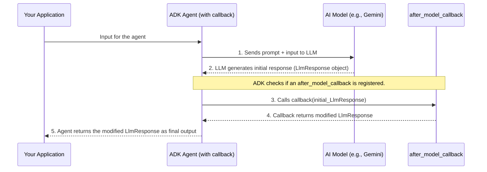

# Chapter 8: Response Post-processing (Callbacks)

Welcome to Chapter 8! In [Chapter 7: Agent Tool Integration](07_agent_tool_integration.md), we saw how our [ADK Agents](05_adk_agent.md) can use tools like Google Search to access external information. This is incredibly powerful! However, the raw information from tools or even the initial response from an LLM might not always be in the perfect shape for the end-user or the next step in our process. Sometimes, it needs a little tidying up or an extra touch of polish.

This is where **Response Post-processing (Callbacks)** come in. Think of it as an "editorial review" stage for an agent's response.

## The Problem: Raw Manuscripts Need Editing

Imagine an author (our LLM) has just finished writing a raw manuscript (the initial response).
*   Sometimes, the author might have left notes in the margin for themselves (like the `---END-OF-EDIT---` marker we saw the `Reviser Agent` was prompted to use).
*   Other times, the author might have gathered a lot of research notes (like search results from the `Critic Agent`'s `google_search` tool) that need to be properly cited and formatted.

If we just published this raw manuscript, it wouldn't look very professional or be easy to read. We need an editor to:
*   Remove those margin notes.
*   Format the citations beautifully.
*   Ensure the final document is polished and complete.

In the world of `llm-auditor`, our agents sometimes produce responses that need this kind of final touch.

**Central Use Case:**
1.  Our `Critic Agent` uses Google Search and gets back a list of web pages. We want to display these as nicely formatted references at the end of its critique.
2.  Our `Reviser Agent` is prompted to add a special marker `---END-OF-EDIT---` to its output. We need to remove this marker before showing the revised answer.

How can we automate this "editorial review"? With **Callbacks**!

## What are Callbacks? The Agent's Personal Editor

In the ADK (Agent Development Kit), a **callback** is a custom function that you can tell an agent to run *after* its AI model (the LLM) has generated its initial response, but *before* that response is considered final.

The most common type we'll see is the `after_model_callback`. As the name suggests, it's called "after the model" has done its part.

These callback functions allow you to:
*   **Format the output:** Make it look nicer, like turning raw links into clickable Markdown links.
*   **Append additional information:** Add things like a list of sources or references.
*   **Remove unwanted artifacts:** Clean up temporary markers or boilerplate text.
*   **Transform the content:** For example, convert data into a different structure.

It's a powerful way to ensure the agent's final output is exactly how you want it.

## Callbacks in Action: Our `llm-auditor` Editors

Let's see how `llm-auditor` uses callbacks to polish the responses from the `Critic Agent` and the `Reviser Agent`.

### 1. The `Critic Agent`: Adding Formatted References

Remember from [Chapter 2: Critic Agent](02_critic_agent.md) and [Chapter 7: Agent Tool Integration](07_agent_tool_integration.md) that our `Critic Agent` uses the `google_search` tool to verify claims. The search tool provides information about the web pages it found (like titles and URLs).

**The Problem:** This raw search information isn't very user-friendly if just dumped as is.
**The Solution:** We use an `after_model_callback` function called `_render_reference` to format this information into a neat "Reference" section.

Here's how the `critic_agent` is defined in `llm_auditor/sub_agents/critic/agent.py`:
```python
# File: llm_auditor/sub_agents/critic/agent.py (Relevant part)

from google.adk import Agent
from google.adk.tools import google_search
from . import prompt
from .agent_impl import _render_reference # Our callback function is imported

critic_agent = Agent(
    model='gemini-2.0-flash',
    name='critic_agent',
    instruction=prompt.CRITIC_PROMPT,
    tools=[google_search],
    after_model_callback=_render_reference, # <-- The callback is registered!
)
```
*   `from .agent_impl import _render_reference`: We import the function that will do the formatting. (In the actual project code, this function is defined in the same file, but importing it highlights it as a distinct piece).
*   `after_model_callback=_render_reference`: This tells the `critic_agent` to run the `_render_reference` function on its response *after* the Gemini model has generated the critique but *before* the critique is finalized.

**What does `_render_reference` do?**
The `_render_reference` function (defined in `llm_auditor/sub_agents/critic/agent.py`) looks for "grounding metadata" that the `google_search` tool might have attached to the LLM's response. This metadata contains details of the search results. The function then formats these into a readable list.

Here's a simplified idea of its logic:
```python
# File: llm_auditor/sub_agents/critic/agent.py (Conceptual _render_reference)
# from google.adk.agents.callback_context import CallbackContext
# from google.adk.models import LlmResponse
# from google.genai import types # For types.Part

def _render_reference(
    # callback_context: CallbackContext, # Info about the agent call
    llm_response: LlmResponse, # The LLM's raw response
) -> LlmResponse: # It must return a (potentially modified) LlmResponse
    
    # 1. Check if there's grounding metadata from search results
    if llm_response.grounding_metadata and llm_response.grounding_metadata.grounding_chunks:
        references_text = "\n\nReference:\n\n"
        for chunk in llm_response.grounding_metadata.grounding_chunks:
            # 2. For each search result, get title, URL, and maybe a snippet
            title = chunk.web.title if chunk.web else "Source"
            uri = chunk.web.uri if chunk.web else ""
            # 3. Format it nicely (e.g., as a Markdown list item)
            if uri:
                references_text += f"* [{title}]({uri})\n"
            else:
                references_text += f"* {title}\n"
        
        # 4. Append this formatted text to the LLM's main content
        # (Ensuring parts exist, creating one if not)
        if not llm_response.content or not llm_response.content.parts:
            llm_response.content = types.Content(parts=[types.Part(text="")])
        llm_response.content.parts[0].text += references_text
        
    return llm_response # Return the modified response
```
This code snippet (a conceptual simplification of the actual one in the project) does the following:
1.  It checks if the `llm_response` contains `grounding_metadata` (which the search tool adds).
2.  It loops through each piece of search evidence (`chunk`).
3.  It extracts details like the `title` and `uri` (URL) of the webpage.
4.  It creates a formatted string, like `* [Page Title](URL)`, for each reference.
5.  It appends this whole list of references to the main text generated by the LLM.

**Example:**
*   **Before `_render_reference` (Conceptual LLM output + metadata):**
    *   LLM's text: "Claim X is inaccurate."
    *   Grounding Metadata: `[ {title: "Official Source Page", uri: "http://example.com/source"} ]`
*   **After `_render_reference` (Final output from `Critic Agent`):**
    ```text
    Claim X is inaccurate.

    Reference:

    * [Official Source Page](http://example.com/source)
    ```
Much clearer and more useful!

### 2. The `Reviser Agent`: Removing Temporary Markers

Our `Reviser Agent` (from [Chapter 3: Reviser Agent](03_reviser_agent.md)) has a different "editorial" need. Its prompt, `REVISER_PROMPT`, instructs the LLM to add a specific marker, `---END-OF-EDIT---`, at the very end of its revised text. This helps ensure the LLM completes its thought process and provides a clear stopping point.

**The Problem:** We don't want this `---END-OF-EDIT---` marker in the final, polished answer that the user sees.
**The Solution:** We use an `after_model_callback` function called `_remove_end_of_edit_mark` to clean this up.

Here's how the `reviser_agent` is defined in `llm_auditor/sub_agents/reviser/agent.py`:
```python
# File: llm_auditor/sub_agents/reviser/agent.py (Relevant part)

from google.adk import Agent
from . import prompt
from .agent_impl import _remove_end_of_edit_mark # Our callback function

reviser_agent = Agent(
    model='gemini-2.0-flash',
    name='reviser_agent',
    instruction=prompt.REVISER_PROMPT,
    after_model_callback=_remove_end_of_edit_mark, # <-- Callback registered!
)
```
*   `after_model_callback=_remove_end_of_edit_mark`: This tells the `reviser_agent` to run the `_remove_end_of_edit_mark` function on its response right after the model generates it.

**What does `_remove_end_of_edit_mark` do?**
This function is simpler. It just looks for the `---END-OF-EDIT---` string in the LLM's response text and removes it.

Here's the actual function from `llm_auditor/sub_agents/reviser/agent.py`:
```python
# File: llm_auditor/sub_agents/reviser/agent.py

# ... (imports) ...
_END_OF_EDIT_MARK = '---END-OF-EDIT---'

def _remove_end_of_edit_mark(
    # callback_context: CallbackContext, # Unused in this simple callback
    llm_response: LlmResponse,
) -> LlmResponse:
    # del callback_context # Mark as unused
    if not llm_response.content or not llm_response.content.parts:
        return llm_response # Nothing to do if no content
    
    # Go through each part of the response content
    for idx, part in enumerate(llm_response.content.parts):
        if part.text and _END_OF_EDIT_MARK in part.text:
            # If marker found, remove it and anything after it
            part.text = part.text.split(_END_OF_EDIT_MARK, 1)[0]
            # Also remove any subsequent parts, if they exist (e.g., LLM added extra newlines)
            del llm_response.content.parts[idx + 1 :] 
            break # Marker found and handled
            
    return llm_response
```
1.  It checks if there's content to process.
2.  It iterates through the `parts` of the `llm_response.content` (an LLM response can have multiple parts, though often it's just one).
3.  If it finds `_END_OF_EDIT_MARK` in the text of a part, it splits the text at the marker and keeps only the part before it.
4.  It also removes any subsequent `parts` to ensure a clean cutoff.

**Example:**
*   **Before `_remove_end_of_edit_mark` (LLM output for `Reviser Agent`):**
    ```text
    This is the revised answer. It is now correct.
    ---END-OF-EDIT---
    ```
*   **After `_remove_end_of_edit_mark` (Final output from `Reviser Agent`):**
    ```text
    This is the revised answer. It is now correct.
    ```
Perfectly clean!

## Under the Hood: The Callback Lifecycle

So, how does the ADK framework actually manage to call your function at the right time? Here's a simplified view of the lifecycle when an agent with an `after_model_callback` is used:



1.  **LLM Generates Response:** Your agent interacts with the LLM (e.g., Gemini), which produces an initial `LlmResponse` object. This object contains the text generated by the model, and potentially other data like the `grounding_metadata` we saw.
2.  **ADK Checks for Callback:** The ADK framework sees that you registered an `after_model_callback` when you defined the agent.
3.  **Callback Execution:** The ADK calls your specified callback function. It passes two important arguments to your callback:
    *   `callback_context: CallbackContext`: This object contains information about the current agent invocation, like the agent's name, input parameters, etc. (Our examples didn't use it much, but it can be useful for more complex callbacks).
    *   `llm_response: LlmResponse`: This is the raw response object directly from the LLM.
4.  **Callback Modifies Response:** Your callback function does its magic – it can read from `llm_response`, modify its `content.parts`, or even create a new `LlmResponse` object. It **must** return an `LlmResponse` object.
5.  **Final Output:** The `LlmResponse` object returned by your callback becomes the final output of the agent for that particular call.

This mechanism provides a clean and organized way to plug in custom post-processing logic without cluttering the main agent definition or its prompt.

## Key Takeaways

*   **Response Post-processing (Callbacks)** are custom functions that run after an LLM generates a response but before it's finalized.
*   They act like an "editorial review" to polish, format, or clean up the LLM's raw output.
*   The `after_model_callback` parameter in `Agent` definition is used to register these functions.
*   The `Critic Agent` uses `_render_reference` to format search results into a readable "Reference" section.
*   The `Reviser Agent` uses `_remove_end_of_edit_mark` to remove a temporary marker from its output.
*   Callbacks receive `CallbackContext` and `LlmResponse` objects and must return an `LlmResponse`.

## Conclusion

You've now learned about the powerful concept of Response Post-processing using Callbacks! This allows you to add a final layer of polish and control over your agent's output, ensuring it's clean, well-formatted, and contains all the necessary information. It's a key technique for making agents more robust and user-friendly.

So far, we've focused on building and orchestrating individual agents and their components. But how do we package all this up so it can be easily deployed and used as a complete application? That's what we'll explore in the next chapter: [Chapter 9: AdkApp (Deployment Wrapper)](09_adkapp__deployment_wrapper_.md).

---

Generated by [AI Codebase Knowledge Builder](https://github.com/The-Pocket/Tutorial-Codebase-Knowledge)