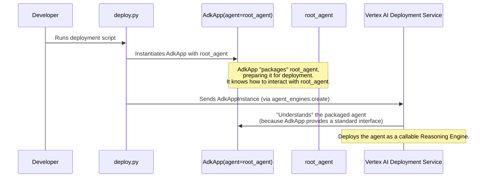

# Chapter 9: AdkApp (Deployment Wrapper)

Welcome to Chapter 9! In [Chapter 8: Response Post-processing (Callbacks)](08_response_post_processing__callbacks_.md), we learned how to refine our agent's output using callbacks, ensuring it's polished and ready. We've now built up our `llm_auditor` system, piece by piece, from individual agents like the [Critic Agent](02_critic_agent.md) and [Reviser Agent](03_reviser_agent.md), to the orchestrating [LLM Auditor (Root Agent)](01_llm_auditor__root_agent_.md) using a [Sequential Agent Workflow](04_sequential_agent_workflow.md).

Our `root_agent` is pretty smart now! But it's currently like a brilliant invention locked away in our workshop (our local code). How do we take this invention and package it so it can be used by others, say, as a reliable service on Google Cloud's Vertex AI?

## The "Why": Packaging Our Agent for the Real World

Imagine you've built an amazing new machine in your garage. It works perfectly! Now, you want to ship it to a factory across the country so it can be put to work. You can't just put the machine on a truck as-is. It might get damaged, or the factory might not have the right equipment to unload or connect it. You need to package it properly.

**Our Central Use Case:**
We have our `root_agent` (the `llm_auditor`). This agent is a complex system, built using the Agent Development Kit (ADK). We want to deploy this `root_agent` to Vertex AI as a "Reasoning Engine." A Reasoning Engine is a service on Vertex AI that can host and run our agent, making it callable by other applications.

To do this, Vertex AI needs our `root_agent` to be presented in a specific, understandable format. It's like the factory needing your machine to arrive in a standard-sized crate with clear labels and connection points. How do we achieve this?

This is where the `AdkApp` class comes in. It's our "packaging solution."

## What is `AdkApp`? The Standardized Shipping Container

**`AdkApp`** is a special class provided by the Vertex AI SDK (specifically, `vertexai.preview.reasoning_engines.AdkApp`). Its main job is to take an agent you've built with the ADK (like our `root_agent`) and wrap it up in a way that makes it ready for deployment as a Reasoning Engine on Vertex AI.

Think of `AdkApp` as a **standardized shipping container**:
*   **Your Agent (`root_agent`) is the Valuable Cargo:** It's the custom-built, intelligent system you've created.
*   **`AdkApp` is the Container:** It securely holds your agent and all its necessary configurations. This container has standard dimensions, labels, and connection points.
*   **Vertex AI Deployment Infrastructure is the Shipping Company:** It knows how to handle these standard containers. It can easily load them (deploy your agent), manage them, and make them accessible.

The `AdkApp` essentially does the following:
1.  **Packages the Agent Logic:** It takes your main agent (e.g., `root_agent`) that encapsulates all the behavior.
2.  **Includes Configurations:** It can hold settings like whether to enable "tracing" (which helps you see what your agent is doing when it runs on Vertex AI).
3.  **Ensures Compatibility:** It makes your ADK-based agent understandable and runnable by the Vertex AI Reasoning Engine infrastructure.

Without `AdkApp`, Vertex AI wouldn't know how to take our Python-based `root_agent` and turn it into a scalable, callable service.

## Using `AdkApp`: A Peek into `deployment/deploy.py`

The `llm-auditor` project has a script for deploying our agent to Vertex AI, located at `deployment/deploy.py`. Let's look at the specific part where `AdkApp` is used:

```python
# File: deployment/deploy.py (Simplified snippet)

# Import our root_agent (the llm_auditor)
from llm_auditor.agent import root_agent

# Import the AdkApp class
from vertexai.preview.reasoning_engines import AdkApp

# ... (other setup code for project ID, location, etc.) ...

def create() -> None:
    """Creates an agent engine for LLM Auditor."""
    
    # Here's where we use AdkApp!
    adk_app = AdkApp(agent=root_agent, enable_tracing=True)
    
    # ... (the rest of the code uses adk_app to deploy to Vertex AI) ...
    # For example, agent_engines.create(adk_app, ...)
    print(f"Preparing to deploy an agent engine based on: {root_agent.name}")
```

Let's break down the key line: `adk_app = AdkApp(agent=root_agent, enable_tracing=True)`

*   `from llm_auditor.agent import root_agent`: First, we import the `root_agent` we've been building throughout this tutorial. This is the "cargo" we want to package. Remember, `root_agent` is our [LLM Auditor (Root Agent)](01_llm_auditor__root_agent_.md), which itself is a [Sequential Agent Workflow](04_sequential_agent_workflow.md) containing the `Critic Agent` and `Reviser Agent`.
*   `from vertexai.preview.reasoning_engines import AdkApp`: We import the `AdkApp` class itself. This is our "shipping container" blueprint.
*   `adk_app = AdkApp(...)`: We create an instance of `AdkApp`.
    *   `agent=root_agent`: This is the most important parameter. We're telling `AdkApp` to package our `root_agent`.
    *   `enable_tracing=True`: This is a configuration option. When set to `True`, it helps in logging more detailed information about your agent's execution steps when it's running on Vertex AI. This is very useful for debugging and understanding how your agent is behaving in the deployed environment.

Once `adk_app` is created, it holds our `root_agent` in a "ready-to-deploy" format. The rest of the `deploy.py` script (which we'll explore more in [Chapter 10: Vertex AI Agent Engine Deployment](10_vertex_ai_agent_engine_deployment.md)) then takes this `adk_app` object and uses other Vertex AI SDK functions (like `agent_engines.create()`) to actually send it to Google Cloud for deployment.

## How `AdkApp` Works (Under the Hood): The Bridge

You might wonder, "What does `AdkApp` actually *do*?" Conceptually, `AdkApp` acts as a **bridge** or an **adapter**.

Our `root_agent` is an [ADK Agent](05_adk_agent.md) object, written in Python using the Agent Development Kit. The Vertex AI Reasoning Engine infrastructure, on the other hand, is a complex cloud service. It needs to know how to:
*   Start our agent.
*   Send requests to it (e.g., when a user asks a question).
*   Get responses back.
*   Manage its lifecycle.

`AdkApp` translates our ADK agent into a format that the Reasoning Engine infrastructure can work with. It might, for example, wrap our agent in a simple web server interface (like Flask or FastAPI, though this is an internal detail you don't need to manage) so that the Reasoning Engine can make HTTP calls to it.

Here's a simplified idea of the interaction when you deploy:



When `AdkApp` is initialized with your `agent`, it essentially prepares a self-contained application package. This package includes your agent's code (and any dependencies you specify, like the `llm_auditor` package itself, as seen in the `extra_packages` argument in `deploy.py`) and a standard way for Vertex AI to run and communicate with it.

## Why is `AdkApp` Necessary?

1.  **Standardization for Vertex AI:** Cloud platforms like Vertex AI need a consistent way to deploy and manage applications. `AdkApp` provides this standard for agents built with the ADK. If everyone packaged their agents differently, it would be a nightmare for the platform to support.
2.  **Simplification for Developers:** As a developer using the ADK, you don't need to worry about the nitty-gritty details of how to make your Python agent runnable as a cloud service (e.g., setting up web servers, handling HTTP requests directly, packaging dependencies in a specific way for the cloud environment). `AdkApp` and the `agent_engines` tools abstract most of this complexity away. You just focus on building your agent logic and then wrap it with `AdkApp`.

It's all about making the path from your agent code to a deployed cloud service as smooth as possible.

## Key Takeaways

*   **`AdkApp`** is a class from the Vertex AI SDK that wraps your [ADK Agent](05_adk_agent.md) (like `root_agent`) to make it deployable as a Vertex AI Reasoning Engine.
*   It's like a **standardized shipping container** for your agent, ensuring Vertex AI can handle and manage it.
*   It packages your agent's logic and can include configurations like `enable_tracing`.
*   You use it by instantiating `AdkApp(agent=your_main_agent, ...)`.
*   `AdkApp` acts as a bridge, making your Python ADK agent compatible with the Vertex AI cloud deployment infrastructure.
*   It simplifies deployment by handling many of the low-level details.

## Conclusion

You've now learned about `AdkApp`, the crucial deployment wrapper that takes our `llm_auditor` (specifically, the `root_agent`) from being just Python code to being a package ready for the cloud! It’s the key piece that connects the world of local ADK agent development with the world of scalable Vertex AI deployment.

With our `root_agent` neatly packaged inside an `AdkApp`, we're finally ready for the last step: actually deploying it to Vertex AI. In the next and final chapter of this basic tutorial, we'll walk through how to use the `deploy.py` script to make our `llm-auditor` live: [Chapter 10: Vertex AI Agent Engine Deployment](10_vertex_ai_agent_engine_deployment.md).

---

Generated by [AI Codebase Knowledge Builder](https://github.com/The-Pocket/Tutorial-Codebase-Knowledge)